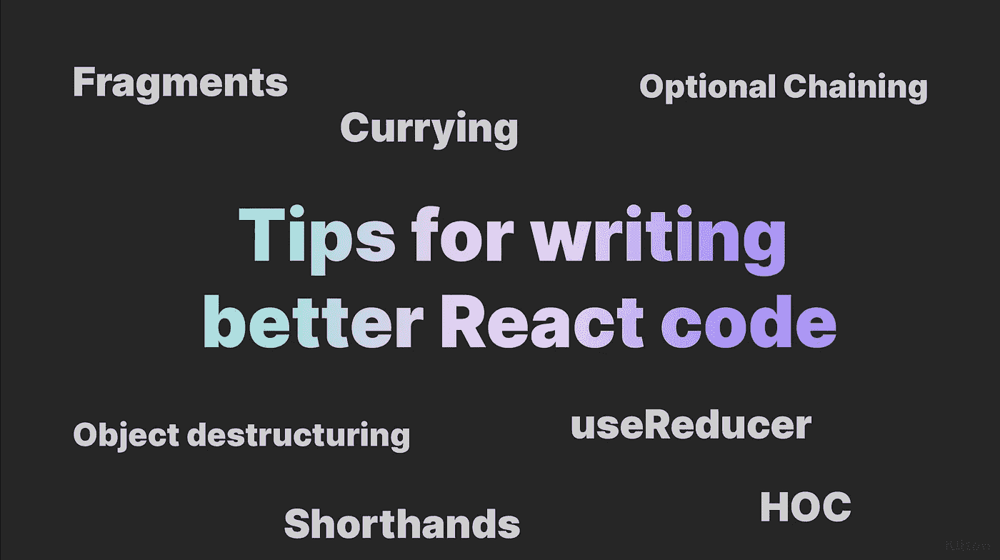

# 编写更好的 React 代码的技巧

> 原文：<https://itnext.io/tips-for-writing-better-react-code-ceb49e929001?source=collection_archive---------0----------------------->

## 你知道那些窍门吗？



# 为什么？

你的代码应该尽可能的干净和可维护。

要成为一名优秀的开发人员，你不一定要写出有用的代码，**你必须写出有用的好代码。**

这里有一些有用的技巧，我希望我以前在我的反应之旅中学过。

# 使用片段

在 React 中，你不能从一个组件中返回多个子组件，如果你尝试的话，你会得到错误:“**相邻的 JSX 元素必须被包围在一个封闭标签**中”。

```
const LoginForm = () => {
  return (
      <UserInput />
      <PasswordInput />
  );
};
```

一个常见的**(不是最好的)**解决方案是将您的孩子包装在一个 div 组件中，如下例所示:

```
const LoginForm = () => {
  return (
    <div>
      <UserInput />
      <PasswordInput />
    </div>
  );
};
```

## **如果不需要就不要用 div**，用 react 片段代替。

```
const LoginForm = () => {
  return (
    <>
      <UserInput />
      <PasswordInput />
    </>
  );
};
```

**为什么你更喜欢片段而不是 div？**

如果你不需要 div，片段总是更好的选择，因为片段不会在 **DOM** 中产生任何元素，这意味着片段的子组件将在没有任何包装 **DOM** 节点的情况下呈现。

# 传播算子

如果您必须将许多道具传递给子组件，如下所示:

```
const Parent = (props) => {
  return (
    <Child
      firstName={props.firstName}
      lastName={props.lastName}
      age={props.age}
      email={props.email}
      address={props.address}
      phone={props.phone}
      work={props.work}
    />
  );
};
```

使用`spread operator (...)`可能会更好，使代码更简洁，就像这样:

```
const Parent = (props) => {
  return <Child {...props} />;
};
```

小心:散布道具会让代码不那么清晰，所以只有在你有很多需要传递的道具的情况下才使用。

# 自动结束标签

在 React 中，只有当组件有子组件时，才需要编写结束标记，就像这样

```
<Component> ... </Component>
```

如果没有子组件，你可以像这样简洁地编写组件

```
<Component />
```

# 使用咖喱功能

大多数 React 开发者都不知道 Curry 函数，但是相信我，你会喜欢它们的。

在解释什么是 curry 函数之前，我需要添加一些上下文。

假设我们想要创建一个组件，为用户数组中的每个用户呈现一个按钮，并在单击按钮时向用户显示一个警告。

通常的做法是这样的:

```
const LoginForm = (props) => {
  const selectUser = (user) => {
    alert(`You selected ${user}`);
  };

  return (
    <>
      {users.map((user) => (
        <button onClick={() => selectUser(user)}>Select {user}</button>
      ))}
    </>
  );
};
```

基本上，在`onClick`内部，我们定义了一个匿名函数来调用`selectUser`函数。

还有一个更好的办法，就是拍马屁。

Currying 就是把一个带**X**T21s 参数的函数分解成**X**函数，每个函数只带**一个参数**。

下面是一个简单的例子，说明如何编写一个 curried add 函数:

```
const add = (a, b) => {
  return a + b;
};

// Becomes

const add = (a) => (b) => {
  return a + b;
};
```

现在我们可以用一个 curry 函数重写上面的例子，如下所示:

```
const LoginForm = (props) => {
  const selectUser = (user) => (e) => {
    alert(`You selected ${user}`);
  };

  return (
    <>
      {users.map((user) => (
        <button onClick={selectUser(user)}>Select {user}</button>
      ))}
    </>
  );
};
```

现在 onClick 代码更加简洁了。

在我们的例子中，curry 函数就像一个“工厂”,它生产其他函数来“冻结”我们为进一步调用而传递的用户值。

要了解幕后发生了什么，您可以尝试运行以下代码:

```
const users = ["kliton", "medium", "devs"];
const LoginForm = (props) => {
  const selectUser = (user) => {
    console.log(
      `I'm creating a selecUser function with the user value: ${user}`
    );
    return (e) => {
      alert(`You selected ${user}`);
    };
  };

  return (
    <>
      {users.map((user) => (
        <button key={`btn-${user}`} onClick={selectUser(user)}>
          Select {user}
        </button>
      ))}
    </>
  );
};
```

…并查看日志。这将是日志输出:

```
I'm creating a selecUser function with the user value: kliton
I'm creating a selecUser function with the user value: medium
I'm creating a selecUser function with the user value: devs
```

# 消除 JSX 的内联功能

通过尽可能简单地将 JavaScript 代码和 HTML 代码分开，可以提高代码的可读性和清晰性。

```
// ❌❌❌❌❌ Bad one
const LoginForm = (props) => {
  return (
    <>
      <button
        onClick={() => {
          const result = login();
          {
            /* ... other code .... */
          }
        }}
      />
    </>
  );
};

// ✔️✔️✔️ Good one
const LoginForm = (props) => {
  const handleLogin = () => {
    const result = login();
    {
      /* ... other code .... */
    }
  };

  return (
    <>
      <button onClick={() => handleLogin()} />
    </>
  );
};
```

# 对列表项使用唯一键属性

React 使用`key`属性在**组件**和 **DOM 元素**之间创建一个**关系**。

键有助于识别哪些项目已经更改(添加或删除)。

例如，如果您正在呈现具有 id 属性的数据，如果 id 属性是唯一的，则可以将其用作键。

```
const users = [
  {
    id: 1,
    first_name: "Janella",
  },
  {
    id: 2,
    first_name: "Cleveland",
  },
  {
    id: 3,
    first_name: "Joellyn",
  },
];

const UserList = (props) => {
  return (
    <ul>
      {users.map((user) => (
        <li key={user.id}>User: {user.first_name}</li>
      ))}
    </ul>
  );
};
```

# 避免使用索引作为关键道具

如果你知道数组不是静态的，就不要使用数组的索引作为键属性。

如果你对数组中的一个元素重新排序，React 将会混淆并重新呈现不正确的元素。

# 使用 HOCS(高阶元件)

HoC 是避免代码重复的好模式，因为 HoC 是一个纯函数，它不会改变任何组件。

React 文档中的定义:“**具体地说，高阶组件是一个函数，它接受一个组件并返回一个新组件。”**

例如，我们可以创建一个高阶组件，向我们的组件添加一个 auth guard，并且只在用户通过身份验证时才显示它。

`AuthGuard`组件检查用户是否登录，如果没有登录，它将代替组件呈现 null。

我们的`withAuthGuard` HoC 是这样的:

高阶分量

rAnd 然后我们可以使用 withAuthGuard HoC 来保护我们的组件:

我们使用 AuthGuard HoC 保护自定义组件

# 对象析构

析构使代码更加可读和清晰。

ES6 中引入了对象析构。

析构是一种只获取某些项(从数组中)或某些属性(从对象中)的方法。

在引入析构之前，属性的提取是这样完成的:

使用析构，您可以通过以下方式提取名字和电子邮件:

析构也适用于数组:

在 ES6 的破坏性介绍之前

变成了:

使用 ES6 析构

## 那么，为什么析构使我的代码更易读、更简洁呢？

*   您可以将自己的变量名称分配给从道具或其他对象提取的属性
*   提高代码的可持续性和可读性
*   有助于减少应用程序中使用的代码量。

析构道具示例:

额外信息:你有没有想过为什么`useState`钩子有这样的语法？

```
const [value, setValue] = useState();
```

你猜对了:`useState`返回一个数组，我们正在析构它。

# 当您有复杂的状态逻辑时，请使用 useReducer 而不是 useState

```
const [state, dispatch] = useReducer(reducer, initialState);
```

## 什么是？

`useReducer`是 React 提供的一个钩子(像`useState`)。

在内部,`useState`使用`useReducer`,这意味着你可以使用`useReducer`做任何你可以用`useState`做的事情。

## 在什么情况下更可取？

如果你有一个复杂的状态形状，`useReducer`比`useState`提供更多可预测的状态转换。

一个很好的经验法则是，当您不再管理原始数据，即字符串、整数或布尔值，而是必须管理复杂的对象时。

## 显示优点的东西

一个 todo-list 应用程序，我们可以在其中添加任务并将其标记为完成。

# 布尔变量名称

当您要创建布尔变量时，请使用以下前缀之一:

*   **是**
*   **有**
*   **可以**

例如，`isVisible`比`visible`更适合作为布尔值的名称。

# 字符串属性不需要花括号

您可以使用引号将字符串文字指定为属性:

# 使用可选的链接运算符(？)

可选的链接运算符**(？。)**使您能够读取位于连接对象链深处的属性值，而不必检查链中的每个引用是否有效。

# 这里有一些我写的其他文章，我想你会觉得有用

[](https://www.klitonbare.com/blog/animate-svg-with-framer) [## 用 React 和帧运动制作 SVG 动画

### 你好👋在这篇文章中，我将向你展示我是如何为我的博客标识创建一个绘制效果的。在这里你将得到什么(你可以…

www.klitonbare.com](https://www.klitonbare.com/blog/animate-svg-with-framer) [](https://medium.com/@barekliton/reactjs-salaries-how-much-developers-earn-around-the-globe-1f1ef03d42b2) [## ReactJS 的薪水:全球开发者的收入

### 你的呢？

medium.com](https://medium.com/@barekliton/reactjs-salaries-how-much-developers-earn-around-the-globe-1f1ef03d42b2) [](https://betterprogramming.pub/how-i-improved-my-react-code-readability-and-maintainability-with-conditional-rendering-94b32448bc70) [## 不使用条件呈现操作符编写更好的 React 代码

### 避免使用使代码不可读的三元运算

better 编程. pub](https://betterprogramming.pub/how-i-improved-my-react-code-readability-and-maintainability-with-conditional-rendering-94b32448bc70) [](/best-books-that-every-software-developer-must-know-8b96faff180d) [## 每个软件开发人员都必须知道的最佳书籍！

### 你的书架上有这些书吗？

itnext.io](/best-books-that-every-software-developer-must-know-8b96faff180d) [](/best-vscode-extensions-by-a-full-stack-developer-in-2022-f730037b6e0b) [## 2022 年全栈开发者评选的最佳 VsCode 扩展

### 作为一名完整的堆栈开发人员，以下是我挑选的最好的 VS 代码扩展！

itnext.io](/best-vscode-extensions-by-a-full-stack-developer-in-2022-f730037b6e0b) 

*更多内容请看*[***plain English . io***](https://plainenglish.io/)*。报名参加我们的* [***免费周报***](http://newsletter.plainenglish.io/) *。关注我们关于*[***Twitter***](https://twitter.com/inPlainEngHQ)[***LinkedIn***](https://www.linkedin.com/company/inplainenglish/)*[***YouTube***](https://www.youtube.com/channel/UCtipWUghju290NWcn8jhyAw)***，以及****[***不和***](https://discord.gg/GtDtUAvyhW) *对成长黑客感兴趣？检查* [***电路***](https://circuit.ooo/) ***。*****