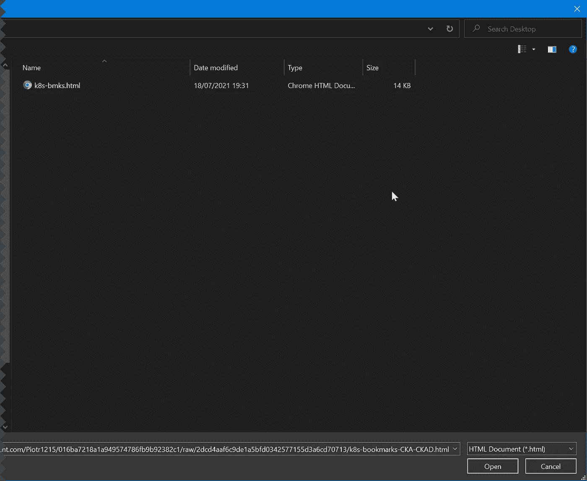

# CKA、CKAD 和 cks 考试的提示和技巧

> 原文：<https://itnext.io/tips-tricks-for-cka-ckad-and-cks-exams-cc9dade1f76d?source=collection_archive---------2----------------------->

[安德鲁·尼尔](https://unsplash.com/@andrewtneel?utm_source=unsplash&utm_medium=referral&utm_content=creditCopyText)在 [Unsplash](https://unsplash.com/?utm_source=unsplash&utm_medium=referral&utm_content=creditCopyText) 上拍照

和有用的书签

## 更新 27.07.2021:书签主要更新

## 介绍

考 Kubernetes 认证 CKAD，CKA 和 CKS 是相当具有挑战性的。为什么它们如此具有挑战性？首先，每个考试都是**实用的，**意味着，您需要对 Kubernetes 资源和集群执行操作。其次，每次考试都是**限时**的，所以你得高效快捷。

为了弥补这些困难的条件，在每次考试期间，你可以使用 Kubernetes 的官方文档，在 CKS 的情况下，也可以使用一些外部网站。

我想与您分享两个方便的资源，以帮助您通过认证，并在以后与 Kubernetes 合作时作为参考。

## Kubectl 命令

这里有一个要点，列出了我在考试中发现非常有用的命令和别名。请注意，此要点经常更新。如果你想贡献你的建议和技巧，请留下你的评论，我会很乐意更新。

和网络相关命令的单独要点，我将很快将它们合并成一个要点(TM)

## 书签

用书签标记 Kubernetes 文档部分的各个部分并快速导航到它比从搜索框中搜索要快得多。在允许其他页面的 CKS 期间尤其如此。

一段时间以来，我整理了一个书签列表，用易于理解的部分分开。与 **kubectl 命令**要点相同，如果您想添加书签，请对要点进行评论。书签作为 gist 托管，很容易直接从原始 gist 导入。

书签已于 27.07 更新，包含以下更改:

现在书签列表中有 4 个部分。所有书签都按字母顺序排序(希望正确；).

## 开始

本节只包含一个链接，您应该从那里开始考试，并复制/粘贴 bash/zsh 自动完成脚本

## YAML

如果您想要快速拷贝原始 YAML 并将其用作文件的基础，此部分非常有用。你可以使用`wget`或者先创建 YAML，然后粘贴到编辑器中。这取决于您想要整个文件还是部分文件。

## 任务

这一节有助于快速导航到 Kubernetes 文档中包含特定任务的部分，如集群安装、etcd 备份等。

## 仅限 CKS

因为 CKS 有很多你需要访问的第三方网站，我把它分成了单独的部分。

导入新文件夹**后，K8S-BMKS** 会出现在你的书签栏中。你可以在考试时使用这些书签来快速获取你需要的信息！

以下是当前版本:

## 更多内容

如果你有兴趣了解更多关于不同的 IT 认证和查看我的其他教育内容，请访问我的网页:【https://www.itcertificationsguide.com/#/。我经常用新内容更新它。

我希望这些资源能帮助你，就像我帮助我通过 Kubernetes 考试一样。祝你好运！