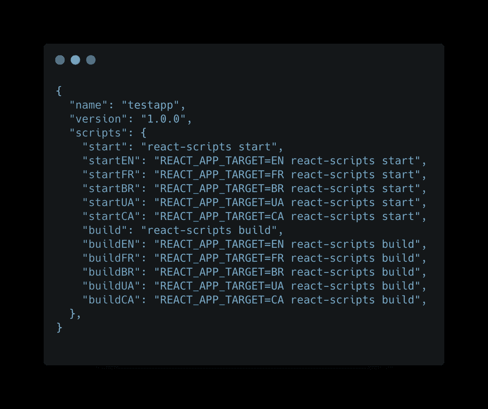
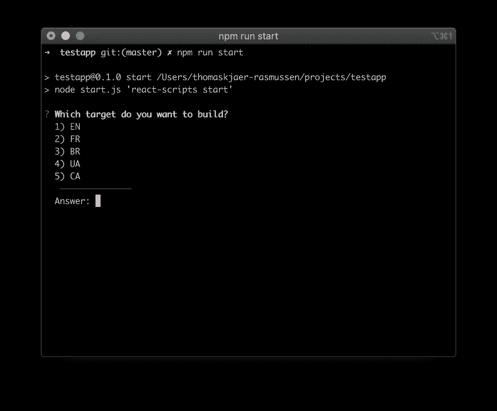

# 厌倦了写环境变量？让 Node 帮你做吧！

> 原文：<https://itnext.io/tired-of-writing-environment-variables-let-node-do-it-for-you-45f14604e1f7?source=collection_archive---------4----------------------->

当处理一个大的 JavaScript 项目时，你的包脚本部分通常会看起来很疯狂。让我们使用 Node 来使它不那么令人难以招架。

# 我们开始吧！

首先将一个小的 Node.js 脚本添加到项目的根目录，并将其命名为`start.js`

*   用你需要的目标编辑`const choices`，
*   将`process.env.REACT_APP_TARGET`替换为您用来区分目标的环境变量的名称。

从这里，将您的`package.json`脚本更改为:

现在运行`npm start`会让你选择你需要的目标🎉

这样你就有了一个更加整洁的脚本部分，虽然这个例子是用 react 编写的，但是它可以很容易地应用到 Angular、React Native 或者你正在使用的任何一个 JavaScript 框架。我已经将完整的例子添加到了 [GitHub](https://github.com/icew1nd/startjs) 中。

👋嘿！我是 Thomas kjr-Rasmussen，前端书呆子和技术爱好者。如果您有任何问题、意见或想法，请在 [Twitter](https://twitter.com/ThomasR______) 或下面联系我！