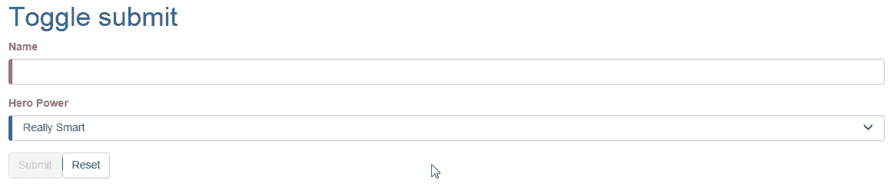
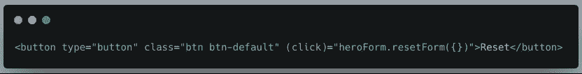
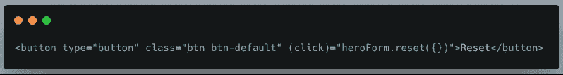
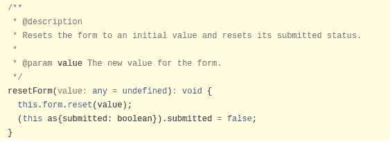
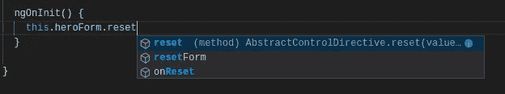

# 重置表单还是重置表单？

> 原文：<https://itnext.io/to-reset-a-form-or-to-resetform-555d3da47c52?source=collection_archive---------0----------------------->

我应该选择什么？

正如威廉·莎士比亚名剧《哈姆雷特》中的自我解惑一样，我也遇到了类似的情况(不涉及死亡或自杀)，我不得不寻找一种方法来重新设定一个有角度的形式。

Angular 中的[反应式表单](https://angular.io/guide/reactive-forms)在开发人员中非常流行，因为它们是可伸缩的、可重用的和可测试的。由于我来自 AngularJS 背景，我习惯使用我更熟悉的[模板驱动的](https://angular.io/guide/forms)表单。最近，我遇到了一个用例，我必须动态地重置这样一个表单的值。这篇博文描述了在实施解决方案的过程中所面临的问题和发现的结果。

# 提交表格

当您想要提交表单时，一个常见的场景是根据表单字段的有效性来启用/禁用提交按钮。正如你在下面的第一个表单中看到的 **Toggle submit** ，按钮`Submit`被禁用，直到在`Name`字段中输入一个必需的值。提交按钮的状态由表单域的验证结果决定。

在我的案例中，方法完全不同。`Submit`按钮*始终*启用，不依赖于现场验证的结果。提交表单后，任何验证错误都会显示给用户，正如您在第二个名为**的表单中看到的，总是提交**。

示例应用程序

这两种方法在我看来都不错。我个人认为，对于新的应用程序来说，如何实现表单提交是一个偏好问题，对于现有的应用程序来说，你已经向用户提供了什么样的体验。假设您的所有表单都遵循 **Toggle submit** 工作流，您应该继续使用相同的模式创建新的表单。

例如在 [**Plexscape**](https://plexearth.com/) ，Plex 的用户。地球人习惯于直接点击提交按钮，而不关心预先的验证。所以我们的网络应用补充了 Plex。地球，遵循同样的原则。

通过这种方式，您可以在整个应用程序生态系统中为您的用户提供相同的唯一 UX。

# 重置表单

每个表单还有一个`Reset`按钮，点击时清除字段值。让我们首先尝试提交并重置第一个表单，看看会发生什么。

切换提交表单

太好了！一切按预期运行。现在，让我们对第二个做同样的事情。

总是提交表单

嗯…这似乎不对。即使我们重置了表单，验证错误消息`Name is required`仍然显示在表单上。

照片由 [bruce mars](https://www.pexels.com/@olly?utm_content=attributionCopyText&utm_medium=referral&utm_source=pexels) 从 [Pexels](https://www.pexels.com/photo/man-wearing-brown-jacket-and-using-grey-laptop-874242/?utm_content=attributionCopyText&utm_medium=referral&utm_source=pexels) 拍摄

让我们试着揭开正在发生的事情。我们将从检查两个表单的模板开始。如果您看一下第一个表单的 reset 按钮， **Toggle submit** ，您会注意到它在按钮的`click`事件上调用了一个方法`resetForm()`。

resetForm()方法

类似地，第二个表单**总是提交**，调用一个方法`reset()`。

reset()方法

这两种方法都在`heroForm`对象上被调用。

# 文档是你最好的朋友

那些方法是什么？为什么重置表单有不同的方法？我们应该使用哪一个？当你开始问自己这样的问题时，是时候去 [angular.io](https://www.angular.io) 查看官方文档了。如果你没有找到你要找的东西，那么开始挖掘 Angular 源代码。

> 反正我喜欢看角源代码。这仍然是了解事物内部如何工作的最好方法！

让我们去看看官方的角度文档，检查一下`[NgForm](https://angular.io/api/forms/NgForm#ngform)`的 API。我们正在寻找`reset`和`resetForm`方法。

resetForm()文档

啊哈！有一个`resetForm`方法。此时，我们可以验证第二个表单的 reset 按钮应该调用这个方法，因为验证消息的外观状态依赖于表单的`submitted`状态。

我们最终解决了我们的问题，但是我们还是没有找到任何方法。太奇怪了，我们继续找。点击**查看源代码< >** 按钮，您将被重定向到`resetForm`方法的源代码。

resetForm()源代码

等等…这里有一个从`resetForm`内部调用的`reset`方法。有趣…但是什么是`this.form`？如果你在变量声明中更进一步，你会看到它是一个类型为`FormGroup`的对象。如果我们去`[FormGroup](https://angular.io/api/forms/FormGroup#formgroup)` API，我们会找到`[reset](https://angular.io/api/forms/FormGroup#reset)`方法的文档。

所以`resetForm`和`reset`是一样的，但是不同之处在于影响了表单的`submitted`状态。

# 结论

有人会说，我应该从一开始就选择`resetForm`方法，根本不用费心去使用`reset`方法。**这是一个合理的说法，但我喜欢证明我使用的东西和我可以使用的替代物。这让我感觉更好，也让我对使用什么更有信心。**

如果您必须从组件中调用 reset 方法，还要考虑这可能会导致混乱。

重置组件中的表单

很难区分哪种方法是哪种，不是吗？。Intellisense 显示了同一对象上的两个方法，即使它们引用不同的类型`NgForm`和`FormGroup`。这是为什么呢？回想一下官方的角度文件

> 组件中的顶级表单是`FormGroup`

在这种情况下，每个组件有且只有一个表单，这意味着它们是顶级表单。

就是这样！非常感谢您阅读我的文章。我希望它能告诉我们什么时候使用每个重置表单方法。

有没有经历过类似的情况？你喜欢哪种方法？请在下面的评论中告诉我！