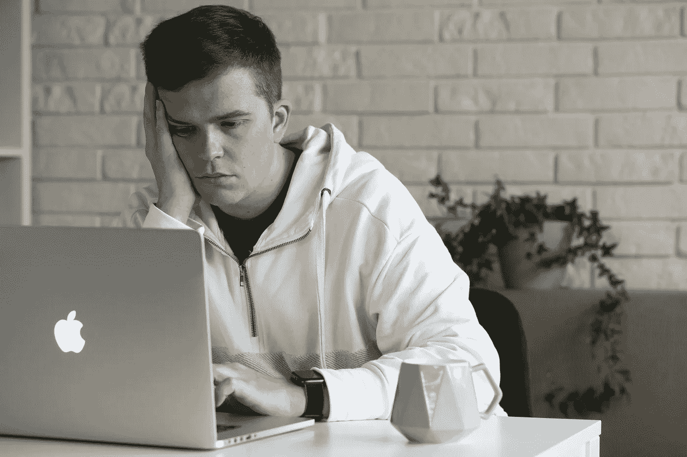
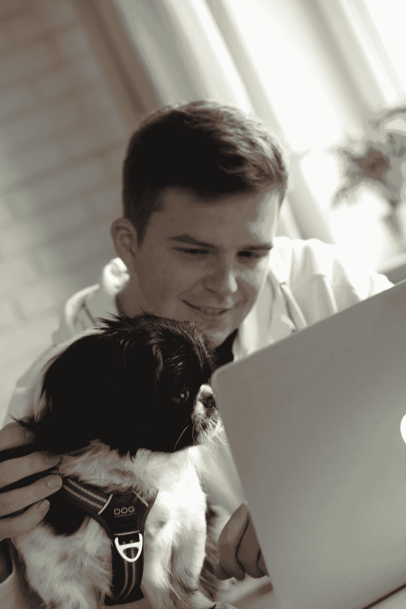

# 如何不自信地写代码

> 原文：<https://itnext.io/to-write-code-without-confidence-1fad22240c1?source=collection_archive---------0----------------------->

所有照片:paweworytko

最后几滴黑金从咖啡冲泡袋中滴落。“新鲜浆果、木槿和柑橘”的味道几乎可以在马克杯的软泥中看到。咖啡对我有好处。在我从吉拉董事会选择另一项任务之前，这会让我平静下来。Arild 提到了一些关于期待玩“WoW Classic”的事情。我真的没在听。我心不在焉。它回到了两年前。回到第一天。好像我一点知识和技能都没有。建筑者鲍勃只是给孩子们看的卡通，不是我电脑上的工具。Linux 是只有铁杆专家才能使用的东西。我仍然被困在 Vim 中。两年来，我在 Sparebank 1 这里跌跌撞撞。我写过代码，提交过文件，搜索过生产日志，有时也承担过责任，试图展现自己最好的一面。我获得了什么新技能吗？我是否提高了现有的技能并获得了知识？还是只是 Aleks.age 增加了？

我慢慢走向我的桌子，我的腿和 650 天前一样沉重。我穿着同样的白衬衫，然而，第一天它是新熨的。你好，黑暗，我的老朋友，我又来和你说话了。焦虑是如此的“他妈的真实”。正如莫里西所说:“每一天都是寂静而灰暗的”。这首歌我已经听了大约一千遍了。这在某种程度上是一种解放。在这场混乱中，我不是一个人。这样更容易承受。有时候这样更容易。今天不行。今天是不容易的一天。我肩上的声音像一袋土豆一样沉重。感觉呼吸困难。我脖子上的钥匙圈正在侵蚀我的皮肤，把我的头拉向地面。每一步都是为了不让自己看起来像巴黎圣母院的驼背。我想知道他们是否会再次敲响圣母院的钟声？

画在地上的跑道给了我速度。动机。我觉得我是尤塞恩·博尔特，正在创造新的世界纪录。如果你能抓住我，维姆。给我的信心蒙上阴影的紧张想法早已消失。我能控制这一切。一切都会好的。咖啡从我的杯子里溢出，溅到地上。
黑金；黑色的混乱。

**回去开始。**

我为此做了新的尝试。我更冷静，更慢。当我走过每个人身边时，我都会观察他们。小步走向我的办公桌。三排人通过。在这个机库大厅里，我们都需要找到自己的停车位。在计算机屏幕、电缆、办公椅和键盘的丛林中，我们都假装自己是独一无二的。我们把自己标记为“前端人”和“后端人”，希望属于一个社区。这个标志从根本上把我们分开，让我们与众不同。直到有一个开发者可以做到这两点。他们称自己为“全栈”。某种超级人类，不会被我们花了这么多时间创造的分割线所阻挡。这是一匹老马的感觉吗？有人更年轻，更快，更好，更强。记住你会变老。记住你的预产期将会到来。

> **《死亡记忆》**

Arild 正随着“Du hasst”的节奏点着头，我的思绪迅速跳到奥斯陆北部的巨型音乐会体育场。回到 2006 年。竞技场真的着火了，因为拉姆斯坦正在用烟火互相射击。如果机库大厅会着火怎么办？这可能会发生，任何一天，任何时间。几天前，我打破了生产建设。我也想称自己为“全栈开发者”。带着渴望和勇气，我负责了应用程序可视层(前端的神奇之地)内的一个小变更请求。这是一个不错的开局，至少我是这么听说的。在 50 多名客户无法实现快速转账的愿望之前，没有人发现我的错误。当支持团队通知我们这个 bug 时，就好像有人把我扔进了一个装满冰的池子里。冰冷的黑暗用冰冷的手拥抱了我。你好，黑暗，我的老朋友，我又来和你说话了。当我越陷越深时，我确信这就是结局。几分钟后，有人会拿着一个纸箱走进来，告诉我把我的个人物品装进去。Kthanxbye。最大的谜团不是如何解决这个 bug，而是没有人拿着一个纸箱走进来。仓库肯定被清空了，其他解释都说不通。为什么他们还允许我留下？

我们的产品负责人 Rune 没有对这件事说一句负面的话。没有人被要求离开，甚至没有人被要求呆到很晚。相反，他拍了拍我们的背，说了些友好的话。好像他在说希腊语。这些话毫无意义。这一切都是玩笑吗？愚人节的玩笑？我绝对相信这是某种形式的戏弄。

这不是上周我打破了生产建设，它只是感觉像它。记忆还是那么清晰。已经一年了。有时候，我和我的同事会对此一笑置之。我紧张地笑着，而其他人笑着，因为他们也破坏了产品构建，或者做了一些同样严重的事情。今天我们都可以 cosplay 狮子王的笑鬣狗。我们已经到了最后的倒计时。是时候推出我们已经构建了两年的应用程序了。当欧洲正在欢歌笑语，奔向金星的时候，我们却成了背上安装“MOBE”重担的倒霉蛋。给我们蛋白质药片和头盔戴上，我们活不了多久。

艾瑞克凝视着我，直直地看着我。我给他一个奇怪的眼神作为回应。我给了他我对传奇足球裁判皮埃路易吉·科里纳最好的模仿。艾瑞克把他的仿制品送了回来，在我们都摇头之前。多么古怪愚蠢的游戏。有点好笑，但是很奇怪。有时候我害怕他们会看穿我。他们都会透露我没那么聪明。我的秘密；每个人都会知道我没有那么熟练。这可能是我选择科里纳仿制品的原因。如果我的凝视足够吓人，我就不会被披露。我得小心不要撞到克劳迪奥的桌子。我并不认为他会因此受到任何伤害。他就像一个艺术家，把他的代码写得如此优雅，以至于它可以被打印出来，挂在大卫雕像旁边的学院画廊的墙上。为了我自己，我想避免撞车。我不想忍受撞在锋利的桌子上的身体疼痛。我也不想再洒咖啡了。神奇的液体，在街角的甜甜圈店买的。它也很贵，但这就是它应该有的样子。稍微炫耀一下很重要。有了身份。做一个喝手工煮的咖啡的人，而不是机器煮出来的咖啡。咖啡鉴赏家也是一种身份。

有人叫我的名字，我全身肌肉都绷紧了。这可不好。当有人这样打断你时，这很少是好消息。

"阿列克斯，你看到我们项目的最新反馈了吗？"。这些话像利剑一样刺向我的喉咙。我不敢确认是否有人用剑指着我，或者我的想象是否疯狂。

我的胃变成了一个水手结。汗珠开始顺着我的脸颊流下。反馈？当然我还没有勇气去看任何反馈。互联网另一端的陌生人很少会说什么好话。尤其是当他们使用新系统的时候。在我大学的大厅里走了五年。五年的准备和寻找工作机会。当我告诉我的朋友我在一家国际公司工作时，他们认为我很幸运，并回答说我一定是在实现梦想。我有理想的工作。一份我不知道如何做的工作，也没有信心能完成。天知道我现在很痛苦。

轮到我上“事故观察”了。每当我不得不推出一个新版本时，我的心都在跳，这还不够。我不得不在接下来的一周里关注收到的反馈和事件。妄想症的紧身衣。每一封收到的电子邮件都警告你有东西着火了。一条电子信息通知你办公室很快将变成一个战区。你有大约 10 分钟的时间来写你的辩护辞。希望其他人能理解，不要给你打上无能的印记。我的心跳比 90 年代的热门歌曲“沙尘暴”还要快，它的声音比 Vim 程序员的机械键盘还要响。世界在我眼前变得一片黑暗。我唯一的愿望就是蒸发到稀薄的空气中消失。不幸的是，我没有任何选择。不管这是不是我做的最后一件事，我都必须打开电子邮件，阅读 beta 测试人员的反馈。当我试着输入密码时，我的手指不由自主地颤抖。这感觉就像是我在自己的墓碑上刻字，孤独地刻在宠物的墓碑上。

*-*-*-*-* ***【回车】*** *。*

我在这里，凝视着我焦虑的双眼。我的私人恶魔。我的死对头。我谈话中最亲密的伙伴。那个在我体内成长的怪物，直到它变得比我还大。没人能看见的鬼魂。只有我能听到的声音。不断膨胀的黑暗，吞噬越来越多。当我试图闯红灯时加速。深渊伸出双手，准备吞噬我。我反抗，知道我没有机会。它知道我所有的动作，甚至在我想到它们之前。不安的眼睛找到了我，无论我藏在哪里。

"阿列克斯，你检查反馈还是什么？"。我是维达尔。这可能是海森堡，用枪指着我的后脑勺。我正跪在自己的坟前，演职员表滚滚而来，作为“开发商 14 号”被写入历史只是时间问题。我试着张开嘴想说些最后的话，但是说不出来。我打开 Outlook，点击我收到的最后一封邮件。

**这就是结局。**

*“新的用户界面看起来不错”。“我喜欢一切都有条不紊。这是一个很好的升级，但是，我希望我能够重新安排帐户列表”。
“这个真好。它看起来既现代又清新”。*

仿佛一股幸福的浪潮在我身上流淌。我在一个冲浪板上，戴着我全新的雷朋，当我巡航离开的时候。如果我从远处看到自己，我会猜到我刚刚赢得了国家彩票。我能看到我的同事们，他们乘着水上飞机飞驰而去，笑着，高兴地挥舞着拳头。他们中的一些人在海滩上围着篝火跳舞，手里拿着鸡尾酒，大声播放音乐。这就好像是春节的广告。这是一幅美丽的景色。

我觉得有人在拍我的肩膀。很酷，是吧？项目是活的，人们似乎并不讨厌它”。

我无语了。无语是因为我从来没有经历过这种事。我制造了一个产品。从一开始。作为一个孩子，没有什么比撕开一个正方形的礼物更好的了，知道它包含一盒乐高。把这些碎片拼在一起，为自己建造一座宏伟的城堡，这种感觉无与伦比。我一砖一瓦地成为建筑师、企业家、室内设计师，最后成为国王。我自己的城堡之王，有四个游戏室，三个游泳池，当然还有一台制作无限量巧克力和冰淇淋的机器。
现在我已经长大了 25 岁，我正在构建系统。让社会车轮转动的系统。我为奥斯陆市政管理局、挪威劳工和福利管理局以及挪威最大的银行之一 Sparebank 1 建立了系统。我并不总是和我的开发伙伴一样聪明，但我为成功做出了贡献，当城堡建成时，不仅仅是我可以玩成品。

**我是一名软件开发人员。**

这让我想哭。来自幸福。出于骄傲。从成功的感觉，信心的奔涌和兴奋。我想拥抱我见到的每一个人。弗雷迪·墨丘利为我们唱道“你们是这个项目的冠军”。我们的产品是现场直播的，我们是坐在旅游大巴里，向人群挥手的人。我们从未独行。

那种感觉是无法形容的。如果没有经历像火一样的考验，这种感觉会不会很好？说不准。回想起来，我什么都不会改变。我们到达了目标，感觉很好。
年轻的时候，我是个个人主义者。从一开始，我就想在冬季两项竞技场上创造自己的成功。我想承担失败的责任，感受成功的喜悦。一个人。直到我意识到冬季两项是一项团队运动，我才最终体验到成功。在软件开发中，情况是一样的。我们不是孤岛，只与我们的电脑相连。我们必须建造桥梁，就像山姆·波特的桥梁一样，我们必须用绳索把彼此系在一起。你永远不会比你的团队更强大。他们也会犯错。他们有时也感到不安全。你们一起可以做出比单个建设者的总和更大的东西。当你们团结一致，凝视着自己的成功，没有什么比这更好的了。

感谢 Sparebank 1 Utvikling 在 2017 年选择相信我，并一路坚持相信我。感谢 30 多名“PM Betaling”的开发者，我有幸与他们一起工作，你们都是伟大的人。感谢 Acando/CGI，在我处于低谷时支持我，在我经历成功时鼓舞我前进。感谢 Anja 和 Niki 的编辑。感谢 Idar，你真是个好经理。感谢克里斯汀·伦德，你是我灵感的源泉。感谢 Nova2018，你付出的比你想象的多。

互相照顾。
问问你的同事和朋友，他们过得怎么样，不要只是用一句“啊，我过得很好”来搪塞。告诉对方你的真实感受。还有其他人正在经历你正在经历的事情。当一切都处于最黑暗的时候，记住有一盏灯永远不会熄灭；那道光是你🕯️

**团结起来，我们坚强地站在一起** ❤️

互相照顾❤(狗:埃德加。谢谢，Justyna:)