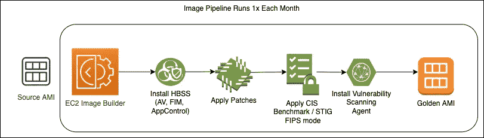
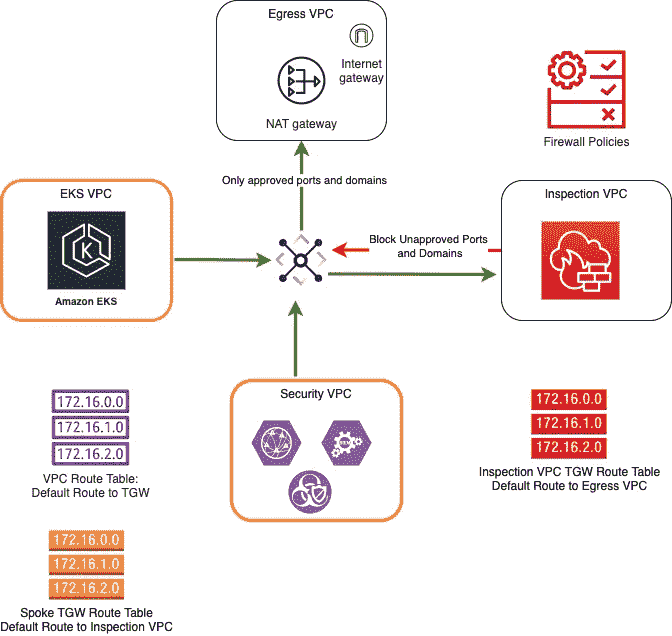
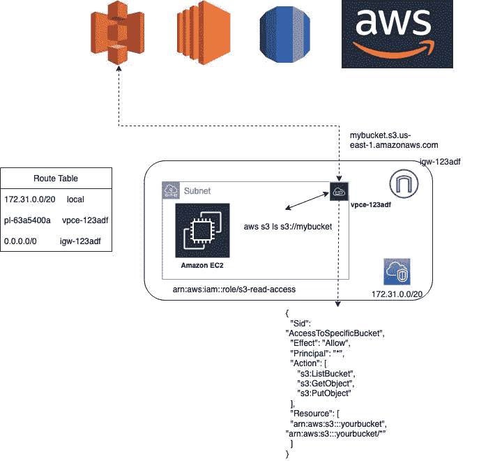
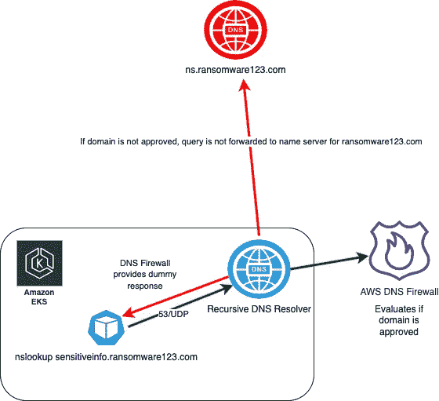

# 保护 EKS 工作负载免受勒索软件攻击的 10 大方法

> 原文：<https://itnext.io/top-10-ways-to-protect-eks-workloads-from-ransomware-ae96d1c1e839?source=collection_archive---------2----------------------->

2021 年将永远被人们铭记，因为这一年全世界都在严肃对待勒索软件。[这是因为报告的勒索软件攻击比上一年翻了一番，2020 年](https://www.securitymagazine.com/articles/97166-ransomware-attacks-nearly-doubled-in-2021)；这些攻击使公司损失了大约 20 亿美元，包括恢复损失和支付赎金。

随着全球转向容器化应用，这对公司来说只会使事情复杂化。虽然容器加速了应用程序的开发和部署，但是对于审计人员和安全团队来说，它们的安全含义通常是模糊的。在这种以勒索软件为重点的环境下，stackArmor 已经带领多个客户利用容器通过了 FISMA、FedRAMP、CMMC 和 DoD SRG 的审计。以下是客户应该重点关注的 10 件事，不仅可以防范勒索软件，还可以防范所有入侵。

## **1。工作者节点上适当的操作系统安全性。**

*   **安装基于主机的安全软件——文件完整性监控、防病毒和应用程序控制。**
*   **强化到可接受的基准，如国防部 STIG 或独联体基准。**
*   **定期扫描主机上的漏洞**

勒索软件说到底，只是一种恶意软件——它只是近年来由于加密货币的兴起和匿名支付的可能性而流行起来。因此，保护容器化应用程序免受恶意软件攻击的第一道防线是适当的加固和具有频繁签名更新的可靠 HBSS，这是有道理的。一个常见的混淆点是容器本身是否需要 AV 等。答案是否定的——容器使用 union mount 文件系统，因此容器化的应用程序将继承应用于主机的保护。利用基于代理的漏洞扫描器(而不是利用 SSH 或 SMB 协议的远程扫描器)也很重要，因为这允许您完全关闭对工作节点的远程访问。**

此外，建议公司利用不可变的部署策略来更新它们的工作节点——不要就地打补丁和更新！为了提高安全性，建议每月创建一个映像管道来自动创建您的黄金工作节点 AMI。AWS EC2 Image Builder 是一个完美的候选者，因为它允许你使用 SSM 编写定制的食谱，并为你的黄金 AMI 创建一个时间表；然后，这个新的 AMI 每月被推送到您的工作节点。EKS 内置了一些功能来加速工作节点的更新，包括节点的封锁、pod 的重新调度等。



** —仍然可以使用 AWS 会话管理器委派对主机的访问。Sessions Manager 不需要任何开放的入站端口，并且可以与外部 IDP 集成，以强制实施企业访问策略，例如强 MFA 和设备状态检查。

## **2。部署 HIDS，如法尔科。**

虽然目前大多数基于主机的安全软件都包含应用程序控制，即只允许所需的应用程序运行，但这可能还不够。根据解决方案的实现方式——基于哈希还是基于启发式——对于许多工作负载来说，尤其是那些基于容器的工作负载，这通常是有问题的。这就是为什么实施额外的基于主机的入侵检测系统(HIDS)如 Falco 非常重要。

Falco 可以作为二进制文件部署在 worker 节点本身上(在这种情况下，它将包含在上面的图像管道中)；但是，它也支持作为 DaemonSet 的部署，可以与自动扩展的 Kubernetes 工作负载无缝集成。如果使用 DaemonSet，则不需要将 Falco 预烘焙到工作节点 AMI 中。

Falco 使用内核模块或更新的 eBPF 来监控每个进程与主机内核的交互。利用其完全可扩展的 DSL，您可以编写自定义规则来警告任何可疑行为。

下面是一个规则示例，用于通知在容器内部打开的外壳。

```
- rule: shell_in_containerdesc: notice shell activity within a containercondition: evt.type = execve and evt.dir=< and container.id != host and proc.name = bashoutput: shell in a container (user=%user.name container_id=%container.id container_name=%container.name shell=%proc.name parent=%proc.pname cmdline=%proc.cmdline)priority: WARNING 
```

以下是通知敏感目录写入事件的规则示例。

```
- macro: open_writecondition: >(evt.type=open or evt.type=openat) andfd.typechar=’f’ and(evt.arg.flags contains O_WRONLY orevt.arg.flags contains O_RDWR orevt.arg.flags contains O_CREAT orevt.arg.flags contains O_TRUNC)- macro: package_mgmt_binariescondition: proc.name in (dpkg, dpkg-preconfigu, rpm, rpmkey, yum)- macro: bin_dircondition: fd.directory in (/bin, /sbin, /usr/bin, /usr/sbin)- rule: write_binary_dirdesc: an attempt to write to any file below a set of binary directoriescondition: evt.dir = < and open_write and not proc.name in (package_mgmt_binaries) and bin_diroutput: “File below a known binary directory opened for writing (user=%user.name command=%proc.cmdline file=%fd.name)”priority: WARNING
```

Falco 支持与 AWS CloudWatch 日志和安全中心集成，以便正确跟踪和处理检测到的异常情况。

## **3。控制出口交通流量。**

勒索软件只能进入网络，因为它要么是从恶意位置下载的，要么是由恶意用户上传的。为了防止恶意下载，控制出口流量至关重要。一些公司可能在服务网格(如 Istio)中使用出口网关来为外部服务制定策略。然而，这是不够的——它们只将出口策略应用于作为服务网格一部分的容器；网格之外的任何容器或进程都不会遵守出口网关策略。在 EKS，可以通过三种方式控制出口流量策略:

1.  互联网出口——在当今以云为先的世界中，真正的空气间隙系统越来越少。在某些时候，您的系统需要下载补丁、防病毒更新、容器映像等。从网上。使用防火墙来控制 EKS 集群和互联网之间的流量非常重要。AWS 网络防火墙是受管防火墙，可以针对用于托管恶意软件的恶意域提供保护。它通过以下方式提供保护:



1.  无状态规则—用于限制允许哪些端口和协议访问互联网—通常为:80/TCP (HTTP)、443/TCP (HTTPS)、123/UDP (NTP)、53/UDP (DNS)、53/TCP (DNS)。恶意软件可以驻留在非传统的端口和协议上，这些端口和协议通常不在互联网上使用，如 389/TCP (LDAP)。臭名昭著的 Log4Shell 漏洞就是利用这种方法被利用的。
2.  状态规则—可用于控制到远程域的 TLS 和 HTTP 流量。通过检查 TLS 客户端 Hello 的 SNI 扩展(或未加密 HTTP 中的主机报头)，防火墙可以阻止外部域的出口流量。这可以通过使用允许列表或拒绝列表来实现。
3.  托管规则组 AWS 还提供托管规则组，可用作恶意域的拒绝列表。以下是一些与勒索软件相关的托管规则组。如需完整列表，请访问:[https://docs . AWS . Amazon . com/network-firewall/latest/developer guide/AWS-managed-rule-groups-list . html](https://docs.aws.amazon.com/network-firewall/latest/developerguide/aws-managed-rule-groups-list.html)

*   abusedreitybotnetcommandcontroldomainsactionorder
*   MalwareDomainsActionOrder
*   abuseddlegitmalwaredomainsactionorder
*   botnetcommandcontroldomainsactionorder
*   威胁签名恶意软件

5.访问 AWS 服务–虽然 AWS 确实会监控滥用帐户，但勒索软件包可能会托管在 AWS 服务中，特别是 S3。当应用程序需要访问 AWS 服务时，添加具有严格端点策略的 VPC 端点可以增加一层保护，保护工作负载免受未经批准的 AWS 服务的访问，并最终免受勒索软件的攻击。



6.DNS 查找——DNS 是互联网的基本协议之一——每个工程师和管理员都在某个时候大喊“总是 DNS”是有原因的。这导致 DNS 成为一个有趣的攻击媒介。黑客可以注册一个恶意的域名，例如 ransomware123.com，因此整个互联网针对该域名的所有 DNS 查询都会被转发到恶意域名服务器。攻击者可以记录 DNS 查询中作为“子域”包含的任何信息。这可以是数据渗透、命令和控制等的载体。数据泄露不是“传统的”勒索软件，但如果敏感数据通过这种方法泄露，它肯定会被用来勒索组织。针对这种媒介的保护被称为 DNS Sink holing，AWS Route 53 Resolver DNS 防火墙符合要求。Sink holing 允许您检查 DNS 查询并评估它是否是一个恶意域；如果是恶意的，DNS 接收器会对 DNS 查询返回一个虚假响应，因此查询永远不会被转发到恶意的名称服务器。DNS 防火墙允许您为 AWS 识别的已知恶意域创建特定的允许列表、拒绝列表或利用 AWS 管理的列表。



## **4。限制对控制平面的访问。**

勒索软件可以部署成容器；因此，任何有权访问您的集群控制平面的人都可以部署勒索软件(有意或无意)。

使用 Kubernetes 中的 aws-auth ConfigMap 来控制对经过身份验证的用户的访问很重要，但控制对控制平面本身的网络访问也很重要。作为 AWS 访问的标准最佳实践，避免使用 AWS IAM 用户访问控制平面，而是依赖使用短期凭据的 IAM 角色。

[最近的一项研究](https://threatpost.com/380k-kubernetes-api-servers-exposed-to-public-internet/179679/)发现，大约 380，000 个不同的 Kubernetes 集群的 Kubernetes API 以及控制平面都暴露在互联网上。虽然 API 服务器可能仍然需要经过身份验证的访问，但可以通过限制哪些公共 IP 可以访问 API 服务器来轻松缓解这一问题；或者更好的是，根本不要把它暴露在互联网上，需要一个 VPN——毕竟，凭证可能会被泄露或窃取。

## **5。容器中的最低特权。**

勒索软件进入 Kubernetes 集群的另一种方式是通过集群中的一个容器。因此，在容器本身上实现适当的运行时安全性非常重要。通过限制容器的特权，您可以限制它们被恶意使用的能力。实现容器运行时安全性的一些常见选项:

1.  只读根文件系统。
2.  以对主机具有有限访问权限的用户身份运行容器。
3.  拒绝特权容器(除非特别要求)—使用准入控制器，如 OPA 网守。
4.  还可以利用 OPA Gatekeeper 来防止将未经批准的注册的容器调度到您的集群中。
5.  限制 Linux 内核功能——比如 NET_ADMIN 和 SYS_CHROOT。
6.  将主机路径卷装载限制到主机上的非敏感目录—可以使用准入控制器强制实施。
7.  使用 AppArmor 或 SecComp 配置文件限制内核访问。
8.  [利用 AWS IRSA 访问 AWS API](https://aws.amazon.com/blogs/opensource/introducing-fine-grained-iam-roles-service-accounts/) 来防止依赖过于宽松的 EC2 实例概要。

**6。网络分段。**

如果您被感染，对您的工作负载进行适当的网络分段可以在很大程度上阻止勒索软件的传播。正确划分集群的一种常见方法是使用 pod 放置策略，如污点、容差、节点亲和性和节点反亲和性。这将有助于在唯一的工作节点上调度 pod，因此如果一个服务受到损害，它可以防止它泄漏到其他服务。这并不是说每个服务都应该有自己的工作节点集；在设计这些需求时，了解您的应用程序的架构以及微服务如何与其他服务交互非常重要。除了 pod 放置策略之外，利用网络策略来控制服务间的通信(网络策略有点像用于 Kubernetes 的 AWS 安全组— [尽管您现在可以将安全组用于 EKS](https://docs.aws.amazon.com/eks/latest/userguide/security-groups-for-pods.html) ！)需要注意的是，默认的 AWS VPC CNI 不支持开箱即用的网络策略。您必须迁移到不同的 CNI，如纤毛，或[部署 Calico Daemonset。](https://docs.aws.amazon.com/eks/latest/userguide/calico.html)

**7。集中式日志聚合仓库和 SIEM 集成。**

来自多个日志源的日志聚合和关联本质上是为了及时确定您是否已经受到威胁。 [AWS 确实支持使用 FluentBit](https://docs.aws.amazon.com/AmazonCloudWatch/latest/monitoring/Container-Insights-setup-logs-FluentBit.html) 将容器日志运送到 CloudWatch 您也可以将它们发送到 Splunk 等公司 SIEM/SOAR。通过与 SIEM 或 CloudWatch 集成，您可以创建自动化，以便在确定整个工作节点遭到破坏时快速终止它们。这就是为什么像 Falco 这样的 HIDS 解决方案是必不可少的，并且应该与您的测井解决方案深度集成。

**8。备份和恢复策略。**

墨菲定律表明，这不是你是否会被勒索软件感染的问题，而是你何时会被感染的问题。这就是为什么在经济允许的情况下尽可能频繁地备份数据非常重要。如果您被感染，最简单的方法很可能是恢复您最新的“干净”备份。如果您使用 EBS、EFS、RDS、S3、DynamoDB、FSx、DocumentDB、Neptune 作为 EKS 集群的持久数据存储，您可以使用 AWS Backup 轻松实现备份自动化。这将允许您轻松地为所有场景定义 RPO，不仅包括勒索软件，还包括 AZ 和区域故障。它还与 AWS Backup Audit Manager 集成，因此您可以定期监控备份作业的状态和范围。

但是，备份只是这种情况的一个方面，恢复同样重要！定期测试您的备份并执行完整恢复非常重要，至少每年一次。没有其他方法可以确定您的备份是否真正有效。定期练习您的恢复过程也将有助于您改进您的过程，以最大限度地减少 RTO。这里有一篇来自 AWS 的关于如何为您的组织确定 RTO 和 RPO 的精彩博客。

**9。定期扫描容器图像。**

所有集装箱安全的开始应该从定期扫描您的集装箱图像开始。易受攻击的包随时都可能被引入和利用，因此在构建阶段进行扫描非常重要，而且还要正确地清点在您的环境中部署了哪些映像。仅仅因为映像在构建时没有漏洞，并不意味着它在生产中运行一段时间后就没有漏洞。[这是我写的另一篇文章，分解了适当的容器扫描策略——虽然它是针对联邦环境写的，但这些策略适用于任何组织。](https://stackarmor.com/demystifying-container-scanning-requirements-for-fedramp-dod-srg-and-cmmc/)

10。强化您的特权用户

任何系统中最容易受到攻击的部分是幕后的管理员和工程师，他们拥有进入集群的特权。因此，定期对所有员工进行网络安全培训非常重要。正确保护您团队的工作站，并教会他们识别最新的社会工程方法，通常是对抗勒索病毒的最后一道防线。