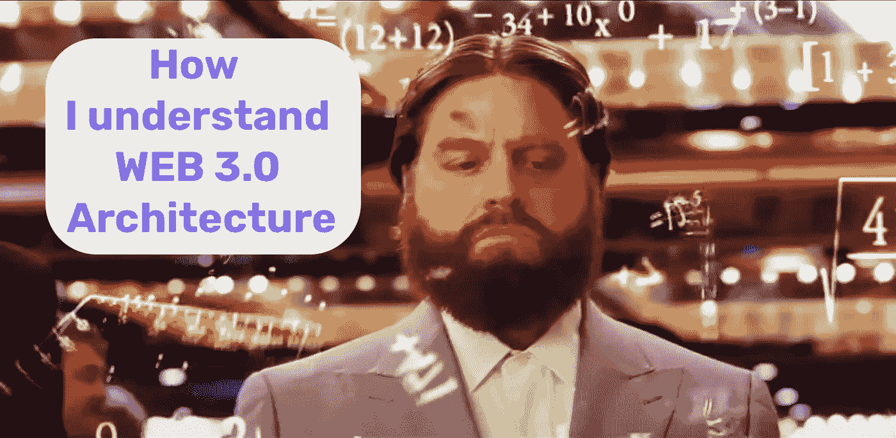
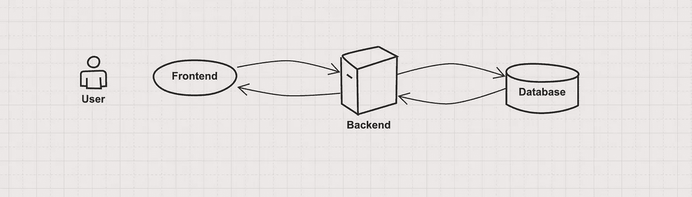
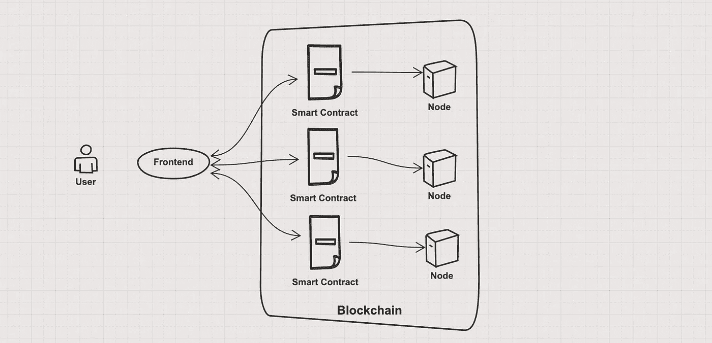
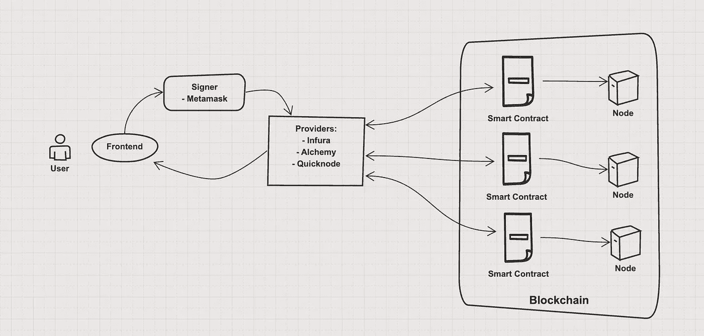
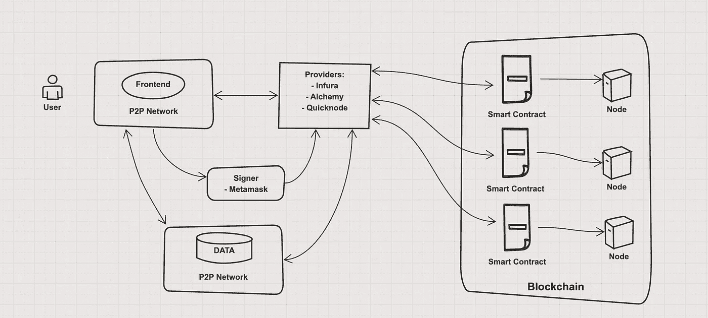

# 🔥解释了 Web3 架构的顶层:前端、后端和数据

> 原文：<https://itnext.io/top-3-web-3-0-architecture-layers-explained-frontend-backend-and-data-e10200f7fc76?source=collection_archive---------0----------------------->

## Web 3.0 架构可能会令人困惑，但我们会让理解变得清晰

# 内容

*   [**简介**](#f5df)
*   [**Web 3.0 中的后端层【DApp】**](#1562)
*   [**Web 3.0 中的前端层 DApp**](#891b)
*   [**Web 3.0 中的数据层 DApp**](#8b00)
*   [**结论**](#82d6)
*   [**博客上充斥着卡布奇诺**](#c500)
*   [**了解更多**](#9a54)

# 介绍

当我们谈论 Web 3.0 架构时，我们指的是分布式应用。从历史上看， **Web 2.0** 架构由我们最熟悉的组件组成:

*   **前端** —浏览器从主机服务器获取并呈现给用户的客户端应用。通常写在🅰️ **有棱角**，⚛️ **有反应**，以及其他任何新潮的框架里；
*   **后端** —服务器端应用(在某些情况下——无服务器，意味着存储在云端)。通常是一个应用程序，它接管所有繁重的逻辑，包括管理数据库。它通过 API 与**客户端**交互，并使用一种流行的后端语言编写: **JAVA** 、 **NodeJs** 、 **C#** 、 **GO、**Ruby、 **Python** 。
*   **数据库** —它可能是 **NoSQL** 或 **SQL** 数据库服务器。基本上存储所有的客户端和服务器数据。最流行的数据库有 **Postgresql** ， **Mongo** 。

当然，取决于可伸缩性，还有更多组件，但这超出了我们的主题。 ***主要问题是 Web 2.0 和 Web 3.0 有什么区别？***

# Web 3.0 DApp 中的后端层

DApp 的主要区别在于分权。你不需要一个集中的数据库或 web 服务器，你可以利用区块链在计算机网络之间分发应用程序。区块链将充当“**国家机器**🤖—通过验证预定义的规则来维护程序的状态和稳定性。状态机分布在区块链网络的所有参与者之间，验证通过关于程序稳定性的**共识**存档。

**后端**逻辑通过**智能契约**实现，智能契约稍后将被部署到共享**状态机**(区块链网络)。所以后端驻留在一个对等网络中，每个人都可以通过匹配一些标准(例如拥有并锁定加密货币，以便对改变进行投票或对程序提出建议)。**但是前端是如何工作的呢？**

# Web 3.0 DApp 中的前端层

在 **DApp** 的情况下，主**前端**架构专注于与**智能合约**(分散程序)的通信。并且它将不同于普通的前端-后端通信。

区块链网络中的每个节点都承载着程序的状态，如果你想与**智能合约**通信，你必须与其中一个节点通信，它可能是:

*   第三方节点**提供者**，像****[**炼金术**](https://www.alchemy.com/) **，以及**[**Quicknode**](https://www.quicknode.com/)****
*   ****或者自己通过运行**状态机**来设置自己的节点；****

****启动区块链基础设施可能相当具有挑战性，尤其是当您想要扩展它以添加更多节点时。有当用户**提供**将是方便的，缺点是它创建了一个集中的依赖组件。****

****所有的**提供商**都在实现 **JSON** - **RPC** 规范，与区块链网络进行通信。 **RPC、**或**远程过程调用—** 是一种请求-响应协议，它定义了允许客户端向远程机器发送消息以执行功能并检索响应的规则。在这种通信中，程序运行时位于客户端机器上，这意味着客户端不知道远程机器。所有的通信都要通过 **HTTP** 或 **Web Sockets** 。****

****当**提供者**连接到**区块链时，**客户端能够获得关于**区块链**的**状态** **的信息。但是客户如何给区块链网络写信呢？**所有的**写** **请求交易**都需要**用客户端的**私钥**签名**。每一笔**交易**都将花费客户一笔**汽油费**是一种加密货币，它将去升值验证**交易**的其他节点(**矿工**)。****

**这样一个**提供者**，就像 [**元掩码**](https://metamask.io/) ，就像一个**事务** **签名者**和**提供者**。它将**私钥**存储在浏览器中，并在客户端发出交易请求时签名，它还连接到区块链网络。**

****

# **Web 3.0 DApp 中的数据层**

> **💡这是你的数据，拥有它吧！**

**将数据存储在**区块链**可能会因为**交易气费**而变得相当昂贵，使用非区块链解决方案更合理，比如点对点存储—[**【IPFS**](https://ipfs.io/)或 [**Swarm**](https://www.ethswarm.org/) 。**

****—是一种点对点的文件系统协议，允许你通过机器网络存储数据。没有流行浏览器的原生支持，IPFT 使用 [**私有**](https://blog.stacktical.com/ipfs/gateway/dapp/2019/09/21/ipfs-server-google-cloud-platform.html) 或 [**公共**](https://ipfs.github.io/public-gateway-checker/) 网关连接网络。****

****[**Swarm**](https://www.ethswarm.org/) —类似于 IPFT，唯一的区别是系统通过以太坊区块链网络中的**智能合约**来维持。****

****为了使您的前端也是分散的，您可以使用相同的对等存储解决方案。****

****最后为了简化查询存储在区块链 [**或对等网络**](https://thegraph.com/en/) 中的数据。它将 GraphQL 查询转换为智能合约事件和对等网关。****

********

# ****结论****

****Web 3.0 DApp 架构可能看起来势不可挡🤯。的确如此，但现在出现了更多旨在简化构建体验的工具，如[**hard hat**](https://hardhat.org/)**和**[**third web**](https://thirdweb.com/)**。但是不要怀疑:**********

*****如果你想学习如何用* ***web 3.0 栈*******拍*** *👏和* ***跟随*** *我在* ***中*** *和* [***碎碎念***](https://twitter.com/EasyWebOrg) *，我正在做建造 NFT 市场的教程，不想错过的点击跟随。😉******

***** [## 每当维塔利·舍甫琴科发表文章时，就收到一封电子邮件。

### 每当维塔利·舍甫琴科发表文章时，就收到一封电子邮件。通过注册，您将创建一个中型帐户，如果您还没有…

easy-web.medium.com](https://easy-web.medium.com/subscribe)  [## 通过我的推荐链接加入 Medium 维塔利·舍甫琴科

### 作为一个媒体会员，你的会员费的一部分会给你阅读的作家，你可以完全接触到每一个故事…

easy-web.medium.com](https://easy-web.medium.com/membership)  [## easyweb 通过教程和博客使 web 开发变得简单

### 嘿，伙计👋每一杯卡布奇诺都会让这个世界变得温暖一点

www.buymeacoffee.com](https://www.buymeacoffee.com/easyweb) 

# 了解更多信息

 [## 🔥2022 年每个前端开发人员都必须遵循的 18 大 Web 3.0 趋势

### 这个列表将展示 Web 3.0 可以带来的新机会，并可能激发下一个百万美元的想法。😜

javascript.plainenglish.io](https://javascript.plainenglish.io/top-18-web-3-0-trends-every-frontend-developer-has-to-follow-in-2022-2861f9b63627)  [## 🔥作为一名前端开发人员，您需要了解互联网 Web 3.0 新时代的哪些信息

### 互联网 Web 3.0 的未来是什么样子，我们在哪里。

javascript.plainenglish.io](https://javascript.plainenglish.io/what-do-you-need-to-know-about-new-era-of-internet-web-3-0-as-a-frontend-developer-55e51f2cd03f)  [## 🔥帮助我获得亚马逊和 LinkedIn 录用通知的前端面试备忘单

### 如果你正在准备一个前端面试，想快速更新你的领域知识，这个备忘单将…

itnext.io](/frontend-interview-cheatsheet-that-helped-me-to-get-offer-on-amazon-and-linkedin-cba9584e33c7)*****