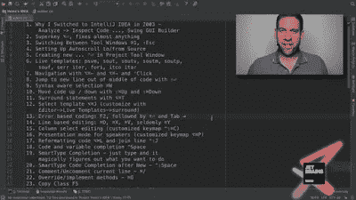
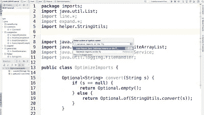
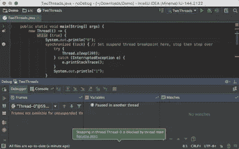
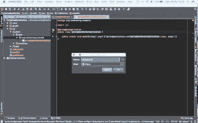
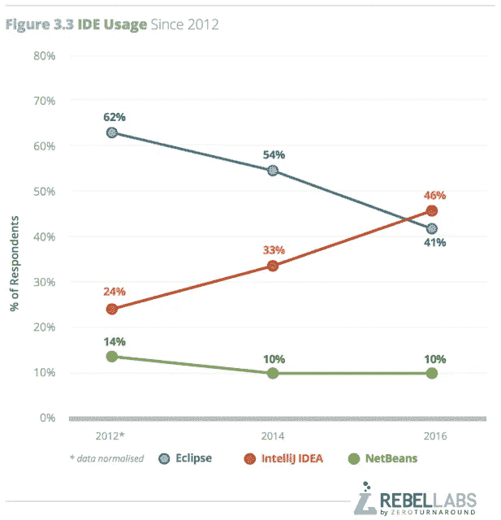

# 2023 年 Java 和 Android 程序员前 5 名 IntelliJ IDEA 和 Android Studio 课程

> 原文：<https://itnext.io/top-5-intellijidea-and-android-studio-courses-for-java-and-android-programmers-afcc27309b60?source=collection_archive---------1----------------------->

毫无疑问， [IntelliJ IDEA](https://www.jetbrains.com/idea/) 是【Java 开发的最佳 IDE 之一，尽管 [Eclipse](https://javarevisited.blogspot.com/2018/07/top-30-eclipse-keyboard-shortcuts-java-programming.html) 可能仍被比 IDEA 更多的人使用，主要是因为它是免费的，IntelliJ IDEA 是功能最丰富和完整的 IDE。

Android Studio 是 Java 中 Android 开发的官方 IDE，它也基于 IntelliJ IDEA，这进一步巩固了它作为每个 Java 开发人员都应该学习的 IDE 的地位。

过去阻止我和许多其他 Java 开发人员迁移到**[**IntelliJ IDEA**](https://medium.com/javarevisited/7-best-courses-to-learn-intellij-idea-for-beginners-and-experienced-java-programmers-2e9aa9bb0c05)的唯一原因是缺乏资源，这也是我过去从 Eclipse 中感受到的不足之处。**

**因为 Eclipse 从一开始就是免费的，所以有大量的资源可用，例如[书籍](https://javarevisited.blogspot.com/2016/03/3-books-to-learn-eclipse-ide-for-java-jee-programmers.html)、[课程](http://www.java67.com/2018/02/5-free-eclipse-and-junit-online-courses-java-developers.html)和[教程](http://www.java67.com/2018/01/how-to-remote-debug-java-application-in-Eclipse.html)。**

**也有很多学习生产力技巧的资源，比如[键盘快捷键](https://javarevisited.blogspot.com/2018/07/top-30-eclipse-keyboard-shortcuts-java-programming.html)和[调试技术](http://bit.ly/2J9SVYQ)，但是 Intelli IDEA 的资源并不多。**

**但是，正如我所说的，事情已经发生了变化。现在网上有很多有用的资源可以学习和掌握 IntelliJ IDEA 和 Android Studio。**

**在 [Udemy](http://javarevisited.blogspot.sg/2018/01/top-10-udemy-courses-for-java-and-web-developers.html) 和 [Pluralsight](http://javarevisited.blogspot.sg/2017/12/top-10-pluralsight-courses-java-and-web-developers.html) 上有很多很好的课程，在 Youtube 上有截屏，甚至在 [JetBrains 的博客](https://blog.jetbrains.com/)上也有一些有用的内容——你唯一需要的就是找到适合你的课程，这就是这篇文章可以帮助你的地方！**

**在本文中，我将为 [**Java**](https://medium.com/javarevisited/10-best-places-to-learn-java-online-for-free-ce5e713ab5b2) **和**[**Kotlin**](https://medium.com/javarevisited/top-5-courses-to-learn-kotlin-in-2020-dfc3fa7706d8)**开发者**们分享一些**最佳 IntelliJ IDEA 课程，来学习和掌握 IntelliJ DEA 和 Android Studio。****

**这些课程还会教你使用键盘快捷键、调试和导航技术，从而帮助你提高工作效率。**

# **面向 Java 开发人员的 5 门最佳 IntelliJ IDEA 和 Android Studio 课程**

**如果你是一名 Java 开发人员，正在学习 intelli jidea(T21 ),并且正在寻找一些很棒的课程来提升你的学习和 IDE 技能，那么你来对地方了。**

**以下是我为 Java 和 Android 开发者列出的一些最好的 IntelliJ IDEA 课程。**

**即使你正在使用 Kotlin 进行 Android 开发，你也可以从 learning IDEA 中受益，并会发现其中一些课程很有用。**

**此外，值得注意的是 [Kotlin](https://medium.com/javarevisited/7-free-courses-to-learn-kotlin-in-2020-327c3872c1e1) 来自 JetBrains，IntelliJ IDEA 和 Android Studio 背后的公司。**

## **1.Heinz Kabutz 的 Java 和 Android IntelliJ Wizardry Lite】(免费)**

**如果你从事 Java 开发已经有几年了，那么你可能听说过 Heinz Kabutz 博士，他是 Java 冠军之一，也是著名的 [Java 并发](https://tinyurl.com/y9lfs5er)和[设计模式](http://bit.ly/2L7psTI)课程的作者。**

**他也是 IntelliJ IDEA 最有影响力的用户之一，并在他的课程中使用它，如果您参加过他的任何网络研讨会或讲座，他的 IntelliJ 技能肯定会引起您的注意。**

**在这个[免费课程](https://javaspecialists.teachable.com/p/intellij-wizardry?affcode=92815_johrd7r8)中，Heinz 分享了他的大部分神奇的 IntelliJIDEA 技巧，任何 [Java](http://javarevisited.blogspot.sg/2017/11/top-5-free-java-courses-for-beginners.html) 或 [Android](http://javarevisited.blogspot.sg/2017/12/top-5-android-online-training-courses-for-Java-developers.html) 开发人员都可以使用 IntelliJ IDEA 或 Android Studio 来提高工作效率。**

**我强烈推荐这门课程，你不会失去什么，因为它是完全免费的。**

****

## **[2。提高 Java 开发人员生产率的 IntelliJ IDEA 技巧](https://click.linksynergy.com/fs-bin/click?id=JVFxdTr9V80&subid=0&offerid=323058.1&type=10&tmpid=14538&RD_PARM1=https%3A%2F%2Fwww.udemy.com%2Fintellij-idea-secrets-double-your-coding-speed-in-2-hours%2F)**

**这是 Udemy 上最受欢迎的 IntelliJ IDEA 课程之一，已经有超过 3000 名学生注册。在本课程中，您将学习 IntelliJ IDEA 的快速编码技巧，这将使您成为一名更高效的 Java 开发人员，记住:工匠和他的工具一样好。**

**作者陶 w .和李中清是在大数据领域工作的软件工程师。詹姆斯也曾与谷歌和亚马逊等技术巨头合作。**

**在他的日常工作中，他与大数据技术打交道，如 [Cassandra](https://javarevisited.blogspot.com/2022/02/top-5-courses-to-learn-apache-cassandra.html) 和 [ElasticSearch](https://javarevisited.blogspot.com/2022/02/top-5-courses-to-learn-elasticsearch.html) ，他是一个绝对的 [Docker](https://javarevisited.blogspot.com/2018/02/10-free-docker-container-courses-for-Java-Developers.html) 技术极客和 IntelliJIDEA 爱好者，非常注重效率和简单性。**

**这充分说明了你将从本课程中获得什么。简而言之，你将学习超过 70 种快捷方式来提高你的生产力(在 [Mac](https://javarevisited.blogspot.com/2022/02/top-5-macos-courses-for-beginners-in.html) 、 [Linux](http://www.java67.com/2018/02/5-free-linux-unix-courses-for-programmers-learn-online.html) 和 Windows 上)，并学习如何使用 IntelliJ IDEA 的分析工具的神奇力量来创建更好的代码。**

****

## **3.[用 IntelliJ 思想重构 Java](https://click.linksynergy.com/fs-bin/click?id=JVFxdTr9V80&subid=0&offerid=323058.1&type=10&tmpid=14538&RD_PARM1=https%3A%2F%2Fwww.udemy.com%2Frefactoring-java-with-intellij-idea%2F)**

**除了单元测试，重构是另一种区分新手和专业开发人员的艺术，为了成为好的重构，你需要一个你可以信任的工具。**

**虽然 [Eclipse](http://shrsl.com/176fn) 和 [NetBeans](http://javarevisited.blogspot.sg/2017/03/10-tools-used-by-java-programming-Developers.html#axzz55lrMRnNC) 都提供了强大的重构工具来[重构 Java 代码](https://medium.com/javarevisited/7-best-courses-to-learn-refactoring-and-clean-coding-in-java-47bea3c67006)，例如**将代码提取到方法**，但是在不破坏 IntelliJ 的重构能力的情况下，类和改变代码的设计是无法匹敌的。**

**IntelliJ IDEA 提供了大量的工具来使非常大的代码库的重构变得安全和没有麻烦，本课程将教你如何利用 IntelliJ IDEA 的内置重构来提高你的代码质量。**

**该课程首先展示如何使用 IntelliJ IDEA 的自动化工具重构一个小的代码库，然后建立可以毫不费力地应用于巨大源代码树的技能。**

**你可以把这本书和马丁·福勒的重构书一起使用，像专家一样重构 Java 代码。**

****

## **4.[用 IntelliJ 思想开发 Spring Boot 和 Java】](https://click.linksynergy.com/fs-bin/click?id=JVFxdTr9V80&subid=0&offerid=323058.1&type=10&tmpid=14538&RD_PARM1=https%3A%2F%2Fwww.udemy.com%2Fintellij-idea-for-java-and-spring-developers%2F)**

**Spring Boot 真的把 Spring 的 Java 开发带到了另一个高度。它的[自动配置](https://javarevisited.blogspot.com/2018/05/top-5-courses-to-learn-spring-boot-in.html)和 starter 依赖特性消除了你在用 Spring 开发 Java 项目时面临的所有初始摩擦。**

**如果将这种便利与 IntelliJ IDEA 的强大功能结合起来，您将拥有一套工具和库来快速开发 Java 和 Spring 框架。**

**在[这门课程](https://click.linksynergy.com/fs-bin/click?id=JVFxdTr9V80&subid=0&offerid=323058.1&type=10&tmpid=14538&RD_PARM1=https%3A%2F%2Fwww.udemy.com%2Fintellij-idea-for-java-and-spring-developers%2F)中，你将学习如何使用 IntelliJ IDEA 开发和运行 [Spring Boot](https://javarevisited.blogspot.com/2018/02/top-5-spring-microservices-courses-with-spring-boot-and-spring-cloud.html) 项目，**学习 IntelliJ IDEA 键盘快捷键**，使用 IntelliJ 调试和测试 Java 应用程序，并在 IntelliJ IDEA 中轻松搜索和编辑源代码。简而言之，Java 和 Spring 开发人员的完美课程。**

****

## **5.[成为 IntelliJ 思想大师](http://https://click.linksynergy.com/fs-bin/click?id=JVFxdTr9V80&subid=0&offerid=323058.1&type=10&tmpid=14538&RD_PARM1=https%3A%2F%2Fwww.udemy.com%2Fexperience-intellij%2F)**

**我之前说过，工匠和他的工具一样好，Java 开发者和他的 IDE 一样好。但是有了 IntelliJ IDEA，你还需要学习如何利用 IDEA 的所有力量。**

**如果您刚刚开始使用 IntelliJ IDEA，那么您应该像专业人士一样学习和使用 IDEA。**

**[本课程](http://https://click.linksynergy.com/fs-bin/click?id=JVFxdTr9V80&subid=0&offerid=323058.1&type=10&tmpid=14538&RD_PARM1=https%3A%2F%2Fwww.udemy.com%2Fexperience-intellij%2F)将教你如何使用自动完成和智能完成更快地编写代码，快速查找和替换所有文件中的文本，轻松导航你的代码库，并从 IntelliJ 中构建和[运行 Java 程序](https://javarevisited.blogspot.com/2018/08/top-5-free-java-8-and-9-courses-for-programmers.html)(无需进入命令行)。**

**如果你还在考虑 Eclipse，你可能需要再考虑一下，从下面来自 [RebelLabs](https://zeroturnaround.com/rebellabs/java-tools-and-technologies-landscape-2016-trends/) 的图表来看，Eclipse 显然已经在与 IntelliJ IDEA 的竞争中失败了，可能只是 Android Studio 扭转了对 Eclipse 的趋势。**

****

**以上是**学习 Java 和 Android 开发 IntelliJ 理念的最佳课程**。这些课程将使您的 IntelliJ IDEA 技能更上一层楼，并提高您的生产力和开发经验。**

**如果你有任何其他的 IntelliJ IDEA 课程想与我们分享，请在下面的评论中自由地这样做。你在这些课程中学到的大部分技巧和提示也适用于 Android Studio。**

**其他 **Java 编程资源**你可能喜欢:
[程序员免费 Java 8 和 Java 9 的前 5 门课程](https://javarevisited.blogspot.com/2018/08/top-5-free-java-8-and-9-courses-for-programmers.html#axzz5RGxCxP4O)
[学习 Android 开发的前 5 门课程](https://javarevisited.blogspot.com/2017/12/top-5-android-online-training-courses-for-Java-developers.html#axzz5RGxCxP4O)
[高级 Java 开发人员的 10 门 DevOps 课程](https://javarevisited.blogspot.com/2018/09/10-devops-courses-for-experienced-java-developers.html)
[Web 开发人员学习 ReactJS 的前 5 门课程](https://javarevisited.blogspot.com/2018/08/top-5-react-js-and-redux-courses-to-learn-online.html)
[2023 年学习 Spring Boot 的前 5 门课程](https://javarevisited.blogspot.com/2018/05/top-5-courses-to-learn-spring-boot-in.html)
[2023 年学习 Python 的前 5 门课程](http://www.java67.com/2018/02/5-free-python-online-courses-for-beginners.html) [2023 年学习 Web 开发的 5 门课程](http://www.java67.com/2018/02/5-free-python-online-courses-for-beginners.html)
[面向 Java 开发者的 5 门免费 Spring 框架课程](http://www.java67.com/2017/11/top-5-free-core-spring-mvc-courses-learn-online.html)**

## **结束语**

**谢谢，你坚持到了文章的结尾…祝你的 Java 开发之旅好运！**

**这当然不会很容易，但是知道了 JetBrains 的 IntelliJIDEA 等一些很棒的工具，你就离成为你一直想成为的更好的 Java 开发人员又近了一步。**