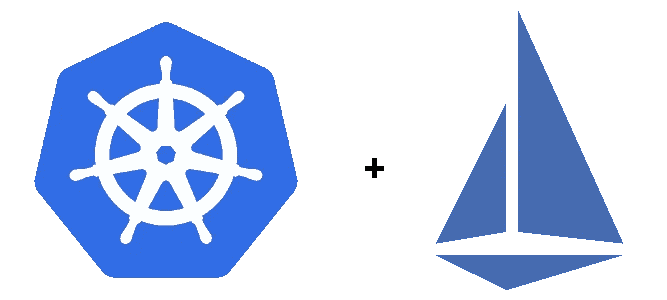

# 五大 Istio 命令

> 原文：<https://itnext.io/top-5-istio-commands-f54ada0cc4e?source=collection_archive---------0----------------------->

Istio 项目(和服务网格)已经成为云原生世界中家喻户晓的名字，这是有充分理由的！Istio 可以位于 Kubernetes 之上，也可以单独作为一个控制平面，只要它管理着通过[特使代理](https://www.envoyproxy.io/)路由流量的服务舰队。Istio 将三件大事合二为一——路由、可观察性和安全性。在我学习的早期，关于 Kubernetes 的一个很棒的项目(嗯，我仍然是！)是 kubectl 备忘单。在这篇文章中，我希望给你五种调试 Istio 的新方法，以及一个当你不确定集群中发生了什么时可以使用的快速工具箱。我假设您正在 Kubernetes 上运行 Istio，并且已经安装了`istioctl`(一些命令使用它)。



Istio 不需要 Kubernetes，但这两者可以很好地结合在一起

# 1.kubectl get pods -n istio-system

把它打出来感觉有点傻，但是如果你是新手，知道 Istio 通常在`istio-system`名称空间中安装它的控制平面组件是有好处的。Istio 1.6 及以上版本中的关键组件是`istiod`。下面是一个输出示例。

```
$ kubectl get pods -n istio-system
NAME                                    READY   STATUS    RESTARTS   AGE
grafana-64986f9974-bmb28                1/1     Running   0          13d
istio-egressgateway-5f9595d5d-gtlwr     1/1     Running   0          13d
istio-ingressgateway-555fd75c88-f6jc8   1/1     Running   0          13d
istio-tracing-7cf5f46848-fzmmh          1/1     Running   0          13d
istiod-76b6d8f677-ml96d                 1/1     Running   0          13d
kiali-7fcc47db9f-fbvrs                  1/1     Running   0          13d
prometheus-698dc96c9-d7ltt              2/2     Running   0          13d
```

注意这里我运行了一些额外的项目，事实上这是和`istioctl`一起安装的`demo`概要文件

# 2.ku bectl logs-n istio-system-l app = istiod

这从 Istiod 获取日志，并为您提供控制平面中发生的事件的快照。同样，这是一个输出示例。注意，我从标签`app=istiod`中抓取了`istiod`

```
$ kubectl logs -n istio-system -l app=istiod
2020-07-06T17:47:13.725314Z info ads LDS: PUSH for node:istio-ingressgateway-555fd75c88-f6jc8.istio-system listeners:0
2020-07-06T17:47:13.726066Z info ads EDS: PUSH for node:istio-ingressgateway-555fd75c88-f6jc8.istio-system clusters:64 endpoints:70 empty:0
```

在任何给定的时间，我都发现这些日志要么充满了有用的信息，要么充满了与我正在调试的内容无关的状态。这是一般性的，但是当 Istio 集群中出现问题时，`istiod`通常包含部分答案，因为往来于特使代理的许多重试逻辑都记录在`istiod`中

# 3.组织分析

`istioctl`工具附带了一个分析工具，它通常是我调试 Istio 时首先去的地方，尤其是当我需要一个系统基线的时候。它会告诉你关于你丢失的东西和不一致的一般项目的常见警告。这是我的一个例子，注意我遗漏了 Istio 侧车注射所需的标签。[查看文档了解更多信息。](https://istio.io/latest/docs/ops/diagnostic-tools/istioctl-analyze/)

```
$ istioctl analyze
Warn [IST0102] (Namespace default) The namespace is not enabled for Istio injection. Run 'kubectl label namespace default istio-injection=enabled' to enable it, or 'kubectl label namespace default istio-injection=disabled' to explicitly mark it as not needing injection
```

这个输出实际上非常有用，我的边车注射标签不见了！

# 4.istioctl 代理-状态

该命令对于获取网格的概览非常有用。您的 Istio 安装中的 sidecars(通过 Envoy 提供支持)依赖于一组称为`xDS` API 的 API，意思是 x 发现服务，其中 x 是被发现的配置类型(有四个)。我知道这可能从一开始就听起来令人困惑，但需要知道的重要一点是，Istio 是一个巨大的工具，用于配置多个一起工作的特使代理。这些代理将其配置分成四个部分，每个部分代表一个发现服务。[有关更多信息，请参见特使文档。](https://www.envoyproxy.io/docs/envoy/latest/api-docs/xds_protocol)

底线是，您在这个输出中寻找的是每个`xDS`字段都表示`SYNCED`(总共有四个)。

```
$ istioctl proxy-status
NAME                 CDS    LDS    EDS     RDS      PILOT  VERSION
istio-egressgateway  SYNCED SYNCED SYNCED  NOT SENT istiod   1.6.2
istio-ingressgateway SYNCED SYNCED SYNCED  NOT SENT istiod   1.6.2
prometheus           SYNCED SYNCED SYNCED  SYNCED   istiod   1.6.2
```

# 5.kubectl 日志 POD_NAME -c istio-proxy

这一点也很容易理解，但仍然值得一提，以防它不在您的首选项中。您的代理将发出各种各样的事件，尤其是当您更改您的 Istio 对象或尝试一些新的东西时。监控这些日志对于观察流量进出您的 pod(以及当它失败时)非常有用。例如，您可以从 pod 中观察`curl https://www.google.com`事件:

```
$ kubectl logs productpage-v1-88646568d-v9q6w -c istio-proxy
2020-07-06T18:53:08.946714Z info Obtained private IP [10.32.2.7]
2020-07-06T18:53:08.948383Z info JWT policy is third-party-jwt
**[2020-07-06T18:57:05.103Z] "- - -" 0 - "-" "-" 883 15444 138 - "-" "-" "-" "-" "74.125.195.106:443" PassthroughCluster 10.32.2.7:53332 74.125.195.106:443 10.32.2.7:53330 - -**
```

请注意，最后一个日志条目从内部的`10.x.x.x` IP 地址命中`74.125.195.106:443`，这表示从 ProductPage pod 内部到 Google 的 cURL(使用端口 443，又名 HTTPS)。

# 摘要

这就对了。我给了你五个命令，可以帮助你完成 Istio 冒险和调试过程。当您的 Istio 集群不可避免地遇到问题或者您试图向您的服务网格添加功能时，这些命令非常简单，但却是必不可少的。如果你喜欢我所做的，**请跟随我的媒介，**如果你有任何问题或询问，请发电子邮件给我 bryant.hagadorn@gmail.com。谢谢！