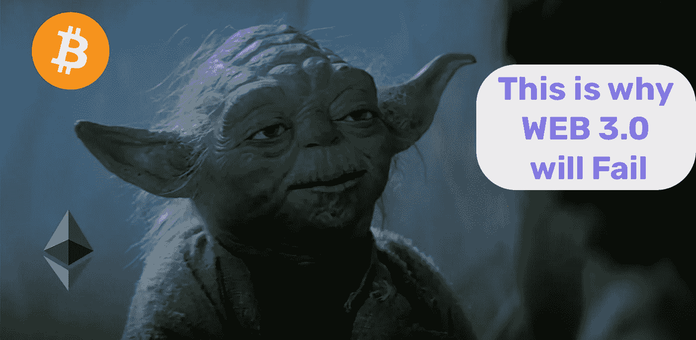
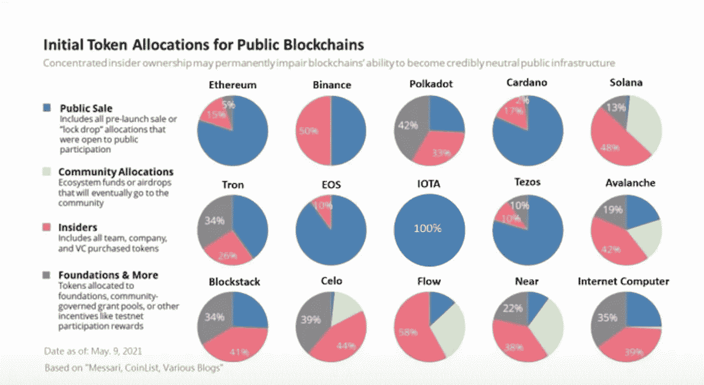

# 🔥Web 3.0 会失败的 5 个原因？

> 原文：<https://itnext.io/top-5-reasons-why-web-3-will-fail-57237e4c3db?source=collection_archive---------0----------------------->

如果 Web 3 只是一个失败的想法，你真的需要浪费时间去学习它吗？

# 介绍

对于大多数人来说，Web 3.0 听起来像是又一个用来推广加密骗局或炒作的时髦词。对其他人来说，这是分散的网络应用，一群人控制着他们自己的互联网份额。数据由智能合同和密码管理，而不是由谷歌、T2、Meta、T4、脸书和亚马逊拥有。这个想法看起来很浪漫，但实施起来够现实吗？否则它将只停留在秘密亚文化的梦想中，永远不会成为主流。我们将回答这个问题，但首先，让我们看看 Web 3.0 的缺点。

# 1.Web 3 是混乱的

Web 3.0 的主要特征是去中心化，这意味着 Web 应用程序存储在一个**区块链**中。业主是区块链的所有参与者，他们通过**共识**决定产品变更。

> 要更流利地使用术语，请看这篇文章。

 [## 🔥2022 年每个前端开发人员都必须遵循的 18 大 Web 3.0 趋势

### 这个列表将展示 Web 3.0 可以带来的新机会，并可能激发下一个百万美元的想法。😜

itnext.io](/top-18-web-3-0-trends-every-frontend-developer-has-to-follow-in-2022-2861f9b63627) 

主要的一点是，没有一个单一的权威机构对这些数据负责。没有法律或法规来定义什么样的程序或内容可以发布。控制它并找到谁将为骚扰和诈骗内容负责将是一个巨大的头痛。监管远离技术，这将使更多的骗子找到新的方法来滥用系统。

# 2.Web 3 很难开发

Web 3.0 应用程序被称为 DApps，即分散式应用程序。代码库将分布在整个区块链，数据存储在对等网络中。这种架构带来了更多问题:

*   共识方法正在减缓发展；
*   应用程序将取决于可能存在一些问题的特定区块链；
*   依靠提供服务的第三方工具来构建应用程序(这种服务仍然非常新，从长远来看没有证明自己)；
*   调试和测试问题。

 [## 🔥解释了前三个 Web 3.0 架构层:前端、后端和数据

### Web 3.0 架构可能会令人困惑，但我们会让理解变得清晰

javascript.plainenglish.io](https://javascript.plainenglish.io/top-3-web-3-0-architecture-layers-explained-frontend-backend-and-data-e10200f7fc76) 

# 3.DApps 实际上并不是分散的😦

从技术上来说——是的，**dapp 们**居住在区块链，并以密码为燃料，但一些人必须创建这个区块链运动并推出令牌。如果你看一下统计数据:

你会注意到区块链产业的很大一部分被贪婪的资本家和硅谷内部人士所控制。如果你计划在区块链的一些地方开发你的 Web 3.0 应用，请注意，它随时可能被拥有主要加密市场的一些有限的人所操纵。

# 4.对主流企业没有好处

理论上，任何 web 应用程序都可以使用 Web 3 栈来构建。嗯，加密货币，区块链，去中心化听起来很棒，但把你的业务转换成去中心化的应用有什么意义呢，这等于无缘无故地把你的资产送人。对于为什么每个人都必须这样做，没有明确的理解，例如，银行。太多的人在金融行业工作，并以此为生，突然间，他们不得不放弃自己的工作和生意。区块链技术很强大，也很有前景，但要找到它的最佳用途还需要时间。

# 5.Crypto crush 会毁掉所有 Web 3 的观点

加密货币(代币)——是区块链任何交易的主要支付来源，没有它 Web 3 不可能存在。而且加密货币不带来任何其他价值，你不能用 crypto 或者 **NFT** 买房买车。这使得加密市场相当脆弱。具有讽刺意味的是，它的存在仅仅是因为一群狂热分子和投机者。另一方面，一些加密货币的价格正在毫无意义地飙升。这样的泡沫随时可能爆发，多米诺骨牌效应会让 Web 3 褪色过去。

# 结论

为了使 Web 3 更加人性化，还有很多问题需要解决。对于一些人来说，将这种技术从他们的生活中排除将是一个主要的争论，因为这样的未来永远不会实现，他们将是正确的。对于其他人来说，这将是一个巨大的机会，让这个未来更近一步，并从中受益。*一些聪明的人说:“悲观主义听起来很聪明，但乐观主义能赚钱。”*

如果它成为主流，你会很高兴你开始得早。

*感谢你的阅读，如果你学到了新的东西，请告诉我。如果你不想被 crypto 弄得一团糟，请关注我的 medium，了解更多关于 Web 3 的知识。*

 [## 每当维塔利·舍甫琴科发表文章时，就收到一封电子邮件。

### 每当维塔利·舍甫琴科发表文章时，就收到一封电子邮件。通过注册，您将创建一个中型帐户，如果您还没有…

easy-web.medium.com](https://easy-web.medium.com/subscribe)  [## 通过我的推荐链接加入 Medium 维塔利·舍甫琴科

### 作为一个媒体会员，你的会员费的一部分会给你阅读的作家，你可以完全接触到每一个故事…

easy-web.medium.com](https://easy-web.medium.com/membership) 

# 了解更多信息

 [## 🔥帮助我获得亚马逊和 LinkedIn 录用通知的前端面试备忘单

### 如果你正在准备一个前端面试，想快速更新你的领域知识，这个备忘单将…

itnext.io](/frontend-interview-cheatsheet-that-helped-me-to-get-offer-on-amazon-and-linkedin-cba9584e33c7)  [## 🔥建造一个漂亮的抖音克隆体，有棱角和微前端

### 第 1 部分:不再有丑陋的教程，只有美丽的，真实世界的例子，通过构建抖音学习微前端

itnext.io](/building-beautiful-tiktok-clone-with-angular-and-micro-frontend-part-1-bdd189425695)  [## 🔥微前端如何改变 Angular 的未来？

### 让我们看看为什么 Angular 最适合微前端

itnext.io](/how-micro-frontend-changes-the-future-of-angular-bb4deb2cfdad)