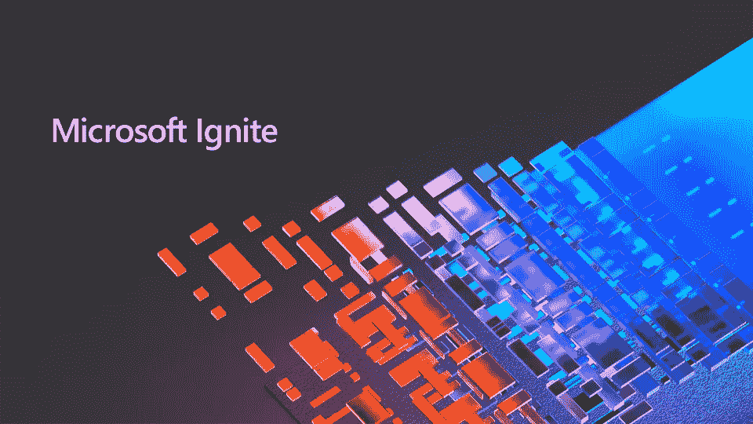
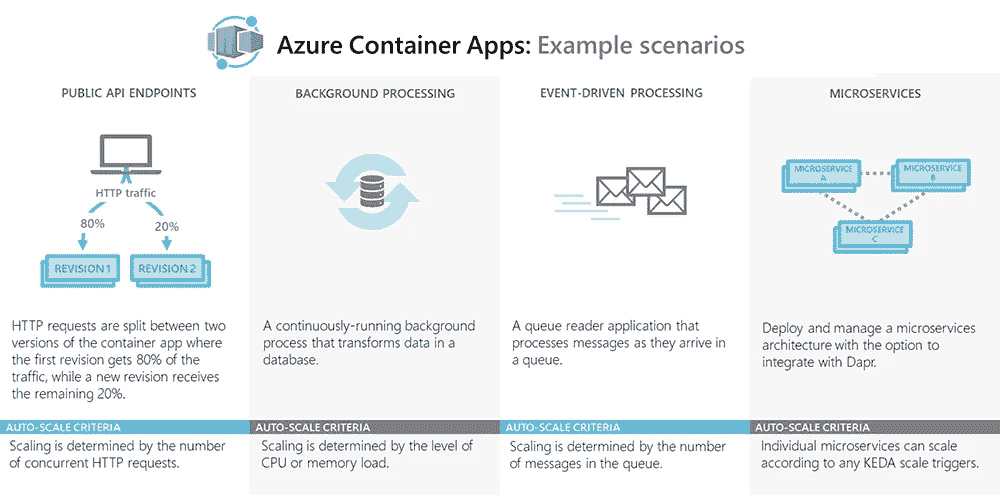
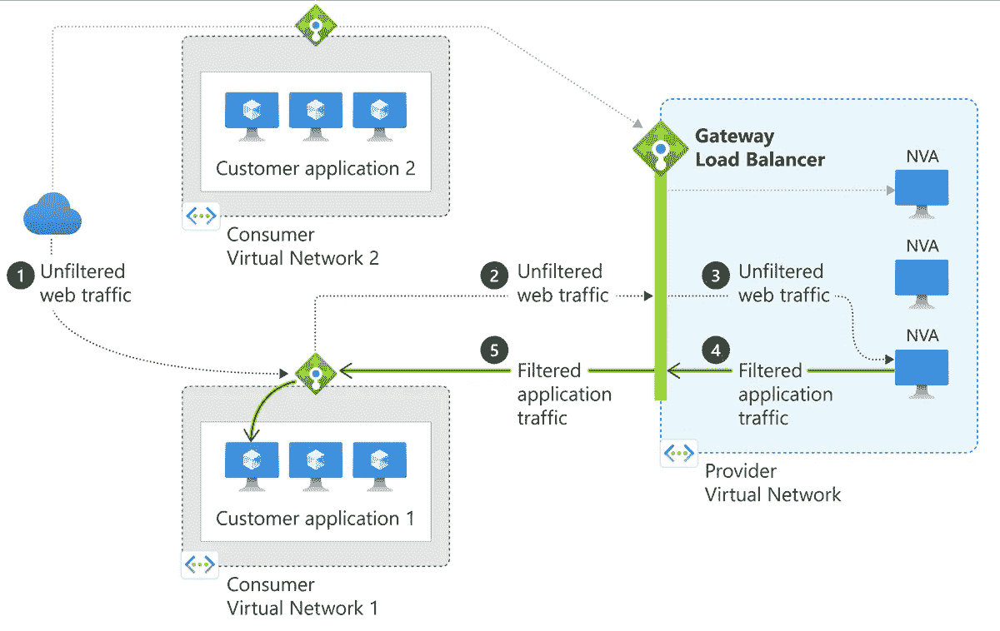
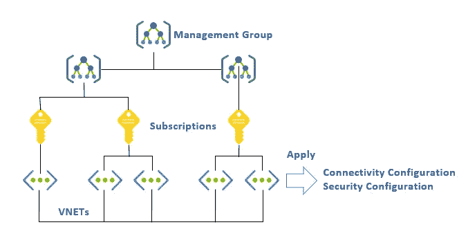
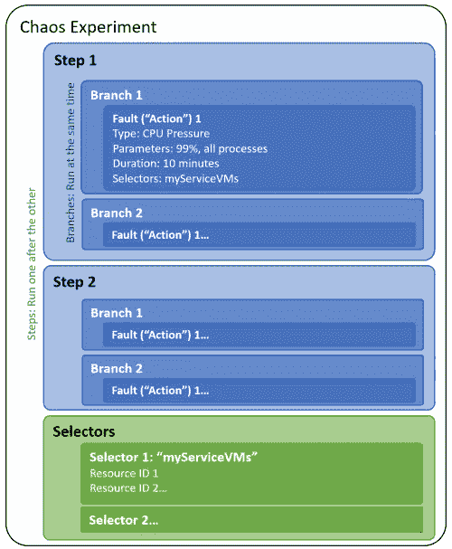
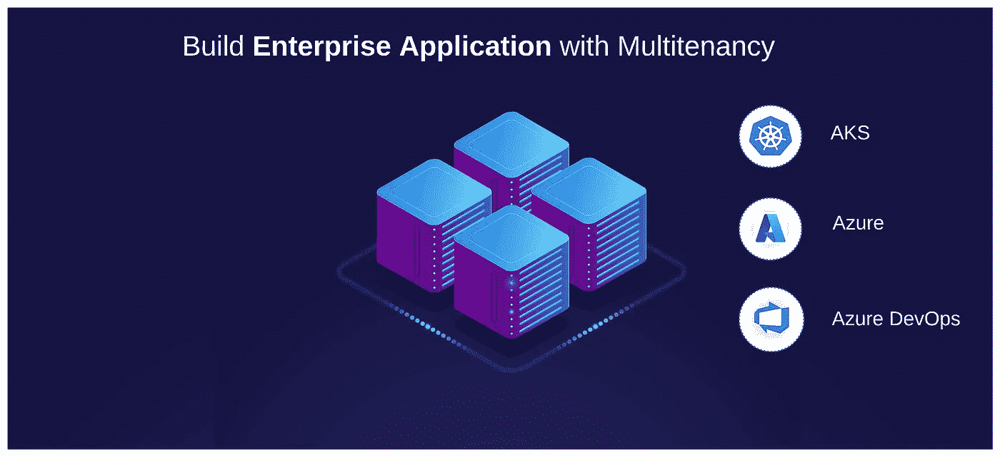
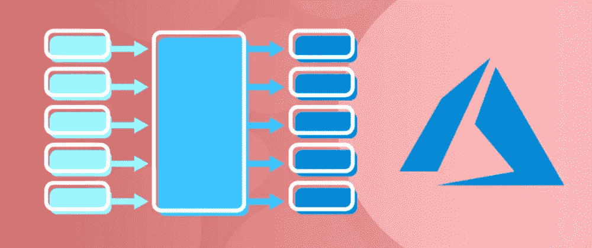

# 2022 年最有前途的 Azure 服务。快速启动。

> 原文：<https://itnext.io/top-5-the-most-promising-azure-services-to-consider-in-2022-quick-start-fd4d5c2e1ca?source=collection_archive---------3----------------------->



# 1.Azure Container Apps [Preview] —该服务允许您从您的容器中旋转容器或微服务架构。

该服务似乎是围绕以下组件和框架的 SaaS 包装器:

*   Kubernetes 或 AKS 被用作中央管弦乐队
*   码头工人
*   [DAPR](https://docs.dapr.io/) 是分布式应用运行时。它用于在服务之间提供一个基于通信/事件的层。
*   [KEDA](https://keda.sh/docs/2.4/) 是 Kubernetes 基于事件的自动缩放器。



**注意:我正在写一篇关于这项服务的详细文章。**

# 2.开放式服务网格 AKS 附加组件

服务网格 AKS 插件允许您只需一个步骤即可为 AKS 集群启用/部署服务网格:

```
az aks enable-addons --addons open-service-mesh -g <my-osm-aks-cluster-rg> -n <my-osm-aks-cluster-name>
```

服务网格，如开源项目 Istio，是一种控制应用程序不同部分如何彼此共享数据的方法。与管理这种通信的其他系统不同，服务网格是内置于应用程序中的专用基础设施层。

更多关于服务网[的信息，请点击](https://www.redhat.com/en/topics/microservices/what-is-a-service-mesh)。

您可以用一个[新的 AKS 集群](https://docs.microsoft.com/en-us/azure/aks/open-service-mesh-deploy-addon-az-cli#install-open-service-mesh-osm-azure-kubernetes-service-aks-add-on-for-a-new-aks-cluster)设置这个附加组件，或者为[现有的一个](https://docs.microsoft.com/en-us/azure/aks/open-service-mesh-deploy-addon-az-cli#enable-open-service-mesh-osm-azure-kubernetes-service-aks-add-on-for-an-existing-aks-cluster)启用它。

[文档](https://docs.microsoft.com/en-us/azure/aks/open-service-mesh-about)

# 3.网关负载平衡器[预览]是一个具有网关 SKU 的负载平衡器。

这是什么意思？创建负载平衡器时，您可以选择包含网关的选项，该网关具有以下选项:

*   防火墙(带内嵌 DDoS)
*   高级数据包分析
*   入侵检测和防御系统
*   流量镜像
*   定制设备

这个服务看起来非常类似于[应用网关](https://docs.microsoft.com/en-us/azure/application-gateway/overview)和 [Azure 前门](https://docs.microsoft.com/en-us/azure/frontdoor/front-door-overview)；)



乍一看，这些服务之间的区别在于负载平衡器运行在 OSI 第 4 层，而 App Gateway 运行在 OSI 第 7 层。

# 4.Azure 虚拟网络管理器[预览]

该服务的基本概念是跨订阅管理网络。您可以在 [Azure 管理组](https://docs.microsoft.com/en-us/azure/governance/management-groups/overview)或订阅级别上分配 Azure 虚拟网络管理器的范围。

主要优势:

*   在全球范围内跨区域和订阅集中管理连接和安全策略。
*   支持中心辐射型配置中辐条之间的可传递通信，而无需管理网状网络的复杂性。
*   高度可扩展和高度可用的服务，在全球范围内提供冗余和复制。
*   能够创建覆盖网络安全组规则的全局网络安全规则。
*   使用虚拟网络对等在不同虚拟网络中的资源之间实现低延迟和高带宽。
*   通过您选择的特定区域顺序和频率展开网络变更。

[文档](https://docs.microsoft.com/en-us/azure/virtual-network-manager/overview)



# 5.Azure 混沌工作室[预览]

Azure Chaos Studio 是一项允许您模拟环境中断的服务。您可以将方案应用于

*   虚拟机。例如，您可以模拟虚拟机关闭。
*   库伯内特。你可以杀死豆荚。
*   强制虚拟机过度使用 CPU。

[这里的](https://docs.microsoft.com/en-us/azure/chaos-studio/chaos-studio-fault-library)是故障列表(或测试用例；))你可以用你的资源申请。

在下图中，你可以看到 Azure Chaos 工作室的主要结构。



[蔚蓝混沌工作室文档](https://docs.microsoft.com/en-us/azure/chaos-studio/chaos-studio-overview)

# Azure 更新的完整列表。

*   通过 Defender for Cloud 支持亚马逊 EKS 威胁情报。
*   基于 OpenAI 的 Azure 认知服务新预览
*   Azure SQL 托管实例链接—一种新服务，允许灾难恢复和 SQL Server 与 SQL 托管实例之间的双向迁移
*   Azure Logic 应用程序在本地和 Azure Arc 上以断开模式运行。
*   对 Azure API 管理的更新，支持 GraphQL 和对 WebSockets API 的本机支持
*   Azure Arc 支持 Azure Stack HCI，与 vSphere 集成支持自助服务功能。
*   支持 Azure 堆栈 HCI 的 Azure 虚拟桌面
*   基于 AMD EPYC(米兰)CPU 的 Dv5/Ev5 和 Dasv5/Easv5 的发布，没有本地磁盘存储，成本更低
*   Azure Monitor 附带 Azure 防火墙、VPN 网关和 open telemetry with Application Insight 的增强故障排除功能。
*   Azure 磁盘存储现在可以按需进行磁盘爆发。
*   Azure Chaos Studio 是 preview 中的一个新服务，类似于 Chaos Monkey，这是一个故意破坏应用程序的服务。
*   Microsoft Defender for Cloud(Azure Defender 和 Azure Security Center 的新名称)现在为 AWS 提供安全最佳实践(包括建议，现在是 Secure Score 的一部分)
*   Azure Sentinel 的近实时分析规则
*   为 Azure Sentinel 与 Microsoft Azure Synapse 集成

*最初发表于*【https://www.boriszaikin.com】

> **想要提升您的云和软件架构技能吗？报名参加我的实践课程:**

**

*[构建多租户企业应用](https://boriszaikin-course.thinkific.com/courses/build-enterprise-application-with-multitenancy)*

**

*[在 Azure 中构建事件驱动和微服务架构](https://www.educative.io/courses/event-driven-microservices-azure)*