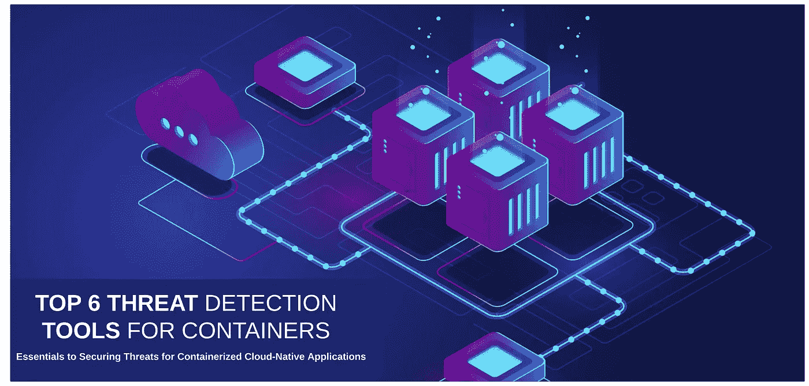

# 集装箱的 6 大威胁检测工具

> 原文：<https://itnext.io/top-6-threat-detection-tools-for-containers-3dd80b77777e?source=collection_archive---------2----------------------->

## 保护容器化云原生应用威胁的基本要素



如今，容器化的解决方案是云原生应用程序开发领域事实上的标准。像 Docker、Containers、CRI-O 和 Kubernetes 这样的工具正在流行。数百万开发和架构团队选择基于容器的解决方案来构建他们的产品。所有知名的云提供商都有大量的服务，并且基于 Kubernetes、Docker 和其他容器编排平台。

工具和平台是威胁检测基础的重要组成部分。有许多开源工具包含许多威胁检测选项。下面我列出了一些提供逻辑的工具:

*   静态图像漏洞扫描
*   配置验证
*   秘密扫描

> [容器威胁检测参考卡](https://dzone.com/refcardz/threat-detection-for-containers)包含关于保护容器化云原生应用威胁的扩展指南。

# 克莱尔

[Clair](https://github.com/quay/clair) 是一款静态安全扫描工具。它基于[开放集装箱倡议(OCI)](https://github.com/opencontainers/image-spec/blob/main/spec.md) 格式。Clair 根据所有已知的威胁和漏洞信息源(如 CVE 追踪器、Redhat security Data 和 Debian Security Bug Tracker)对图像进行验证和索引。此外，Clair 提供了一个用于开发集成目的的 API。它允许您创建您的潜水员来扩展和定制 Clair 功能。Clair 有几个[索引器](https://quay.github.io/clair/reference/indexer.html)、[匹配器](https://quay.github.io/clair/reference/matcher.html)、[通知器](https://quay.github.io/clair/reference/notifier.html)或组合模型。最简单快捷的开始方式是组合模式。这样，它在单个进程中运行。

对于组合模式，您需要一个负载平衡器或 Kubernetes 入口和一个数据库，如上图所示。

# 琐碎

Trivy 是一款基于 CVE 威胁数据库的安全集装箱扫描仪。它还可以扫描错误配置、秘密和软件依赖性。Trivy 使用几种扫描源，如:

*   容器图像
*   文件系统和存储
*   库伯内特星团

使用 npm、apt-get、brew 和其他包管理器，Trivy 可以安装在您的 PC 上或 Kubernetes 节点中。

```
apt-get install trivyyum install trivybrew install aquasecurity/trivy/trivy
```

要执行图像扫描，您可以执行以下命令

```
$ trivy image app-backend:1.9-test
```

# 秘密扫描仪

主要目标 [Secret Scanner](https://github.com/deepfence/SecretScanner) 是查看容器映像、作为代码文件的基础设施、硬编码和默认机密的 JSON 日志文件、密码、AWS 访问 id、AWS 秘密访问密钥、Google OAuth 密钥、SSH 密钥和令牌。

要独立运行 SecretScanner，您应该执行以下操作:

```
docker run -it — rm — name=deepfence-secretscanner -v $(pwd):/home/deepfence/output -v /var/run/docker.sock:/var/run/docker.sock deepfenceio/deepfence_secret_scanner:latest -image-name node:8.11
```

# OpenSCAP

[OpenSCAP](https://github.com/OpenSCAP/openscap) 是一个包含复杂安全审计选项的工具。它允许您扫描、编辑和导出 SCAP 文档。SCAP(安全内容自动化协议)为基于 Linux 的基础设施提供并描述了安全符合性检查。

Open SCAP 由以下组件和工具组成:

*   **OpenSCAP Base** —用于漏洞和配置扫描
*   **oscap-docker** —用于合规性扫描
*   **SCAP 工作台** —一个图形实用程序，便于执行典型的 oscap 任务
*   **OpenSCAP 守护进程** —在后台运行的服务
*   **SCAP mony**—为用户的基础设施保留 SCAP 结果的中间件

下面您可以看到一个如何运行 SCAP 内容验证流程的示例。

oscap ds sds-validate scap-ds.xml

# 库贝长凳

[Kube-bench](https://github.com/aquasecurity/kube-bench) 是最强大的开源工具之一，用于检测 Kuberenetes 集群的威胁和安全问题。其安全检查基于 [CIS Kubernetes 基准](https://www.cisecurity.org/benchmark/kubernetes/)。

要配置 kube-bench，您可以使用 YAML 文件。我已经列出了 YAML 的档案。您可以使用它对单个 pod 运行验证过程。

```
---
apiVersion: batch/v1
kind: Job
metadata:
  name: kube-bench
spec:
  template:
    metadata:
      labels:
        app: kube-bench
    spec:
      hostPID: true
      containers:
        - name: kube-bench
          image: docker.io/aquasec/kube-bench:v0.6.8
          command: ["kube-bench"]
          volumeMounts:
            - name: var-lib-etcd
              mountPath: /var/lib/etcd
              readOnly: true
            - name: var-lib-kubelet
              mountPath: /var/lib/kubelet
              readOnly: true
            - name: var-lib-kube-scheduler
              mountPath: /var/lib/kube-scheduler
              readOnly: true
            - name: usr-bin
              mountPath: /usr/local/mount-from-host/bin
              readOnly: true
            - name: etc-cni-netd
              mountPath: /etc/cni/net.d/
              readOnly: true
            - name: opt-cni-bin
              mountPath: /opt/cni/bin/
              readOnly: true
…
      restartPolicy: Never
      volumes:
        - name: var-lib-etcd
          hostPath:
            path: "/var/lib/etcd"
        - name: var-lib-kubelet
          hostPath:
            path: "/var/lib/kubelet"
…
```

让我们将这个文档保存到 job.yaml 文件中，并使用 apply 命令运行它:

```
$ kubectl apply -f job.yaml
```

我得把文件剪掉一点。你可以在这里找到完整版本。

# 威胁映射器

威胁映射器是针对云原生应用的复杂安全解决方案。它会扫描您的基础架构群集组件，查找威胁和漏洞。它包含:

*   秘密扫描
*   生成[软件物料清单](https://github.com/opensbom-generator/spdx-sbom-generator) (SBOM)
*   基础设施安全和威胁可视化

在我们进入工具描述之前，我将给出什么是软件材料清单(SBOM)的概述。

SBOM 是包含您的应用程序的所有开源和第三方工具和组件的组合。SBOM 包含所有组件的许可信息。这些信息对于快速识别安全风险非常重要。

威胁扫描程序包含以下组件:

*   管理控制台—是一种 UI 工具，可构建安全基础架构概述并提供漏洞和威胁报告。
*   传感器代理—是一种扫描集群节点并收集安全遥测数据的工具。传感器代理向管理控制台报告遥测数据。

例如，要将传感器代理安装到 AKS 集群，您需要执行以下操作:

掌舵回购添加深围栏[https://deepfence-helm-charts.s3.amazonaws.com/threatmapper](https://deepfence-helm-charts.s3.amazonaws.com/threatmapper)

```
helm repo add deepfence [https://deepfence-helm-charts.s3.amazonaws.com/threatmapper](https://deepfence-helm-charts.s3.amazonaws.com/threatmapper)
helm show readme deepfence/deepfence-agent
helm show values deepfence/deepfence-agent

# helm v2
helm install deepfence/deepfence-agent \
    --name=deepfence-agent \
    --set managementConsoleUrl=x.x.x.x \
    --set deepfenceKey=C8TtyEtNB0gBo1wGhpeAZICNSAaGWw71BSdS2kLELY0

# helm v3
helm install deepfence-agent deepfence/deepfence-agent \
    --set managementConsoleUrl=x.x.x.x \
    --set deepfenceKey=C8TtyEtNB0gBo1wGhpeAZICNSAaGWw71BSdS2kLELY0
```

要在 AKS 集群中安装管理控制台，可以使用以下命令:

```
helm repo add deepfence https://deepfence-helm-charts.s3.amazonaws.com/threatmapperhelm install deepfence-console deepfence/deepfence-console
```

安装会将 helm 软件包直接下载并安装到集群命名空间中。它使用两个简单的命令，允许您将它包含在 IaC 进程中。

# 集装箱的威胁检测

“随着容器采用的指数级增长，对于团队来说，确保适当的安全和威胁管理基础设施**和**实践到位比以往任何时候都更加重要。该参考卡对集装箱化环境的威胁检测进行了全面的检查，涵盖了几个重点领域，如通用云安全架构和 Kubernetes 强化指南。”

[和这张 Refcard](https://dzone.com/refcardz/threat-detection-for-containers) 的核心是容器威胁检测的基础，包括资源限制、静态图像漏洞扫描、配置验证等概念。