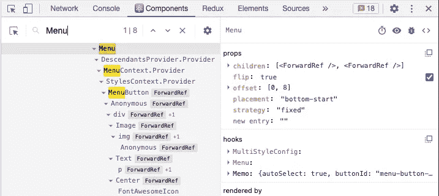
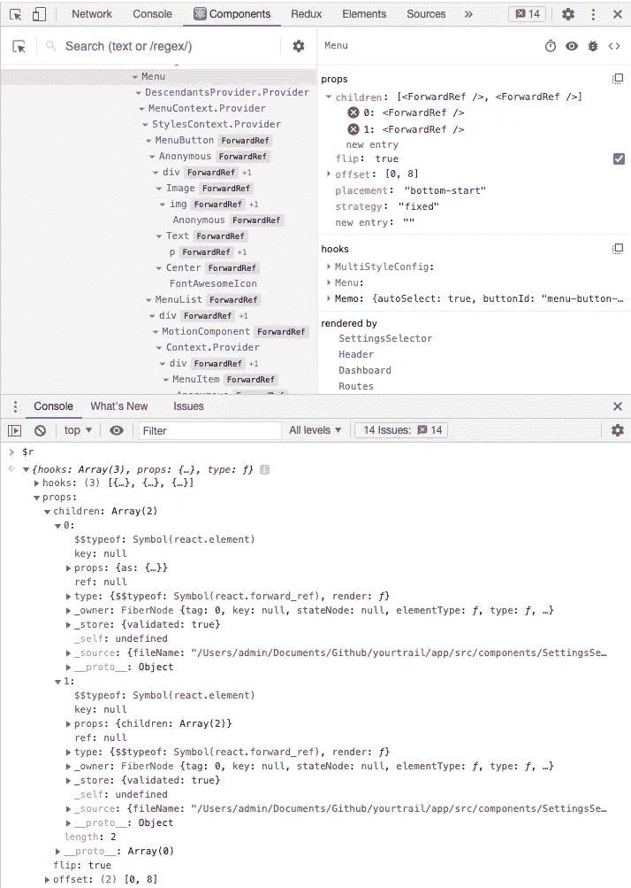
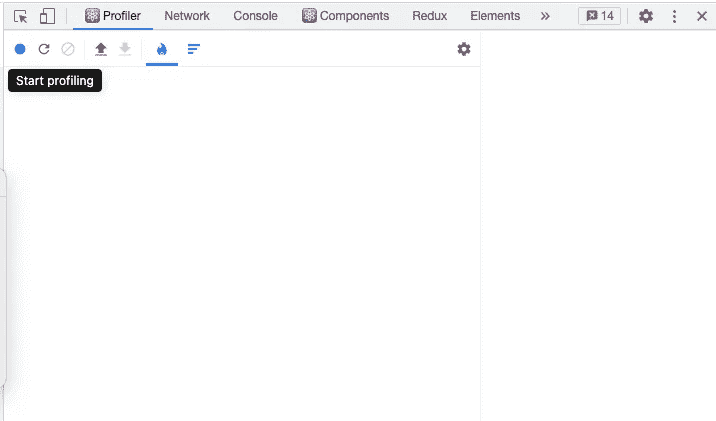
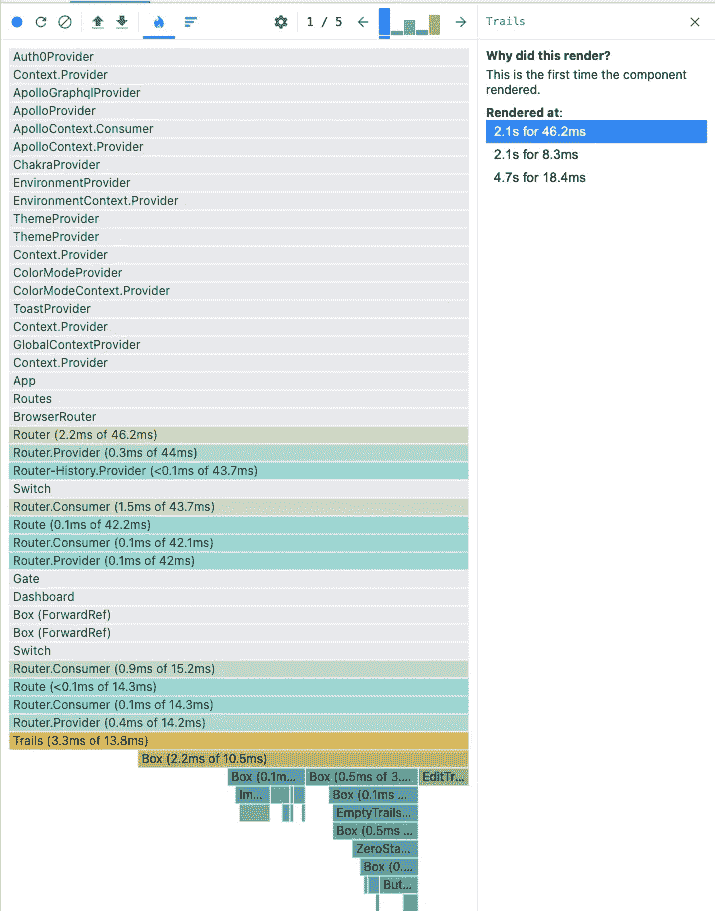
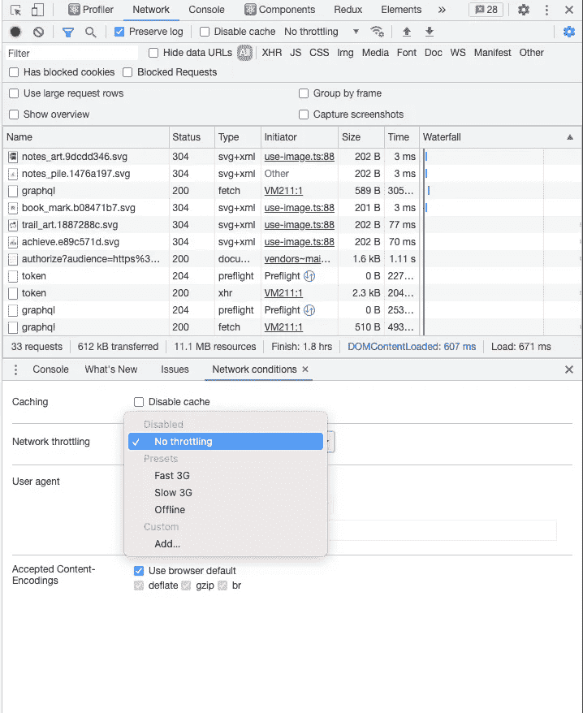
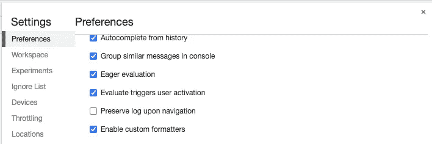
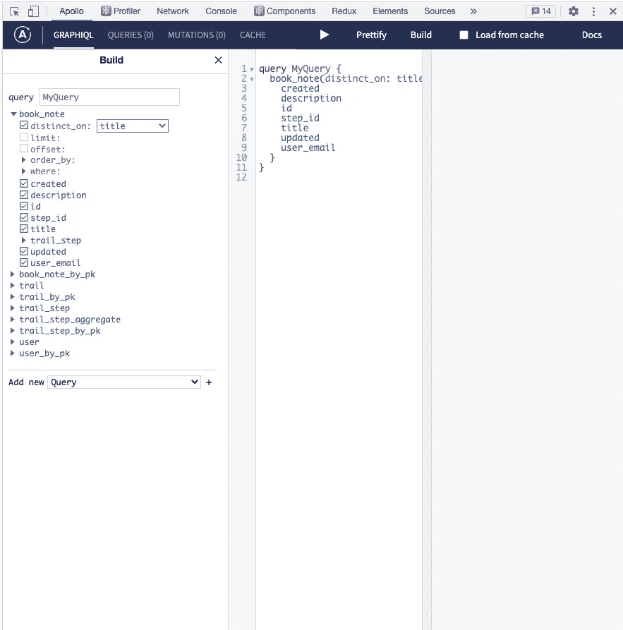
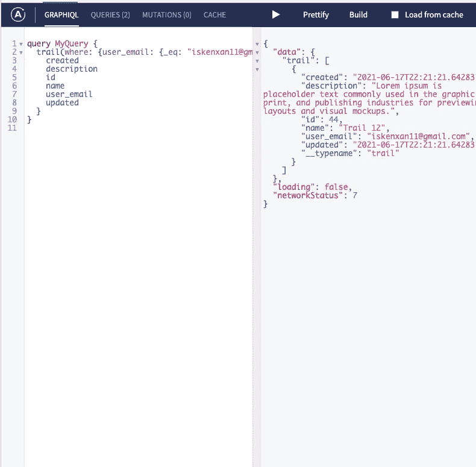

# React 的五大 Chrome 开发工具提示

> 原文：<https://itnext.io/top-five-chrome-dev-tools-tips-for-react-8ff48c3b19e9?source=collection_archive---------4----------------------->

Chrome 的开发工具有很多技巧，但并不是所有的技巧都对 React 有用。在这篇文章中，我将介绍为 React 开发定制的五个开发工具技巧。

该列表将是原生 Chrome 开发工具特性和便利扩展的混合。

# 将组件状态打印到控制台

如果你正在使用 React，你可能每天都在使用 React 开发工具。如果你不是，那么你应该。该扩展帮助您查看和调试组件的状态。

安装 React 开发工具后，您会在开发工具中获得两个额外的选项卡，`Components`和`Profiler`。这两者都很有价值，但是使用案例完全不同。我们一会儿会谈到`Profiler`。

但是，您可能没有意识到的一点是，您可以将组件的状态打印到控制台。

有几个原因可以解释你为什么想这么做。React Dev 工具并不总是显示关于组件的完整信息。在这些情况下，您可以将组件状态打印到控制台以查看更多数据。例如，看看这个视图:

反应组件选项卡

假设您想更详细地查看`Menu`组件的子组件。`Components`调试器只显示`children`属性是一个 ForwardRefs 数组。为了更仔细地查看子组件，我们可以使用一个特殊的控制台命令打印出`Menu`组件的状态。

通过点击选择组件，并在控制台中键入`$r`。

**Pro 提示:**要在同一视图中显示控制台日志和`Components`调试器，请单击`Esc`按钮:

组件控制台输出

如您所见，我们可以通过这种方式展开并获得更多关于`Menu`的子节点的信息。

# 仿形铣床

Profiler 是提高性能的最佳工具之一。

正如我提到的，它是 React Dev 工具的一部分，允许您跟踪组件的渲染。

开始使用它很简单。安装 React Dev 工具后，打开`Profiler`选项卡并点击`Start Profiling`按钮:

反应分析器启动

现在，您可以开始与您的应用程序进行交互，以衡量其性能。完成后，点击`Stop profiling`按钮。以下是您将看到的内容:

反应分析器结束

您得到的是组件树呈现活动的交互式概述。每个组件都根据您进行性能分析时重新渲染的次数进行着色。如果是灰色的，说明在交互过程中根本没有重新渲染。

如果你点击任何组件，分析器将显示时间戳和每次重新渲染的原因。

如果您的 React 应用程序有性能问题，那很可能是由于冗余的重新渲染。在这种情况下，使用`Profiler`追踪那些渲染超过必要的组件，并努力减少重新渲染的次数。你可以使用不同的工具进行优化，比如 [React.memo](https://reactjs.org/docs/react-api.html#reactmemo) 、 [useCallback](https://reactjs.org/docs/hooks-reference.html#usecallback) 等等。

# 网络条件

在不同的网络条件下测试 React 应用程序非常重要。当你在一台连接速度很快的计算机上进行本地开发时，一切都会很顺利。这可能会让你错过那些连接较差的用户将面临的边缘情况。

超过一半的在线用户通过移动设备访问他们的服务。通常，这些设备的连接条件并不理想。

幸运的是，您可以使用开发工具中的`Network Conditions`选项来模拟不同的连接速度:

网络条件选项

如你所见，默认情况下它被设置为`No throttling`。要模拟较慢的网络连接，您可以使用不同的预设，甚至创建自己的预设。

当构建加载屏幕和其他异步交互时，最好至少测试一个`Slow 3G`连接。

# 自定义格式化程序

自定义格式器是 Chrome 开发工具中隐藏的瑰宝。它们让开发人员可以控制对象在调试器和控制台中的外观。

默认情况下，自定义格式化程序是禁用的，因此您需要进入设置->首选项并启用它们:

自定义格式化程序设置

那么为什么要使用它们呢？好吧，你可以为难以调试的对象编写你自己的格式化程序。自定义格式化程序的一个常见用例是递归显示深度嵌套的对象。有很多关于编写自定义格式化程序的教程。

但对我来说，主要的优势是构建在它们之上的扩展。这种扩展的一个很好的例子是 [Immutable.js 对象格式化程序](https://chrome.google.com/webstore/detail/immutablejs-object-format/hgldghadipiblonfkkicmgcbbijnpeog)。如果你使用过 Immutable.js，你就会知道调试有多烦人。该扩展通过很好地格式化输出到控制台的不可变数据结构解决了这个问题:

不可改变。JS 格式化程序

# 阿波罗 Chrome 扩展

如果我使用 GraphQL，这是我必须拥有的扩展。如果你安装了这个扩展，你还会在你的开发工具中得到一个额外的`Apollo`标签。这是它的样子

阿波罗扩展

如果你曾经使用过 [graphiql](https://github.com/graphql/graphiql) 编辑器，你会对这个界面很熟悉。点击`Build`按钮会打开一个交互式侧边栏，里面有你可以使用的所有可用的查询和变化。

运行阿波罗

最好的部分是扩展使用当前的用户会话。这允许您查看在当前用户权限下查询是如何执行的。

正如您现在可能已经猜到的那样，这个扩展的缺点是它只适用于 Apollo GraphQL 客户端。

# 奖励:Redux 开发工具

最初，我没有列出 [Redux 开发工具](https://chrome.google.com/webstore/detail/redux-devtools/lmhkpmbekcpmknklioeibfkpmmfibljd?hl=en)，因为在这一点上，很难找到一个不知道它的 React 开发人员。但是对于那些刚接触 React 或 Redux 的人来说，这可能值得一提。

这个扩展使得使用 Redux 变得非常容易。除了许多其他功能之外，它还允许您实时查看所有触发的操作及其有效负载。

这是帮助我完成 React 工作的五大 Chrome 开发工具提示。我希望这个列表对你有用！

*原载于 2021 年 6 月 20 日 https://isamatov.com**[*。*](https://isamatov.com/react-chrome-dev-tools-tips/)*