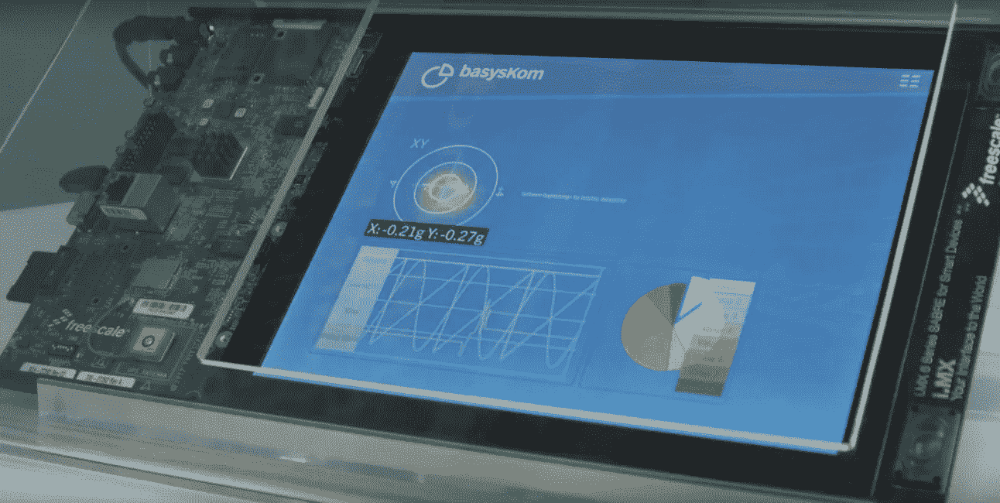
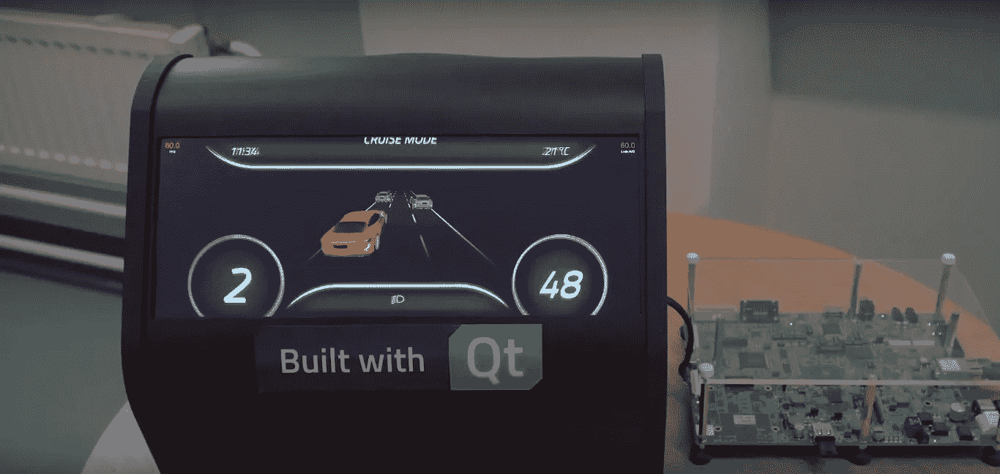
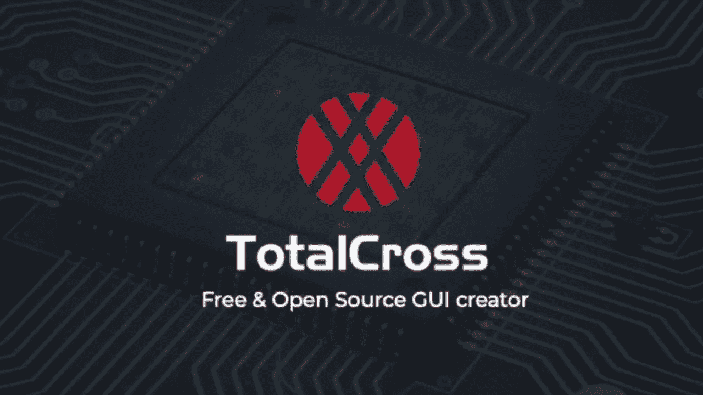
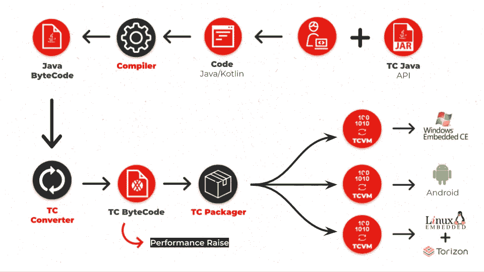
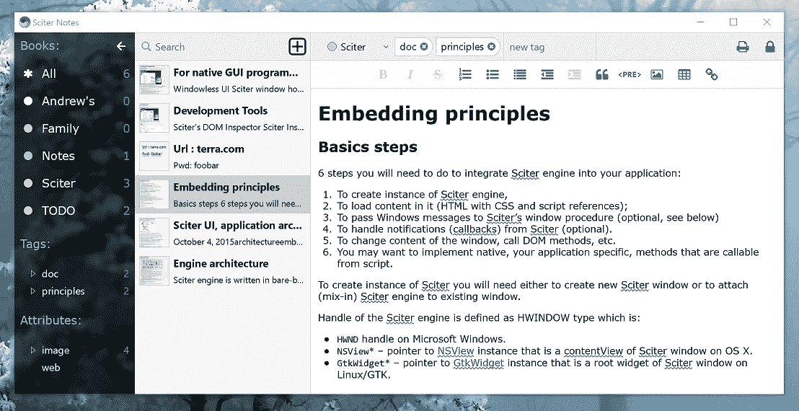

# 在嵌入式 Linux 上创建 GUI 的五大库

> 原文：<https://itnext.io/top-five-libraries-for-creating-gui-on-embedded-linux-5ce03903be32?source=collection_archive---------0----------------------->

有十几个免费的和商业的解决方案可以在嵌入式 Linux 上构建 GUI 应用程序。在某些情况下，最好依靠主板供应商提供的工具，例如 [TouchGFX](https://www.touchgfx.com/) 作为 [STM32 生态系统](https://www.st.com/content/st_com/en/products/embedded-software/mcu-mpu-embedded-software/stm32-embedded-software/stm32cube-expansion-packages/x-cube-touchgfx.html)的一部分免费捆绑。但是大多数库可以配置为支持常见的板，如 Raspberry Pi 或 Arduino。您可以使用这个精选的列表来帮助您做出正确的决定，选择您想要用于嵌入式 Linux 开发的技术栈。

# Qt/QML/C++

对于大多数爱好者和商业供应商来说，这可能是最受欢迎的选择。它最初是一个针对桌面市场的跨平台框架，直到 2000 年他们在 GPL +商业许可下发布了 Qt/Embedded。qtopia(Qt/Embedded 的子集)在 2009 年被诺基亚终止之前，在 2000 年代取得了很多成功。Digia 在 2013 年将其重新发布为 Qt 的 Boot(现在称为 Qt，用于设备创建),但只有在商业许可下。

虽然你可以使用 Qt Widgets(基于 C++的),但是建议你使用 QML 来构建你的 UI，它是现代的，支持流畅的动画 UI 和触摸屏。如下所述，您可以在商业或自由/开源软件许可下使用 Qt。

[**面向小型企业的 Qt**](https://www.qt.io/en-us/qt-for-small-business):今年早些时候于 2020 年 3 月上市。这是 Qt 商业开发最经济实惠的选择。费用为 499 美元/年。但是你得符合要求。收入+资金少于 250，000 美元/年，每家公司仅限 4 个开发者许可证。分发许可证费用(不适用于台式机或移动设备)必须单独协商，并按发运的每台设备收取。作为基准，QNX 实时操作系统的价格为每台设备 3-5 美元。

[**Qt 用于设备创建**](https://www.qt.io/qt-for-device-creation/) :这是完全无折扣版本。他们从未在他们的产品页面上透露价格，但应用程序开发(桌面+移动)的 Qt 费用为 5508 美元/年。因此，我推断它将在 5600-5700 美元/年左右。这是第一年。你可以协商以后几年的折扣。分销费用仍然适用。如果你计划运送更多的设备，你可以协商更低的分销费用。

[**自由/开源软件用户**](https://www.qt.io/download-open-source) :在商业环境下使用 Qt 开源软件之前，你应该咨询一位精通 GPL/LGPL 许可的律师。今年早些时候，Qt 在 2020 年 1 月宣布了[新的变化](https://www.qt.io/blog/qt-offering-changes-2020)，在论坛上有相当多的[闲聊](https://www.phoronix.com/scan.php?page=news_item&px=More-Interest-Possible-Qt-Fork)。所以你必须跟上任何影响自由/开源软件用户的新发展和新闻。如果你把它作为一种爱好，这可能是你唯一的选择。如前所述，没有用于设备创建的 Qt 开源。但是不要担心，这只是应用程序开发的正常 Qt，带有额外的模块和预构建的映像。这意味着您必须下载开源版本，并将其配置为在您的嵌入式 Linux 板上交叉编译。如果你是这方面的新手，我向你推荐 Raspberry Pi 和下面两个资源。

[https://mechatronics blog . com/cross-compile-and-deploy-Qt-5-12-for-raspberry-pi/](https://mechatronicsblog.com/cross-compile-and-deploy-qt-5-12-for-raspberry-pi/)

[https://medium . com/@ Amir Mann/how-to-cross-compile-Qt-for-raspberry-pi-3-on-Linux-Ubuntu-for-初学者-75acf2a078c](https://medium.com/@amirmann/how-to-cross-compile-qt-for-raspberry-pi-3-on-linux-ubuntu-for-beginners-75acf2a078c)

# TotalCross

这是一个基于 Java 的工具包，可以部署在嵌入式、移动和桌面平台上。它是从 SuperWaba 项目演变而来的，该项目以前的目标是 iPAQ 等便携式设备。TotalCross 高度优化的 VM 使得在使用 Java 或 Kotlin 的低端设备上创建漂亮的 ui 成为可能，同时仍然确保本机性能和低占用空间。

它是 Toradex 的官方合作伙伴之一，为 Torizon 和 T2 的 Toradex 模块提供支持。TotalCross 没有默认的 IDE，所以您可以使用任何 Java 支持的 IDE，比如 Eclipse。但是最近，他们决定倾向于 [Visual Studio 代码](https://medium.com/totalcross-community/totalcross-plugin-for-vscode-4f45da146a0a)。他们计划发布一个名为 [KnowCode](https://yourapp.totalcross.com/knowcode-app) 的新功能，这将使得把 Android XML 中的 ui 移植到嵌入式系统成为可能。他们的首席执行官布鲁诺·穆尼斯在这段视频中对此进行了解释。

[https://www.youtube.com/watch?v=7o3p14wQPsE](https://www.youtube.com/watch?v=7o3p14wQPsE)

TotalCross 拥有 LGPLv2.1 和商业许可证的双重许可。如果你不想遵守 LGPLv2.1，你将不得不购买没有版税的商业许可证。查看他们的[网站](https://totalcross.com/)和官方 [YouTube 频道](https://www.youtube.com/channel/UCSXUBRBC4Ec3_o9R7-3XX-w)以查看更多演示和功能。

# LVGL

它最近从 LittlevGL 更名为 LVGL(轻型通用图形库)。这是一个开源的嵌入式 GUI 库，用 C 语言编写(与 C++兼容)，在 MIT 许可下发布。它针对微控制器和裸机(无操作系统)设备上的部署进行了优化，但也可以配置为在嵌入式 Linux 板上运行。最好的方法是通过 Linux framebuffer，如本[入门教程](https://blog.lvgl.io/2018-01-03/linux_fb)中所解释的。他们还有一个支持良好的 [MicroPython API](https://blog.lvgl.io/2019-02-20/micropython-bindings) 用于快速原型开发。查看他们的[官网](https://lvgl.io/)和 [GitHub repo](https://github.com/lvgl) 开始吧。你可以从他们的官方论坛得到帮助，或者选择专门的商业支持。

演示:[https://www.youtube.com/watch?v=ZUJxbCbBod0](https://www.youtube.com/watch?v=ZUJxbCbBod0)

# uGFX

就像 LVGL 一样， [uGFX](https://ugfx.io/) 针对最小硬件进行了优化，可以在裸机上运行。它是用 C 写的，来源是[提供的](https://git.ugfx.io/uGFX/uGFX)。私人/个人使用是免费的，但是你必须为商业开发购买许可证。它带有一个 GUI 设计器，用于快速原型制作。使用 Linux framebuffer 驱动程序是在嵌入式 Linux 上运行 uGFX 的推荐方式。可以看看这个[树莓派指南](https://wiki.ugfx.io/index.php/Raspberry_Pi)作为例子。如果你的嵌入式 Linux 板支持 SDL2(需要 OpenGL)，那么[强烈推荐](https://community.ugfx.io/topic/495-ugfx-linux-framebuffer-armv7/?tab=comments#comment-3503)使用 SDL 驱动运行 uGFX。这里有一个[指南](https://gist.github.com/Lokathor/e6fec720b722b8a6f78e399698cae6e4)来正确配置 Raspberry Pi 3 B+上的 SDL2。

# 吉斯利切

一个开源 GUI (MIT license) C 库，设计用于在 Raspberry Pi 和 Arduino 上部署。也可以部署在其他[支持的板卡](https://www.impulseadventure.com/elec/guislice-gui.html#testing)上。要在嵌入式 Linux 上部署它，您的主板需要支持 SDL 1.2(使用 Linux framebuffer)或 SDL2(使用 OpenGL)。如果你要使用触摸屏，你需要安装 tslib 库。这里有一个[教程](https://github.com/ImpulseAdventure/GUIslice/wiki/Installing-GUIslice-on-Raspberry-Pi)用于在 Raspberry Pi 上配置库。它还带有一个[构建器](https://github.com/ImpulseAdventure/GUIslice/wiki/GUIslice-Builder)来帮助用户界面的快速原型制作。你可以在这里开始使用这个库[。](https://www.impulseadventure.com/elec/guislice-gui.html)

## 值得注意的提及

# **贵利特**

一个非常小的(< 6000 lines of code) C++ library that can be deployed on micro-controllers and embedded devices. To deploy it on Embedded Linux boards, you’ll need to run on top off the Linux framebuffer (/dev/fb0). It’s released under the open-source license Apache 2.0\. Check out their [GitHub](https://github.com/idea4good/GuiLite) 用于样品和安装指南。

演示:【https://www.youtube.com/watch?v=grqXEz3bdC0 

# **剪报**

这不是一个库，而是一个用于呈现 UI 的 HTML/CSS/脚本引擎。渲染引擎是独一无二的，不基于 Webkit 或 Chromium。它使用一个 C API，最初的目标是 C/C++后端。它现在有其他语言的绑定。Sciter 引擎只是一个单独的 DLL(大约 5 Mb ),它支持 GPU 加速渲染。

[Sciter Notes](https://notes.sciter.com/downloads/) ，一款使用 Sciter engine 做 UI，C++做后端的应用，在 Win、Mac、Linux 下出货不到 5Mb。大多数 Sciter engine 客户都在台式机市场，尤其是 AV 供应商。引擎本身是免费的二进制形式，但是你必须获得商业许可才能获得源代码和支持。这里有一些资源详细介绍了如何在嵌入式 Linux 设备上部署 Sciter。

[https://sciter.com/sciter-lite-is-published/](https://sciter.com/sciter-lite-is-published/)

[https://sciter . com/windowless-sciter-Android-and-IOT-devices/](https://sciter.com/windowless-sciter-android-and-iot-devices/)

我在 [StackOverflow](https://stackoverflow.com/questions/59945182/is-it-possible-to-develop-a-gui-on-linux-embedded-with-just-html-css-and-js/61654579#61654579) 上写了一个回答，提供了在嵌入式设备中比较 QML 和 HTML5 的额外资源。你可能想去看看。