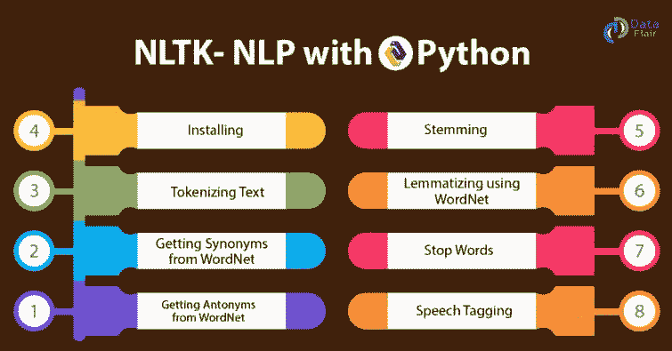
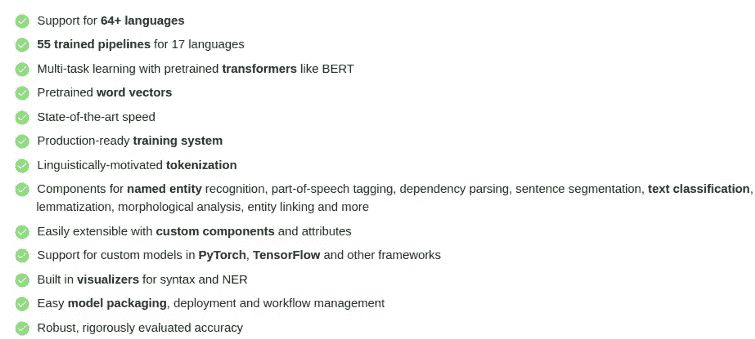
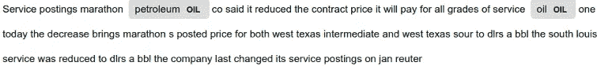
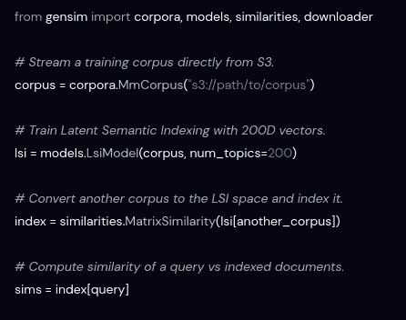
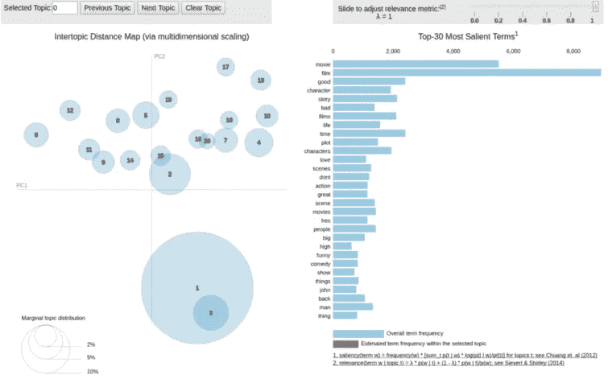

# Python 的顶级机器学习 NLP 工具

> 原文：<https://itnext.io/top-machine-learning-nlp-tools-for-python-5b2587521b73?source=collection_archive---------5----------------------->


照片由 [Unsplash](https://unsplash.com?utm_source=medium&utm_medium=referral) 上的 [h heyerlein](https://unsplash.com/@heyerlein?utm_source=medium&utm_medium=referral) 拍摄

# 介绍

本文的目标是给出一个快速的**概述**，并举例说明使用 [**Python**](https://www.python.org/) 执行自然语言处理( [**NLP**](https://en.wikipedia.org/wiki/Natural_language_processing) **)** 任务的工具。在本文中，我将只关注**文本**数据，而不是音频或视频处理。

这篇文章是我以前的[文章](/introduction-to-natural-language-processing-nlp-tools-for-python-cf39af3cfc64)的摘录，在那里我给出了什么是 **NLP** 的概述，如果你不熟悉 NLP，我建议你先看看这篇[文章](/introduction-to-natural-language-processing-nlp-tools-for-python-cf39af3cfc64)。我假设你之前有 [**Python**](https://www.python.org/) 和 [**机器学习**](https://en.wikipedia.org/wiki/Machine_learning) 的知识。

# 什么是 NLP？

简单来说，NLP 是 [**机器学习**](https://en.wikipedia.org/wiki/Machine_learning) 专注于从[](https://en.wikipedia.org/wiki/Natural_language)**自然语言中提取洞察的一个领域。你的目标是让计算机理解我们自己的语言。**

**自然语言处理的一些实用的**例子**是语音识别、翻译、情感分析、主题建模、词汇分析、实体提取等等。**

**使用所有这些工具和算法，你可以从自然语言中提取结构化数据，这些数据可以被计算机处理。此外， **NLP** 任务的输出通常是机器学习算法，该算法将使用这些原始数据来进行**预测**。**

****

**通过**将许多算法结合在一起**，您可以提取有用的数据，这些数据可用于广泛的场景，例如:**

*   **欺诈检测**
*   **[风险情报](https://aylien.com/solutions/risk-intelligence)**
*   **电子邮件分类**
*   **[情绪分析](https://pythonspot.com/python-sentiment-analysis/)**

# **NLP 工具**

**在我之前的[文章](/introduction-to-natural-language-processing-nlp-tools-for-python-cf39af3cfc64)中，我谈到了管理原始数据的重要性。你大概听说过**花在[](https://en.wikipedia.org/wiki/Machine_learning)**机器学习的 80%** 时间是**数据准备**:数据清洗、[数据角力](https://en.wikipedia.org/wiki/Data_wrangling)、特征工程等。对于 NLP 来说尤其如此，因为我们的主要目标是将文本转换成计算机可以使用的数字 T21。****

****简而言之，我们可以获取原始文本数据，加载它，清理它，标记它，最后执行特征工程，将文本转换为数字，以便它可以用于实体提取或分类。现在，我们将回顾 Python 中可用的一些工具，**我们将从更通用/低级的工具开始，然后转向更专业和更高级别的库和工具。******

## ****sci kit-学习****

****[Scikit-learn](https://scikit-learn.org/) 是一个著名的**Python 通用 ML 库**。广泛用于各种各样的机器学习任务，如[分类](https://scikit-learn.org/stable/supervised_learning.html#supervised-learning)、[回归](https://scikit-learn.org/stable/supervised_learning.html#supervised-learning)或[聚类](https://scikit-learn.org/stable/modules/clustering.html#clustering)。还可以通过连接多个模型来构建管道。****

****为了**安装**和 [Scikit-learn](https://scikit-learn.org/) 运行:****

```
**pip install -U scikit-learn**
```

****[Scikit-learn](https://scikit-learn.org/) 附带了许多 [**NLP 特性**](https://scikit-learn.org/stable/tutorial/text_analytics/working_with_text_data.html) 包括分词器、词袋、词频、分类器等等。例如，要处理文本、标记化、删除停用词并使用词袋构建特征向量，我们可以使用`[**CountVectorizer**](https://scikit-learn.org/stable/modules/generated/sklearn.feature_extraction.text.CountVectorizer.html#sklearn.feature_extraction.text.CountVectorizer)`来一气呵成地完成所有这些工作:****

```
****from** **sklearn.feature_extraction.text** **import** CountVectorizer
count_vect = CountVectorizer()
X_train_counts = count_vect.fit_transform(email.data)**
```

****结果是一个带有文本数据数字表示的向量，可以用作分类器的输入。`email.data`包含邮件正文。****

****它还带有`[**TfidfTransformer**](https://scikit-learn.org/stable/modules/generated/sklearn.feature_extraction.text.TfidfTransformer.html#sklearn.feature_extraction.text.TfidfTransformer)` ，使用 **tf-idf** 算法实现相同的方法:****

```
****from** **sklearn.feature_extraction.text** **import** TfidfTransformer
X_train_tfidf = tfidf_transformer.fit_transform(X_train_counts)**
```

****现在，我们可以很容易地训练一个模型来进行预测。首先，我们训练一个模型，例如**多项式******

```
****from** **sklearn.naive_bayes** **import** MultinomialNB
clf = MultinomialNB().fit(X_train_tfidf, email_span.target)**
```

****目标列包含电子邮件是否是 Span。上面的代码训练我们的模型。现在我们可以预测:****

```
**emails_test = ['Buy this', 'OpenGL on the GPU is fast']
X_new_counts = count_vect.transform(emails_test)
X_new_tfidf = tfidf_transformer.transform(X_new_counts)
predicted = clf.predict(X_new_tfidf)**
```

****Scikit-learn 是一个非常著名且易于使用的库，是你工具箱中的必备工具。我推荐这个库，因为你已经用它来完成其他的 ML 任务，并且你想增加 NLP 功能。然而，还有其他更专业的自然语言处理库。****

## ****NLTK****

****[**NLTK**](https://www.nltk.org/) 是著名的 NLP 库。它不仅仅是一个库，它是一个平台，不仅提供库，还提供简单易用的接口来连接超过 50 个语料库和词汇资源。****

********

****NLTK 功能****

****它拥有用于分类、标记化、词干化、标记、解析和语义推理的文本处理库，用于工业级自然语言处理库的包装器，以及一个活跃的论坛。****

****要安装 NLTK 运行:****

```
**pip install --user -U nltk**
```

****建议您也下载一些语料库来运行:****

```
****import** **nltk**
nltk.download()**
```

****应该会打开一个新窗口，显示 NLTK 下载程序。您可以选择并下载许多易于导入的数据集。****

****得益于大量的**语料库数据**，NLTK 在**学术界**中非常**受欢迎**，因为你可以很容易地迭代并使用容易访问的数据集处理你的模型。它还提供了许多工具和算法，例如，要显示一个词汇树，你可以简单地运行:****

```
****from** **nltk.corpus** **import** treebank
t = treebank.parsed_sents('wsj_0001.mrg')[0]
t.draw()**
```

****它还支持词干/词汇化和[词性标注](https://pythonprogramming.net/part-of-speech-tagging-nltk-tutorial/)。查看[这篇](https://likegeeks.com/nlp-tutorial-using-python-nltk/) [文章](https://likegeeks.com/nlp-tutorial-using-python-nltk/)以了解有关 NLTK 功能的更多信息。我向那些想学习和尝试自然语言处理的人推荐这个库，但是它不是我生产就绪自然语言处理的首选。****

## ****空间****

****[Spacy是我最喜欢的**NLP**库。它是一个开源的库，致力于使执行任何 NLP 任务变得非常容易。不像](https://spacy.io/) [NLTK](https://en.wikipedia.org/wiki/Natural_Language_Toolkit) 用在学术上； **Spacy 是为现实世界的使用**而构建的，这得益于其出色的**性能**，大量的**优化**和**易于使用的**API。****

****它支持许多自然的 [**语言**](https://spacy.io/usage/models#languages) 开箱即用，它提供许多 [**训练好的管道**](https://spacy.io/usage/models#download) 随时可以用作你的起点。它提供了一个很棒的[标记器](https://spacy.io/usage/linguistic-features#tokenization)和许多 [**语言特性**](https://spacy.io/usage/linguistic-features) ，比如[词性标注](https://spacy.io/usage/linguistic-features#pos-tagging)、词汇化、[实体链接](https://spacy.io/usage/linguistic-features#entity-linking)、依存解析等等！****

********

****空间特征:[https://spacy.io/usage/facts-figures](https://spacy.io/usage/facts-figures)****

******SpaCy** 支持 [**深度学习**](https://en.wikipedia.org/wiki/Deep_learning) 工作流，你可以在其中训练和部署神经网络模型，或者将由流行的[机器学习](https://en.wikipedia.org/wiki/Machine_learning)库训练的外部模型，如 [TensorFlow](https://en.wikipedia.org/wiki/TensorFlow) 或 [PyTorch](https://en.wikipedia.org/wiki/PyTorch) 插入到你的管道中。****

****我真正喜欢 SpaCy 的是它的入门如此简单！****

******安装空间******

****有关基于您的平台的详细 [**安装说明**](https://spacy.io/usage) ，请参考文档。使用画中画时，只需:****

```
**pip install -U pip setuptools wheel
pip install -U spacy
python -m spacy download en_core_web_sm**
```

****由于**预训练管道**是使用大型文本语料库训练的，所以很容易开始。首先，你需要导入 Spacy，然后你可以加载一个预先训练好的模型，有 [**不同尺寸**](https://spacy.io/models/en) 可供选择；然后你可以创建你的 ***nlp*** 对象包含你的原始数据:****

```
**import spacynlp = spacy.load("en_core_web_sm")
doc = nlp("Apple is looking at buying U.K. startup for $1 billion")**
```

******SpaCy** 为您处理所有的数据准备和标记化，这是在您调用 ***nlp*** 对象时完成和计算的，该对象接受一个文本字符串，并返回一个包含标记化文本、POS 注释、命名实体等等的已处理的`Doc`。即使对一个`Doc`进行了处理(拆分成单个单词并进行注释),它仍然保存着**原始文本的所有信息。******

****我们可以很容易地遍历令牌:****

```
**for token in doc:
    print(token.text)**
```

****这将打印令牌列表。****

******位置标记******

****[**POS tagging**](https://en.wikipedia.org/wiki/Part-of-speech_tagging) 也是为你计算的:****

```
**for token in doc:
    print(token.text, token.pos_, token.dep_)**
```

****这将打印:****

```
**Apple PROPN nsubj
is AUX aux
looking VERB ROOT
at ADP prep
buying VERB pcomp
U.K. PROPN dobj
startup NOUN advcl
for ADP prep
$ SYM quantmod
1 NUM compound
billion NUM pobj**
```

******词向量相似度******

****相似度是通过比较“[](https://en.wikipedia.org/wiki/Word_embedding)**”词语嵌入量来确定的。可以使用像 [word2vec](https://en.wikipedia.org/wiki/Word2vec) 这样的算法生成单词向量。大多数 SpaCy 管道包都带有内置的单词向量，使它们可以作为`[Token.vector](https://spacy.io/api/token#vector)`属性使用。例如给出下面的句子:******

```
****tokens = nlp("dog cat banana afskfsd")for token in tokens:
    print(token.text, token.has_vector, token.vector_norm)****
```

******我们得到这样的输出:******

```
****dog True 7.0336733 False
cat True 6.6808186 False
banana True 6.700014 False
afskfsd False 0.0 True****
```

******预测相似性对于建立推荐系统或者标记重复是有用的。******

********命名实体识别(NER)********

****使用 SpaCy 提取实体非常简单:****

```
**nlp = spacy.load("en_core_web_sm")
doc = nlp("Apple is looking at buying U.K. startup for $1 billion")for ent in doc.ents:
    print(ent.text, ent.start_char, ent.end_char, ent.label_)**
```

****这将输出:****

```
**Apple 0 5 ORG
U.K. 27 31 GPE
$1 billion 44 54 MONEY**
```

****如您所见，SpaCy 提供了一个非常简单的 API 和**强大的预训练管道**，允许开发人员轻松构建生产就绪的 NLP 解决方案。****

****但是我如何训练模型来检测其他实体呢？我在这篇文章[](/nlp-named-entity-recognition-ner-with-spacy-and-python-dabaf843cab2)****中解释了这个过程，但是基本上你需要做的就是**使用一些将在下一节介绍的工具给数据**加标签，**训练模型**，最后像使用预训练模型一样使用。这是代码:********

```
**import spacy
import random
import jsonnlp = spacy.blank("en")
ner = nlp.create_pipe("ner")
nlp.add_pipe(ner)
ner.add_label("OIL")# Start the training
nlp.begin_training()# Loop for 40 iterations
for itn in range(40):
    # Shuffle the training data
    random.shuffle(TRAINING_DATA)
    losses = {}    # Batch the examples and iterate over them
    for batch in spacy.util.minibatch(TRAINING_DATA, size=2):
        texts = [text for text, entities in batch]
        annotations = [entities for text, entities in batch]        # Update the model
        nlp.update(texts, annotations, losses=losses, drop=0.3)
    print(losses)**
```

****在这个例子中，我们使用了 *TRAINING_DATA* 对象作为输入，该对象包含带有训练数据的句子，其中标注了与 *OIL* 相关的单词。然后，我们使用深度学习算法(神经网络)通过几次迭代来训练模型。现在我们可以将模型保存到磁盘:****

```
**nlp.to_disk("oil.model")**
```

****并像其他模型一样加载它。我们可以像使用预训练模型一样使用它:****

```
**for ent in doc.ents:
    print(ent.text, ent.start_char, ent.end_char, ent.label_)**
```

****或者使用 [**显示**](https://explosion.ai/demos/displacy) 库获得更好的可视化效果:****

********

******模式匹配******

******Spacy** 还提供了**匹配器**，可以很容易地用来查找特定的子字符串、数字等。我们还可以根据词性标签设置规则。****

****这是代码:****

```
**import spacy# Import the Matcher
from spacy.matcher import Matchernlp = spacy.load("en_core_web_sm")
doc = nlp(example)# Initialize the Matcher with the shared vocabulary
matcher = Matcher(nlp.vocab)# Add the pattern to the matcher
matcher.add("OIL_PATTERN", None, [{"LOWER": "oil"}], [{"LOWER": "petroleum"}])# Use the matcher on the doc
matches = matcher(doc)
print("Matches:", [doc[start:end].text for match_id, start, end in matches])**
```

****你应该会看到印在笔记本上的火柴。****

```
**Matches: ['petroleum', 'oil']**
```

# ****根西姆****

****[**根思**](https://radimrehurek.com/gensim/) **m** 是一个强大的专注于 [**主题** **造型**](https://en.wikipedia.org/wiki/Topic_model) 的库。它提供了许多算法，如 [LDA](https://towardsdatascience.com/nlp-with-lda-latent-dirichlet-allocation-and-text-clustering-to-improve-classification-97688c23d98) 记忆，它是一个**无监督**算法。****

********

****https://radimrehurek.com/gensim/的例子****

****`gensim`的核心概念是:****

*   ****[文件](https://radimrehurek.com/gensim/auto_examples/core/run_core_concepts.html#core-concepts-document):输入文本。****
*   ****[文集](https://radimrehurek.com/gensim/auto_examples/core/run_core_concepts.html#core-concepts-corpus):文件的集合。****
*   ****[Vector](https://radimrehurek.com/gensim/auto_examples/core/run_core_concepts.html#core-concepts-vector) :文档的数学上的方便表示。****
*   ****[模型](https://radimrehurek.com/gensim/auto_examples/core/run_core_concepts.html#core-concepts-model):将向量从一种表示转换成另一种表示的算法。****

****这是我们已经看过的核心概念。为了使用 **LDA** 进行主题建模，首先我们需要从数据中创建一个**字典**，然后将其转换为[单词袋](https://en.wikipedia.org/wiki/Bag-of-words_model)模型:****

```
**from gensim import corporadictionary = corpora.Dictionary(input_text)
corpus = [dictionary.doc2bow(text) for text in input_text]**
```

****然后我们可以使用 LDA:****

```
**import gensim
NUM_TOPICS = 2 # how many topic we want to extractldamodel = gensim.models.ldamodel.LdaModel(corpus, num_topics = NUM_TOPICS, id2word=dictionary, passes=12)topics = ldamodel.print_topics(num_words=5)
for topic in topics:
    print(topic)**
```

****正如我们前面提到的，我们需要事先选择要提取多少主题，然后我们可以使用前面创建的语料库和字典来创建模型。代码将打印两个主题，每个主题有 5 个示例单词。****

****我们可以使用 [**pyLDAvis**](https://pypi.python.org/pypi/pyLDAvis/2.1.1) 这个神奇的库来可视化结果:****

```
**import pyLDAvis.gensimlda_display = pyLDAvis.gensim.prepare(lda, corpus, dictionary, sort_topics=False)pyLDAvis.display(lda_display)**
```

********

****检查这个 [**笔记本**](https://nbviewer.jupyter.org/github/bmabey/pyLDAvis/blob/master/notebooks/pyLDAvis_overview.ipynb#topic=0&lambda=1&term=) 获得一个关于 [**pyLDAvis**](https://pypi.python.org/pypi/pyLDAvis/2.1.1) 功能的[演示](https://nbviewer.jupyter.org/github/bmabey/pyLDAvis/blob/master/notebooks/pyLDAvis_overview.ipynb#topic=0&lambda=1&term=)。****

# ****结论****

****我们可以这样总结 NLP:**它结合了一套工具和技术来将复杂的自然语言转换成机器可读的数据。******

****如你所见，像任何机器学习任务一样，**大部分工作都是准备和标记数据**，这一部分不仅耗时，而且**至关重要**。对于 NLP 来说，**正确地预处理数据**是取得好结果最重要的因素。****

****我们已经回顾了一些工具，它们可以帮助你非常容易地做到这一点，所以你可以**更多地关注你业务领域**而不是 NLP 的通用数据准备任务。我最喜欢的工具 [**Spacy**](https://en.wikipedia.org/wiki/SpaCy) ，可以让你快速建立模型，而不会陷入文本处理的复杂细节中。****

*****记得来* ***拍拍*** *如果你喜欢这篇文章和* [***关注*******me****](https://javier-ramos.medium.com/subscribe)**或* [***订阅***](https://javier-ramos.medium.com/membership) *获取更多更新！******

*****[**订阅**](https://javier-ramos.medium.com/subscribe) 获得**通知**当我发表一篇文章和 [**加入 Medium.com**](https://javier-ramos.medium.com/membership)访问百万或文章！*****