# 带着颤动走向天堂

> 原文：<https://itnext.io/towards-altogic-with-flutter-b6830bdb45cb?source=collection_archive---------0----------------------->

“在几分钟内构建后端”:在我用 Flutter 开发应用程序的这些年里，我使用了许多服务来体验这句格言。后端框架是我自己写的。最后，Altogic 满足了我们的需求。我对 Altogic 的兴趣使我成为这个伟大团队的一员。

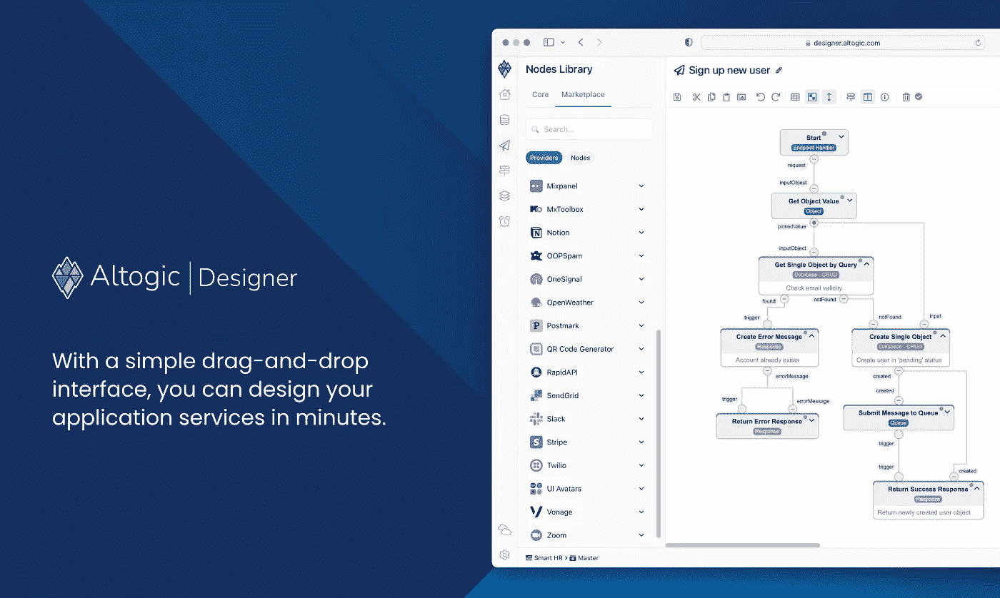

# 那么什么是 Altogic 呢？

简而言之，它是一个 BaaS 平台，你可以在几分钟内开发后端应用程序。数据库、身份验证、端点、存储等..您可以轻松地管理它们，并通过高功能的客户端库轻松地使用它们。

创建应用程序后，您可以开始在前端使用所有这些服务。在大多数情况下，您无需编码就可以创建端点，并通过 cleint 库轻松使用它们。

Altogic 的 flutter 客户端差不多准备好了，我想宣布一下，并简单介绍一下 Altogic。

活生生的例子:[https://altogic-flutter-example.netlify.app/](https://altogic-flutter-example.netlify.app/)

支持我们寻找产品:[https://www.producthunt.com/posts/altogic](https://www.producthunt.com/posts/altogic)

## 入门指南

首先你需要[报名](https://designer.altogic.com/auth/signup)。

创建第一个应用程序:

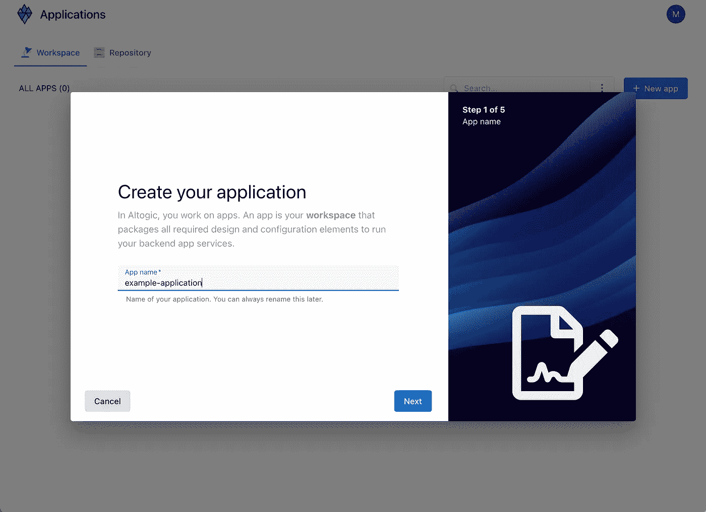

在接下来的几个简单步骤之后，选择应用程序模板:

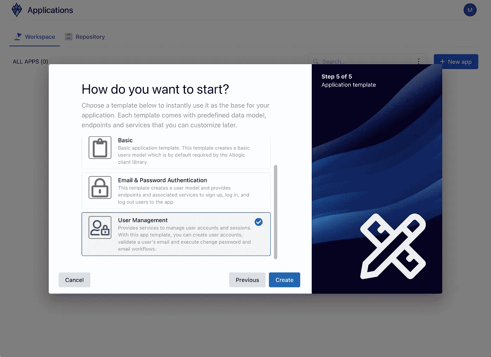

# 你准备好了！

现在，您已经准备好将 Altogic 与 Flutter 一起使用了。

```
flutter pub add altogic_flutterflutter pub get
```

创建`altogic`实例:

```
AltogicClient altogic = createClient(
    "<env-url>",
    "<client-key>");
```

您可以使用 altogic 中的许多服务。您可以通过 altogic 访问所有这些服务。

```
altogic.auth
altogic.db
altogic.storage
altogic.endpoint
altogic.task
altogic.queue
altogic.cache
altogic.realtime
```

# 证明

注册:

```
var res = await altogic.auth.signUpWithEmail(email, password, name);if (res.errors == null) {
  // success
}
```

并登录:

```
var res = await altogic.auth.signInWithEmail(email, password);if (res.errors == null) {
  // success
}
```

> *如果在您的应用认证
> 设置中**启用了* *电子邮件确认，并且如果用户的电子邮件尚未验证，
> 此方法将返回一条错误消息。*

有许多认证方法。你可以在网上看到他们的例子:[https://altogic-flutter-example.netlify.app/](https://altogic-flutter-example.netlify.app/)

# 数据库ˌ资料库

创建您的第一个模型:

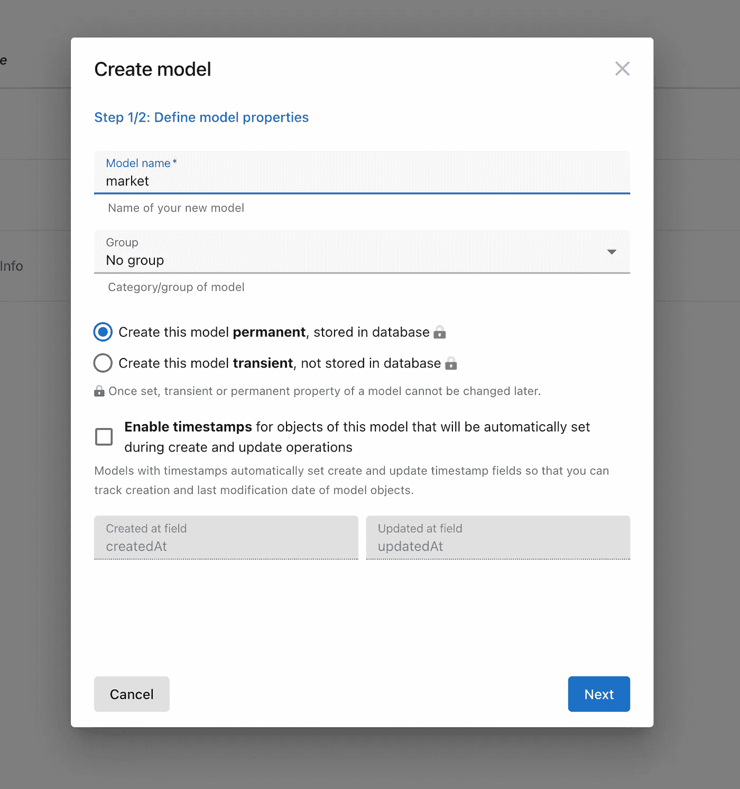

并将字段添加到您模型中:

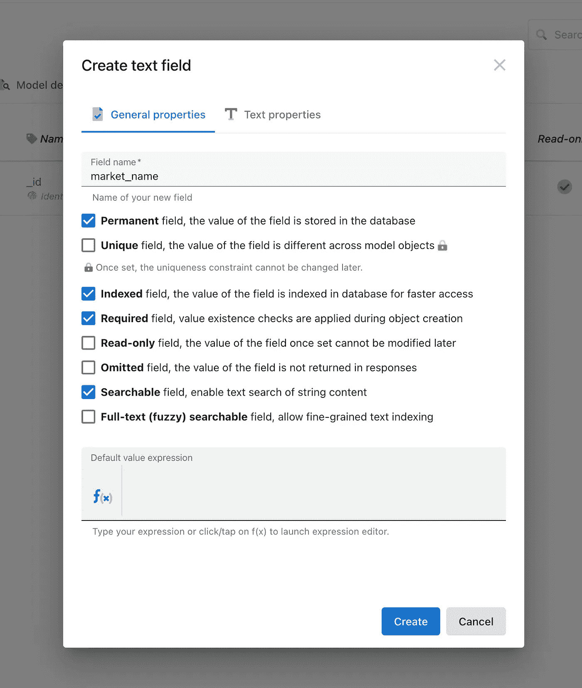

准备好了。创建第一个对象:

```
var res = await altogic.db.model('market').create({
'market_name' : 'My Market'
});
```

有很多数据库操作。你可以在网上看到他们的例子:[https://altogic-flutter-example.netlify.app/](https://altogic-flutter-example.netlify.app/)

# 创建您自己的端点无代码

首先，我们需要端点服务。

创建端点服务:

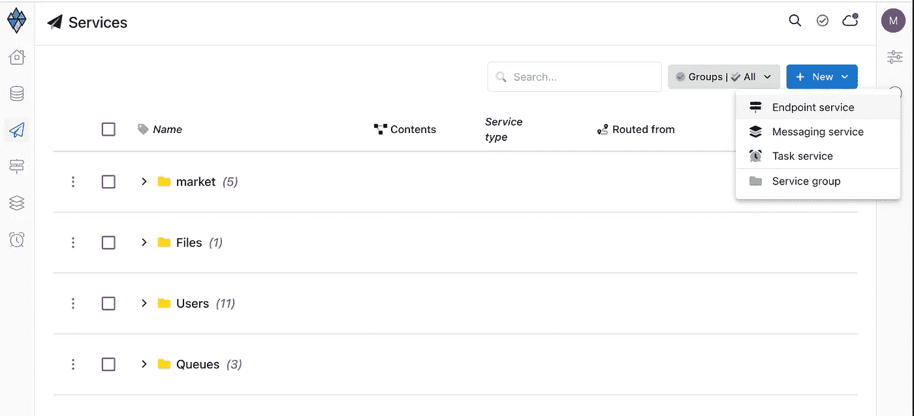

定义参数。将使用这些查询参数调用该服务。

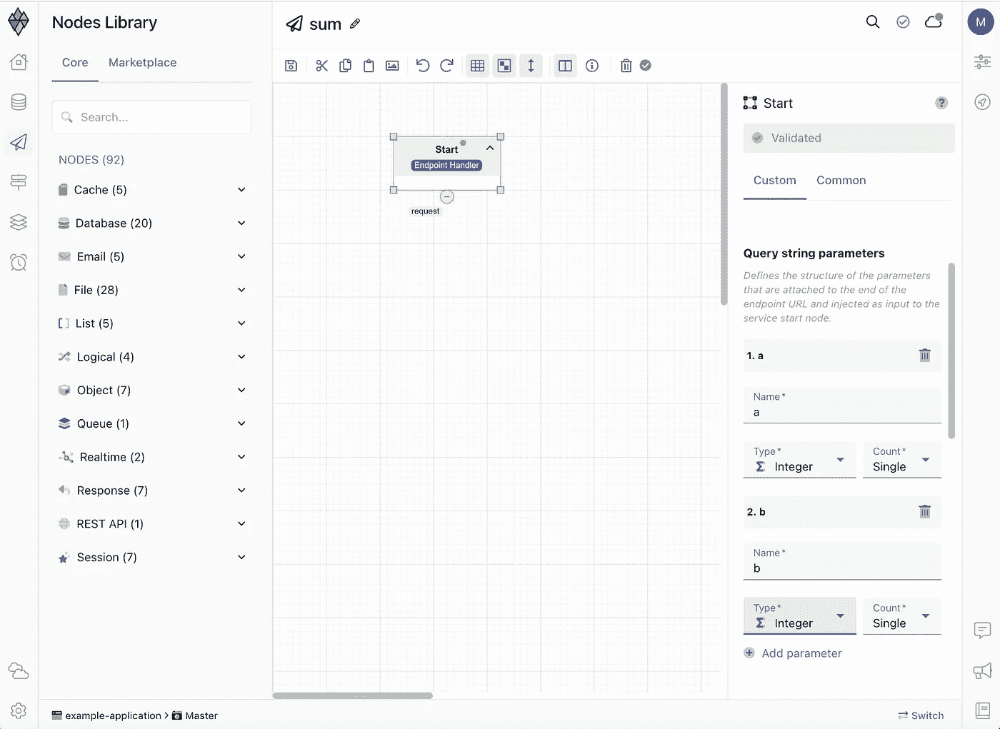

创建变量对象节点并添加您的字段。

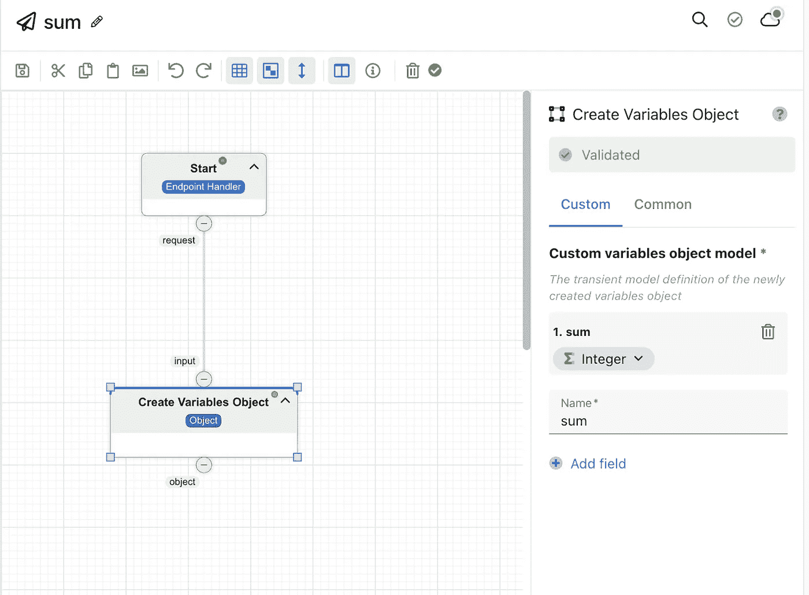

用函数设置字段

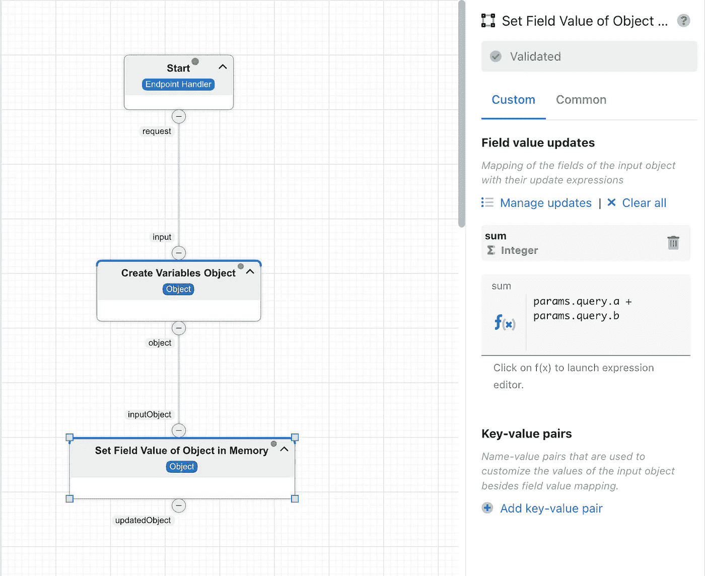

返回响应

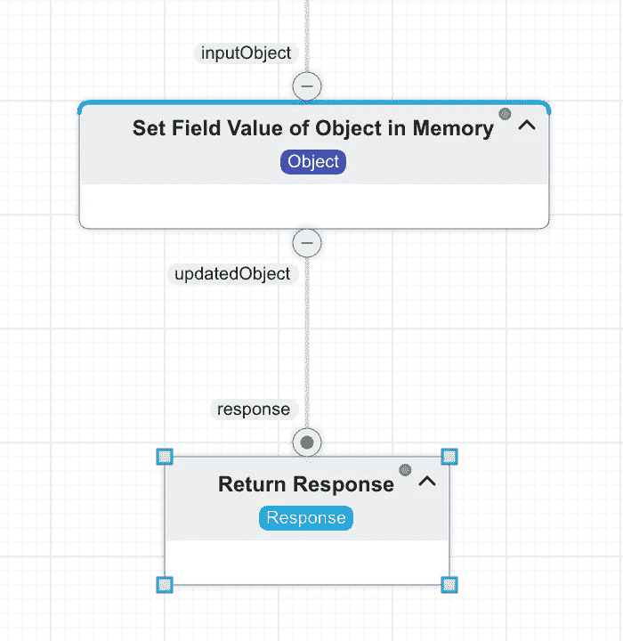

服务准备好了！

创建一个 GET 端点并连接到服务

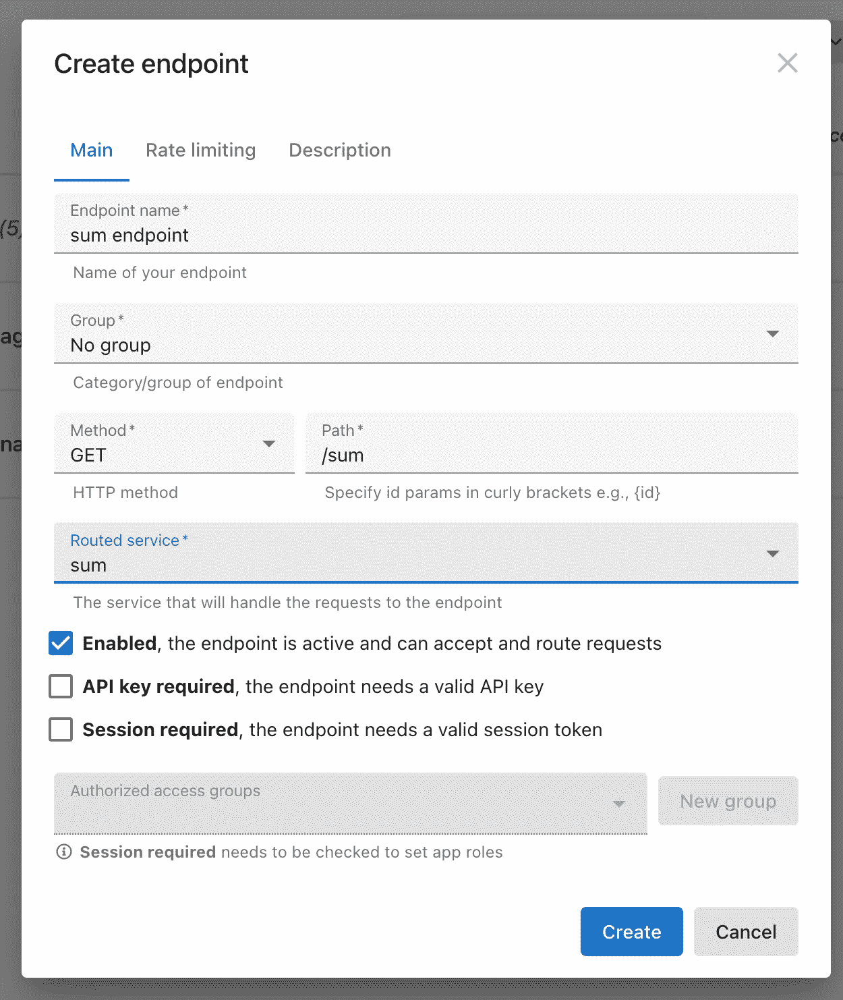

好吧！我们可以称之为:

```
var res = await altogic.endpoint.get('/test/get', queryParams: {
  'a': a,
  'b': b,
}).asMap();
```

# 就这么简单！

Altogic 的 Flutter 客户端现在更加强大，有了更多的特性！

查看示例和包:

套餐:[https://pub.dev/packages/altogic_dart](https://pub.dev/packages/altogic_dart)

活生生的例子:【https://altogic-flutter-example.netlify.app/ 

# 支持我们！

支持我们寻找产品:【https://www.producthunt.com/posts/altogic 