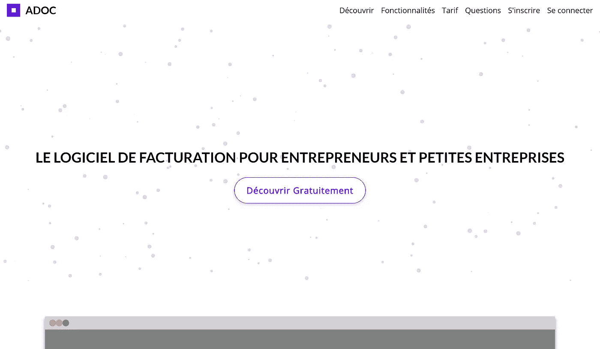
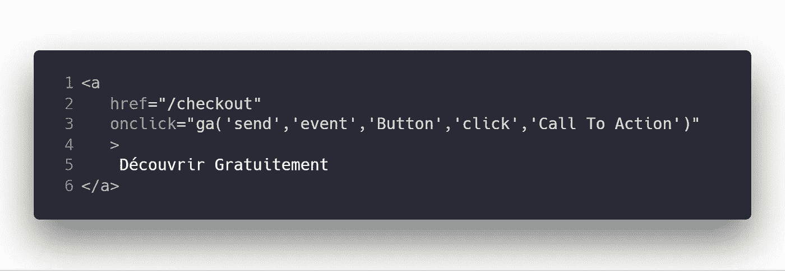
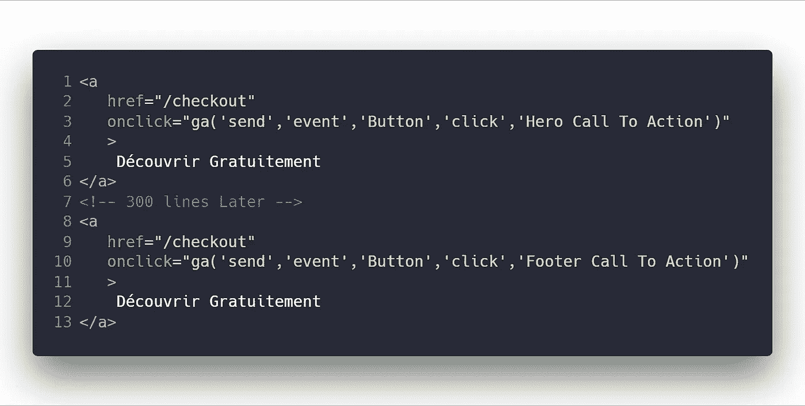
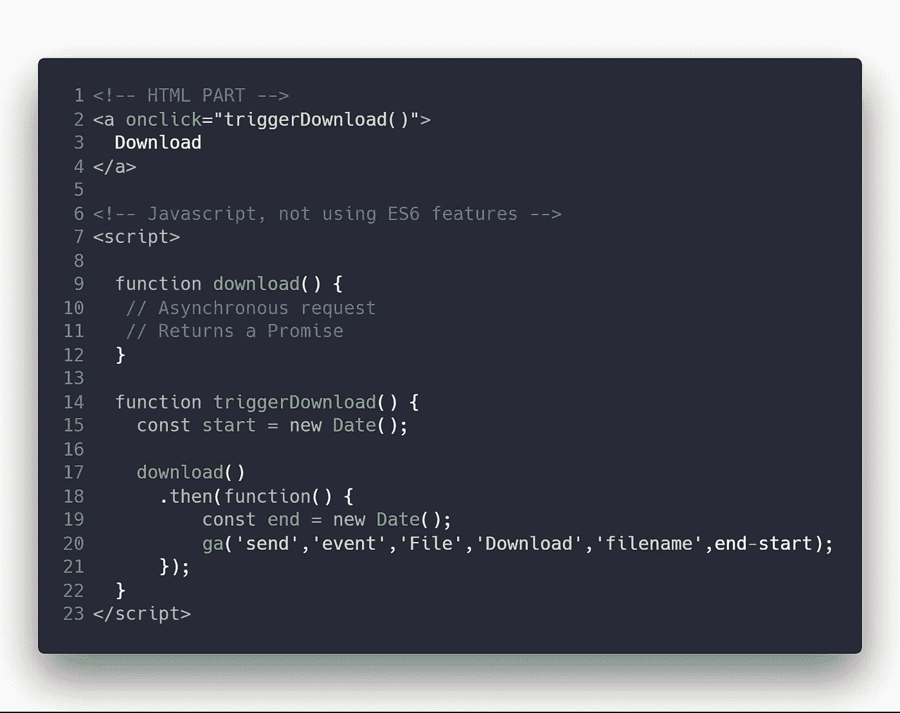

# 使用 Google Analytics 跟踪您网站上的定制事件

> 原文：<https://itnext.io/track-custom-events-on-your-website-using-google-analytics-cc32ef5c608b?source=collection_archive---------6----------------------->

照片由[拍摄🐣卢卡·亚科内利🦊](https://unsplash.com/@luxdamore?utm_source=medium&utm_medium=referral) on [Unsplash](https://unsplash.com?utm_source=medium&utm_medium=referral)

在跟踪用户方面，谷歌分析是一个非常强大的解决方案。但是，每个人都包括的小脚本是不够的。

了解有多少用户点击了某个特定的按钮(行动号召)，或者使用交叉销售策略而不是直接导航来访问页面，这一点可能很重要。**其实你需要自定义事件。**

> 这就是这篇文章的全部内容。

**你需要:**

*   Javascript 的最基本知识(监听器和处理程序)
*   1 分钟

**它假设:**

*   您的网站上已经配置了 Google Analytics(片段包含在您的`UA-XXXXXXX`标识符中)
*   你熟悉谷歌分析仪表板

# 动手实践示例

假设您刚刚为您的产品创建了一个令人难以置信的登录页面，并且您想要跟踪您的行动号召的有效性。

大概是这样的:

我们将重点放在紫色的大按钮:**是经常点还是不点？**

> 有三样东西藏不了多久:太阳、月亮和真相。—佛陀

你只需要知道一件事

**简短解释:**

*   `'send'`:命令(手册中称为`hitType`)。它将要求谷歌分析触发“某事”。
*   `'event'`:“某事”是一个事件。所以你会触发一个事件。
*   `'category'`:有过什么互动。引用手册:视频、按钮、图片等。
*   `'Action'`:互动的那种。例如:播放视频(`'play'`动作)，阅读文章(`'read'`动作)，等等。

**进一步详情:**

*   `'Label'`:让您对事件进行分类。例如，当一篇文章被阅读时，你可以提供文章的名字作为标签。回头见。
*   `'Value'`:数值。例如，当下载结束时，您可以跟踪浏览器下载它花了多长时间。回头见。

# 这是怎么做到的

回到我们的行动号召，我们想知道它被点击了多少次。

**片段:**

**意思是:**

*   在 Google Analytics 中触发自定义事件。
*   点击了一个按钮。
*   这个按钮是一个行动号召。

现在，让我们想象我的网站上还有第二个行动号召。

我想知道它与第一款相比表现如何。

**片段:**

这就是标签如何被证明是有用的。

# 另一个例子

*如果你已经明白了一切，你可以离开或者直接进入我文章的结尾。*

这次我将使用 Promises(需要更多的 Javascript 知识)。

假设您想知道客户端下载一个文件需要多长时间。

**我们将假设下载功能是一个返回承诺的异步请求。**

**片段:**

# 感谢阅读

我希望这篇教程能让你改善使用谷歌分析的追踪体验。这对我非常有用，在线教程对于一行 Javascript 代码来说似乎要困难得多。

查看我的最新文章:

 [## Javascript:将 HTML + CSS 转换成 PDF。几秒钟内打印 HTML

### 我目前正在做的一个个人项目涉及到将一个样式化的 HTML 节点树转换成一个可打印的 PDF 资产…

dmware.fr](https://dmware.fr/javascript-convert-html-css-to-pdf-print-html-in-seconds/) 

请随时联系 **david.mellul@outlook.fr.**

[吴怡](https://unsplash.com/@takeshi2?utm_source=medium&utm_medium=referral)在 [Unsplash](https://unsplash.com?utm_source=medium&utm_medium=referral) 上的“白色马克杯中的卡布奇诺，白色泡沫艺术在木桌上”