# 使用 Azure 门户的 Azure 虚拟机性能

> 原文：<https://itnext.io/tracking-vm-performance-using-the-portal-84c085871b5?source=collection_archive---------7----------------------->

> 知道你去过哪里，就知道你要去哪里

所以任何知道这个参考的人都会加分。不喜欢…酷点或任何东西…只是…点。；)水冷器谈论最多的事情之一就是监控虚拟机性能。微软有各种令人疯狂的工具来查看虚拟机的性能，但消费者呢？

信不信由你，微软评估的大部分资源都来自同一个来源，所有客户都可以直接从门户中获得。现在，根据您拥有的计算资源的类型(例如:您有可用性集吗？音阶设置？孤独的虚拟机？)地点会*略有*不同。然而，基本的概念性想法和步骤将是接近相同的。

# 虚拟机规模集

让我们从 VMSS 开始，它是 azure 上非常受欢迎的资源。获取性能统计数据非常简单，只需查看门户中设置的比例即可。让我们来看看我的一套秤。登录门户网站，在搜索栏中输入`vmss`，点击列表中的`Vitual Machine Scale Sets`，查看您的所有秤台。

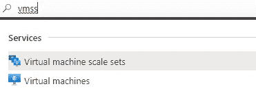

速记快捷方式

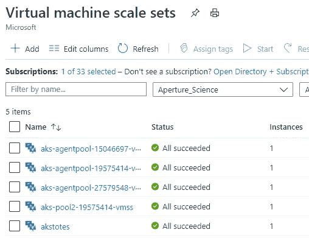

音阶设置！=虚拟机

现在让我们进入其中一个，四处看看。在此之前，我想提一下，规模集虚拟机标识不是基于名称，而是基于实例号。注意，我所有的规模集合中都有`1`实例，这意味着每个集合中只有`1`个虚拟机。

# 关注性能

我们可以立即看到该刀片式服务器上的性能图表以及许多其他信息，如每个实例的状态、虚拟网络、操作系统、大小等。但是我们想关注的是图表。这是一个针对**所有**比例集实例的**组合**性能图表。请记住这一点，因为如果您有多个实例，就像大多数情况一样，那么这些将是一般规模的健康指标集，仅此而已。

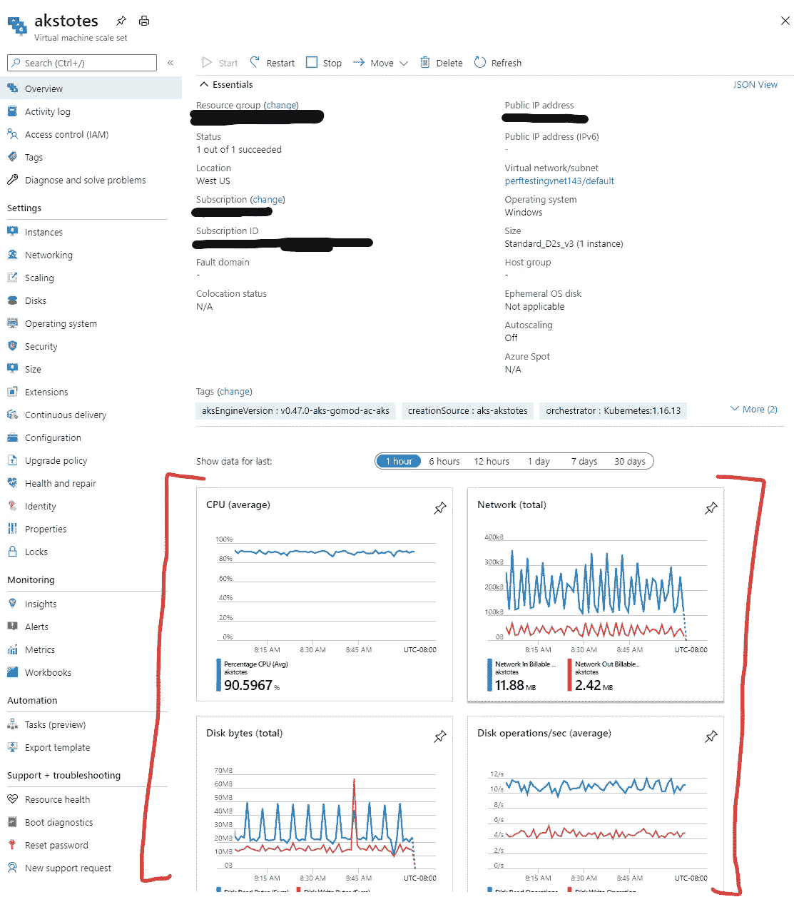

此处的图表是比例集中所有实例的组合性能

可以使用时间切片器对这些图表进行时间切片，如您所见，它们可以回溯 30 天。大量的数据可以帮助您跟踪可能的基于性能的回归或高负载时间框架。

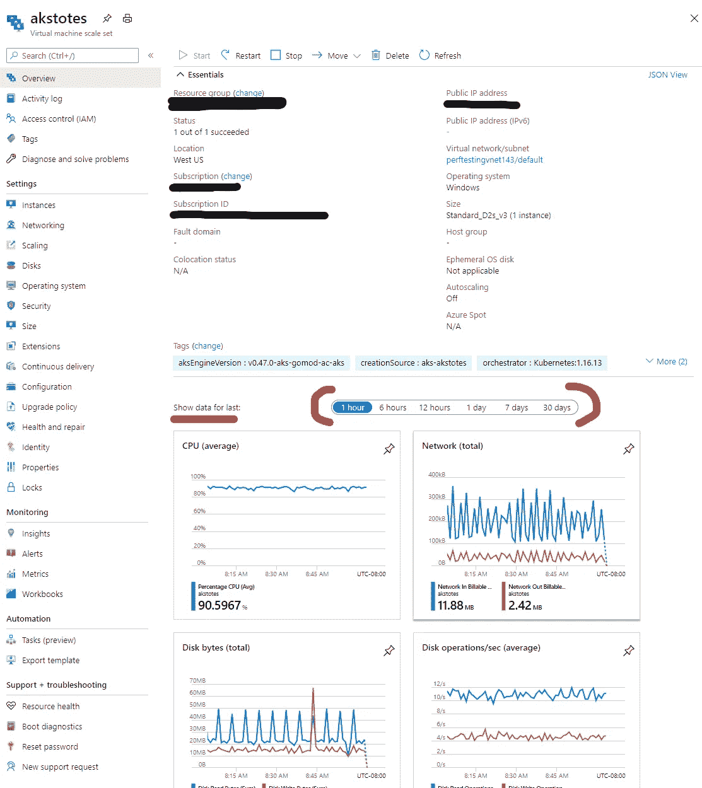

使用这些来限制或磨练在特定的时间领域

让我们直接看看其中的一个例子。您希望在刀片的`instances`部分查看规模集中的每个实际虚拟机。

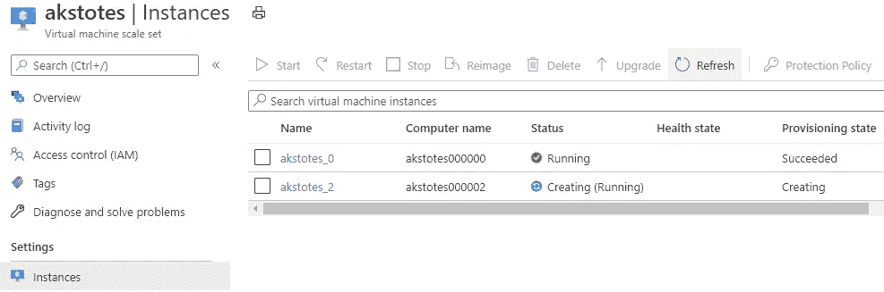

我们看到实际的名字、地位、状态等等。

既然我在这里，我可以去看看，比如说，akstotes_0，并直接了解它的具体性能。现在，图表的范围将仅限于该特定实例。默认图表是平均 CPU、网络总数、磁盘字节总数、平均每秒磁盘操作数。你可能不会使用这些，主要是因为没有最小/最大刻度的平均值不会让你得到真实的饱和度值。

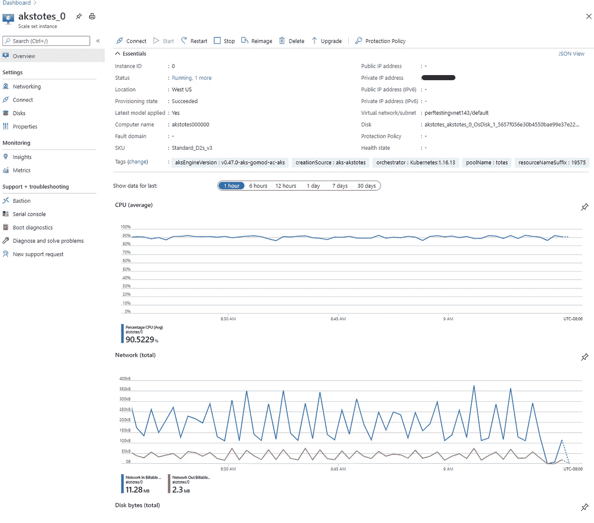

没有最小值/最大值的平均值可能对您没有太大帮助

所以基本上我给你展示的是如何访问你可能用不到的图表？太好了……> _ >…我想让你体验的是过程，这样你**就知道**如何到达这些地方，看看那里有什么样的数据。我们可以定制**所有的**这才是真正的力量所在！

# 自定义度量图表

你有几个选择。因为我已经在查看我的一个实例，所以我可以直接单击其中一个图表，比如 CPU，它会直接将我带到指标图表，我可以修改它以满足我的需要。

> 请注意，这些是一分钟内的**集合**

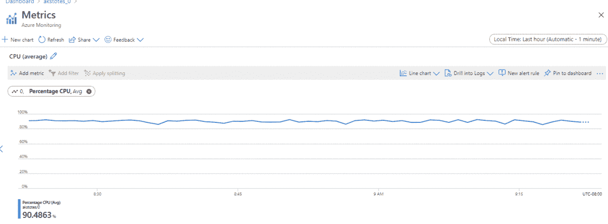

添加度量，选择度量，聚合和 boom！

只需点击几下，您就可以轻松地让这些图表变得更加有用。请注意，我将`scope`设置为 0，在这种情况下，这表示 scale 集合中的实例。因为我被紧紧地限制在这个资源的范围内，所以我只能看到这个资源。

这是我发现的不好的一面。尚不支持每个实例的 VMSS 实例定制度量图表。悲伤的一天。此外，您也不能使用 VMSS 图表之外的警报规则逻辑进行任何性能指标警报。尽管如此，使用 [Azure monitoring rest api](https://docs.microsoft.com/en-us/azure/azure-monitor/platform/rest-api-walkthrough) 可以检索数据。

# 虚拟机

好了，现在我们已经解决了 VMSS 的问题，让我们对虚拟机做同样的事情！我很高兴地告诉你，你会发现 VMSS 的局限性不遵循基本虚拟机！这包括您在[可用性集](https://docs.microsoft.com/en-us/azure/virtual-machines/availability#availability-sets)中拥有的虚拟机(虚拟机的逻辑分组)。

与 VMSS 实例非常相似，您可以像我上面所做的那样，访问资源并找到性能指标。我将向您展示如何从头开始创建自定义图表，而不是展示这一点。

# 从头开始度量

在搜索栏中输入`Monitor`并选择…..呃……`Monitor`。进入该区域后，选择左侧的`Metrics`。

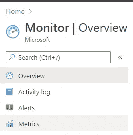

指标允许我们创建定制的仪表板！

这将为您设置一个选择范围刀片，您可以在这里找到我们今天要查看的虚拟机的位置。我通常将我的`Resource types`到`Virtual machines`缩小范围，只是为了降低我需要做的点击。

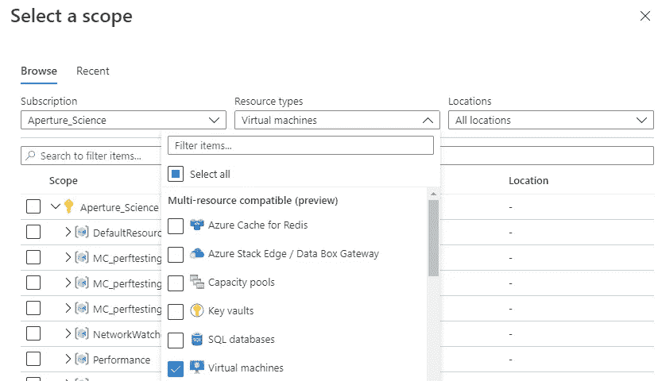

全部搜索完毕。

我将为我的 vm Fettsvette 创建这个。我将选择它并点击应用。注意，如果我有更多要检查的，我也可以添加它们。我通常在我经常做的工作中使用秤台，所以我目前没有很多虚拟机。

我的背包有喷气机！

现在我们已经在图表中了，我想在这里创建一些不同的指标。由于这些指标差异很大，我希望其中一些指标有不同的图表。让我们从最大百分比 CPU 图表开始。

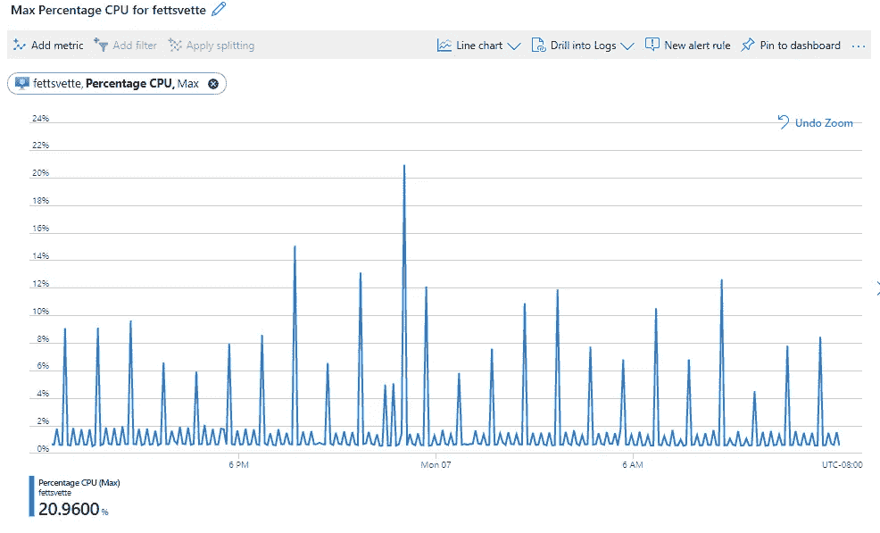

非常好。

接下来，我需要一个新的图表来记录每秒的最大磁盘读/写操作数。这将要求在添加磁盘读取操作后使用添加指标选项。

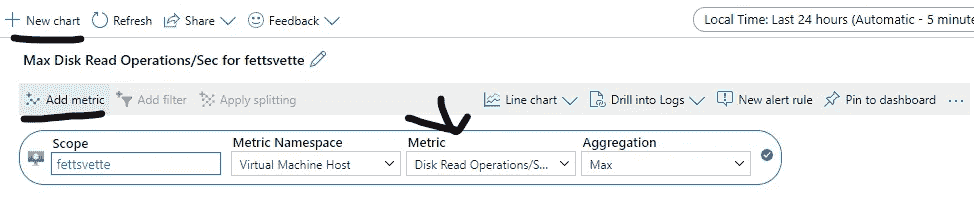

添加一个新图表，分配指标，然后添加另一个指标，以便两者都在一个图表上。

最终结果将是在一个图表上显示两个指标。像这样:

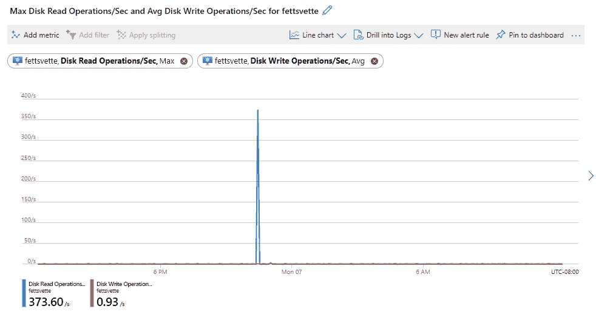

两个指标都可见，单独的颜色是自动的

太好了，现在我们有了一些东西，如果我们想的话，我们可以将它们固定在仪表板上，以方便查看。让我们说，虽然不只是看门户上的图表，但我们希望**提醒**如果某些东西超过了特定的限制。比如 90%的 CPU 最大值？我们可以使用**警报规则**通过点击我们的最大 CPU 百分比图表上的`New alert rule`按钮来实现这一点。

> 对于每种情况的这种类型的警告，有一个费用，但不是一个可怕的数目。

这将我们带入一个新的领域，让我们可以设置条件和操作，从而精确调整我们想要的警报类型。这些是可定制的，具有很大的灵活性。我要决定做这样的事情:

我将保留`Static`门槛，而不是现在使用`Dynamic`，因为这里不需要我进行机器学习。实际上，我希望看到最大值不超过 90%，并且我希望每隔 15 分钟检查一次过去 15 分钟的情况。

> 静态是一个简单的**信号逻辑。Dynamic 能够提供更强大、更高级的警报，更适合生产环境。能够跟踪使用模式，并在一定时期内基于逻辑违规进行触发，这让您可以剔除许多潜在的误报。如果你想了解更多关于动态的信息，请告诉我或者查看[文档](https://aka.ms/dynamicThresholdsDocumentation)**

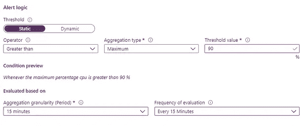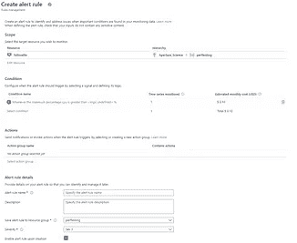

创建警报，设置逻辑。

现在我们有了基本的逻辑集，我们可以分配一个动作。在这种情况下，我们可以创建一个新的操作组，并将其命名为 **vmalert。**我还想设置一个通知，因此我将点击**通知**选项卡，创建一个**电子邮件/短信/推送/语音**，并将其发送到我的电子邮件中。对于此操作组，这就是我要做的全部工作，因此我将继续创建警报规则。

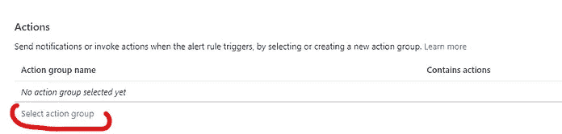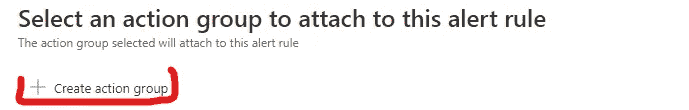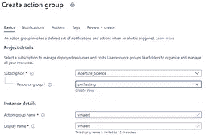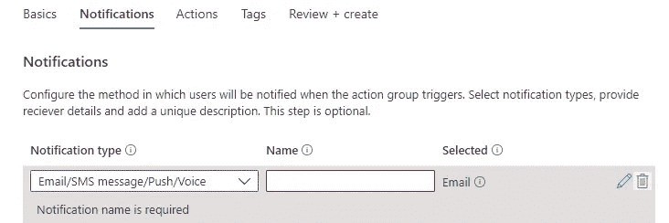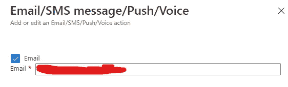

冒险的片段

好了，现在我们可以通过命名实际的警报并为其提供一些附加信息来完成这一步。

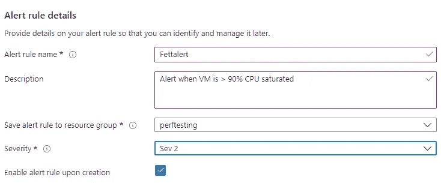

我选择了 Sev 2，因为我觉得它很重要，但并不重要。

就是这样！我们已经创建了一个定制的多维度控制面板，如果 CPU 使用率超过 90%，它可以查看多个指标和警报！这里有很大的权力和灵活性，所以发挥周围，看看什么最适合你。这里的重点是帮助你把脚弄湿:)

# 摘要

可以通过直接访问虚拟机并深入研究预先创建的控制面板来收集虚拟机性能。默认情况下，大多数信息是以平均值的形式提供的，这可能会掩盖潜在的使用高峰，因此请记住这一点。

您还可以创建定制的仪表板，以您想要的方式查看数据，甚至在某些数据超出您定义的重要阈值时发出警报。所有这些仪表板都能够收集 30 天的数据进行分析，并可以分成片段供您查看。

希望这对您有所帮助，如果有任何问题、意见或顾虑，请随时联系我们！