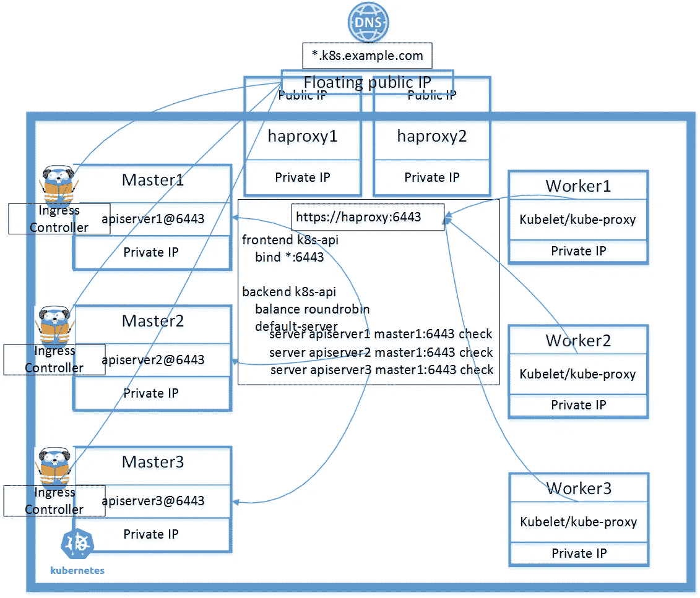
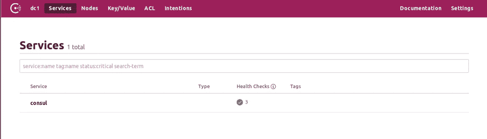
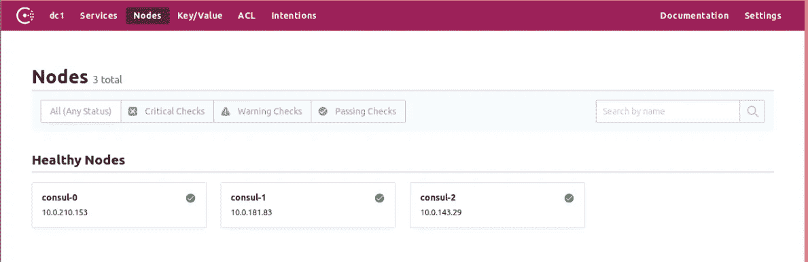
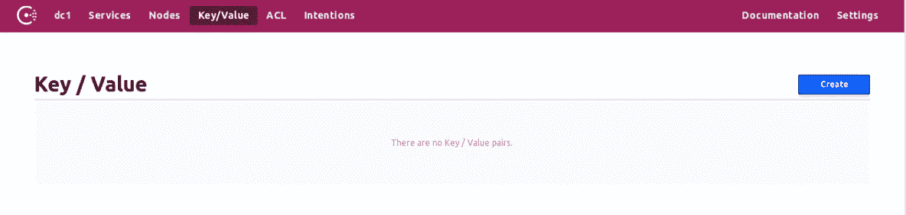
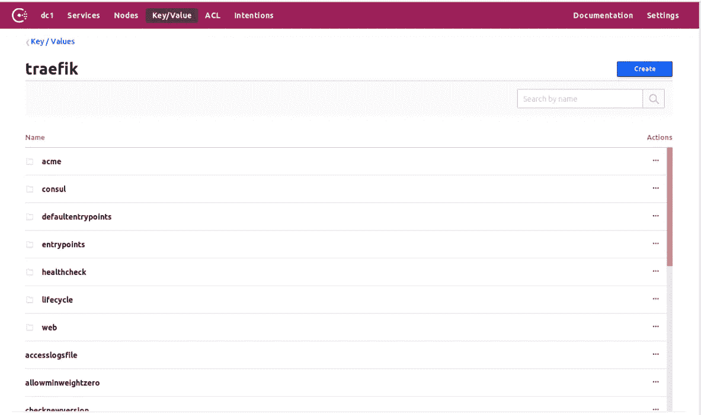
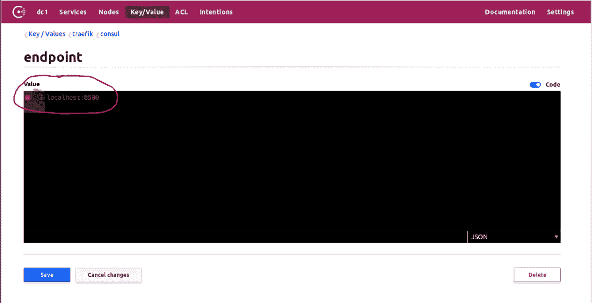

# Traefik 集群作为 Kubernetes 的入口控制器

> 原文：<https://itnext.io/traefik-cluster-as-ingress-controller-for-kubernetes-99fa6c34402?source=collection_archive---------1----------------------->

Traefik 集群作为 Kubernetes 的入口控制器

## 介绍

入口控制器是 Kubernetes 集群上运行的服务的入口。为了获得高可用性集群，应该有多个入口控制器作为一个集群一起工作。

Traefik 是[入口控制器](https://kubernetes.io/docs/concepts/services-networking/ingress-controllers/)之一。我使用它的动态配置和自动 LetsEncrypt 证书。部署单个 Traefik 入口控制器的说明很多，但 Traefik 集群的详细信息不如入口控制器多。[公文](https://docs.traefik.io/user-guide/cluster/)比较简短，所以我想在这篇文章里分享一下我的经验。

一个工作的 HA Kubernetes 集群至少有 3 个主节点和一些工作节点。我在这里 分享过我的经验[。通过添加 Traefik 集群，集群的架构如下图所示。](https://medium.com/@liejuntao001/create-highly-available-kubernetes-cluster-with-minimal-dependencies-c45f5b34e9d2)

在这里，我在主节点上部署入口控制器，我认为这适用于低流量集群。如果集群需要服务高流量，可以将更多实例部署到工作节点。



体系结构

*2020 年 1 月 9 日更新*

> Traefik 使用 Consul 集群作为存储后端。为了使它安全/稳定，我在本文中分享了我最近在 Kubernetes 中为生产运行 Consul 的经验。

## 先决条件

[咨询](https://www.consul.io/downloads.html)命令行，示例如下

```
cd /tmp && wget   [https://releases.hashicorp.com/consul/1.5.1/consul_1.5.1_linux_amd64.zip](https://releases.hashicorp.com/consul/1.5.1/consul_1.5.1_linux_amd64.zip) && unzip [consul_1.5.1_linux_amd64.zip](https://releases.hashicorp.com/consul/1.5.1/consul_1.5.1_linux_amd64.zip) && sudo mv consul /usr/local/bin
```

[traefik](https://github.com/containous/traefik/releases) 命令行，示例如下

```
cd /tmp && wget [https://github.com/containous/traefik/releases/download/v1.7.11/trae  fik_linux-amd64](https://github.com/containous/traefik/releases/download/v1.7.11/traefik_linux-amd64) && chmod +x traefik_linux-amd64 && mv traefik_linux-amd64 traefik && sudo mv traefik /usr/local/bin
```

go 环境，cfssl，cfssljson

```
# Install [gimme](https://github.com/travis-ci/gimme)
$ curl -sL -o ~/bin/gimme https://raw.githubusercontent.com/travis-ci/gimme/master/gimme
$ chmod +x ~/bin/gimme# Install go
$ eval `gimme stable`# Install cfssl, cfssljson
go get -u github.com/cloudflare/cfssl/cmd/cfssl
go get -u github.com/cloudflare/cfssl/cmd/cfssljson
```

## 本文中使用的来源

```
[github link](https://github.com/liejuntao001/traefik-ingress-cluster)
```

## 部署领事

领事是用来作为 KV 商店的 Traefik，而它实际上更强大。

我将按照本教程 [*的前半部分*](https://testdriven.io/blog/running-vault-and-consul-on-kubernetes/) 部署一个 3 副本 consul 集群。

为咨询生成 CA 和证书

```
$ cd ca# Generate CA$ cfssl gencert -initca config/ca-csr.json | cfssljson -bare ca# Generate certs$ cfssl gencert \
    -ca=ca.pem \
    -ca-key=ca-key.pem \
    -config=config/ca-config.json \
    -profile=default \
    config/consul-csr.json | cfssljson -bare consul$ cfssl gencert \
    -ca=ca.pem \
    -ca-key=ca-key.pem \
    -config=config/ca-config.json \
    -profile=default \
    config/traefik-csr.json | cfssljson -bare traefik
```

部署领事

由于 Consul 需要持久卷，请适当调整 consul/consul_statefulset.yml 中的 storageClassName。

如果集群的工作节点少于 3 个，请从 consul/Consul _ statefullset . yml 中删除“podAntiAffinity ”,但是，要获得高可用性的 Consul 集群，最好在不同的节点上运行 3 或 5 个副本。

```
kubectl apply -f consul/
```

生成领事机密

```
$ cd ca# Generate gossip key
$ export GOSSIP_ENCRYPTION_KEY=$(consul keygen)# consul
$ kubectl -n consul create secret generic consul \
  --from-literal="gossip-encryption-key=${GOSSIP_ENCRYPTION_KEY}" \
  --from-file=ca.pem \
  --from-file=consul.pem \
  --from-file=consul-key.pem
```

如果一切顺利，我们应该有 3 个执政官舱。

```
$ kubectl -n consul get pod
NAME       READY   STATUS    RESTARTS   AGE
consul-0   2/2     Running   0          17s
consul-1   2/2     Running   0          14s
consul-2   2/2     Running   0          11s# check log
$ kubectl -n consul logs -f consul-0 -c consul
bootstrap_expect > 0: expecting 3 servers
==> Starting Consul agent...
==> Consul agent running!
           Version: 'v1.5.0'
           Node ID: '159adb35-0cfd-2c58-ea51-8e3a6b64ee4c'
         Node name: 'consul-0'
        Datacenter: 'dc1' (Segment: '<all>')
            Server: true (Bootstrap: false)
       Client Addr: [0.0.0.0] (HTTP: 8500, HTTPS: 8443, gRPC: -1, DNS: 8600)
      Cluster Addr: 10.0.210.154 (LAN: 8301, WAN: 8302)
           Encrypt: Gossip: **true**, TLS-Outgoing: **true**, TLS-Incoming: **true**# forward consul to localhost
$ kubectl -n consul port-forward consul-0 8500:8500 &# run this command in different console to maintain the connection
$ while true; do consul members && sleep 20; done$ consul members
Node      Address            Status  Type    Build  Protocol  DC   Segment
consul-0  10.0.210.154:8301  alive   server  1.5.0  2         dc1  <all>
consul-1  10.0.143.30:8301   alive   server  1.5.0  2         dc1  <all>
consul-2  10.0.181.84:8301   alive   server  1.5.0  2         dc1  <all> 
```

浏览到 [http://localhost:8500](http://localhost:8500) 获得咨询用户界面



咨询服务



咨询节点



领事 K/V 商店，现在空了

## 将 traefik.toml 导入 Consul

我有这个 traefik.toml.sample 作为模板。
填写合适的邮箱地址和域名，生成一个文件 traefik.toml

使用“traefik storeconfig”命令导入 traefik.toml。

```
# Generate from template
$ EMAIL=youremail@example.com DOMAIN=example.com envsubst < traefik.toml.kv.sample  > traefik.toml# forward consul to localhost
$ kubectl -n consul port-forward consul-0 8500:8500 &# magic time
$ traefik storeconfig  --consul --consul.endpoint=localhost:8500 --file.filename=./traefik.toml
...
Writing config to KV
```

如果正确导入，请检查领事 K/V 商店中的值



导入后 K/V 存储

完成上述导入步骤后，需要手动更改键 traefik/consul/endpoint 的值。如下图截图所示，to '[https://consul . consul . SVC . cluster . local:8443](https://consul.consul.svc.cluster.local:8443)，这是领事服务的 URL。



手动修改该值

如果在 acme.json 文件中存在现有的 Let'sEncrypt 证书，只需取消注释该行即可

```
#storageFile = "./acme.json"
```

从文件 traefik.toml 进行导入。它也会被导入到 Consul 中。

然后删除键 traefik/acme/account/lock，以允许 traefik 入口 pod 获得锁。

## 部署 Traefik 入口控制器集群

为 traefik 群集创建 TLS 机密。它是用来访问领事的。

```
$ cd ca
$ kubectl -n kube-system create secret generic traefik-consul \
>     --from-file=ca.pem \
>     --from-file=traefik.pem \
>     --from-file=traefik-key.pem
secret/traefik-consul created
```

创建 traefik 仪表板密码。

```
kubectl -n kube-system create secret generic kubesecret --from-file auth
```

文件“auth”就是从这个命令创建的。用户名/密码将用于访问 traefik 仪表板

```
$ htpasswd -c ./auth <username>
New password:
Re-type new password:
Adding password for user testaaa
```

现在部署它。

示例 traefik_kv.yaml 将部署到主节点。如果不希望如此，请调整“nodeAffinity”部分。

```
DOMAIN=example.com envsubst < traefik_kv.yaml | kubectl apply -f -
```

traefik-ingress-controller 有 3 个 pod。

```
$ kubectl -n kube-system get pod -o wide
traefik-ingress-controller-5dlbz          1/1     Running   0          5m21s   10.0.142.69       master3
traefik-ingress-controller-9nxqt          1/1     Running   0          6m34s   10.0.123.196      master2   
traefik-ingress-controller-xzkzd          1/1     Running   0          5m34s   10.0.255.14       master1 
```

向部署了入口控制器的节点添加标签，因为我将使用标签来处理集群重启序列。参考我的文章《如何重启高可用的 Kubernetes 集群》([链接](https://medium.com/@liejuntao001/how-to-reboot-highly-available-kubernetes-cluster-5a9df4daecf))。

```
# for all nodes that has Ingress Controller
$ kubectl label nodes master1 node-role.kubernetes.io/ingress-controller=$ kubectl get nodes
NAME      STATUS   ROLES                       AGE   VERSION
master1   Ready    ingress-controller,master   49d   v1.14.1
master2   Ready    ingress-controller,master   49d   v1.14.1
master3   Ready    ingress-controller,master   49d   v1.14.1
worker1   Ready    <none>                      49d   v1.14.1
worker2   Ready    <none>                      48d   v1.14.1
worker3   Ready    <none>                      48d   v1.14.1
```

## **添加 Haproxy 规则**

traefik 集群准备就绪后，将 haproxy 规则添加到主要和备份 haproxy 主机。基本上，转发端口 80 和 443。

由于域的 DNS 指向 haproxy，现在可以使用上面创建的用户名/密码访问 trae fik dashboard h[ttps://trae fik . k8s . example . com/](https://traefik.example.com/)。

## 从领事处导出顶点

我想检查/备份 Traefik 群集为服务获得的 Let'sEncrypt 证书。我找不到清晰的说明，以下是我尝试后的步骤。

```
# Connect to consul
kubectl -n consul port-forward consul-0 8500:8500 &# Keep the consul connection open
while true; do consul members && sleep 10; done# retrieve compressed acme object
consul kv get traefik/acme/account/object > acme.gz# gunzip
cat acme.gz | gunzip > acme.json# Format
cat acme.json | jq '.' > acme.json.formatted
```

## 备份/恢复咨询

我遇到了一个案例，我想为 consul 集群更改持久卷。所以我需要摧毁执政官集群并重建它。显然，我不想失去现有的 KV 值。我发现使用 consul 快照备份/恢复非常简单。

1.  创建快照作为备份
2.  销毁领事声明集和 pvc
3.  用新的咨询配置重新创建
4.  从快照恢复

```
# backup
consul snapshot save backup.snap# restore
consul snapshot restore backup.snap
```

感谢阅读。