# Empyrial:一个基于 Python 的项目组合管理框架

> 原文：<https://itnext.io/trafalgar-a-python-library-to-make-quantitative-finance-and-portfolio-analysis-faster-and-easier-24b2c0cb29d4?source=collection_archive---------0----------------------->


Empyrial 是一个基于 Python 的**开源量化投资**库，专门面向**金融机构**和**散户**，于 2021 年火星正式发布。

Empyrial 已经被数以千计在金融行业工作的人使用，它的目标是成为投资组合管理、分析和 T21 优化的一体化平台。

empyria**通过**在一个**易于理解的**、**灵活的**和**强大的框架**中带来最佳性能**和**风险分析**来增强组合管理**。

借助 Empyrial，您可以轻松分析证券或投资组合，以便**从中获得最佳见解**。

这主要是 **Quantstats** 和 **PyPortfolioOpt** 等金融分析库的**包装器**。

# 安装🖥️

您可以使用 pip 安装 Empyrial:

```
pip install empyrial
```

为了更好的体验，我们建议你在笔记本上使用 Empyrial(Jupyter，Google Colab…)

*注意:macOS 用户将需要安装* [*命令行工具*](https://osxdaily.com/2014/02/12/install-command-line-tools-mac-os-x/) *。*

*注意:如果你在 windows 上，首先需要安装 C++。(* [*下载*](https://visualstudio.microsoft.com/thank-you-downloading-visual-studio/?sku=BuildTools&rel=16) *，* [*安装说明*](https://drive.google.com/file/d/0B4GsMXCRaSSIOWpYQkstajlYZ0tPVkNQSElmTWh1dXFaYkJr/view) *)*

# 证明文件📖

[完整文档](https://empyrial.gitbook.io/empyrial/)(网站)

[完整文档](https://github.com/ssantoshp/Empyrial/blob/main/empyrial_documentation.pdf) (PDF)

# 使用🏄‍♂️

**经验性的**

```
from empyrial import empyrial, Engineportfolio = Engine(    
         start_date= "2018-06-09", 
         portfolio= ["BABA", "PDD", "KO", "AMD","^IXIC"], 
         weights = [0.2, 0.2, 0.2, 0.2, 0.2], #equal weighting is set by default
         benchmark = ["SPY"] #SPY is set by default
)empyrial(portfolio)
```

**日历再平衡**📅

```
from empyrial import empyrial, Engineportfolio = Engine(    
         start_date= "2018-06-09", 
         portfolio= ["BABA", "PDD", "KO", "AMD","^IXIC"], 
         weights = [0.2, 0.2, 0.2, 0.2, 0.2], 
         benchmark = ["SPY"], #SPY is set by default
         rebalance = "1y"
)empyrial(portfolio)
```

可用于再平衡的时间段有`2y`、`1y`、`6mo`、`quarterly`、`monthly`

**自定义再平衡**

通过执行以下操作，您可以决定重新平衡的自定义日期:

```
from empyrial import empyrial, Engineportfolio = Engine(    
         start_date= "2018-06-09", 
         portfolio= ["BABA", "PDD", "KO", "AMD","^IXIC"], 
	 weights = [0.2, 0.2, 0.2, 0.2, 0.2],
         benchmark = ["SPY"], #SPY by default
         rebalance = ["2018-06-09", "2019-01-01", "2020-01-01", "2021-01-01"]
)empyrial(portfolio)
```

⚠️:在这种情况下，确保列表的第一个元素对应于`start_date`，最后一个元素对应于`end_date`，默认情况下是今天的日期。

**优化器**

您可以使用自定义权重:

```
from empyrial import empyrial, Engineportfolio = Engine(
      start_date = "2018-01-01",
      portfolio= ["BABA", "PDD", "KO", "AMD","^IXIC"], 
      weights = [0.1, 0.3, 0.15, 0.25, 0.2], #custom weights
      rebalance = "1y" #rebalance every year
)empyrial(portfolio)
```

你也可以使用我们内置的优化器。有 4 个优化器可用:

*   `"EF"`:全球有效前沿[举例](https://empyrial.gitbook.io/empyrial/optimization/global-efficient-frontier)
*   `"MEANVAR"`:均值方差[示例](https://empyrial.gitbook.io/empyrial/optimization/mean-variance)
*   `"HRP"`:分级风险平价[示例](https://empyrial.gitbook.io/empyrial/optimization/hierarchical-risk-parity)
*   `"MINVAR"`:最小方差[示例](https://empyrial.gitbook.io/empyrial/optimization/minimum-variance)

*注意:默认优化器是等权重的*

```
from empyrial import empyrial, Engineportfolio = Engine(
      start_date = "2018-01-01",
      portfolio = "BABA", "PDD", "KO", "AMD","^IXIC"],
      optimizer = "EF",
      rebalance = "1y" #rebalance every year
)portfolio.weights
```

输出:

```
[0.31409, 0.0, 0.03472, 0.00046, 0.0, 0.0, 0.069, 0.08831, 0.00854, 0.48489]
```

我们可以看到分配得到了优化。

**风险经理**👨‍💼

有 3 名风险经理:

*   **最大压降** : `{"Max Drawdown" : -0.3}` [示例](https://empyrial.gitbook.io/empyrial/risk-management/max-drawdown)
*   **止盈** : `{"Take Profit" : 0.4}` [举例](https://empyrial.gitbook.io/empyrial/risk-management/take-profit)
*   **止损** : `{"Stop Loss" : -0.2}` [举例](https://empyrial.gitbook.io/empyrial/risk-management/stop-loss)

```
from empyrial import empyrial, Engineportfolio = Engine(
      start_date = "2018-01-01",
      portfolio= ["BABA", "PDD", "KO", "AMD","^IXIC"], 
      optimizer = "EF",
      rebalance = "1y", #rebalance every year
      risk_manager = {"Max Drawdown" : -0.2} #Stop the investment when the drawdown becomes superior to -20%
)empyrial(portfolio)
```

**经验输出**🚀

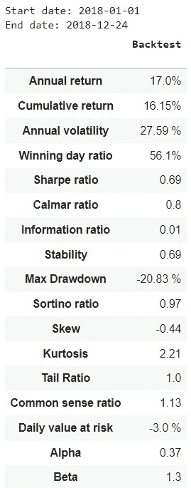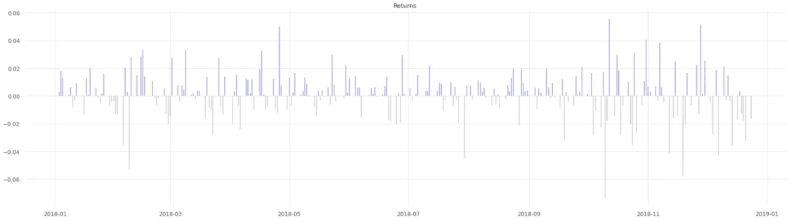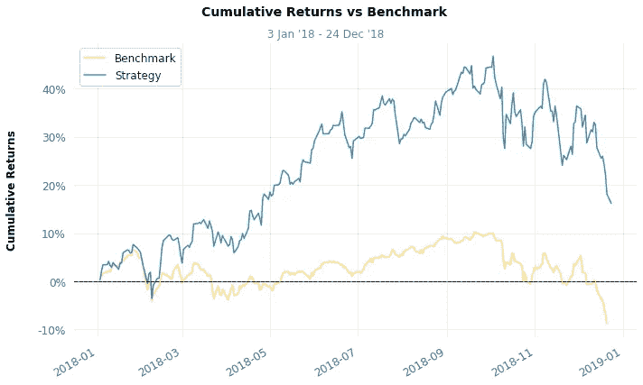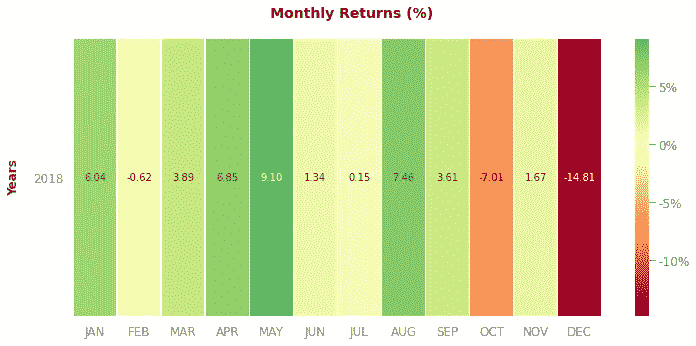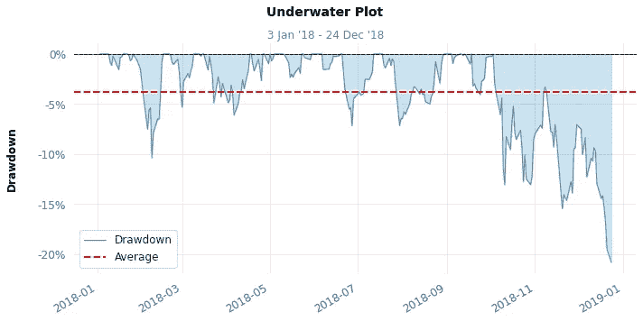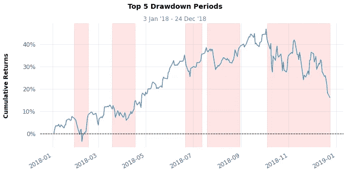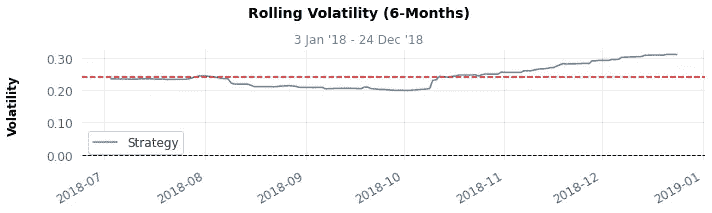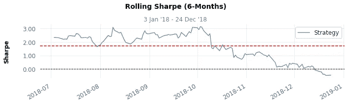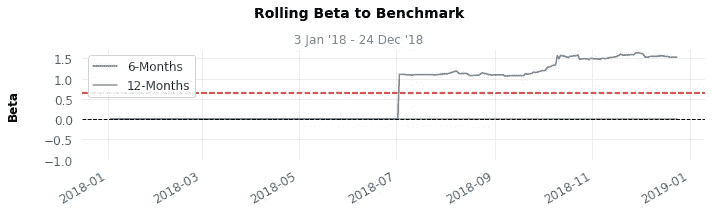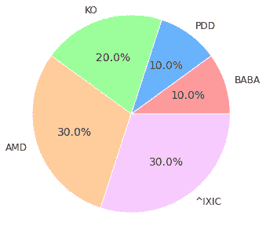

# 下载样张📁

您也可以下载 Empyrial 生成的 PDF 格式的模板:

```
from empyrial import get_report, Engineportfolio = Engine(
      start_date = "2018-01-01",
      portfolio = ["BLK", "BAC", "AAPL", "TM", "JPM","JD", "INTU", "NVDA", "DIS", "TSLA"],
      optimizer = "EF",
      rebalance = "1y", #rebalance every year
      risk_manager = {"Stop Loss" : -0.2}
)get_report(portfolio)
```

输出:

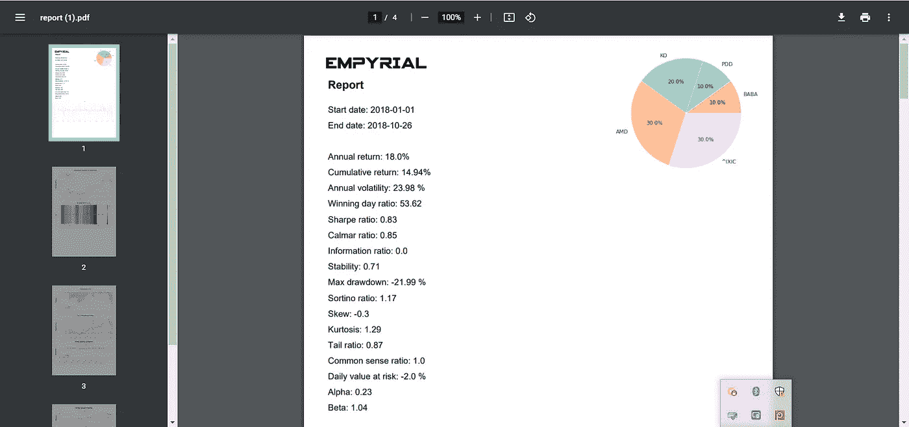

# 信用

这座图书馆之所以成为可能，也是因为这些不可思议的人们的工作:

*   [绕过](https://github.com/ranaroussi)[quanta stats 库](https://github.com/ranaroussi/quantstats)的
*   [罗伯特·马丁](https://github.com/robertmartin8)为 [PyPortfolioOpt](https://github.com/robertmartin8/PyPortfolioOpt)

# 接触🤙

如果你有一些建议，改进，批评或问题，不要犹豫让我评论，我很乐意回答:)

电子邮件:santoshpassoubady@gmail.com

你也可以在 Github 上关注我，开始这个项目(【https://github.com/ssantoshp/Empyrial】)在那里我做了很多金融项目和面向量化的东西。

祝你今天开心！玩的开心！🤗