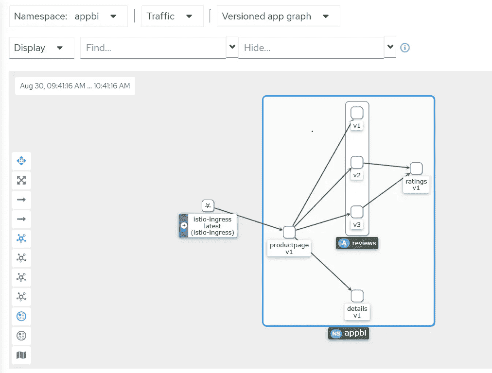
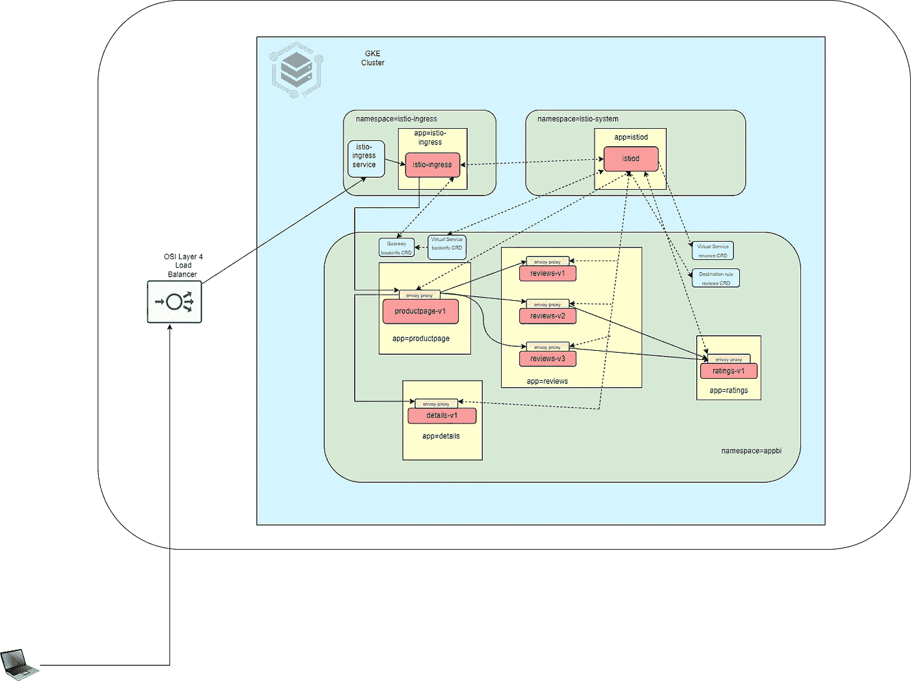
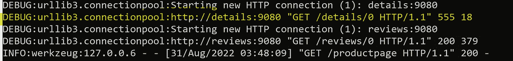

# 使用 Istio 101 进行交通管理

> 原文：<https://itnext.io/traffic-management-using-istio-b49663da3e8d?source=collection_archive---------1----------------------->

# 目的

最近我读了一位同事的博客，内容是关于 Istio 如何超越所有其他 Kubernetes 部署的入口解决方案。博客提到，Istio 有一个巨大的流量管理功能集，这让我对 Istio 及其功能感兴趣。所以我钻研了非常全面和描述性的 Istio 文档。我写这些是为了巩固我的理解，并分享我在玩它时学到的东西。Istio 有许多特性，但在本文中，我们将触及由 Istio 服务网格提供的流量管理特性的基础。

# Istio 交通管理简介

**流量管理** t 是 [Istio](https://istio.io/latest/) 服务网格除了**可观察性、安全性、可扩展性之外提供的主要特性。**为了在您的网状网络中引导流量，Istio 需要知道您的所有端点在哪里，以及它们属于哪些服务。为了填充自己的服务注册中心，Istio 连接到一个服务发现系统。例如，如果您在 Kubernetes 集群上安装了 Istio，那么 Istio 会自动检测该集群中的服务和端点。

虽然 Istio 的基本服务发现和负载平衡为您提供了一个有效的服务网格，但这还远远不够。在许多情况下，您可能希望对网格流量进行更细粒度的控制。作为 A/B 测试的一部分，您可能**希望将特定百分比的流量**导向新版本的服务，或者对特定服务实例子集的流量应用不同的负载平衡策略。您可能还想对进出网格的流量应用特殊的规则，或者将网格的外部依赖关系添加到服务注册中心。通过使用 Istio 的流量管理 API 向 Istio 添加您自己的流量配置，您可以做到所有这些以及更多。

像其他 Istio 配置一样， **API 是使用 Kubernetes 自定义资源定义(CRDs)** 指定的，您可以使用 YAML 进行配置。我们将研究大部分流量管理 API 资源，以及使用 Istio 提供的示例应用程序可以做些什么。

Istio 还支持典型的 [Kubernetes ingress](https://istio.io/latest/docs/tasks/traffic-management/ingress/kubernetes-ingress/) 资源。但是建议使用 [Istio 网关](https://istio.io/latest/docs/tasks/traffic-management/ingress/ingress-control/)，而不是 Ingress，以利用 Istio 提供的全部功能，例如丰富的流量管理和安全功能。您将在测试中使用 Istio 入口网关。

# 测试设置

1.  创建一个 GKE 集群[https://cloud . Google . com/kubernetes-engine/docs/deploy-app-cluster # create _ cluster](https://cloud.google.com/kubernetes-engine/docs/deploy-app-cluster#create_cluster)
2.  打开 cloud shell，对 GKE 集群进行身份验证，以便可以在 cloud shell 中使用 kubectl 和 helm。
3.  在云 shell 中运行下面的 shell 脚本

setup-istio.sh

4.运行下面的脚本来部署 BookInfo 应用程序(由 Istio 提供用于演示目的)。

setup-biapp.sh

使用以下命令查看配置

```
alias kgar="kubectl api-resources -o name --namespaced=true --verbs=list | xargs -n 1 kubectl get --ignore-not-found=true --show-kind"kgar -n appbi
kgar -n istio-ingress
kgar -n istio-system
```

5.通过执行以下命令来配置网关和虚拟服务

bookinfo-gateway.yaml

```
kubectl apply -f bookinfo-gateway.yaml -n appbi
```

此时，您的配置如下所示(这是我的 [kiali](https://kiali.io/) 仪表板的快照)



图 1 Bookinfo 应用图表

正如您所看到的，istio-ingress pod 将流量定向到 productpage-v1 部署，而 productpage-v1 连接到 reviews 应用程序，该应用程序有 3 个部署，分别使用不同版本的应用程序。productpage-v1 还连接到 details-v1 部署。评论应用 v2 和 v3 连接到评级-v1 应用。

# 方法

您将使用一个[网关](https://istio.io/latest/docs/reference/config/networking/gateway/#Gateway)来管理您的网格的入站和出站流量，让您指定想要进入或离开网格的流量。**网关配置适用于在网格边缘运行的独立特使代理，即 istio-ingress(在命名空间 istio-ingress 中)**，而不是与您的服务工作负载一起运行的 sidecar 特使代理。`Gateway`配置资源允许外部流量进入 Istio 服务网格，并使 Istio 的流量管理和策略功能可用于边缘服务。

Istio 的网关资源只允许您配置第 4 层到第 6 层负载平衡属性，如要公开的端口、TLS 设置等。然后，不是将应用层流量路由(L7)添加到同一个 API 资源，而是将一个常规的 Istio [虚拟服务](https://istio.io/latest/docs/concepts/traffic-management/#virtual-services)绑定到网关。这使您可以像管理 Istio 网格中的任何其他数据平面流量一样管理网关流量。

让我们检查一下网关 CRD 的定义。

```
kubectl get gateway -n appbi -o yaml
```

*   选择器 *istio: ingress* 应该是命名空间 istio-ingress(独立特使代理)中部署 istio-ingress 的标签
*   此网关配置允许来自`bookinfo.app.io`(来自主机列表)的 HTTP 流量通过端口 80 进入网状网络，但不为流量指定任何路由。
*   如果您使用子域，主机列表中可以有“n”个主机，您可以从这些主机允许流量进入服务网格。
*   要指定路由并使网关按预期工作，还必须将网关绑定到虚拟服务。您可以使用虚拟服务的`gateways`字段来实现这一点(稍后您将会看到)。
*   您也可以在网关上配置 tls 配置(本文没有涉及)，您可以使用下面的命令检查选项。

```
kubectl explain gateway.spec.servers.tls
```

**注意:要使用网关资源，必须存在 Istio ingress 独立特使代理(** *istio-ingress 名称空间* **中的 istio-ingress 部署)。**

要研究和查看所有选项，请参考[官方指南](https://istio.io/latest/docs/reference/config/networking/gateway/)。

# 虚拟服务

虚拟服务以及[目的地规则](https://istio.io/latest/docs/concepts/traffic-management/#destination-rules)，是 Istio 流量路由功能的关键组成部分。虚拟服务允许您配置如何将请求路由到 Istio 服务网格中的服务。每个虚拟服务由一组按顺序评估的路由规则组成，让 Istio 将虚拟服务的每个给定请求匹配到网格中的一个特定实际目的地。路由规则按从上到下的顺序进行评估，虚拟服务定义中的第一个规则被赋予最高优先级。根据您的使用情况，您的网格可能需要多个虚拟服务，也可能不需要。

如果您希望基于不同服务版本之间的百分比来配置流量路由，或者将流量从内部用户定向到一组特定的实例，虚拟服务非常有用。你可以在使用 Istio 的 [**金丝雀部署中了解更多关于虚拟服务如何帮助**金丝雀部署的信息。****](https://istio.io/latest/blog/2017/0.1-canary/)

使用虚拟服务，您可以为一个或多个主机名指定流量行为。您在虚拟服务中使用路由规则，告诉 Envoy 如何将虚拟服务的流量发送到适当的目的地。路径目的地可以是相同服务的版本，也可以是完全不同的服务。

让我们检查一下您部署的虚拟服务 CRD 定义。

```
kubectl  get virtualservice -n appbi -o yaml
```

*   `hosts`字段列出了虚拟服务的主机——这是客户端向服务发送请求时使用的一个或多个地址。在本例中是“bookinfo.app.io”。
*   `gateways`字段列出了与虚拟服务相关的网关对象。您将这个虚拟服务与您之前定义的网关“bookinfo”相关联。
*   `http`部分包含虚拟服务的**路由规则**，描述匹配条件和动作，用于路由发送到主机字段中指定的目的地的 HTTP/1.1、HTTP2 和 gRPC 流量。

**路由规则**

*   如您所见，有两条路由规则。
*   第一个具有匹配的条件，即请求 uri 是“/productpage”还是“/static”或“/login”等。，将请求路由到端口 9080 处的目标服务“product page . app bi . SVC . cluster . local”。然后，Envoy 代理将接管与服务“product page . appbi . SVC . cluster . local”相关联的 pod 的请求并对其进行负载平衡。当客户试图联系 http://bookinfo.app.io/productpage.时，上述规则适用
*   第二个路由没有匹配的条件，所以它充当所有请求的默认路由，没有任何 URI 上下文路径。路线目的地与上一个相同，但有一个额外的地图“重写”。“重写”有助于在转发到目的地之前重写 URI。因此，如果客户端试图访问 http://bookinfo.app.io/,特使代理设置目的地为与端口 9080 的服务“product page . appbi . SVC . cluster . local”相关联的 pod，URI 上下文路径为“/productpage”。

我们之前讨论了使用虚拟服务基于不同服务版本的百分比来配置路由的方法，但是到目前为止还没有这样的方法。因为您有一个“reviews”应用程序，它有 3 个部署，分别使用不同版本的应用程序，所以您可以使用一个新的虚拟服务来基于百分比定义路线。

vs-review.yaml

```
kubectl apply -f vs-reviews.yaml -n appbi
```

这将创建一个新的虚拟服务“评论”。

*   没有与之相关联的网关，因为这是用于服务网格内的流量。
*   没有匹配的条件，所以它适用于所有定向到点评应用程序的流量。
*   有一个路由规则定义了 3 条不同的目的地路由。每个目的地有不同的权重(以百分比表示)。虽然主机字段(不同于 virtualservice.spec.hosts 下的字段)对于所有目的地都是相同的，但是请注意“子集”是不同的，并且与同一应用程序的不同版本相关联。子集定义将在 destinationrule CRD 中介绍(稍后将介绍)。**这个规则基本上说，服务“评论”的流量的 50%应该被定向到子集 v1，40 %应该被定向到子集 v2，10%应该被定向到子集 v3。**

为了实现上述功能，您需要定义一个目的地规则，在这里您将定义子集 v1、v2 和 v3 的含义。

正如您在上面看到的，路由规则是将特定流量子集路由到特定目的地的强大工具。您可以在流量端口、报头字段、URIs 等方面设置匹配条件。**所有选项的完整参考可以在官方** [**文档**](https://istio.io/latest/docs/reference/config/networking/virtual-service/) **中找到。**

# 目的地规则

与虚拟服务一样，目的地规则也是 Istio 流量路由功能的关键部分。您可以将虚拟服务视为如何将流量路由到给定目的地，然后使用目的地规则来配置该目的地的流量。评估虚拟服务路由规则后应用目的地规则，因此它们适用于流量的“真实”目的地。

特别是，您使用目的地规则来指定命名的服务子集，例如按版本对所有给定服务的实例进行分组。然后，您可以在虚拟服务的路由规则中使用这些服务子集来控制到不同服务实例的流量。

让我们为评论应用程序做它。

dr-reviews.yaml

```
kubectl apply -f dr-reviews.yaml -n appbi
```

让我们检查您部署的目标规则 CRD 定义。

*   您已经定义了子集列表。列表项是为每个子集定义标签的地图。
*   每个子集都是基于一个或多个`labels`定义的，在 Kubernetes 中，这些是附属于对象(如 pod)的键/值对。这些标签作为`metadata`应用于 Kubernetes 服务的部署中，以识别不同的版本。标签实际上是目的舱的选择器。您可以检查特定子集的流量将被定向到哪个 pod。例如，假设您想要查找子集 v1 的窗格，您可以使用下面的命令进行检查。

```
kubectl get pod -n appbi --selector=version=v1,app=reviews
```

现在您已经为 reviews 应用程序部署了虚拟服务和 DestinationRule，您可以进行测试了。

```
kubectl get svc istio-ingress -n istio-ingress -o jsonpath='{.status.loadBalancer.ingress[0].ip}';echo ""
```

使用上面的命令获取 LB 的公共 IP，并将其作为“bookinfo.app.io”添加到客户机上的 hosts 文件中。观察书评区显示不同的“书评”用户界面，即 v1 没有星星，v2 有黑星，v3 有红星。经常查看刷新应用程序页面时显示的 UI。

如官方 Istio 博客所示，这一特性可用于 canary 部署。

您可以在[目的地规则参考](https://istio.io/latest/docs/reference/config/networking/destination-rule/)中看到目的地规则选项的完整列表。

## 入口请求流

下图显示了流量如何通过负载平衡器、Istio 入口网关和服务于 web 应用程序的服务网格从客户端流向 pods。



IstioIngressGateway

流量一旦到达作为 istio-ingress 运行的独立特使代理，就进入网状网络。

# 服务条目

您使用一个[服务条目](https://istio.io/latest/docs/reference/config/networking/service-entry/#ServiceEntry)向 Istio 内部维护的服务注册中心添加一个条目。添加服务条目后，特使代理可以向该服务发送流量，就像它是您的网格中的服务一样。

通过配置服务条目，您可以管理在网格外部运行的服务的流量，包括以下任务:

*   重定向和转发外部目的地的流量，例如从 web 使用的 API，或者到传统基础设施中的服务的流量。
*   为外部目的地定义[重试](https://istio.io/latest/docs/concepts/traffic-management/#retries)、[超时](https://istio.io/latest/docs/concepts/traffic-management/#timeouts)和[故障注入](https://istio.io/latest/docs/concepts/traffic-management/#fault-injection)策略。
*   通过[将虚拟机添加到您的网格](https://istio.io/latest/docs/examples/virtual-machines/)，在虚拟机(VM)中运行网格服务。

serviceEntry.yaml

```
kubectl apply -f serviceEntry.yaml -n appbi
```

在这个服务条目示例中，您将为 googleapis.com 添加一个服务条目，然后在虚拟服务和 destinationrule 定义中使用外部服务端点，就好像该服务是服务网格的一部分一样。

# 边车

默认情况下，Istio 将每个 Envoy 代理配置为接受其相关工作负载的所有端口上的流量，并在转发流量时到达网格中的每个工作负载。您可以使用边车配置来执行以下操作:

*   微调特使代理接受的端口和协议集。
*   限制特使代理可以访问的服务集。

在较大的应用程序中，您可能希望像这样限制 sidecar 的可到达性，在这些应用程序中，配置每个代理以到达网格中的每个其他服务可能会由于高内存使用率而潜在地影响网格性能。

Sidecar.yaml

```
kubectl apply -f Sidecar.yaml -n appbi
```

您可以指定希望 sidecar 配置应用于特定名称空间中的所有工作负载，或者使用`workloadSelector`选择特定的工作负载。在上面的 sidecar 配置中，`appbi`名称空间中的所有服务都被配置为只能访问运行在相同名称空间和 Istio 控制平面中的服务(Istio 的出口和遥测功能需要这些服务)。

注意:**虚拟服务、目的地规则、服务入口、Sidecar 等资源不需要 Istio ingress 独立特使代理(** *istio-ingress 命名空间* **中的 istio-ingress 部署)。**

# 网络弹性和测试

除了帮助您引导网格周围的流量，Istio 还提供了可选的故障恢复和故障注入功能，您可以在运行时动态配置这些功能。

## 超时设定

超时是指特使代理应该等待来自给定服务的回复的时间量，以确保服务不会无休止地等待回复，并确保调用在可预测的时间范围内成功或失败。默认情况下，Istio 中禁用 HTTP 请求的特使超时。

对于某些应用程序和服务，Istio 的默认超时可能不合适。为了找到并使用您的最佳超时设置，Istio 允许您使用[虚拟服务](https://istio.io/latest/docs/concepts/traffic-management/#virtual-services)轻松地动态调整每个服务的超时，而无需编辑您的服务代码。

**在 vs-reviews.yaml 中，您为所有目的地路由指定了 10 秒的超时时间**

## 重试次数

重试设置指定如果初始调用失败，特使代理尝试连接到服务的最大次数。重试可以提高服务可用性和应用程序性能，因为它可以确保呼叫不会因为暂时的问题(如暂时过载的服务或网络)而永久失败。重试间隔(25 毫秒以上)是可变的，由 Istio 自动确定，防止被叫服务被请求淹没。HTTP 请求的默认重试行为是在返回错误之前重试两次。

与超时一样，Istio 的默认重试行为在延迟(对失败的服务重试太多次会减慢速度)或可用性方面可能不适合您的应用程序需求。同样像超时一样，你可以在[虚拟服务](https://istio.io/latest/docs/concepts/traffic-management/#virtual-services)中基于每个服务调整你的重试设置，而不必接触你的服务代码。

**在 vs-reviews.yaml 中，您配置了在初始呼叫失败后最多 3 次重试连接该服务子集，每次有 2 秒钟的超时。**

## 断路器

断路器是 Istio 为创建弹性微服务应用提供的另一个有用机制。在断路器中，您可以设置对服务中各个主机的调用限制，例如并发连接数或对此主机的调用失败的次数。一旦达到该限制，断路器就会“跳闸”并停止与该主机的进一步连接。使用断路器模式支持快速故障，而不是客户端尝试连接到过载或故障主机。

在 dr-reviews.yaml 中，您将所有子集的`reviews`服务工作负载的并发连接数限制为 100。

## 故障注入

您可以使用 Istio 的故障注入机制来测试整个应用程序的故障恢复能力。故障注入是一种测试方法，它将错误引入系统，以确保系统能够承受错误条件并从中恢复。使用故障注入特别有助于确保故障恢复策略不会不兼容或限制过多，从而可能导致关键服务不可用。

目前，故障注入配置不能与同一虚拟服务上的重试或超时配置结合使用，参见[流量管理问题](https://istio.io/latest/docs/ops/common-problems/network-issues/#virtual-service-with-fault-injection-and-retry-timeout-policies-not-working-as-expected)。

故障注入. yaml

```
kubectl apply -f faultInjection.yaml -n appbi
```

在本例中，您为 details-v1 应用程序部署了虚拟服务，并为其部署了目标规则。在虚拟服务定义中，您在 specs 下引入了一个故障图。您在该故障图中为 100%的传入请求引入了 HTTP 代码为 555 的错误。

当您访问 URL[http://bookinfo.app.io/](http://bookinfo.app.io/)或者使用下面的命令查看 productpage-v1 pod 的日志时，您会看到错误。

```
kubectl logs -n appbi --selector=app=productpage -n appbi -f
```



故障注入

# 一起使用 Nginx 入口控制器和 Istio 流量管理

我的问题是你为什么要这么做？嗯，我出于好奇测试了一下，它确实有效。我也可以使用 [Nginx ingress](https://github.com/kubernetes/ingress-nginx) 访问 bookinfo 应用程序。在 productpage 应用程序的 pod 尝试访问其他服务后，请求进入网格。**一旦请求进入网格，特使代理仍然接管并应用您在虚拟服务(与入口网关不相关的服务)、目的地规则、服务条目和侧柜中定义的所有配置。**只是请求没有通过 Istio 入口网关进入 mesh，您无法享受与 Istio 入口网关相关的功能。

# 结束了

**嗯，不尽然！！！**其实是很基础的，入门的 101 式文章。如果你对 Istio 的流量管理能力感兴趣，这是一个入门的东西。 [Istio 的官方文档](https://istio.io/latest/docs/reference/config/networking/)非常全面，有很多例子。正如我在本文开头所说的，目的是触及 Istio 流量管理功能的基础，这些功能确实有用，但也很复杂。

此外，Istio 还有其他[有价值的功能](https://istio.io/latest/docs/concepts/)，您可能会感兴趣。您还可以考虑托管解决方案，如由 Istio 支持的 [Anthos service mesh](https://cloud.google.com/service-mesh/docs/overview) 。

**如何使用带有 Istio 的 WAF？下面是我关于** [**用 Istio**](https://harinderjitss.medium.com/using-application-gateway-waf-with-istio-315b907b8ed7) **使用应用网关 WAF 的文章。**

请阅读我的其他文章，并分享您的反馈。如果你喜欢分享的内容，请点赞、评论并订阅新文章。