# 用网络游戏训练你的 CSS 技能👾 🚀

> 原文：<https://itnext.io/train-your-css-skills-with-online-games-11067129338a?source=collection_archive---------0----------------------->

## 学习网页设计也可以很有趣！

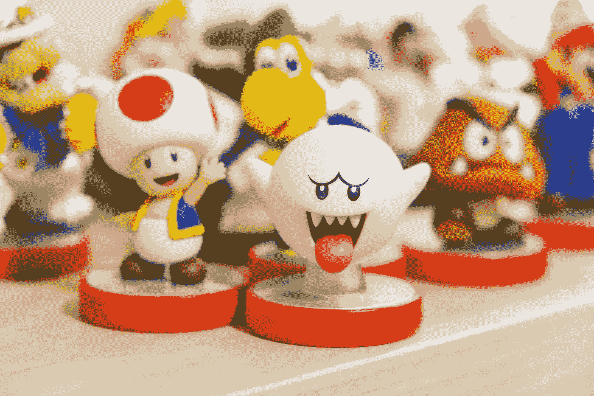

作为前端开发人员，我们经常被要求为我们的 web 应用程序设计一个简洁而有吸引力的 UI。

现在有很多概念和技术需要了解:SCSS、响应式设计、网格布局和 Flexbox 等等。即使我们每天在工作中使用它们，我们通常只记得最常见的规则。

因此，为什么不在玩耍的同时练习这些概念，让学习过程变得有趣呢？

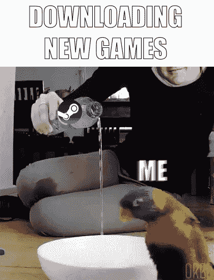

有几个在线游戏可以让我们训练我们的设计技能，并以一种有趣的方式让他们跟上时代。让我们一起来看看其中的一些。

# CSS 餐厅

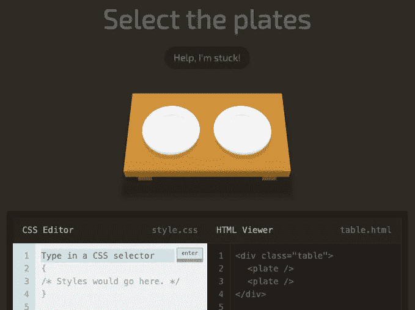

目标是使用 CSS 语句在屏幕上选择特定的 UI 元素。如果输入的规则是正确的，我们可以传递到下面的水平。总共有 32 级。
**免费** [我们来玩](https://flukeout.github.io/)

# CSS 网格花园

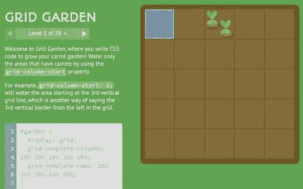

在这个游戏中，我们必须通过掌握 CSS 网格来浇灌胡萝卜作物。为了达到我们的目标，我们需要定义列、行和网格模板区域。
**免费** [我们来玩](https://cssgridgarden.com/)

# Gridcritters

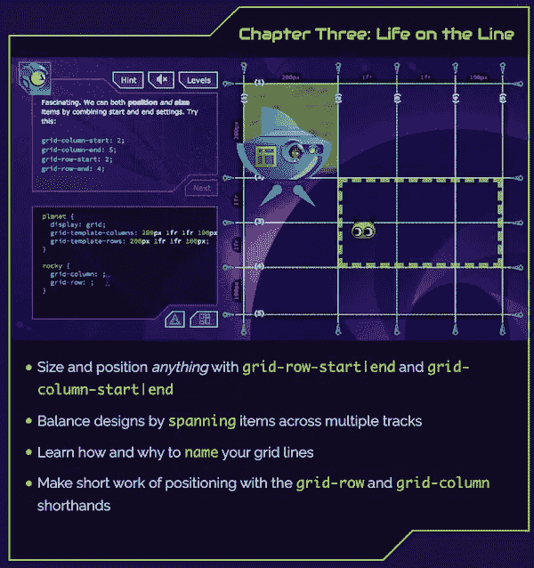

这个游戏是一个小小的设计杰作。我们需要使用我们的 CSS 网格技能来拯救外星生物免于灭绝！在每一级，必须满足更具挑战性的要求，才能成功进入下一阶段。

该游戏由前 IT 架构师 Dave Geddes 开发，现已完全转型为教育平台开发者。你可以在这里阅读这个项目背后的故事以及游戏主页使用的 CSS 网格规则。博文本身就已经很有信息量了！
**费用:179$** [我们来玩](https://www.gridcritters.com/)

# CSS 之战

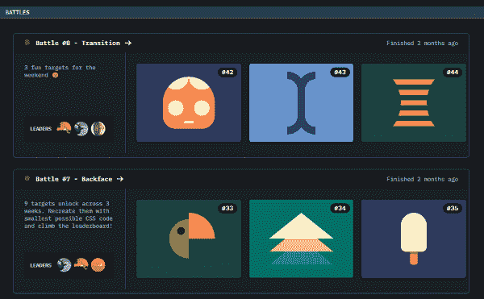

在 CSS 战中，我们必须用尽可能少的代码复制目标布局，我们可以与其他玩家竞争，以获得排行榜上的最高分。

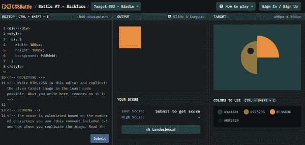

**免费** [我们来玩](https://cssbattle.dev/)
👉感谢@尼克·泰勒在评论中的建议！

# Flexbox 青蛙

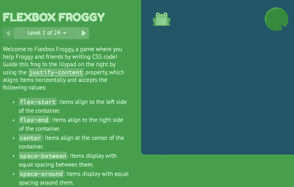

通过编写 CSS 代码来帮助青蛙和朋友！

> Flexbox Froggy 从经典街机游戏 Frogger 和 web literature 游戏(如精彩的 CSS Diner 和 Erase All Kittens)中获得灵感，在这些游戏中，您可以分别了解 CSS 选择器和 HTML 标记。

我们必须使用 CSS flexbox 指令把青蛙带回家。我们需要控制网页上元素的对齐、间距和换行来实现我们的目标。
**免费** [我们来玩](https://flexboxfroggy.com/)

# Flexbox 防御

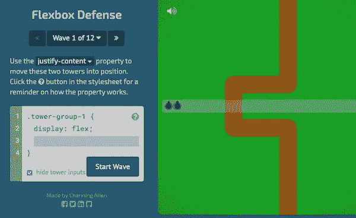

Flexbox defense 基于经典的塔防游戏，但是为了放置我们的物品，我们编写了 CSS 指令。我们使用主容器上的 justify-content 属性将单个塔移动到有效位置。
**免费** [我们来玩](http://www.flexboxdefense.com/)

# Flexbox 僵尸

这个游戏也是由戴夫·格迪斯设计的。在这里，我们使用 Flexbox 来定位英雄的十字弓，并在游戏中打击僵尸和生存。

看看戴夫在游戏发布会上使用的视频。同样在这种情况下，图形和故事真的是惊人的！

> *每一部分都解开了部分情节，让你对新的 flexbox 概念有了专业知识，并提出了僵尸生存挑战，迫使你巩固你的新技能，就像你的生命取决于它一样。*

**你还知道其他 CSS/设计类游戏吗？写在下面的评论里，我会把它们添加到上面的列表里。**

# 有用的参考资料

下面是一些资源，如果我们需要从基础开始学习，或者只是偶尔看看作为参考，我们可以访问这些资源。

# CSS 选择器

关于所有 [Css 选择器](https://www.w3schools.com/cssref/css_selectors.asp)以及如何应用它们的概述。

# 网格 CSS

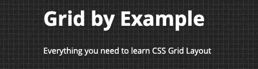

一个[全面收集](https://gridbyexample.com/learn/)资源(视频和例子)来学习 CSS 网格布局。

# Flexbox 布局

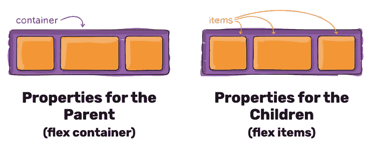

CSS flexbox 布局的可视化指南(我认为是最好的指南之一)。本指南重点关注父元素(flex 容器)和子元素(flex 项目)的所有不同的可能属性。
[链接](https://css-tricks.com/snippets/css/a-guide-to-flexbox/)

*原载于 2019 年 11 月 15 日*[*https://dev . to*](https://dev.to/paco_ita/train-your-css-skills-with-online-games-4ah3)*。*