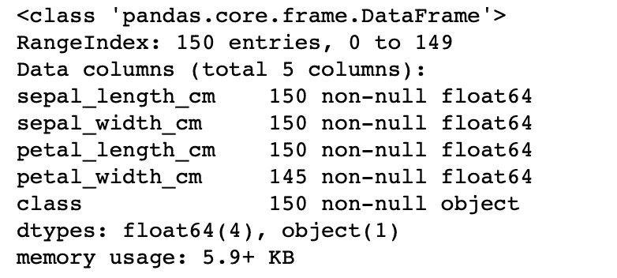
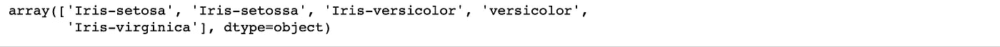
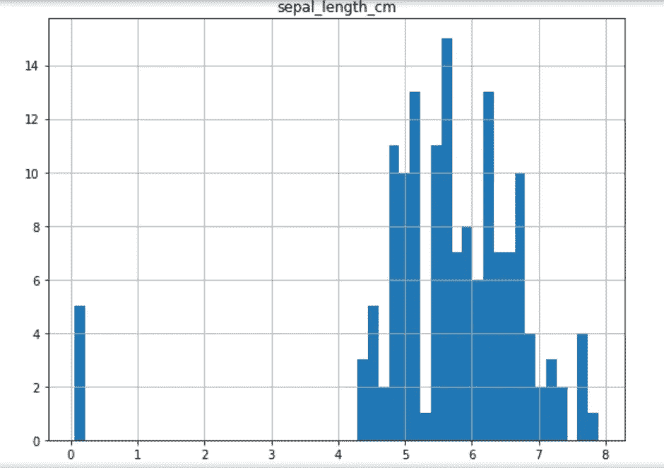
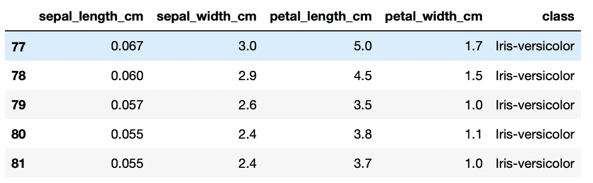
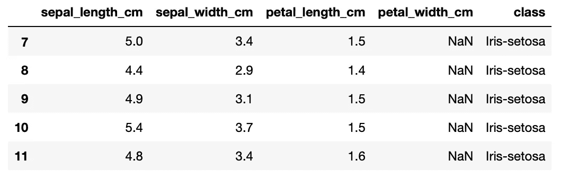
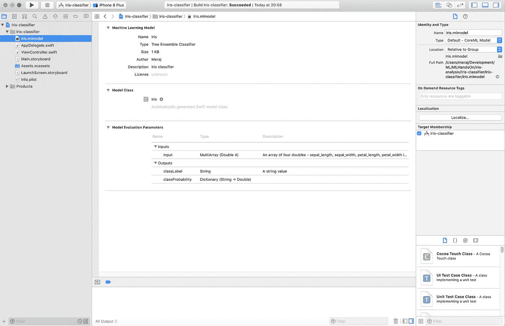
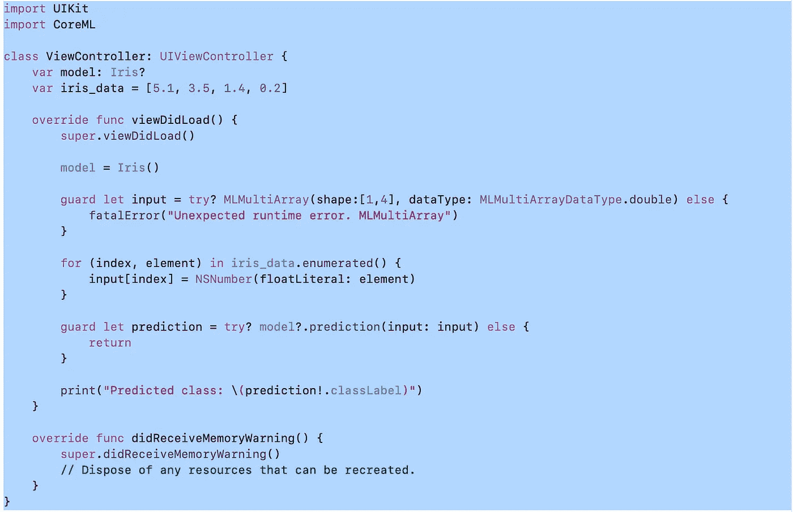

# 使用 Scikit 训练您自己的 ML 模型，并在 iOS 应用程序中使用 CoreML(可能还有增强现实)

> 原文：<https://itnext.io/train-your-own-ml-model-using-scikit-and-use-in-ios-app-with-coreml-and-probably-with-augmented-99928a3757ad?source=collection_archive---------1----------------------->

在本文中，我们将从零开始训练一个机器学习模型，将其转换为 CoreML 模型，最后使用生成的 CoreML 模型编写一个简单的 iOS 应用。本文的重点绝不是开发一个完美的模型，而是展示我们如何实际使用一个训练好的模型。我们假设读者对 Scikit 和机器学习基础有些熟悉。

数据集来自[1]，模型开发部分松散地基于[1]。

# **列车 ML 模型**:

为了给出数据的一些概述，该数据集表示用于区分不同鸢尾花的特征。首先，我们将加载数据集并检查各种属性。

下面的代码用于加载数据集—

> 进口熊猫作为 pd
> 
> iris _ data = PD . read _ CSV(' iris-data . CSV ')
> iris _ data . head()

**head()** 方法将显示如下前五个数据帧，其中显示了各种虹膜类型的四个特征和一个类别

前 5 个数据帧

info()方法用于快速获取数据描述—

> iris_data.info()

关于数据的信息

从打印的信息中，我们可以看到总共有 150 行。此外，花瓣宽度厘米有 145 个条目，这意味着一些值丢失。我们稍后会处理这件事。

我们试着用——

> iris_data['class']。唯一()

输出—

Iris 类(有拼写错误)

从输出我们可以看到有一些错别字。应该有三类虹膜，但我们看到的是五类。我们用下面的代码纠正了错别字—

> Iris _ data . loc[Iris _ data[' class ']= ' versicolor '，' class ']= ' Iris-versicolor '
> Iris _ data . loc[Iris _ data[' class'] = 'Iris-setosa '，' class ']= ' Iris-setosa '
> 
> iris_data['class']。唯一()

这一次的输出和预期的一样，有 3 个类—

修复后的虹膜类别

接下来，我们用下面的代码绘制数据—

> %matplotlib inline
> 将 matplotlib.pyplot 作为 plt 导入
> 
> iris_data.hist(bins=50，figsize=(20，15))
> plt.show()

图 **sepal_length_cm** 显示了一些缺失值——

sepal_length_cm 显示缺失值

为了找出哪里出错了，我们用下面的代码检查数据—

> Iris _ data . loc[(Iris _ data[' class ']= ' Iris-versicolor ')&
> (Iris _ data[' sepal _ length _ cm ']<1.0)]

输出显示这些条目使用了一些错误的数据单位——

萼片长度厘米的单位错误

数据收集中的这一错误随后由以下代码修复(乘以 100 以转换为 cm) —

> Iris _ data . loc[(Iris _ data[' class ']= ' Iris-versicolor ')&
> (Iris _ data[' sepal _ length _ cm ']<1.0)，
> 'sepal_length_cm'] *= 100.0

接下来，我们用下面的代码检查输入中是否有任何 N/A 值—

> iris _ data . loc[(iris _ data[' sepal _ length _ cm ']。is null())|
> (iris _ data[' sepal _ width _ cm ']。is null())|
> (iris _ data[' petal _ length _ cm ']。is null())|
> (iris _ data[' petal _ width _ cm ']。isnull())]

这表明数据中有一些 **NaN** 值—

数据中的 Nan 值

我们使用一个**估算器**来修正他的 NaN 值，以使用中值填充所有的 **NaN** 值。由于，**类**数据是字符串，我们将其从估算器中排除——

> 预处理导入输入器
> 
> imputr = imputr(missing _ values = " NaN "，strategy = " median ")
> iris _ data[[' sepal _ length _ cm '，' sepal_width_cm '，
> ' petal_length_cm '，【petal _ width _ cm ']]= imputr . fit _ transform(iris _ data[[' sepal _ length _ cm '，' sepal_width_cm '，' petal _ length _ cm '，【T10]' petal _ width _ cm '])

现在我们的数据已经准备好了，我们将训练和测试数据集分离如下—

> 从 sklearn.model_selection 导入训练 _ 测试 _ 拆分
> 
> all_inputs = iris_data[['萼片 _ 长度 _ 厘米'，'萼片 _ 宽度 _ 厘米'，【T11'花瓣 _ 长度 _ 厘米'，'花瓣 _ 宽度 _ 厘米']]。值
> all _ labels = iris _ data[' class ']。价值观念
> 
> X_train，X_test，y_train，y_test = train_test_split(所有输入，
> 所有标签，分层=所有标签，随机状态=42)

我们用训练数据训练了一个 RandomForestClassifier，它在训练数据上的得分是. 99107，在测试数据上的得分是. 92105

> 从 sklearn.ensemble 导入 RandomForestClassifier
> 
> forest _ classifier = RandomForestClassifier()
> forest _ classifier . fit(X _ train，y_train)
> 
> forest _ classifier . score(X _ train，y_train)

接下来，我们运行 **GridSearch** 和 **CrossValidation** ，以找到最佳参数来提高训练模型的准确性

> 从 sklearn.model_selection 导入 GridSearchCV
> 
> param _ grid =[
> { ' n _ estimators ':[3，10，30，100]，' max_features': [1，2，4]}
> ]
> 
> grid _ search = GridSearchCV(forest _ classifer，param_grid，cv = 5)
> grid _ search . fit(X _ train，y _ train)
> grid _ search . best _ params _
> grid _ search . best _ estimator _

因此，我们的模型精度提高到了 0.94736—

> forest _ classifier = grid _ search . best _ estimator _
> forest _ classifier . score(X _ test，y_test)

我们不会尝试在数据上应用 Scaler 或使用其他算法来提高准确性，我们将在这里停下来，将我们的模型转换为 CoreML 模型。

# **将 ML 模型转换为 CoreML:**

在这个阶段，我们有一个训练有素的模型。我们将其转换为 CoreML 模型。目前，CoreML 仅与 Python 2.7 兼容，并不支持所有 Scikit 模型。您可以在这里阅读 Python 模块[https://pypi.org/project/coremltools/](https://pypi.org/project/coremltools/)的安装说明

转换成 CoreML 模型的代码非常简单，如下所示

> 导入 coremltools
> 
> **coreml _ model = coremltools . converters . sk learn . convert(forest _ classifier)**
> 
> coreml_model.author = "Meraj "
> 
> coreml _ model . input _ description[" input "]= "四个双精度值的数组 sepal _ length，sepal_width，petal_length，petal _ width in cm "
> coreml _ model . output _ description[" class label "]= "一个字符串值"
> coreml _ model . short _ description = " Iris classifier "
> 
> coreml _ model . save(' iris . ml model ')

粗体行转换模型，其余行用于设置模型中的作者、输入、输出和描述字段。最后，我们使用 **save()** 方法将模型保存在 **Iris.mlmodel** 文件中。

# **在 iOS 中使用 CoreML 模型:**

下一步是使用 iOS 应用程序中生成的 CoreML 模型进行预测。为此，我们创建一个示例 Xcode 项目，并将模型文件 Iris.mlmodel 添加到该项目中。我们可以从 Xcode 中看到关于我们模型的各种信息。

Xcode 中的虹膜模型

使用该模型所需的 iOS 代码很少。它有意保持简单，专注于模型的使用。完整的代码在下面—

使用 Iris 模型的 iOS 代码

我们将样本数据存储在 **iris_data** 数组中，并使用该数组构建一个 **MLMultiArray** 输入对象——

> 警卫让输入=试试？MLMultiArray(shape:[1，4]，dataType:mlmultiarraydatatype . double)else {
> 
> fatalError("意外的运行时错误。MLMultiArray”)
> 
> }
> 
> iris_data.enumerated() {
> 
> input[index]= ns number(float literal:element)
> 
> }

并使用得到的数组进行预测——

> 守卫让预测=试试？模特？。预测(输入:输入)else {
> 
> 返回
> 
> }
> 
> print("预测类:\(预测！。classLabel)")

上述代码显示的输出—

**预测类:鸢尾花**

完整的模型训练代码可以在这里看 Jupyter 笔记本—[https://github . com/imeraj/machine learning/blob/master/MLHandsOn/iris-analysis/iris-analysis . ipynb](https://github.com/imeraj/MachineLearning/blob/master/MLHandsOn/iris-analysis/iris-analysis.ipynb)

完整的 iOS 应用可以从这里下载—[https://github . com/imeraj/machine learning/tree/master/MLHandsOn/Iris-analysis/Iris-classifier](https://github.com/imeraj/MachineLearning/tree/master/MLHandsOn/iris-analysis/Iris-classifier)

# ***一些想法* :**

你也许可以扩展 iOS 应用程序，使用增强现实(AR)来测量鸢尾花的活体特征，并将测量结果直接输入模型，以获得动态预测:)

我不是机器学习方面的专家，但我希望这篇文章能帮助一些读者。如果你喜欢这篇文章，请关注我这里或者上 [*推特*](https://twitter.com/meraj_enigma) *别忘了鼓掌；)*

# **参考文献**:

[1][http://nb viewer . jupyter . org/github/rhi ever/Data-Analysis-and-Machine-Learning-Projects/blob/master/Example-Data-science-notebook/Example % 20 Machine % 20 Learning % 20 note book . ipynb](http://nbviewer.jupyter.org/github/rhiever/Data-Analysis-and-Machine-Learning-Projects/blob/master/example-data-science-notebook/Example%20Machine%20Learning%20Notebook.ipynb)