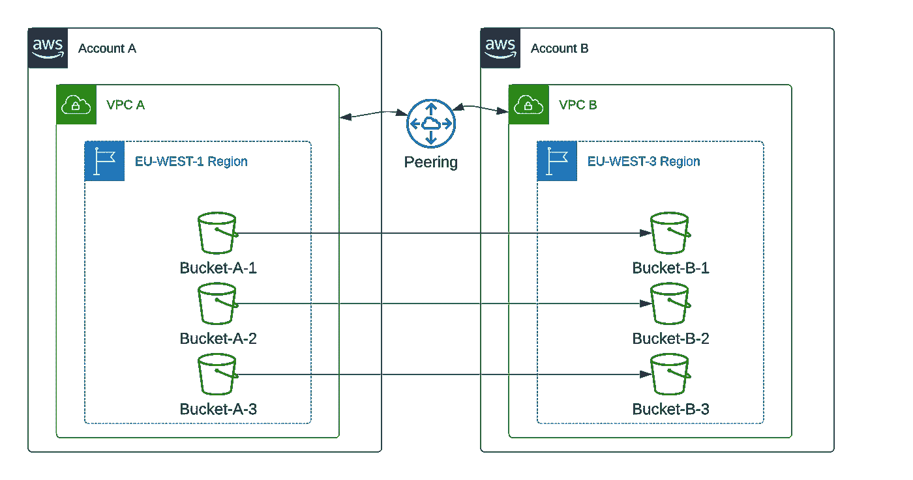
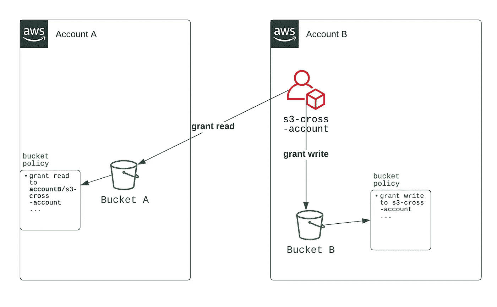
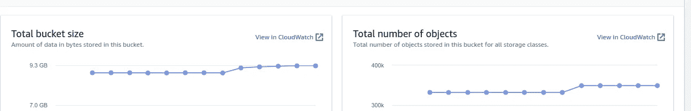
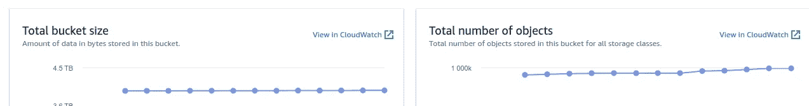
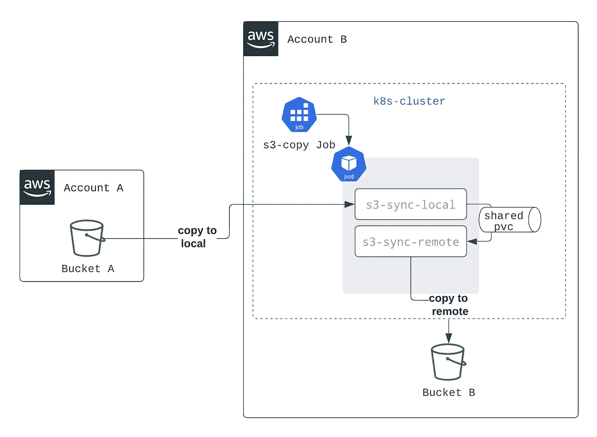
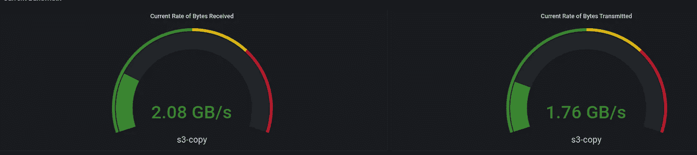

# 在 AWS s3 存储桶之间跨客户、跨地区和跨 vpc 传输数 TB 的数据

> 原文：<https://itnext.io/transfer-terabytes-of-data-between-aws-s3-buckets-cross-account-cross-region-and-cross-vpc-ccdbec15e53?source=collection_archive---------0----------------------->

在将我们的基础设施迁移到 Kubernetes 时，我们有多个 s3 存储桶要从我们的旧基础设施迁移到新基础设施。

这个博客的目的是向你展示我们对最终实现的解决方案所做的不同实验。如果您对 Kubernetes 如何帮助我们完成这项工作感兴趣，您可以直接阅读“处理更大的水桶”

# 背景:

为了理解任务的复杂性，我画了下面的架构图:



如图所示，我们在帐户 A 中有 3 个存储桶(bucket-A-*)，位于虚拟私有云 A 中，托管在爱尔兰地区(EU-西 1)。相反，我们在虚拟私有云 B 的账户 B 中有 3 个空桶(bucket-B-*)，托管在巴黎地区(EU-西-3) **。**

**目标是将桶 A 中的所有数据转移到桶 b 中。**

我们在此次迁移中面临的多重挑战:

*   两个存储桶都受到存储桶策略的保护
*   桶 A 包含大量的小文件
*   要传输的总数据量是 10 到
*   不同的账户、不同的 vpc 和不同的地区使得操作变得复杂
*   目的桶是**加密的**

**为了简化文章操作，我们将对每个帐户只使用一个 bucket:bucket-A 和 bucket-B。如果您处理多个 bucket，您会发现一些工业化流程的技巧。**

# 先决条件

> 我们将假设桶目的地(桶-b)被创建并且是空的

**请求权限准备操作:**

要创建 s3cross-account 用户帐户并相应地添加适当的权限，您首先需要一个 admin 帐户来管理它。

**如果您拥有帐户 A 和 b 的管理员权限，您可以跳过这一部分。**

如果您不能访问管理员帐户，您至少可以请求帐户 A 和 B 的管理员访问:

*   完全访问存储桶-A
*   完全访问桶-B
*   在帐户 B 中创建 IAM 用户的权限

## 创建 S3 跨帐户 IAM 用户:

第一步是创建用户并设置所需的权限，以确保存储桶之间的转移。该用户帐户将在存储桶 A 上以只读方式访问，在存储桶 b 上以读写方式访问。

用户帐户需要在帐户 b 中创建。**我们假设您知道如何在 AWS 控制台上创建 IAM 用户帐户。**

由于我们的存储桶受存储桶策略和 IAM 用户策略的保护，授予 S3-交叉帐户的权限将分为两部分:

1.  **从用户角度授予对两个存储桶的访问权限**将保证帐户可以访问存储桶(下图中的黑色箭头)
2.  **从存储桶策略**授予对两个存储桶的访问权限将允许存储桶授权帐户进行更改。(下图中绿色的存储桶策略)



## 创建 S3-跨帐户用户的策略:

在 S3-交叉帐户用户的策略上，创建两个内联策略:


> 如果您要处理多个要传输的 bucket，我建议您向所有 bucket-B 授予“Resource”:“arn:AWS:S3:::bucket-B-*”的访问权限。对于 bucket-A-*来说，你需要一个接一个地手工编写它们。

您可以注意到，bucket B 策略授予对 KMS 密钥的访问权限，以允许 s3 跨帐户用户将加密文件放入 bucket。如果不使用加密，可以删除 grantKMSkey 部分。

> 请注意，您不能将任何未加密的文件放入加密的 s3 存储桶中。您将看到“权限被拒绝”的错误。

## 更改存储桶的策略:

下一步是从存储桶的角度授予 S3-交叉帐户。

在**存储桶 A** 上添加以下存储桶策略(存储桶策略在权限选项卡下):

在**时段 B，**添加以下时段策略:

> 对于多个存储桶的修改，您可以使用这个[脚本](https://gist.github.com/ilyesAj/db76562a158a34e809d1c97a4f7bf635)来自动修改多个存储桶上的策略，而不需要逐个手动访问它们。

**权限抽测:**

在配置了您的 S3-交叉账户用户的访问密钥和秘密密钥之后(如果您不熟悉这个过程，您可以看看这里的)

我们现在可以测试用户是否拥有正确的权限。您可以执行以下操作:

```
# test bucket A access
$ aws s3 ls --profile s3-prod-cross-account s3://bucket-A --region eu-west-1
$ aws s3 cp --profile s3-prod-cross-account s3://bucket-A/some-file . --region eu-west-1
-> some-file downloaded locally# test bucket B access
$ aws s3 ls --profile s3-prod-cross-account s3://bucket-B --region eu-west-3
$ touch dummyfile
$ aws s3 cp --profile s3-prod-cross-account ./dummyfile s3://bucket-B --region eu-west-3
-> dummyfile uploaded to s3
```

> **当您尝试这些命令时，确保配置文件和区域的名称是正确的。**

现在我们准备好了，我们可以开始转移了。

# 传输数据:

正如我提到的，我们要处理数万亿字节的数据和数千个文件。我们有些桶只有千兆字节的数据，有些桶有兆兆字节。

本节旨在向您介绍我们已经测试过的不同解决方案。解决方案没有好坏之分；这取决于您的架构&存储桶的大小和对象的总数。

## 处理小桶:

处理小桶并不意味着复制会很快。对象的数量也很重要，因为它可以将复制时间乘以 10。

这是我们必须复制的一个存储桶示例:



将存储桶从一个区域复制到另一个区域的通用命令是:

```
aws s3 cp --profile s3-prod-cross-account s3://bucket-source/ s3://bucket-target/ --source-region source-region --region target-region --recursive
```

如果我们认为存储桶 A 是一个小存储桶，您可以用以下公式复制它:

```
aws s3 cp --profile s3-prod-cross-account s3://bucket-A/ s3://bucket-B/ --source-region eu-west-1 --region eu-west-3 --recursive
```

您可以考虑一些优化来加快复制速度:

*   **复制命令“cp”而不是同步:**同步需要枚举桶内的所有文件来决定复制哪些文件。Copy 命令会将源存储桶的内容复制到目标存储桶。如果目标中存在该文件，它将被覆盖
*   **并行运行:**您可以在不同的终端中运行多个 awscli 实例，以提高传输速度。
*   **将运行分割成多个部分:**您可以使用“排除”和“包含”过滤器将您的桶分割成多个部分，并同时复制它们(进一步说明[此处](https://aws.amazon.com/premiumsupport/knowledge-center/s3-improve-transfer-sync-command/))。
*   **后台作业:**我建议总是使用“cronjobs”或“nohup”命令在后台作业上运行 AWS s3 副本

## 处理更大的铲斗:

在如此复杂的架构中处理更大的存储桶是迁移过程中的一个痛点(这也是促使我写这篇博客的原因)。这是我们转移的一个桶的例子。



**第一次运行**是从我的笔记本电脑上使用`aws cp`命令(像上一节一样)来执行复制。我给出的想法，因为它将需要几天的时间来完成与公布的速度复制。

**第二次运行时，**我试图最接近 AWS 基础设施；因为我们在帐户 B 上运行 Kubernetes 集群，所以我运行了一个带有 awscli 映像的作业，它将为我启动 cp 命令。你可以在下面找到这份工作的一个片段。

在这种方法中，我遇到了以下错误:

```
An error occurred (AccessDenied) when calling the CopyObject operation: VPC endpoints do not support cross-region requests
```

当深入研究这个问题时，我发现我不能从 vpc 内部进行复制，因为亚马逊 S3 的 [VPC 端点目前不支持跨区域请求。(正如我前面提到的，包含 bucket A 的 vpc-A 与包含 bucket B 的 vpc-B 有一个对等关系)。](https://docs.aws.amazon.com/vpc/latest/userguide/vpc-endpoints-s3.html#vpc-endpoints-policies-s3)

有多种解决方案可以解决这个问题:

*   通过从路由表中删除 VPC 端点，暂时禁用 VPC 端点。此过程将强制 awscli 通过 internet 传递，而不是使用 vpc 内部调用
*   创建一个没有 VPC 端点的新 VPC，并在那里启动 EC2。
*   启动一台既不在区域 A 也不在区域 B 的 EC2 机器

**在我们的设置中，没有一个解决方案是可行的；我们需要在不改变架构或增加资源的情况下进行迁移。**

**在第三次运行时**(就是那个好的！)，我基于这个[评论](https://stackoverflow.com/a/65184575/11436917)提出了我的解决方案，并将其调整为在 Kubernetes 上运行。

为了解释设置，您可以在下面找到一个模式:



我们已经创建了一个 pod(由一个作业控制),它包含两个带有共享文件夹的容器:

1.  s3-sync-local 会将文件从源存储桶(存储桶-a)复制到本地文件夹/数据
2.  s3-sync-remote 会将/data 中的文件移动到远程 bucket (bucket-b)。如果文件夹是空的，他将等待 5 秒钟，然后重新运行移动命令。如果文件夹在两次迭代中为空(10 秒睡眠),则 while 循环停止。)

> /data 是两个容器之间的共享文件夹，将用作缓冲区(s3-sync-local 具有写访问权限，s3-sync-remote 具有只读访问权限)。该文件夹在 kubernetes 一侧以 PVC 为背衬。您也可以使用 tempdir，但是您可能会使节点饱和(在 kubelet 端会有磁盘压力警告)

您可以在下面找到我使用的代码片段:

该解决方案的优势在于:

*   解决 vpc 跨区域限制
*   使用 Kubernetes 的强大功能同时自动复制存储桶
*   可以使用 cronjob 进行调度
*   只需要 bucket 总大小的 5%就可以复制整个 bucket(根据我的测试，对于一个 5，4tb 的 bucket，您将需要大约 250 Gb 的存储作为缓冲)
*   您可以使用 subpath 变量来创建同一个存储桶的多个并行运行

> 尽管有所有的优势，你需要考虑到这种方法会复制两次相同的文件(bucket-A -> pod -> bucket-B)，这**可能会导致网络饱和**。您还需要意识到，如果作业失败，您需要从头重新启动它。

## 最终结果:

对一个最大的木桶的真正考验:

*   文件总数:946 803
*   桶的总尺寸:4,391To
*   文件的大小是不同的；我们有 1ko 到 200ko 和 15Mb 到 30Mb 的文件。

该存储桶有十个主文件夹，其中包含多个子文件夹和对象。我创造了十份工作；每个作业处理一个主文件夹。这种采样帮助我加快了复制速度，并在作业失败时限制了影响。

**我用了 77 分钟复制了整个桶(~4To)！**

```
NAME                 COMPLETIONS   DURATION   AGEs3-copy-bucket-a      1/1           66m        22ds3-copy-bucket-a1     1/1           77m        22ds3-copy-bucket-a2     1/1           74m        22ds3-copy-bucket-a3     1/1           72m        22ds3-copy-bucket-a4     1/1           65m        22ds3-copy-bucket-a5     1/1           64m        21ds3-copy-bucket-a6     1/1           66m        22ds3-copy-bucket-a7     1/1           67m        22ds3-copy-bucket-a8     1/1           77m        22ds3-copy-bucket-a9     1/1           74m        22d
```

正如我之前所说的，您需要监控这个操作的网络，因为它可能会使您的网络饱和。这是我复制时的流量快照:



> **替代解决方案(AWS 管理):**当我写这篇博客时，我发现您可以使用[这篇博客](https://aws.amazon.com/blogs/storage/replicating-existing-objects-between-s3-buckets/)来测试它作为复制跨帐户跨区域的可能解决方案。

# 最后的想法

尽管最终的解决方案需要耗费大量的网络资源，但结果非常令人满意。我们能够优化跨地区、跨 VPC 和跨帐户的数据传输，从几天缩短到几个小时。

AWS 最近宣布[亚马逊 S3 跨区域复制(CRR)](https://aws.amazon.com/s3/features/replication/#Amazon_S3_Cross-Region_Replication_.28CRR.29) [现在](https://aws.amazon.com/blogs/aws/new-replicate-existing-objects-with-amazon-s3-batch-replication/)支持复制现有对象。这项服务可能是一个替代解决方案。请务必估计转移成本，因为账单可能会呈指数增长。

## 参考资料:

*   [https://AWS . Amazon . com/blogs/security/how-to-restrict-Amazon-S3-bucket-access-a-specific-iam-role/](https://aws.amazon.com/blogs/security/how-to-restrict-amazon-s3-bucket-access-to-a-specific-iam-role/)
*   [https://AWS . Amazon . com/premium support/knowledge-center/S3-trouble shooting-copy-between-bucket/](https://aws.amazon.com/premiumsupport/knowledge-center/s3-troubleshoot-copy-between-buckets/)
*   [https://AWS . Amazon . com/premium support/knowledge-center/S3-improve-transfer-sync-command/](https://aws.amazon.com/premiumsupport/knowledge-center/s3-improve-transfer-sync-command/)
*   [https://stack overflow . com/questions/39707923/AWS-CLI-copy-between-S3-regions-on-ec2](https://stackoverflow.com/questions/39707923/aws-cli-copy-between-s3-regions-on-ec2)