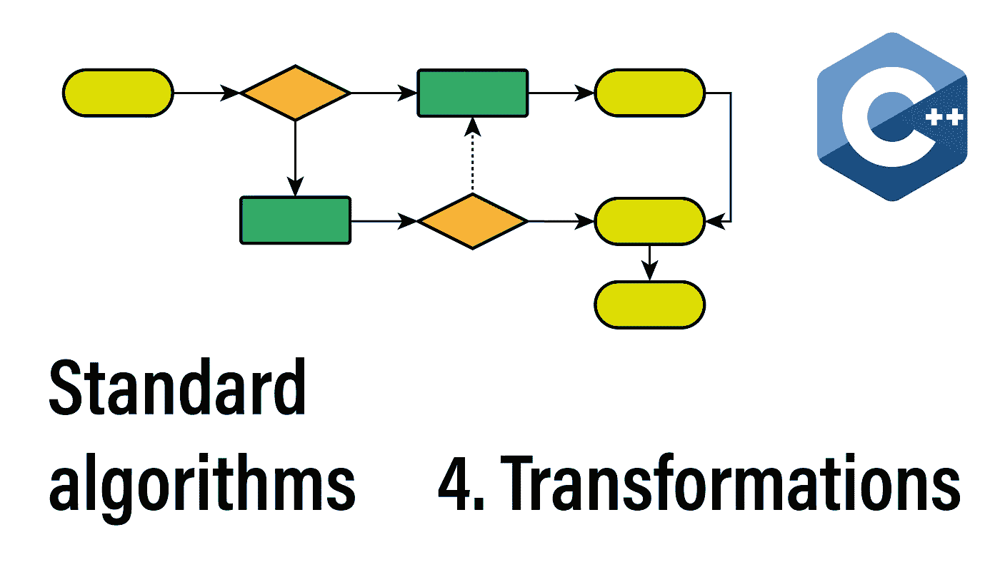
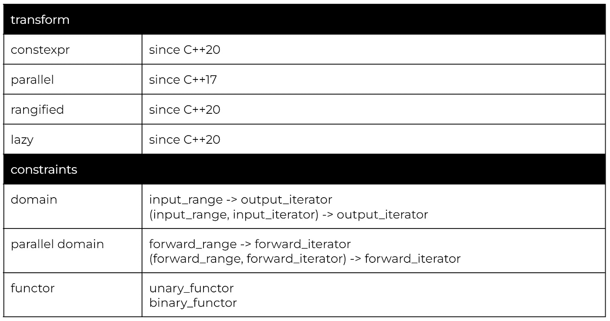
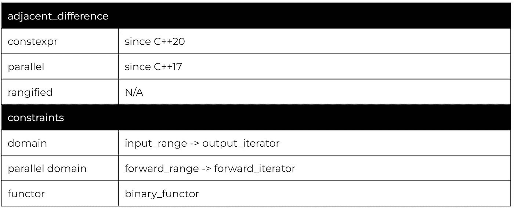
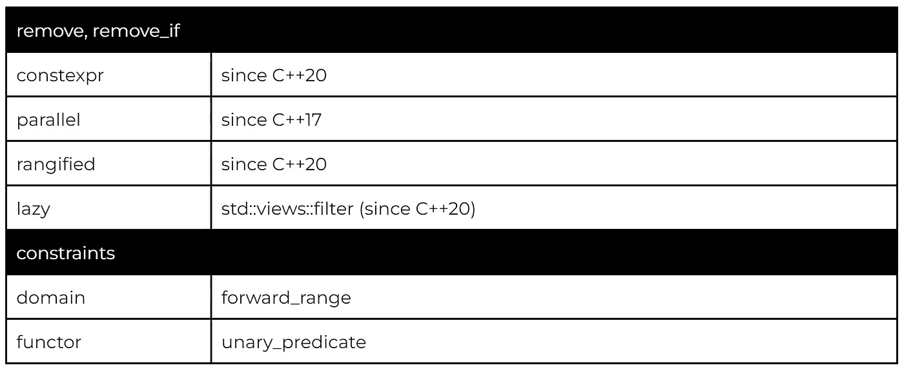
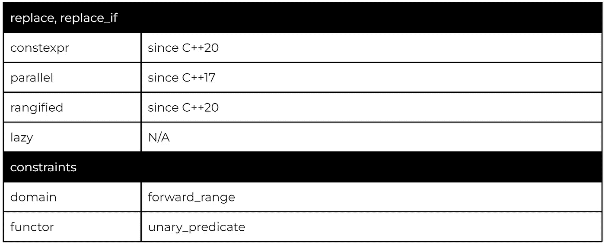
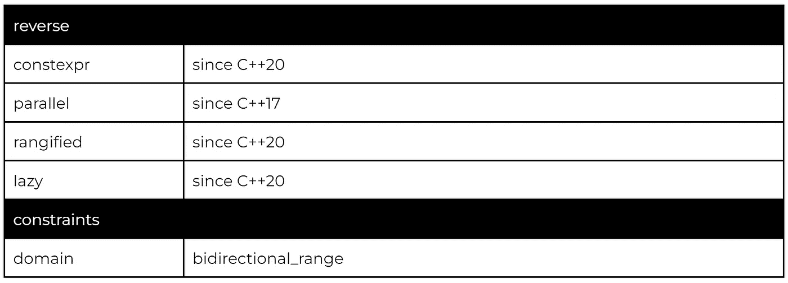
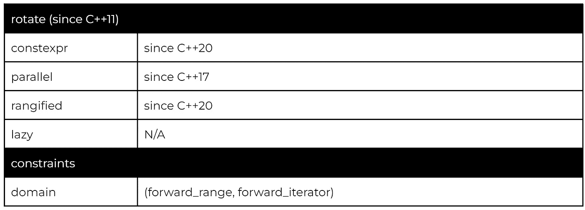
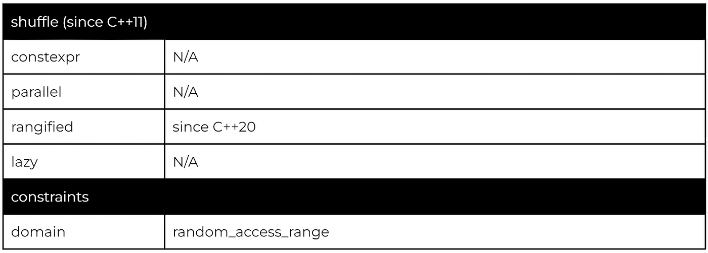
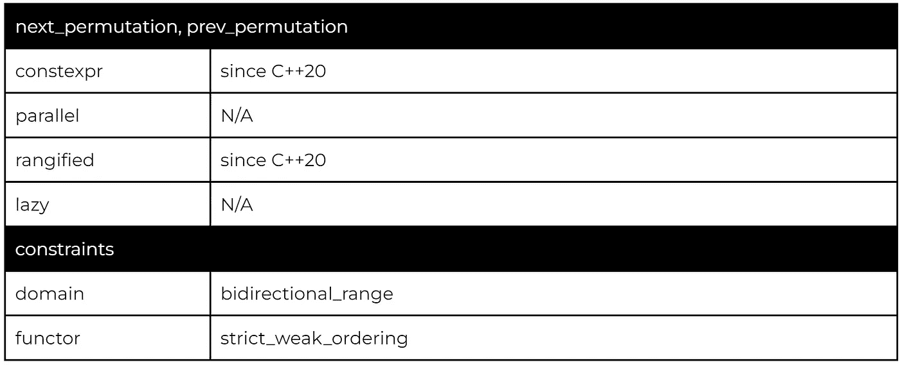
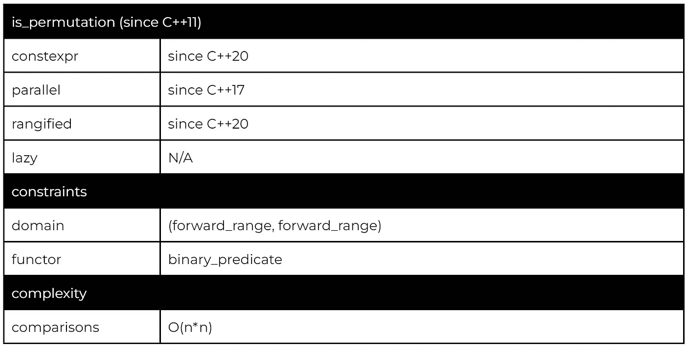

# 转换:114 C++算法系列

> 原文：<https://itnext.io/transformations-the-114-c-algorithms-series-deacdbd4c373?source=collection_archive---------2----------------------->

欢迎阅读 114 C++标准算法系列的第四篇文章。转换算法通过更改元素的值、更改元素的顺序或删除元素来改变范围的状态。

我们今天要讨论的几个转换算法也有惰性视图变体。视图是作为 C++20 中 [ranges 功能的一部分引入的标准算法的延迟评估和可组合变体。](/c-20-ranges-complete-guide-4d26e3511db0)

## 该系列:

*   [简介](/the-114-standard-c-algorithms-introduction-2a75a2df4300)
*   [排序和划分算法](/sorting-partitioning-the-114-c-algorithms-series-6503ad41cede)
*   [对排序或分区范围进行操作的算法](/divide-conquer-and-sets-the-114-c-algorithms-series-d0085a38046e)
*   转换算法
*   [左侧折叠和其他缩减](/left-folds-and-other-reductions-the-114-c-algorithms-series-6195724d324)
*   [生成器、复制和移动](/generators-copies-and-moves-the-114-c-algorithms-series-1d0774472877)
*   [堆和堆](/heap-and-heap-the-114-c-algorithms-series-1d4215ae9f0d)
*   [搜索和最小值-最大值](https://medium.com/@simontoth/8a6ed951ad40)
*   结论(即将发布)

# 改变

最直接的转换可能是对每个元素应用一个转换函数。

标准库提供了一元和二元 std::transform。

因为输出范围是使用迭代器指定的，所以两种转换算法都可以内联操作或输出到另一个范围。

对于这两个变量，所提供的函子不能使迭代器无效，也不能修改任何一个范围的元素。最重要的是，这两种转换都不能保证所提供的仿函数严格地从左到右应用(这只对有状态仿函数有影响)。

正是这些限制将一元 std::transform 与 std::for_each 区分开来。

该示例利用可变 lambdas(第 6 行和第 10 行)和来自 C++14 的通用 lambda 捕获，它允许在 lambda 的捕获部分创建和初始化变量。

Transform 也是我们谈到的第一个带有惰性变体的算法。C++20 引入了视图的概念作为范围功能的一部分。

我有一篇关于 C++20 范围的独立文章，也包含了视图。这里的主要要点是:

*   组合视图发生在编译时；第 5 行没有运行时操作
*   even_squares 对象本身就是一个视图；复制和移动的成本很低，并且不拥有它所查看的数据
*   视图的每个组件都被延迟评估；如果我们只从 even_squares 视图中读取一个元素，那么 views::filter 将被计算两次，而 views::transform 只被计算一次

# 相邻 _ 差异

尽管如此命名，但 adjacent_difference 是二进制转换的一种变体，对单个范围内的相邻元素进行操作。

与 transform 不同，adjacent_difference 保证从左到右应用。此外，因为输入范围允许每个元素仅被读取一次，所以该算法在内部存储最后读取值的副本(用作左操作数)。

默认版本将计算相邻元素的差异，复制第一个元素。

然而，由于我们可以选择不同的函子(而不是 std::minus)，我们也可以使用 std::adjacent_difference 来生成序列:

注意，输出范围的 std::next(data.begin())在这里很关键。adjacent_difference 算法将每个元素只读取一次，并记住左参数的前一次读取值。std::next 确保我们在任一参数之前生成一个元素。

# 移除，移除 _ 如果

remove 的命名有点误导。删除将移动范围中的元素，这样前导子范围将不包含指定的元素。

类似于 std::unique，该算法不能调整范围的大小，所以它返回一个迭代器来指定新的结束位置。

这种命名模式将在几种算法中重复。基本版本总是基于提供的值进行操作的变量(第 2 行)，_if 变量依赖于提供的谓词(第 7 行)。

虽然 remove 没有直接的惰性版本，但我们通常可以用 std::views::filter 替换它。

一个显著的区别是，views::filter 改变了范围的迭代方式，但不修改范围的实际内容。

# 替换，替换 _ 如果

我们可以使用替换算法来替换值，而不是删除它们。

遵循相同的命名模式，std::replace 替换匹配给定值的元素，而 std::replace_if 基于谓词替换元素。

# 反转、旋转、洗牌

反向算法提供了给定双向范围的直接基于交换的反向。

虽然只有 C++20 引入了 reverse 的视图版本，但是每个双向范围本身都支持通过 begin()和 end()迭代器的 rbegin()和 rend()变体进行反向迭代。

当处理 C 数组或字符串等遗留类型时，反向迭代可能会很笨拙。然而，我们可以依靠 std::span(从 C++20 开始)和 std::string_view(从 C++17 开始)，它们都提供双向支持。

反向算法也为我们展示更高级的视图组合提供了一个极好的地方。例如，以下是跳过前导和尾随空白的修剪视图:

和前面的例子一样，第 4–7 行没有运行时计算，处理是按需完成的，因为 std::copy 算法在组合视图上迭代(第 10 行)。

我们从一个为空白字符返回 true 的谓词开始(第 4 行)。然后我们使用 drop_while 视图，该视图跳过元素，直到谓词返回 false(第 5 行)。这已经是我们的单向修剪了。

为了构造反向修剪，我们反转范围，修剪现在的前导空白，然后再次反转范围(第 6 行)。最后，完全微调是两个部分微调操作的简单组合。

rotate 算法正是这样做的，它旋转该范围内的元素，使得指定的元素现在是该范围的第一个元素。

shuffle 算法是现已失效的 random_shuffle 算法(在 C++14 中已弃用，在 C++17 中已删除)的后续算法，并依赖于 C++11 中添加的新随机工具。

随机设施超出了本文的范围。然而，混洗将与任何统一随机位发生器一起工作。

我们使用 std::generate 算法(我们将在下一篇文章中讨论)来生成 52 个唯一的卡片(第 21 行)。生成后，卡片将按顺序排列。

然后，我们使用 Mersenne Twister 引擎统一位生成器(在其 32 位预定义别名中)，我们将它传递给洗牌算法，从而产生随机洗牌范围。

第 4–17 行的输出流操作符重载提供了从索引到文本表示的转换，例如“梅花 j”。

# 下一个置换，上一个置换，下一个置换

置换算法将按字典顺序生成下一个或前一个置换。

严格地说，调用 next_permutation 将调整元素的顺序，使其成为下一个更高的值(使用相同的仿函数)。如果没有这样的范围，next_permutation 将循环回到最低值并返回 false。

当与一系列布尔值一起使用时，next_permutation 可以用来迭代特定大小的所有集合。

我们从一个用假值填充的范围开始，将前三个元素设置为真(第 6 行)。然后我们打印出对应于真实值的元素(第 10 行)。最后，一旦我们将前三个元素设置为 true(第 14 行)，循环回到初始范围，prev_permutation 将返回 false。

最后，为了检查一个范围是否是另一个范围的排列，我们可以使用 is_permutation 算法。

is_permutation 的效用主要在测试中弹出，我们经常需要测试两个值域是否分段相等但不一定同阶。

# 感谢您的阅读

不要忘记关注，这样你就不会错过本系列的其他文章。例如，下一篇文章将讨论归约，即把一个范围归约为单个值的算法。

我也在 YouTube 上发布视频。你有问题吗？在[推特](https://twitter.com/SimonToth83)或 [LinkedIn](https://www.linkedin.com/in/simontoth) 上联系我。