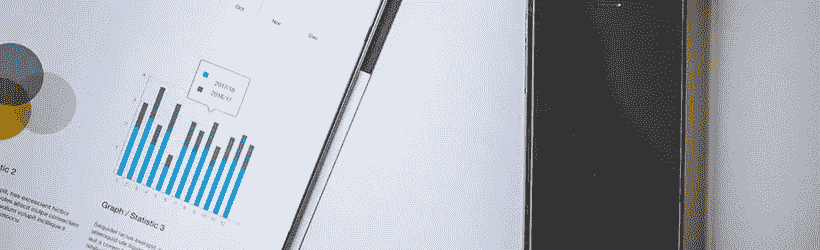

# 通过分析将数据转换为有意义的见解

> 原文：<https://itnext.io/transformeren-van-data-naar-betekenisvolle-inzichten-met-behulp-van-analyse-697772d6ddbf?source=collection_archive---------6----------------------->

这是智能数据系列的第四篇文章。系列中的其他文章如下所示:

> *# 1*[关注更多数据还是更聪明地使用现有数据？大数据与智能数据](/focussen-op-meer-data-of-slimmer-gebruik-van-bestaande-data-big-data-vs-smart-data-5b9a306c873f)
> 
> #2、[智能数据以](/smart-data-begint-met-een-strategie-9b5ade9062c1?source=user_profile---------3----------------)策略开始
> 
> #3、[数据只是数据。从指标和智能问题中获得战略优势](/data-is-slechts-data-behaal-strategisch-voordeel-met-metrics-en-smart-questions-580a87c22887)
> 
> # 5:[利用强大的报告功能充分发挥大数据的潜力](/benut-het-volledige-potentieel-van-big-data-met-behulp-van-krachtige-rapportages-1c27ca0b121e?source=user_profile---------0----------------)

为了发挥大数据的潜力，首先要制定一项 t10 战略 t11。一旦制定了明确的战略，就很清楚组织要实现的目标。这些目标又一次明确了哪些 t12 度量可用，以及需要收集哪些数据。但是，有数据是不够的！我们面临的挑战是，通过分析，将这些数据转变为有意义的“业务洞察力”，这有助于记录策略并持续改进组织的性能。本文的第四篇文章，在以《T14 智慧型资料模型》T15 为基础的系列中，[伯纳 Marr](https://www.linkedin.com/in/bernardmarr/) 是关于应用分析的《a》。

# 分析的进化

数据和分析是并行的。如果不采取行动，收集数据就毫无意义。因此，分析功能随着数据的增长而扩展，这一点也不奇怪。存储和计算能力的改进使您能够访问以前无法使用的数据集。此外，网络容量不断增加，并使现代软件(如“t0”Hadoop)能够将数据分析分解为碎片，从而使大型数据集能够进行碎片分析。在以前只能使用 SQL 查询分析结构化数据的地方，现在可以分析多种结构化和非结构化数据格式，如文本、音频、视频和图像。从这里获得的见解本身可能很有意思，但当不同的数据集和分析结合在一起时，真正的增值才会显现出来。

# 分析的一般形式

可以区分不同类型的分析。常见的三种类型包括:

*   文本分析
*   语音分析
*   视频和图像分析

## 文本分析

正如名字所猜测的，这是从文本中获取信息和见解的过程。
对于人们来说，虽然文本文档是结构化和合乎逻辑的，但从分析的角度来看，这与系统是相反的。他们最初看到的是不一致的单词。全新的文字分析功能，让您获得前所未有的洞察力。发现文本中的模式和趋势对组织来说是很有价值的。一个很好的例子是垃圾邮件过滤器，它越来越能够根据文本对传入的电子邮件进行分类。另一个例子是识别语言，甚至正确解读它。语言本身可能是相当模糊的，有时单词有多种含义。通过分析文字字符串并将其归类为“肯定”或“否定”，可以将文字放在特定的上下文中，然后使用该上下文来测量产品或服务周围的情感。社交媒体兴起后，这些技术变得越来越流行。

## 语音分析

像文字一样，现在也可以分析录音和对话。同样地，将声音放在正确的情绪环境中也是一项挑战。通过分析音高、语调、说话量和安静程度，可以推断出某个人是快乐、愤怒还是悲伤。现在，当您致电客户服务以进行培训时，您有多少次听不到“此呼叫可被录音”的声音？录制的对话确实可以用于此目的，但同时也提供了对产品或服务的有用见解。实时聊天分析还通过识别某些“关键字”或短语迅速发展。与文本分析一样，语音分析不仅通过分析“说”来提供价值，还通过分析“说”的方式来提供价值。这种发展可以大大加强预防犯罪和欺诈。想像一下警方在审讯时会如何处理语音分析

## 视频和图像分析

对于企业来说，过去的视频和图像数据主要由安全摄像头的图像组成。这些系统会持续记录，当磁带已满时，会再次被复盖。在那段时间里你还需要一个仓库来存放所有的磁带。这一切都是因为现今的储存装置而改变的。分析视频和图像依赖于人们分配的标签。比如说，你还在 YouTube 上搜索视频。通过最新的视频分析工具，您可以逐场景地浏览视频，以便“读取”视频，然后执行某些操作。这种类型的视频分析已应用于:

*   面部识别:自动身份验证
*   行为分析:分析人们在商店前的行为
*   形势评估:危险情况或犯罪时发出警告

# 建立分析

与数据一样，该值不仅仅存在于一个数据集中。只有在组合和分析不同的数据集时，才能发挥全部潜力。这有助于提高销售业绩、提高流程效率、防止损坏或欺诈，甚至挽救生命。这些发展也有一个方面，主要是隐私方面。在你可能没有注意到的情况下，你会在你的生活中留下一条[数字轨道](https://www.linkit.nl/knowledge-base/286/Google_Facebook_make_our_lives_easier_but_at_what_cost)。因此，[剑桥大学](https://www.cam.ac.uk/)和[微软研究实验室](https://www.microsoft.com/en-us/research/lab/microsoft-research-cambridge/)的研究人员根据 facebook likes 做出了一些有趣的个人预测，这些预测值得[阅读！](http://www.pnas.org/content/110/15/5802.full.pdf)