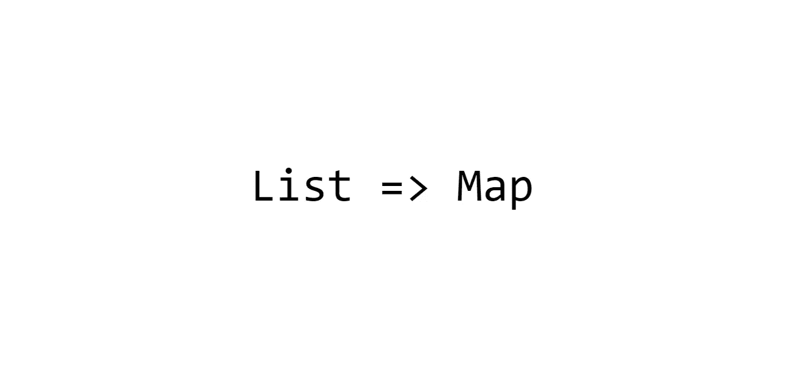

# 使用 Java Stream API 将列表转换为映射

> 原文：<https://itnext.io/transforming-lists-into-maps-using-java-stream-api-b29ef743b440?source=collection_archive---------0----------------------->

## 令人印象深刻的将列表转换成地图的便捷 API



源数据通常以列表的形式存储。例如，关系数据库的表或 Excel 文件就是一列行。当源数据被处理以最终可视化时，地图可能经常被用作中间或最终的数据结构。

Java 有一个令人印象深刻的流 API，它使得列表到映射的转换成为一项简单的任务。Java 流不能比`for`-循环做得更多或更快，但是使用 stream API 的代码通常会更短、更易读。在这篇文章中，我回顾了将流转换成地图的合理方法。

从一个`Stream`返回一个`Map`有四种简单的方法。由 `Collectors`类的重载方法`toMap()`、`groupingBy()`或`partitioningBy()`产生的收集器可以在终端方法`Stream.collect(collector)`内部使用。它的形式`collect(supplier, accumulator, combiner)`可以不使用任何收集器直接返回一张地图。因此，根据变换的不同，可能有几种生成地图的方法。这些选项在代码大小上可能略有不同。

为了说明这篇文章，我使用了由 15 个不同的`Player`对象组成的`List`。每个玩家都有唯一的用户名、性别、分数，并且属于一个团队:

`public record Player(String name, String sex, int score, String team) {}`

我导入了`Collectors`类的所有静态方法，这样这些方法就不必以类名为前缀，这样代码就更有意义了:

`import static java.util.stream.Collectors.*;`

## 包含产生唯一键的所有元素的列表

这种映射通常用于连接两个实体列表。

使用`toMap(keyMapper,valueMapper)`收集器可以生成将 id 链接到对象的映射:

`Map<String, Player> playersByName = players.stream().collect(toMap(Player::name, p -> p));`

生成的地图中前三个相关的键和值(键和值用`=>`分隔，未显示的条目用`…`符号表示):

```
Charles =>Player[name=Charles, sex=M, score=2, team=Green]
Evelyn  =>Player[name=Evelyn, sex=F, score=7, team=Blue]
Madison =>Player[name=Madison, sex=F, score=9, team=Blue]
...
```

`toMap(keyMapper,valueMapper)` collector 也可以用来制作一个连接同一个对象的两个属性的地图。例如，保存用户分数的地图。

`Map<String, Integer> playerScores = players.stream().collect(toMap(Player::name, Player::score));`

```
Charles =>2
Evelyn  =>7
Madison =>9
..
```

当源列表的每个元素都确定会产生一个唯一的键时，可以使用`toMap(keyMapper,valueMapper)`。如果生成的键已经在映射中，收集器将引发异常。

## 列出产生非唯一键的列表

我不确定哪里需要它，但是如果需要简单地覆盖先前插入的值，可以使用没有任何收集器的代码行。

`Map<String, Player> playersByName2 = players.stream().collect(HashMap::new, (m, p) -> m.put(p.team(), p),(m1, m2) -> m1.putAll(m2));`

```
Red =>Player[name=Mila, sex=F, score=0, team=Red]
Blue =>Player[name=Madison, sex=F, score=9, team=Blue]
Green =>Player[name=Isabella, sex=F, score=6, team=Green]
```

处理产生非唯一键的对象的一种更常见的方法是将所有具有相同键的值收集到一个列表中。这可以通过`groupingBy(keyMapper)`收集器实现:

`Map<String, List<Player>> playersByTeam = layers.stream().collect(groupingBy(Player::team));`

生成的地图中的第一个关键字:

```
Red =>[Player[name=Addison, sex=F, score=7, team=Red], Player[name=Lucy, sex=F, score=8, team=Red], Player[name=Mila, sex=F, score=0, team=Red]]
...
```

一个类似的收集器`partitioningBy(predicate)`允许将一个列表分成与`true`和`false`键相关联的两个列表。

`Map<Boolean, List<Player>> bestPlayers = players.stream().collect(partitioningBy(p -> p.score() > 1000));`

```
false =>[Player[name=Lily, sex=F, score=2, team=Blue], Player[name=Addison, sex=F, score=7, team=Red], Player[name=Logan, sex=M, score=4, team=Green], ...]
true =>[]
```

几乎等价的多值`Map`可以用具有相同谓词的`groupingBy(keyMapper)`生成:

`Map<Boolean, List<Player>> bestPlayers2 = players.stream().collect(groupingBy(p -> p.score() > 1000));`

```
false =>[Player[name=Lily, sex=F, score=2, team=Blue], Player[name=Addison, sex=F, score=7, team=Red], Player[name=Logan, sex=M, score=4, team=Green], ...]
```

`partitioningBy(predicate)`和`groupingBy(keyMapper)`的唯一区别在于`partitioningBy(predicate)`返回的地图包含`false`和`true`键的`List` s，即使`predicate`从不返回`true`或`false`。

由`groupingBy(keyMapper, collector)`返回的收集器创建了一个映射，在这个映射中，对应于一个给定键的多个值没有被添加到一个列表中，而是被传递给嵌套的收集器，而嵌套的收集器又可以有一个嵌套的收集器。

下一个示例中的嵌套收集器具有不言自明的名称。

`Map<String, Integer> totalScoreByTeam = players.stream().collect(groupingBy(Player::team, summingInt(Player::score)));`

```
Red   =>15
Blue  =>32
Green =>25
```

`Map<String, Double> avgScoreByTeam = players.stream().collect(groupingBy(Player::team, averagingInt(Player::score)));`

```
Red   =>5.0
Blue  =>5.333333333333333
Green =>4.166666666666667
```

`Map<String, Long> teamMemberCount = players.stream().collect(groupingBy(Player::team, counting()));`

```
Red   =>3
Blue  =>6
Green =>6
```

分组值不必减少，它们可以通过另一个`keyMapper`功能进一步分组到附加地图中:

`Map<String, Map<String, Long>> sexCountInTeams = players.stream().collect(groupingBy(Player::team, groupingBy(Player::sex, counting())));`

```
Red
 F =>3
Blue
 F =>4
 M =>2
Green
 F =>3
 M =>3
```

嵌套收集器可以包装在辅助收集器`mapping(valueMapper, collector)`中，在将值传递给嵌套收集器之前对其进行转换:

`Map<String, List<String>> namesBySex = players.stream().collect(groupingBy(Player::sex, mapping(Player::name, toList())));`

```
F =>[Lily, Addison, Emilia, Olivia, Lucy, Mila, Eleanor, Evelyn, Isabella, Madison]
M =>[Logan, Elijah, Charles, Asher, Wyatt]
```

`Map<String, Set<Integer>> teamUniqueScores = players.stream().collect( groupingBy(Player::team, mapping(Player::score, toSet())));`

```
Red =>[0, 7, 8]
Blue =>[2, 3, 5, 6, 7, 9]
Green =>[2, 3, 4, 5, 6]
```

`Map<String, Set<Integer>> sortedUniqueScoresBySex = players.stream().collect(groupingBy(Player::sex, mapping(Player::score, toCollection(TreeSet::new))));`

```
F =>[0, 2, 3, 5, 6, 7, 8, 9]
M =>[2, 3, 4, 5, 6]
```

`Map<String, String> teamMemberNames = players.stream().collect(groupingBy(Player::team,mapping(Player::name, joining(", "))));`

```
Red =>Addison, Lucy, Mila
Blue =>Lily, Emilia, Elijah, Evelyn, Wyatt, Madison
Green =>Logan, Olivia, Eleanor, Charles, Asher, Isabella
```

最后的结果也可以用`toMap(keyMapper, valueMapper, mergeFunction)`产生:

`Map<String, String> teamMemberNames2 = players.stream().collect(
toMap(Player::team, Player::name, (t, v) -> t + ", "+ v));`

```
Red =>Addison, Lucy, Mila
Blue =>Lily, Emilia, Elijah, Evelyn, Wyatt, Madison
Green =>Logan, Olivia, Eleanor, Charles, Asher, Isabella
```

最后两段代码产生相同的`Map`，其中团队名称与团队成员的串联名称相关联。这样的地图是不可接受的，因为名字没有排序。如何对它们进行排序？

一个相当糟糕的选择是使用`collectingAndThen(collector, finisher)`收集器。它只是将值传递给嵌套收集器，并在处理完所有值后，将嵌套收集器返回的结果传递给 finisher 函数:

`Map<String, String> teamMemberNames4 = players.stream().collect(groupingBy(Player::team,mapping(Player::name, collectingAndThen(toList(), l -> l.stream().sorted().collect(joining(", "))))));`

```
Red =>Addison, Lucy, Mila
Blue =>Elijah, Emilia, Evelyn, Lily, Madison, Wyatt
Green =>Asher, Charles, Eleanor, Isabella, Logan, Olivia
```

一种不太尴尬的方法是在分组前对值进行排序:

`Map<String, String> teamMemberNames5 = players.stream().sorted(Comparator.comparing(Player::name)).collect(groupingBy(Player::team,mapping(Player::name, joining(", "))));`

```
Red =>Addison, Lucy, Mila
Blue =>Elijah, Emilia, Evelyn, Lily, Madison, Wyatt
Green =>Asher, Charles, Eleanor, Isabella, Logan, Olivia
```

嵌套`groupingBy()`收集器的另一个常见例子是:

`Map<String,Map<String,List<String>>> namesByTeamAndSex = players.stream().collect(groupingBy(Player::team, groupingBy(Player::sex, mapping(Player::name, toList()))));`

```
Red
 F =>[Addison, Lucy, Mila]
Blue
 F =>[Lily, Emilia, Evelyn, Madison]
 M =>[Elijah, Wyatt]
Green
 F =>[Olivia, Eleanor, Isabella]
 M =>[Logan, Charles, Asher]
```

在流 API 中，痛苦的来源之一通常是无用或不需要的`Optional`类型。一些内置的收集器返回`Optional`，除了例外情况，不必要地延长了代码:

`Map<String, Optional<Player>> highestScoreByTeam = players.stream().collect(groupingBy(Player::team, maxBy(Comparator.comparing(Player::score))));`

现在，为了从`Optional`中提取玩家，代码的大小必须加倍:

`Map<String, Player> highestScoreByTeam2 = players.stream().collect(groupingBy(Player::team,maxBy(Comparator.comparing(Player::score)))).entrySet().stream().collect(toMap(e -> e.getKey(), e -> e.getValue().get()));`

```
Red =>Player[name=Lucy, sex=F, score=8, team=Red]
Blue =>Player[name=Madison, sex=F, score=9, team=Blue]
Green =>Player[name=Isabella, sex=F, score=6, team=Green]
```

还好`Optional`只由三个不可或缺的收藏者产生:`reducing(binaryOperator)`、`minBy(comparator)`和`maxBy(comparator)`。

如果使用`toMap(keyMapper, valueMapper, mergeFunction)`，可以用更少的代码获得相同的结果。`mergeFunction`组合相同键值。

`Map<String, Player> highestScoreInTeam3 = players.stream().collect(toMap(Player::team, p -> p,(p1, p2) -> p1.score() > p2.score()? p1 : p2));`

但是为了同时计算最佳和最差玩家，最短的解决方案是使用`minBy(comparator)`和`maxBy(comparator)`:

`record MinMax(Player min, Player max) {};`

`Map<String, MinMax> highestScoreInTeam4 = players.stream().collect(groupingBy(Player::team, teeing( minBy(Comparator.comparing(Player::score)), maxBy(Comparator.comparing(Player::score)),(a, b) -> new MinMax(a.get(), b.get()))));`

```
Red =>MinMax[min=Player[name=Mila, sex=F, score=0, team=Red], max=Player[name=Lucy, sex=F, score=8, team=Red]]
Blue =>MinMax[min=Player[name=Lily, sex=F, score=2, team=Blue], max=Player[name=Madison, sex=F, score=9, team=Blue]]
Green =>MinMax[min=Player[name=Charles, sex=M, score=2, team=Green], max=Player[name=Isabella, sex=F, score=6, team=Green]]
```

`teeing(collector1, collector2, mergeFunction)`是两个收集器的包装。它将元素传递给它们两个，最后将它们的结果传递给`mergeFunction.`

`[reducing(mergeFunction)](https://marian-caikovski.medium.com/efficiently-loading-associations-with-jdbc-hibernate-and-eclipselink-20ee88584938)` [对于分解从数据库加载的实体连接非常有用。](https://marian-caikovski.medium.com/efficiently-loading-associations-with-jdbc-hibernate-and-eclipselink-20ee88584938)但是很难想象有意义的例子用`reducing(mergeFunction)`产生不像上面的结果或者比上面的代码更短。

基本上，这些是制作地图最常见的方法。这个 API 是多余的，也是详尽的。stream API 对于将连接产品分解成实体或连接相关对象的列表特别方便。如果一个实体有多个关联，那么使用映射连接相关实体的内存列表会比使用单个查询加载一个巨大的连接产品更有效。

最大的不便是一些收集器返回无意义的`Optional`，这总是需要额外的代码。但是，如果要在多个应用程序中重用代码，可以创建一个定制的通用收集器。[我在之前的帖子中描述了一个自定义收集器。](/advantages-of-not-using-spring-data-and-hibernate-with-relational-data-8a509faf0c48)

代码可以从[https://github.com/marianc000/ListToMap](https://github.com/marianc000/ListToMap)下载