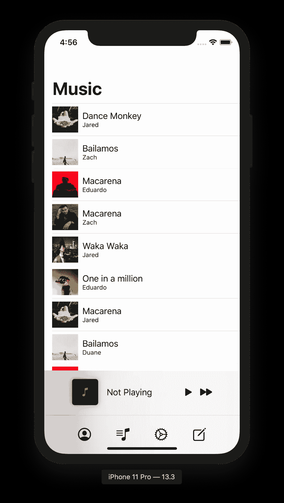
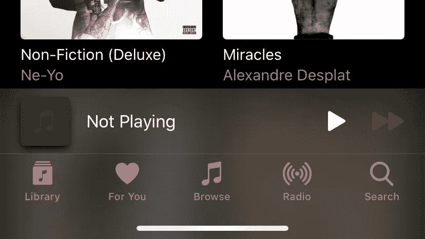
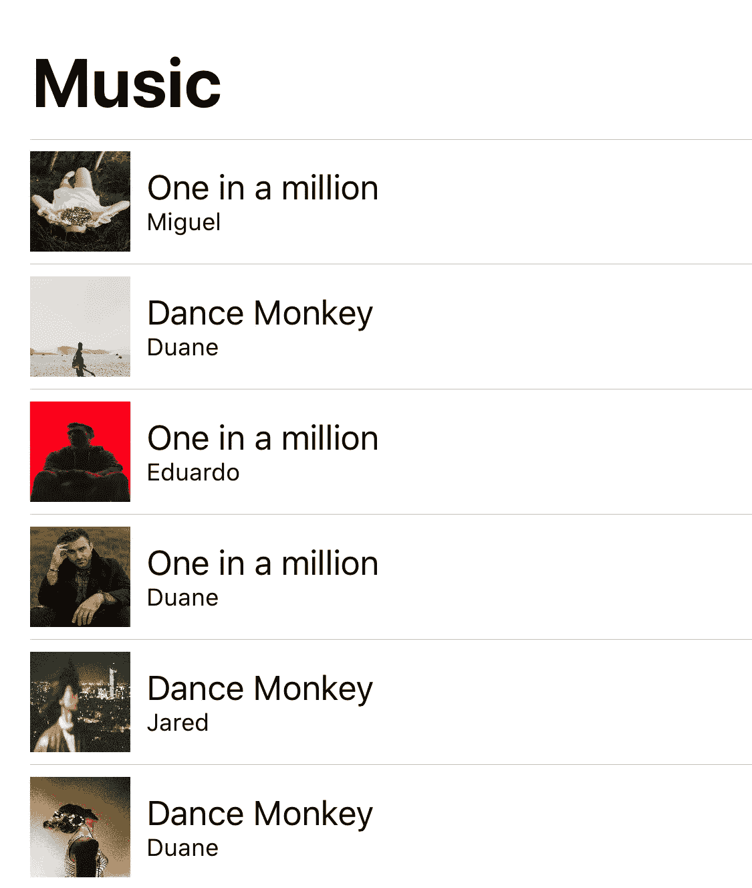
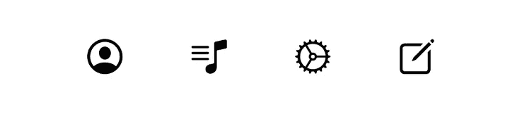
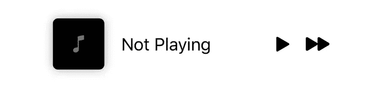
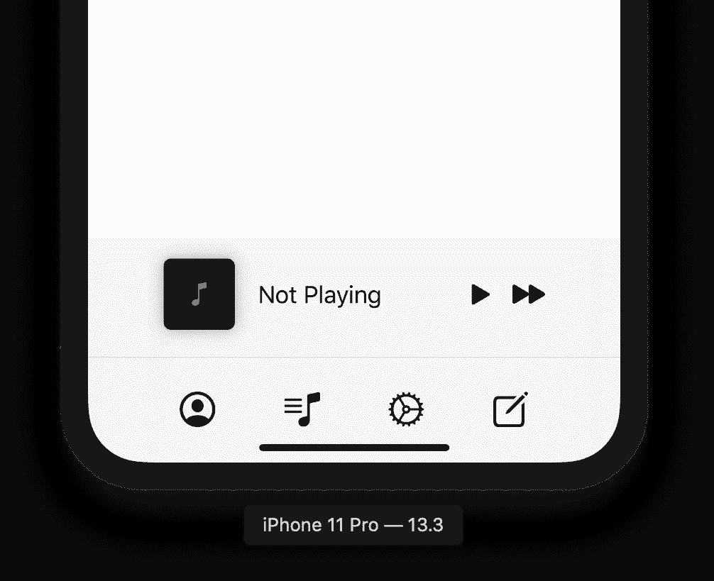
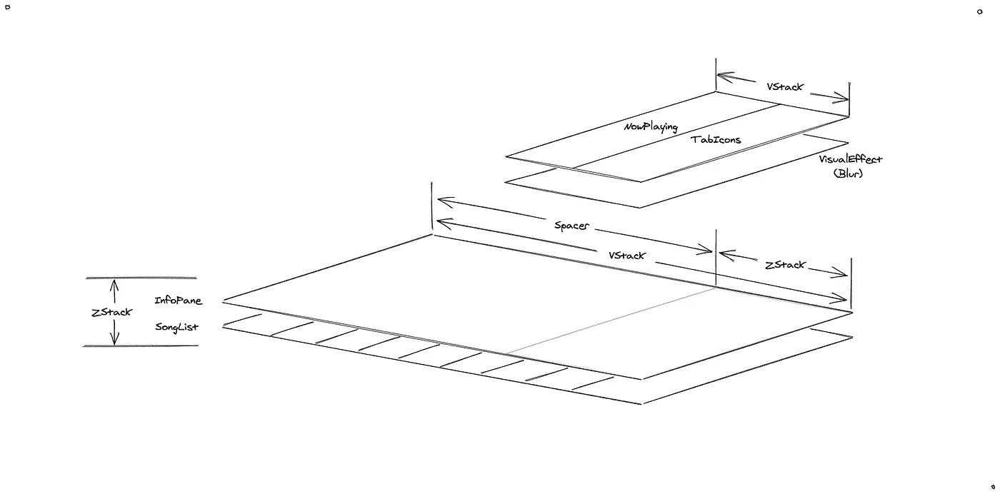
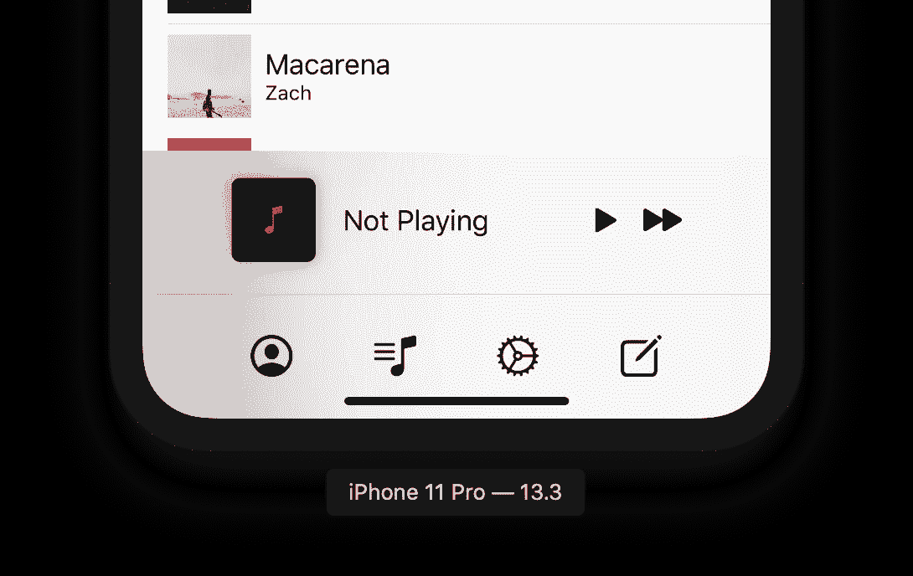

# 半透明的“正在播放”栏

> 原文：<https://itnext.io/translucent-now-playing-bar-252724c09b0?source=collection_archive---------4----------------------->

在 SwiftUI 中复制 Apple Music 的“正在播放”栏😎

> 这个例子并不适用于所有尺寸的 iPhone。更多的是一个实验。

我在互联网上搜索，试图找到一种方法，从苹果音乐应用程序中重新创建正在播放的酒吧。它正好放在标签栏的上方，具有漂亮、匹配的半透明效果:

苹果音乐应用

我偶然看到[这篇文章](https://stackoverflow.com/questions/56610957/is-there-a-method-to-blur-a-background-in-swiftui/56611342)引导我在 SwiftUI 中找到了解决这个问题的方法。实际上，神奇之处在于使用了一个`UIViewRepresentable`和一个`UIVisualEffect`，其中效果属于`UIBlurEffect`类型，风格为`.systemThinMaterial`。

> 还有一个`.systemUltraThinMaterial`，但是它用于不同的 UI 组件。

# 建造这个东西

我使用的所有代码和图片都可以在 Github 上找到。

## 歌曲列表

首先，我们需要一个随机创作歌曲的列表。因此，让我们创建一个名为`SongListView`的新 SwiftUI 文件:

SongListView.swift

现在，我们更新 ContentView 来显示这个歌曲列表:

它应该看起来像一个普通的假歌列表:

## 标签图标

让我们为选项卡图标创建一个视图。这只是一个占位符，因此不是交互式的，也不是真正的 TabView 的好设计，但它服务于我们的目的…

这将为我们提供以下预览:

TabIconsView.swift

## 正在播放栏

标签图标上方的“正在播放”栏也很简单:

给我们以下预览(说“不播放”，因为目前没有播放):

NowPlayingView.swift

## 最后，侠影

我们必须扩展一个`UIViewRepresentable`，而不是扩展一个视图。`UIViewRepresentable`有一个`UIBlurEffect`类型的效果属性。

## 把它们拼凑在一起

我们将把`NowPlaying`和`TabIcon`视图放在`VStack`中，然后把它和我们的`VisualEffect`视图一起放在`ZStack`中。`VisualEffect`是下面的*，给我们想要的模糊效果。让我们称这整个组合为一个`InfoPane`视图:*

InfoPaneView.swift

厉害！它看起来像我们想要的。您可能已经注意到了，`InfoPane`视图由一个`VStack`和一个`Spacer()`组成。这会将我们的控件推到屏幕底部。这是我们的视图层次的可视化:

最后，我们更新我们的内容视图:

我们得到了我们想要的效果！我们可以隐约看到条形和标签图标后面的颜色。

## 深色模式

用 SwiftUI 构建的一个好处是事情*就是工作*。我们没有修改代码来支持黑暗模式😎

