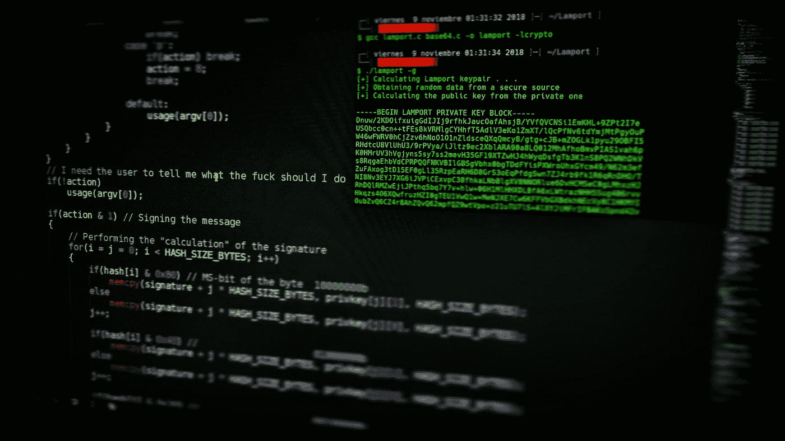
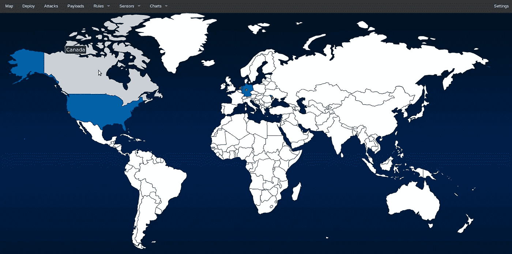
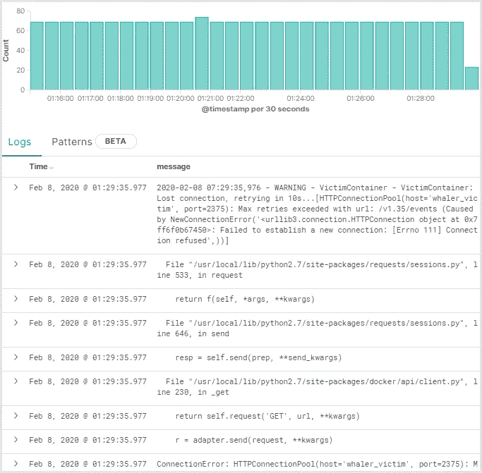
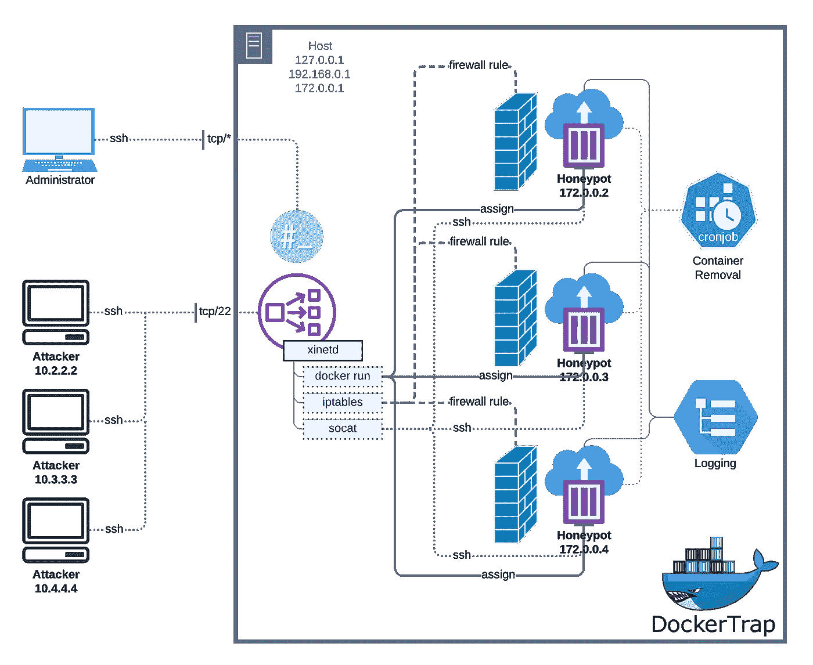

# 用集装箱式欺骗诱捕黑客

> 原文：<https://itnext.io/trapping-hackers-with-containerized-deception-7a52c78285aa?source=collection_archive---------0----------------------->

## 码头深水潜水

## 使用 Docker 部署高交互蜜罐的终极指南

# TL；速度三角形定位法(dead reckoning)

这个故事探索了利用容器化的现代蜜罐，通过遍历一个高交互蜜罐的设计，可以使用任意 Docker 容器来引诱恶意攻击。


照片由克林特·帕特森 / [Unsplash](https://unsplash.com/?utm_source=ghost&utm_medium=referral&utm_campaign=api-credit) 拍摄

# 介绍

虽然蜜罐已经存在了很长一段时间，但这个故事将试图提供一个新的视角，看看集装箱化是如何影响我们今天在集装箱化环境中使用蜜罐的方式的。诚然，从 2005 年开始，我就没有再探讨过这个话题。因此，当我在研究实现一些同样有价值和有趣的东西时，我遇到了至少六次错误的开始。我认为，像计算的其他领域一样，先进的蜜罐系统会在开源社区中大量存在。但是，我想我低估了这个主题的深奥本质，以及它严密保护的商业可行性。

自 2005 年以来，发生了很多变化，但也有很多保持不变。蜜罐不是一个复杂的概念；它是一个系统或服务，故意将自己暴露给攻击者，以便当有人试图闯入时可以被检测到。与入侵检测系统不同，蜜罐可以是简单的几行代码，将自己伪装成系统上易受攻击的开放端口，也可以是成熟的操作系统，带有分析行为模式的秘密日志记录系统。

然而，随着开发人员和系统专家将容器化融入到他们的设计中，许多使用蜜罐的传统方法变得不那么有效了。在 2005 年，部署蜜罐通常只需一次，通常放置在网络其他部分容易访问的地方。但是对于容器化的系统，由于它们与网络和其他服务隔离，部署蜜罐同样变得毫无用处。

虽然开发人员精通技术，但通常情况下他们并不了解安全性。即使他们是，优先考虑方便也是很常见的。这使得确保 Docker 的安全成为具有安全意识的 DevOps 专业人员的一个更加重要的部分。对于负担过重的系统管理员来说也是如此，他们采取不重视安全性的方法来快速完成工作。

大部分问题源于这样一个事实，即开发人员通常对公司内部的计算资源有很高的访问权限。系统管理员必然比开发人员拥有更高的访问级别。他们不仅可以访问系统中的所有源代码，还可以测试数据库，而且在许多情况下，尤其是在 DevOps 环境中，他们甚至可以访问生产系统。此外，出于测试目的，开发人员需要执行许多在安全软件看来可疑的任务，这为禁用安全软件提供了理由。这使得恶意软件和攻击者更容易感染系统硬件。

在本地 windows 环境中运行 Docker 的情况下，正如许多开发人员出于开发目的所做的那样，不能相信所有的开发系统都会遵守适当的安全配置。在我的例子中，出于测试的目的，我经常在主机上启用 Docker remote API，并让它保持启用状态，这可能是出于遗忘，也可能是为了方便。

# 欺骗系统概述



照片由[阿吉特](https://unsplash.com/@arget?utm_source=ghost&utm_medium=referral&utm_campaign=api-credit) / [Unsplash](https://unsplash.com/?utm_source=ghost&utm_medium=referral&utm_campaign=api-credit) 拍摄

## 蜜罐

蜜罐可以与网络中不同类型的系统一起部署。它们是诱饵，旨在引诱攻击者和恶意软件，以便可以检测、记录和跟踪源头。蜜罐有各种类型。高交互蜜罐被设计为作为一种服务运行，并意味着足够复杂，以欺骗系统认为它是一个全功能的操作系统或设备。中间交互蜜罐模拟应用层的某些方面，但不太复杂，因此更难被轻易攻破。我们将在本文中讨论的低交互蜜罐易于部署和维护，同时作为一个简单的早期预警系统，防止环境中更关键的系统受到感染。

## 蜜网

蜜网是一个蜜罐的集合，旨在战略性地跟踪恶意软件和攻击者的方法和技术。这种方法允许管理员观察黑客和恶意代码利用系统的各种漏洞，并可用于生产或研究目的，以发现新的漏洞和攻击。

## 基本用例

蜜罐的优势在于不需要关于网络攻击方法的详细知识。对于低交互的蜜罐来说尤其如此，蜜罐是相对简单的应用程序，它位于一个端口上监听，通常很少模仿原始服务。他们记录访问尝试，其他什么也不做。在收集某些类型的访问信息时，或者在出现任何严重问题之前，作为受损服务的早期警告，这种数据收集可能是非常宝贵的。

# 背景

## 脆弱点

使用容器作为蜜罐已经引起了一些争论，因为容器化技术与完全虚拟化相比还不成熟。一些管理员也很容易忽略潜在的配置问题，如下所示。

## Docker 引擎 API

API 是应用程序的编程接口。它是一种协议；规则集；有时是抽象的，但不管实现如何，它总是不同类型的程序相互对话的标准方法。REST 代表“代表性状态转移”。这是一个标准，开发人员可以使用它来获取信息并与其他应用程序交换信息，以特定 URL 的形式发送信息请求，同时在返回响应的主体中接收数据。

Docker 引擎 API 由 Docker CLI 用来管理对象。虽然在 Linux 系统上默认启用 UNIX 套接字(`unix:///var/run/docker.sock`)，但在 Windows 系统上默认启用 TCP 套接字(`tcp://127.0.0.1:2376`)。在 Linux 系统上，出于开发和自动化的目的，这个 API 也可以作为 REST API 被远程应用程序直接访问，方法是允许它被 TCP 套接字使用。

## 基础图像

今天发现的大多数漏洞都存在于基础映像本身。对于 Docker，基本映像由一个操作系统组成，通常是从 Docker Hub 上的另一个流行映像定制的。恶意的或意外的定制，以及原始的基础映像，为攻击创造了大量的机会，有时甚至是最新手的黑客。

## 码头枢纽

虽然 Docker Hub 过去已经删除了恶意的 Docker 容器，但作为一个社区存储库，它很容易被滥用和攻击。上传到 Docker Hub 的基本映像应谨慎使用。但是，考虑到许多管理员认为便利性往往大于风险，采取谨慎的安全措施来降低攻击风险是有道理的。

# 著名的蜜罐系统

有许多蜜罐系统在普遍使用，但是，很少专门针对或唯一受益于集装箱化的使用。以下两个开源包是明显的例外。

## 现代蜂蜜网



作者截图

MHN 对于容器集成有很大的潜力，但是官方并不支持它运行 Docker。作为一个全面的蜜网管理系统，蜜罐可以作为 K8s 配置的一部分轻松部署。特别是从内部网络来源收集的蜜罐数据，对于保护分布式容器环境非常有价值。

## Oncyberblog 的捕鲸船:一个 Docker API 蜜罐



作者截图

十几个 GitHub 库都以 Whaler 为名，然而 [Oncyberblog](https://github.com/oncyberblog) 的这个实际上是这个故事的预计竞争者。这个项目是独一无二的，因为它试图引诱攻击者使用暴露的 Docker 引擎 API。然而，它也有其局限性。首先，因为它运行的是嵌入式 Docker 容器，Docker 必须在其主机上以特权模式运行。这是一个问题，因为这是一个巨大的安全风险，可能会危及主机的安全。因此，有必要采取预防措施，将其安装在一个隔离且安全的主机上。系统要求不高，所以主机不需要很大。但是，由于您需要监控主要主机上的单个容器，因此您需要一种方法来将隔离的蜜罐主机链接到被监控的应用程序容器所在的应用程序主机。

# 系统概况

这个项目快速利用了传统的 Linux 内部机制来处理容器编排、负载平衡和安全性。有关更多信息、源代码和更新，请参见为本文创建的配套 GitHub 资源库 [DockerTrap](https://github.com/mrhavens/DockerTrap) 。



作者图表

# 系统配置

## 更改主机上 SSH 的默认端口

在做其他事情之前，将默认端口`22`改为其他端口，比如`2222`。系统将使用端口`22`引诱攻击者，因此该端口应该被释放使用。

## 安装 Docker

```
sudo apt -y install apt-transport-https ca-certificates curl software-properties-common
curl -fsSL https://download.docker.com/linux/ubuntu/gpg | sudo apt-key add -
sudo add-apt-repository "deb [arch=amd64] https://download.docker.com/linux/ubuntu bionic stable"
sudo apt update
apt-cache policy docker-ce
sudo apt -y install docker-ce
```

## 安装支持系统工具

```
sudo apt update
sudo apt -y install socat xinetd auditd netcat-openbsd
```

## 配置`xinetd`

这个系统使用下面的 bash 脚本，由`xinetd`管理，每当端口`22`请求一个传入连接时，就启动容器。

下面的`bash`脚本应该作为具有`755`权限和根用户所有权的`/usr/bin/honeypot`对`xinetd`可用。

应该将`EXT_IFACE`变量更改为与您希望在端口`22`上接收传入 ssh 连接的设备相对应的接口。

```
 #!/bin/bash

EXT_IFACE=ens4
MEM_LIMIT=128M
SERVICE=22

QUOTA_IN=5242880
QUOTA_OUT=1310720
REMOTE_HOST=`echo ${REMOTE_HOST} | grep -o '[0-9]\{1,3\}\.[0-9]\{1,3\}\.[0-9]\{1,3\}\.[0-9]\{1,3\}'`

{
    CONTAINER_NAME="honeypot-${REMOTE_HOST}"
    HOSTNAME=$(/bin/hostname)
    # check if the container exists
    if ! /usr/bin/docker inspect "${CONTAINER_NAME}" &> /dev/null; then
        # create new container
        CONTAINER_ID=$(/usr/bin/docker run --name ${CONTAINER_NAME} -h ${HOSTNAME} -e "REMOTE_HOST=${REMOTE_HOST}" -m ${MEM_LIMIT} -d -i honeypot ) ##/sbin/init)
        CONTAINER_IP=$(/usr/bin/docker inspect --format '{{ .NetworkSettings.IPAddress }}' ${CONTAINER_ID})
        PROCESS_ID=$(/usr/bin/docker inspect --format '{{ .State.Pid }}' ${CONTAINER_ID})

        # drop all inbound and outbound traffic by default
        /usr/bin/nsenter --target ${PROCESS_ID} -n /sbin/iptables -P INPUT DROP
        /usr/bin/nsenter --target ${PROCESS_ID} -n /sbin/iptables -P OUTPUT DROP

        # allow access to the service regardless of the quota
        /usr/bin/nsenter --target ${PROCESS_ID} -n /sbin/iptables -A INPUT -p tcp -m tcp --dport ${SERVICE} -j ACCEPT
        /usr/bin/nsenter --target ${PROCESS_ID} -n /sbin/iptables -A INPUT -m quota --quota ${QUOTA_IN} -j ACCEPT

        # allow related outbound access limited by the quota
        /usr/bin/nsenter --target ${PROCESS_ID} -n /sbin/iptables -A OUTPUT -p tcp --sport ${SERVICE} -m state --state ESTABLISHED,RELATED -m quota --quota ${QUOTA_OUT} -j ACCEPT

        # enable the host to connect to rsyslog on the host
        /usr/bin/nsenter --target ${PROCESS_ID} -n /sbin/iptables -A OUTPUT -p tcp -m tcp --dst 172.17.0.1 --dport 514 -j ACCEPT

        # add iptables redirection rule
        /sbin/iptables -t nat -A PREROUTING -i ${EXT_IFACE} -s ${REMOTE_HOST} -p tcp -m tcp --dport ${SERVICE} -j DNAT --to-destination ${CONTAINER_IP}
        /sbin/iptables -t nat -A POSTROUTING -j MASQUERADE
    else
        # start container if exited and grab the cid
        /usr/bin/docker start "${CONTAINER_NAME}" &> /dev/null
        CONTAINER_ID=$(/usr/bin/docker inspect --format '{{ .Id }}' "${CONTAINER_NAME}")
        CONTAINER_IP=$(/usr/bin/docker inspect --format '{{ .NetworkSettings.IPAddress }}' ${CONTAINER_ID})

        # add iptables redirection rule
        /sbin/iptables -t nat -A PREROUTING -i ${EXT_IFACE} -s ${REMOTE_HOST} -p tcp -m tcp --dport ${SERVICE} -j DNAT --to-destination ${CONTAINER_IP}
        /sbin/iptables -t nat -A POSTROUTING -j MASQUERADE
    fi
    echo ${CONTAINER_IP}
} &> /dev/null

# forward traffic to the container
exec /usr/bin/socat stdin tcp:${CONTAINER_IP}:22,retry=60
```

以下服务文件应创建为`/etc/xinetd.d/honeypot`:

```
# Container launcher for an SSH honeypot 
service honeypot
{
        disable         = no
        instances       = UNLIMITED
        server          = /usr/bin/honeypot
        socket_type     = stream
        protocol        = tcp
        port            = 22
        user            = root
        wait            = no
        log_type        = SYSLOG authpriv info
        log_on_success  = HOST PID
        log_on_failure  = HOST
}
```

然后，`/etc/services`应该更新为包含以下内容，以反映新的 ssh 端口和端口`22`上的蜜罐端口

```
ssh          2222/tcp
honeypot     22/tcp
```

## 配置`crond`

为了处理停止和清理旧容器，应该使用`755`权限和根所有权将下面的`bash`脚本部署到`/usr/bin/honeypot.clean`。

```
#!/bin/bash

EXT_IFACE=ens4
SERVICE=22

HOSTNAME=$(/bin/hostname)
LIFETIME=$((3600 * 6)) # Six hours

datediff () {
    d1=$(/bin/date -d "$1" +%s)
    d2=$(/bin/date -d "$2" +%s)
    echo $((d1 - d2))
}

for CONTAINER_ID in $(/usr/bin/docker ps -a --no-trunc | grep "honeypot-" | cut -f1 -d" "); do
    STARTED=$(/usr/bin/docker inspect --format '{{ .State.StartedAt }}' ${CONTAINER_ID})
    RUNTIME=$(datediff now "${STARTED}")
    if [[ "${RUNTIME}" -gt "${LIFETIME}" ]]; then
        logger -p local3.info "Stopping honeypot container ${CONTAINER_ID}"
        /usr/bin/docker stop $CONTAINER_ID
    fi

    RUNNING=$(/usr/bin/docker inspect --format '{{ .State.Running }}' ${CONTAINER_ID})

    if [[ "$RUNNING" != "true" ]]; then
        # delete iptables rule
        CONTAINER_IP=$(/usr/bin/docker inspect --format '{{ .NetworkSettings.IPAddress }}' ${CONTAINER_ID})
        REMOTE_HOST=$(/usr/bin/docker inspect --format '{{ .Name }}' ${CONTAINER_ID} | cut -f2 -d-)
        /sbin/iptables -t nat -D PREROUTING -i ${EXT_IFACE} -s ${REMOTE_HOST} -p tcp --dport ${SERVICE} -j DNAT --to-destination ${CONTAINER_IP}
        logger -p local3.info "Removing honeypot container ${CONTAINER_ID}"
        /usr/bin/docker rm $CONTAINER_ID
    fi

done
```

默认情况下，通过将以下内容附加到`/etc/crontab`，上述脚本被设置为每 5 分钟运行一次。

```
*/5 * * * * /usr/bin/honeypot.clean
```

## 配置`auditd`

通过添加以下审核规则，启用在 auditd 中记录 execve 系统调用:

```
auditctl -a exit,always -F arch=b64 -S execve
auditctl -a exit,always -F arch=b32 -S execve
```

## 展开`apitrap.sh`

`apitrap.sh`脚本是一个可选组件，它尝试在主机上模拟 Docker API。由于这是一个 bash 脚本，建议从 Docker 容器运行，以无权限用户身份运行，并重定向到端口 2375 或 2376，以避免潜在的漏洞。

```
#!/bin/bash

## Docker API heading
H1="HTTP/1.1 404 Not Found\n"
H2="Content-Type: application/json\n"
H3="Date: "`date '+%a, %d %b %Y %T %Z'`"\n"
H4="Content-Length: 29\n\n"

## API error message
B1="{\"message\":\"page not found\"}\n"
HEADERS+=$H1$H2$H3$H4

## Default to port 2376 if no port is given
if ! test -z "$1"; then
  PORT=$1;
  else 
    PORT=2376; 
fi

QUEUE_FILE=/tmp/apitrap
test -p $QUEUE_FILE && rm $QUEUE_FILE
mkfifo $QUEUE_FILE

while true; do
  cat "$QUEUE_FILE" | nc -l "$PORT" | while read -r line || [[ -n "$line" ]]; do
    if echo $line | grep -q 'GET \|HEAD \|POST \|PUT \|DELETE \|CONNECT \|OPTIONS \|TRACE'; then
      echo ">>> ["$(date)"] <<<"
      echo : $line
      echo -e $HEADERS$B1 > $QUEUE_FILE
    fi
  done
done
```

您需要对系统进行适当的修改，但是从您决定部署的任何蜜罐内部，应该可以从 docker 容器内部获得主机 IP。例如:

```
root@dockerhost:~# hostname -I |awk '{ print $2 }'
172.17.0.1
root@dockerhost:~# docker run -it honeypot-test /sbin/ip route|awk '/default/ { print $3 }'
172.17.0.1
root@dockerhost:~#
```

我们显示 dockerhost 的主机名是`172.17.0.1`。检索 Docker 容器的网关地址发现它也是`172.17.0.1`。这很容易使主机 IP 受到来自容器的攻击。因此，我们应该在我们的项目中利用这一点，确保 DockerTrap 的配置被重定向并在同一主机上可用。但是，这里不讨论这些细节。在 [DockerTrap](https://github.com/mrhavens/DockerTrap) GitHub 仓库上寻找更新。

## 从`Dockerfile`构建蜜罐镜像

这个映像的主要特点是启用了 sshd，启用了 root 登录，root 的密码设置为`root`。您应该对此进行修改，以包括其他用户帐户，以及有助于吸引更多攻击的琐碎密码。

```
FROM alpine:3.9
ENTRYPOINT ["/entrypoint.sh"]
EXPOSE 22

## Root is gloriously unsecure!
RUN apk add --no-cache openssh \
  && sed -i s/#PermitRootLogin.\*/PermitRootLogin\ yes/ /etc/ssh/sshd_config \
  && echo "root:root" | chpasswd

RUN echo -e '#!/bin/ash\n\nssh-keygen -A\n/usr/sbin/sshd -D -e "$@"' > /entrypoint.sh
RUN chmod 555 /entrypoint.sh
```

## 提交最终蜜罐映像

系统查找提交为`honeypot:latest`的基础映像。当建立 ssh 连接时，系统会自动创建一个带有`honeypot-`前缀的镜像的唯一实例。根据需要修改此图像。

# 测试


## SSH 进入蜜罐

每个动态创建的蜜罐将采用主机的主机名。此时，如果在 localhost 的端口`22`上建立了任何套接字连接(或主机上配置为由 DockerTrap 使用的任何其他网络适配器)，它将被重定向到一个蜜罐容器内的蜜罐的 sshd 守护进程。由`xinetd`触发的 Bash 脚本`/usr/bin/honeypot`确保每个 IP 地址都指向其对应的容器，因此如果攻击者试图第二次、第三次或第四次从同一个 IP 地址登录，他们每次都会登录到同一个容器。

```
dockertrap:~# ssh root@localhost -p 22
The authenticity of host 'localhost (127.0.0.1)' can't be established.
ECDSA key fingerprint is SHA256:dY6EIpV1nBw5143TkgPQU5SRWIkrxkZCiLWd+ktiNKE.
Are you sure you want to continue connecting (yes/no)? yes
Warning: Permanently added 'localhost' (ECDSA) to the list of known hosts.
root@localhost's password:
Welcome to Alpine!

The Alpine Wiki contains a large amount of how-to guides and general
information about administrating Alpine systems.
See <http://wiki.alpinelinux.org/>.

You can setup the system with the command: setup-alpine

You may change this message by editing /etc/motd.

dockertrap:~# ifconfig -a
eth0      Link encap:Ethernet  HWaddr 02:42:AC:11:00:02
          inet addr:172.17.0.2  Bcast:172.17.255.255  Mask:255.255.0.0
          UP BROADCAST RUNNING MULTICAST  MTU:1500  Metric:1
          RX packets:124 errors:0 dropped:0 overruns:0 frame:0
          TX packets:96 errors:0 dropped:0 overruns:0 carrier:0
          collisions:0 txqueuelen:0
          RX bytes:13954 (13.6 KiB)  TX bytes:14026 (13.6 KiB)

lo        Link encap:Local Loopback
          inet addr:127.0.0.1  Mask:255.0.0.0
          UP LOOPBACK RUNNING  MTU:65536  Metric:1
          RX packets:0 errors:0 dropped:0 overruns:0 frame:0
          TX packets:0 errors:0 dropped:0 overruns:0 carrier:0
          collisions:0 txqueuelen:1000
          RX bytes:0 (0.0 B)  TX bytes:0 (0.0 B)

dockertrap:~# exit
Connection to localhost closed.
root@dockertrap:~#
```

注意，上面的以太网设备`eth0`配置了 IP 地址`172.17.0.2`和 MAC 地址`02:42:AC:11:00:02`。当从主机的本地主机之外的 IP 地址登录时，比如我的 hope PC，DockerTrap 将产生一个新的、几乎相同的容器供我登录(当然，IP 和 MAC 地址除外)。

```
C:\Users\user>ssh root@35.238.100.5 -p 22
The authenticity of host '35.238.100.5 (35.238.100.5)' can't be established.
ECDSA key fingerprint is SHA256:VKG+5VhB0WL5ncPomfmb+XW484LtjS8oAs+BDM07sJQ.
Are you sure you want to continue connecting (yes/no)? yes
Warning: Permanently added '35.238.100.5' (ECDSA) to the list of known hosts.
root@35.238.100.5's password:
Welcome to Alpine!

The Alpine Wiki contains a large amount of how-to guides and general
information about administrating Alpine systems.
See <http://wiki.alpinelinux.org/>.

You can setup the system with the command: setup-alpine

You may change this message by editing /etc/motd.

honeypot2:~# ifconfig -a
eth0      Link encap:Ethernet  HWaddr 02:42:AC:11:00:09
          inet addr:172.17.0.9  Bcast:172.17.255.255  Mask:255.255.0.0
          UP BROADCAST RUNNING MULTICAST  MTU:1500  Metric:1
          RX packets:72 errors:0 dropped:0 overruns:0 frame:0
          TX packets:50 errors:0 dropped:0 overruns:0 carrier:0
          collisions:0 txqueuelen:0
          RX bytes:7593 (7.4 KiB)  TX bytes:7041 (6.8 KiB)
lo        Link encap:Local Loopback
          inet addr:127.0.0.1  Mask:255.0.0.0
          UP LOOPBACK RUNNING  MTU:65536  Metric:1
          RX packets:0 errors:0 dropped:0 overruns:0 frame:0
          TX packets:0 errors:0 dropped:0 overruns:0 carrier:0
          collisions:0 txqueuelen:1000
          RX bytes:0 (0.0 B)  TX bytes:0 (0.0 B)
honeypot2:~# exit
Connection to 35.238.100.5 closed.
C:\Users\user>
```

IP 地址和 MAC 地址不同，但主机名相同。过一会儿，我们会注意到越来越多的容器开始在主机上旋转，因为随机的机器人连接到端口`22`。为了防止内存资源攻击，您需要编辑`/etc/xinetd.d/honeypot`文件，以便`xinetd`限制实例的数量，这是没有意义的。

```
root@dockertrap:/usr/bin# docker ps
CONTAINER ID        IMAGE               COMMAND             CREATED             STATUS              PORTS               NAMES
4971d1c8272a        honeypot            "/entrypoint.sh"    17 minutes ago      Up 17 minutes       22/tcp              honeypot-175.111.182.186
bf4f9b94ad03        honeypot            "/entrypoint.sh"    27 minutes ago      Up 27 minutes       22/tcp              honeypot-58.96.198.15
e69231243915        honeypot            "/entrypoint.sh"    29 minutes ago      Up 29 minutes       22/tcp              honeypot-
906c4e2be5c7        honeypot            "/entrypoint.sh"    30 minutes ago      Up 30 minutes       22/tcp              honeypot-10.128.0.46
root@dockertrap:/usr/bin#
```

# 未来的工作

DockerTrap 的大部分设计可以应用于 Kubernetes。类似于 Docker 如何在这里启用资源限制，K8s 支持高级的[安全特性](https://kubernetes.io/docs/tasks/administer-cluster/securing-a-cluster/)，包括一个 iptables 对应的[网络策略](https://kubernetes.io/docs/concepts/services-networking/network-policies/)。API 蜜罐`apitrap.sh`也可以被更强大的系统取代，如 [Whaler](https://github.com/oncyberblog/whaler) ，这将有助于识别专门寻找错误配置的 Docker 主机的受损系统。

*作为 Medium 上的一名作者，* [*我邀请你成为会员*](https://mark-havens.medium.com/membership) *并获得我的故事集，以及成千上万其他天才作家写的故事。你的会员费直接支持我和你阅读的其他作家，并让你完全接触媒体上的每一个故事。*

[](https://www.buymeacoffee.com/markrhavens)

如果你喜欢这篇文章，像你这样的粉丝再给我一杯咖啡，肯定会鼓励我再写一篇这样的文章。顺便来看看，打个招呼，让我知道你对你可能想读的话题的想法。你可能是我需要写一些更棒的东西的灵感火花！

# 更新:2022 年 11 月 24 日

在 2020 年疫情爆发时，我提出并被委托写上述的穿越。由[*Appfleet*](https://appfleet.com/)*发布，并于 2020 年 3 月 2 日作为 app fleet 博客* *发布* [*。*](https://appfleet.com/blog/compromised-container-detection-with-honeypot-containers/) [*这个故事的一个版本*](https://havdevops.com/Trapping-Hackers-with-Containerized-Deception/) *也可以在*[*my havdoveps 博客*](https://havdevops.com/) *上找到。我将上面更新的故事发布到 Medium，只做了微小的编辑和格式更改。如果有人发现错误需要我的注意，请不吝赐教。*

[*马克·兰道尔·哈文斯*](https://markhavens.us/) *是一位连续创业者和创造者，他从 19 岁起就开始创业。他是北德克萨斯州最知名的两个创客社区* [*达拉斯创客社区*](https://dallasmakercommunity.org/) *和* [*达拉斯创客空间*](https://dallasmakerspace.org/) *的创始人。他拥有科罗拉多技术大学的管理学硕士学位，并获得了德克萨斯大学 Rio Grand Valley 分校的计算机科学学士学位。为了表彰他在创客社区的工作，他获得了位于阿灵顿的德克萨斯大学的博士奖学金。当马克不从事制造工作或探索生活、文化和技术时，他住在达拉斯的中心郊区——沃斯堡大都会区，探索新的、创新的方式来养活他的母亲和两个孩子。*