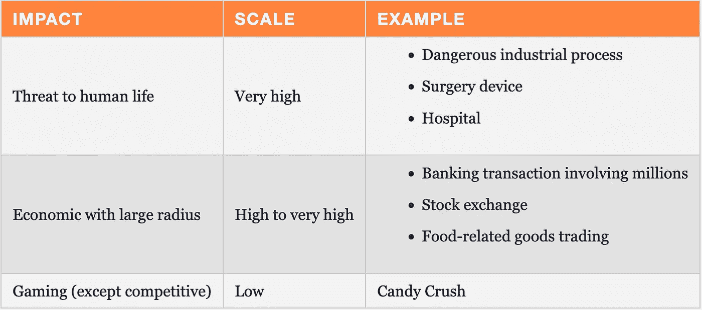

# 将安全视为一种风险

> 原文：<https://itnext.io/treat-security-as-risk-5300741f9736?source=collection_archive---------2----------------------->


安全性是非功能性需求的典型代表:大多数人并不关心，直到众所周知的粪便碰到旋转推进器。后果可能是名誉扫地、承担法律责任，甚至停业。在我的关于运行不安全代码的[帖子中，我得出结论，你应该把安全视为一种风险——并就此打住。我认为应该设立一个专门的职位。](https://blog.frankel.ch/running-untrusted-code/)

风险管理是非常好的[有很多文件证明](https://en.wikipedia.org/wiki/Risk_management)。你可以在许多工程学科中找到它，如果不是每一个的话。风险管理流程由以下步骤组成:

**辨认** ⇨ **分析** ⇨ **分清轻重缓急** ⇨ **请客** ⇨ **班长**

以 [Attach API](https://blog.frankel.ch/jvm-security/4/) 为例，让我们看看如何将它应用于安全性。

# 识别风险

简而言之，Attach API 允许用户改变已经加载到正在运行的 JVM 1.6+中的字节码。为此，您需要:

*   正在运行的 JVM 的 PID
*   在同一系统上运行另一个 JVM 的能力

当附加的 JVM 再次启动时，它会丢弃更新后的*字节码*，并从预期的位置加载代码。因此，没有迹象表明*字节码*已经通过这个特性被改变了。

通过 Attach API，恶意参与者可以改变正在运行的应用程序的行为。例如，参与者可以将每笔交易的几分钱存入他们在银行系统中的账户。

# 分析风险

既然我们已经正确地识别了风险，我们需要量化它的可能性:恶意行为者触发风险的可能性有多大？

对于我们的示例，我们需要评估以下情况的可能性:

1.  进入系统
2.  获取启动 JVM 的权限
3.  获取 JVM 的 PID

系统访问和许可取决于这篇博文上下文中的未知因素。然而，如果您满足了另外两个条件，那么获得 JVM 的 PID 是很简单的。

对于低于版本 9 的 JVM，我们需要默认使用`Runtime`类并使用`jps`命令:

```
long pid = Runtime.getRuntime()
               .exec("jps")
               .inputStream
               .bufferedReader(Charset.forName("UTF-8"))
               .lines()
               .map { it.split(" ").toTypedArray() }
               .filter { it.size > 1 && it[1].endsWith("BusinessApplicationKt") }
               .map { it[0] }
```

从 9 开始，JVM 在流程 API 中增加了一个专用的`ProcessHandle`类:

```
long pid = ProcessHandle.current().pid()
```

# 优先考虑

为了确定优先级，我们需要评估一次成功攻击的影响。

在 Attach API 的上下文中，它依赖于目标系统。这是非常依赖于上下文的，所以这里有一些领域的例子:



# 款待

治疗包括两件独立的事情:

*   防止风险发生
*   *缓解措施*，如果有的话

缓解措施可以降低攻击的影响。可能有几个缓解措施。对于每一种，你都需要描述:它减少了多少影响，花费了多少。

使用 Attach API，默认情况下会启用该功能。处理方法是显式禁用它。我想不出任何缓解措施。一旦恶意行为者注入了*字节码*，后者就会自行其是。

# 现实世界中的风险管理

安全不是一个非黑即白的问题。没有安全系统和不安全系统之分。对于特定的威胁，有些系统比其他系统更安全。此外，提高抵御威胁的安全性通常是有成本的。因此，人们需要在风险的可能性、其影响、治疗成本和可能的缓解措施之间找到正确的平衡。

如果你实施了我上面描述的所有风险管理步骤，你可能还是会失败。原因是我们在人类组织内工作:它涉及政治、指责游戏、逃避责任以及类似的公司相关细节。

如果你想有机会让风险管理发挥作用，你需要跟踪所做的决定。记录应包括上述所有内容:风险、描述、可能性、影响、缓解措施等。，没有忘记决定。可以是*接受*、*拒绝*或任何缓解行动。

缺少一条关键信息:做决定的人。通过让一个人负责，他们将*承诺*而不仅仅是*参与*。在这一点上，仍然没有保证。然而，该组织将更好地准备，以避免最糟糕的惨败，如 [Equifax 数据泄露](https://en.wikipedia.org/wiki/2017_Equifax_data_breach)。

*最初发表于* [*一个 Java 极客*](https://blog.frankel.ch/treat-security-as-risk/)*2022 年 1 月 23 日*