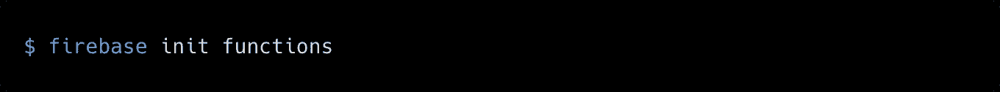
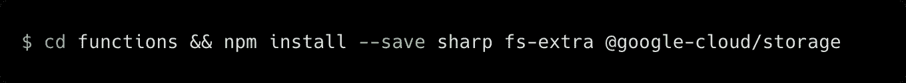
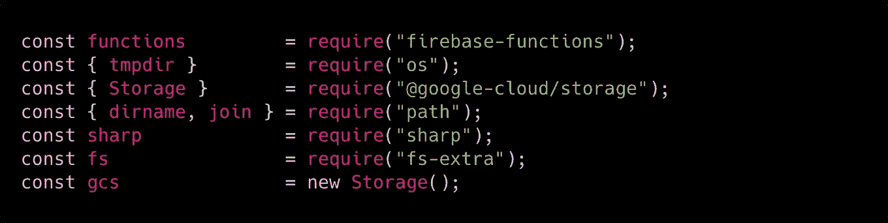
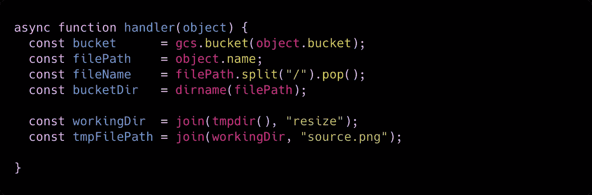
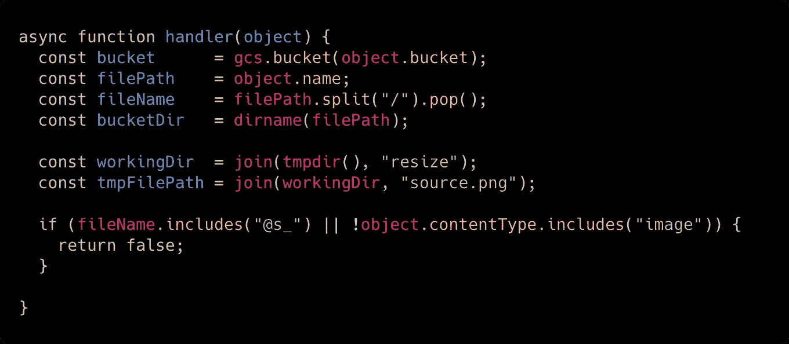
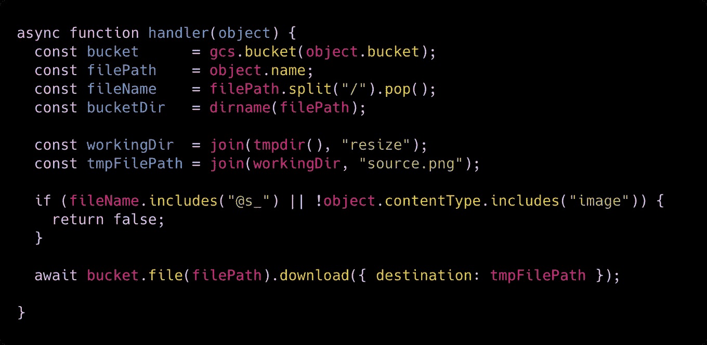
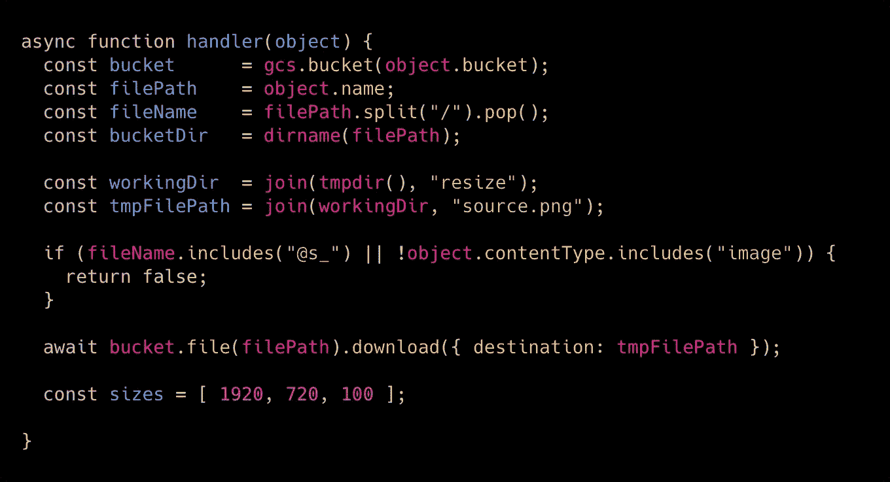
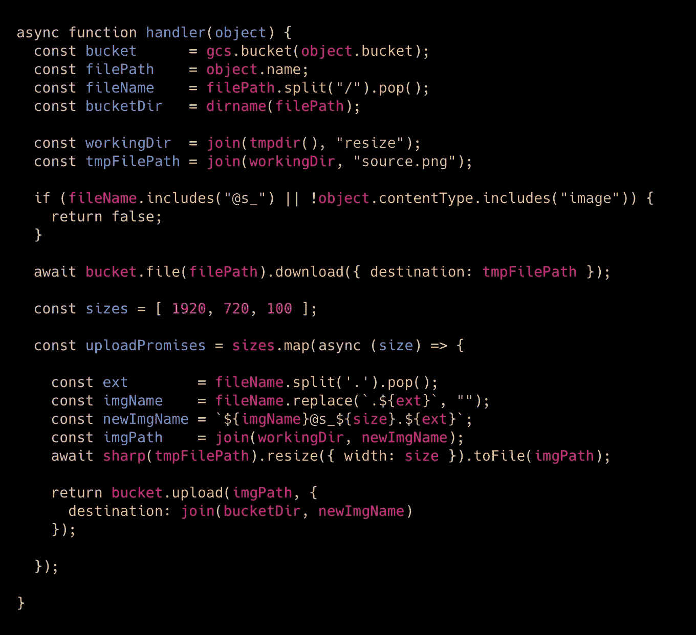
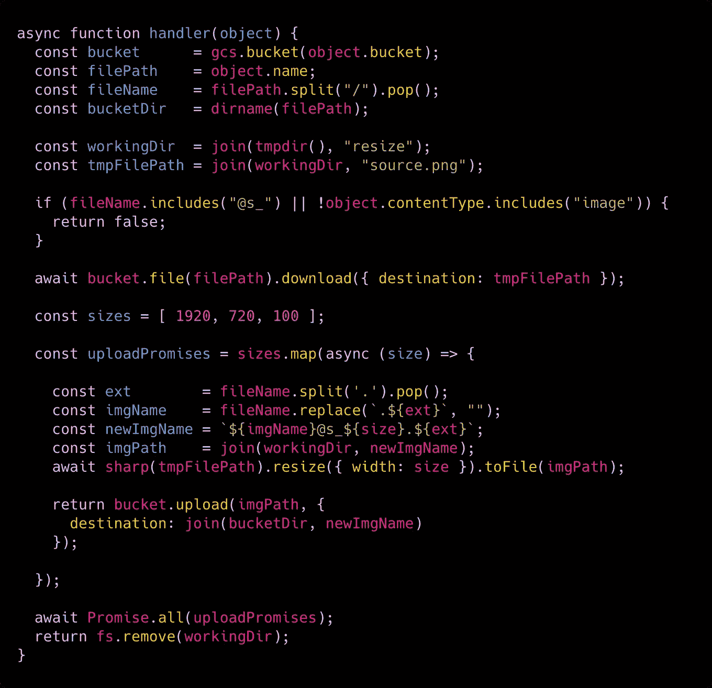
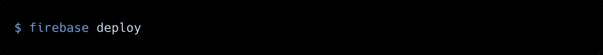

# 使用云函数触发 Firebase 存储映像调整大小

> 原文：<https://itnext.io/trigger-firebase-storage-image-resize-with-cloud-functions-9dd409ededac?source=collection_archive---------2----------------------->

Firebase 太棒了。正如之前 JSMonday 文章 中的 [**所写的，它允许我们编写无服务器的应用程序，认证用户和许多其他事情。**](/running-express-js-on-firebase-cloud-functions-a20b536c6aec)

Firebase 还提供一项名为 **Firebase Storage** 的服务，有点类似于 **AWS S3** 。您可以创建一个存储桶，然后在其中插入任何类型的文件。它通常用于存储图像，但问题来了:如果用户正在上传一个令人难以置信的沉重的图像怎么办？你可能想调整它的大小！
让我们看看如何使用 **Firebase 函数**来实现。

首先，让我们初始化一个新的 **Firebase Functions** 项目。
然后，让我们安装几个 **npm** 软件包:

如您所见，我们正在安装这三个软件包:

*   `@google-cloud/storage`允许您从 **Firebase 存储器**中获取图像。
*   `fs-extra`，包装 Node.js 默认`fs`模块，用承诺公开其功能。
*   `sharp`，Node.js 惊人的高性能图像处理库

我们现在准备好写我们的图像尺寸！让我们导航到我们的`functions/index.js`文件，开始导入我们需要的依赖项:

太好了！现在我们可以开始编写函数处理程序了:

如您所见，我们告诉 Firebase 函数，我们需要至少 2GB 的内存和最多 120 秒的时间来执行我们的函数。我们还声明，一旦图像被上传到我们的桶中，我们就需要触发这个函数(`storage.object().onFinalize`)。

让我们编写`handler`函数:

我们需要从我们的`object`参数(它实际上是一个描述我们的图像被上传到哪里的对象)中获得大量信息:

*   **桶**:我们上传图像的桶。
*   **文件路径**:我们桶里面的文件路径。
*   **文件名**:上传的文件名。
*   **桶目录**:我们上传图像的目录名。

现在我们可以创建一个临时目录，在这里我们将执行调整代码。我们还将创建一个临时文件来运行我们的操作。

现在出现了一个问题:每次在我们的桶中创建新文件时，我们的函数都会被触发…但是我们实际上是在创建一个新的调整大小的图像，那么我们如何避免一个无限的调整大小循环呢？

我们将为调整后的图像设置一个类似于`myImage@s_1920.jpg`的名称(其中`s_`代表“大小”)，这样我们就能够检查新创建的图像是否是调整大小的结果。
如果图像本身是一个调整过大小的图像，我们将退出我们的功能。

现在我们只需要下载新创建的图像。我们将把它下载到先前创建的临时文件路径中:

现在我们准备开始调整大小！假设我们需要创建三种不同的大小:1920 像素、720 像素、100 像素。让我们将这些值包装成一个数组:

现在我们需要运行 resizer，所以我们将为数组中的每个大小创建一个承诺:

如您所见，这个过程非常简单:

*   获取图像扩展名。
*   获取原始图像名称。
*   创建最终图像名称。
*   获取它的路径。
*   现在让我们运行`sharp`，调整图像大小，然后保存到一个文件中。
*   最后但同样重要的是，使用新的文件名将图像上传到原始的 bucket。

现在我们只需要运行这三个承诺…但我们不想按顺序运行它们，这可能需要太长时间！因此，我们将使用`Promise.all`来并发运行它们:

我们完事了。
让我们部署该功能并进行测试，将文件上传到 Firebase 存储:

我们现在准备运行我们的 resizer！
在 **JSMonday** ，我们实际上使用了上面的代码来调整我们图像的大小:

 [## js Monday/达盖尔

### 此时您不能执行该操作。您已使用另一个标签页或窗口登录。您已在另一个选项卡中注销，或者…

github.com](https://github.com/jsmonday/Daguerre) 

请随意重用上面的代码为您的图像尺寸！

