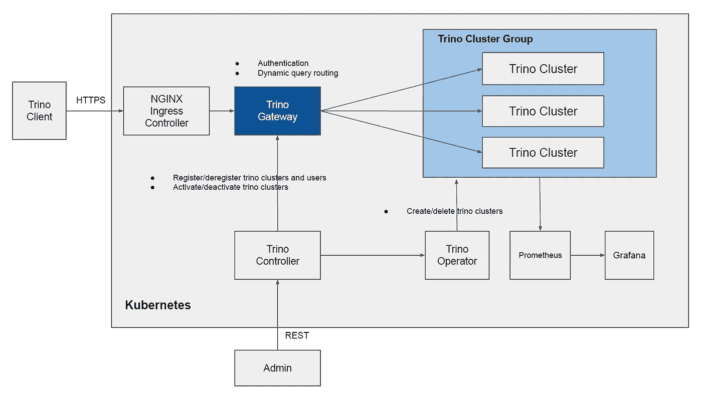

# Trino Gateway

> 原文：<https://itnext.io/trino-gateway-8e654366df5e?source=collection_archive---------1----------------------->


谢尔盖·温在 [Unsplash](https://unsplash.com?utm_source=medium&utm_medium=referral) 上的照片

之前，我在本文的[中提到过如何构建 trino 网关来将查询动态地路由到下游 trino 集群。](/route-trino-queries-dynamically-using-trino-gateway-9772d62b1630)

在这里，我将展示改进的 trino gateway 架构，使用 [DataRoaster trino 控制器](https://github.com/cloudcheflabs/dataroaster/tree/master/trino-ecosystem/trino-controller)控制所有 Trino 生态系统组件，轻松创建一个漂亮的 trino gateway。

# Trino 网关架构



*   `Admin`向`Trino Controller`发送创建和删除 trino 集群的请求，然后`Trino Controller`会让[数据烘烤器 trino 操作员](https://github.com/cloudcheflabs/dataroaster/tree/master/operators/trino)创建和删除 Trino 集群。
*   创建 trino 集群时，trino 协调器和工作器中嵌入的 prometheus jmx 导出器的地址将作为作业添加到`Prometheus`中的 prometheus configmap，以收集 trino 协调器和工作器公开的 jmx 指标。
*   `Admin`将向`Trino Controller`发送请求以注册 trino 集群，并向`Trino Gateway`发送用户请求以将 trino 查询路由到已注册的 trino 集群。
*   `Admin`可以向`Trino Controller`发送请求，以停用查询不会被路由到的 trino 集群。
*   当客户端发送查询时，`Trino Gateway`首先将对用户进行身份验证，并找到用户所属的集群组，查询将被路由到随机选择的属于该集群组的下游 trino 集群。

与[之前的 trino gateway 架构](/route-trino-queries-dynamically-using-trino-gateway-9772d62b1630)相比，很多复杂的工作已经从`Admin`需要做的工作中移除，取而代之的是`Trino Controller`将会做这些复杂的工作，因此`Admin`只需访问`Trino Controller`提供的 [REST API](https://github.com/cloudcheflabs/dataroaster/tree/master/trino-ecosystem/trino-controller#trino-controller-rest-api) 就具有以下能力:

*   轻松创建 trino 集群。
*   轻松扩展 trino 工作人员。
*   轻松添加 trino 目录属性。
*   轻松更新 trino 配置。
*   在 trino worker HPA 中轻松设置最小/最大副本数。
*   方便地在 trino gateway 上注册/注销 trino 集群。
*   轻松激活/停用 trino gateway 中的 trino 集群。
*   通过 prometheus 和 grafana 轻松收集嵌入在 trino coordinator 和 workers 中的 prometheus jmx exporter 公开的 jmx 指标，监控 trino 集群。

您还会看到 trino gateway 的安装比以前更加简单。

# 安装 DataRoaster Trino 控制器

让我们使用[数据烘烤器 trino 控制器](https://github.com/cloudcheflabs/dataroaster/tree/master/trino-ecosystem/trino-controller)安装 trino gateway，该控制器将与其他几个 Trino 生态系统组件一起创建。

## 安装 Trino 控制器

运行以下舵图安装 trino 控制器。

```
helm repo add dataroaster-trino-controller https://cloudcheflabs.github.io/trino-controller-helm-repo/
helm repo updatehelm install \
trino-controller \
--create-namespace \
--namespace trino-controller \
--version v1.3.0 \
--set trino.gateway.publicEndpoint="https://trino-gateway-proxy-test.cloudchef-labs.com" \
--set trino.gateway.proxyHostName=trino-gateway-proxy-test.cloudchef-labs.com \
--set trino.gateway.restHostName=trino-gateway-rest-test.cloudchef-labs.com \
--set trino.gateway.storageClass=oci \
dataroaster-trino-controller/dataroaster-trino-controller;
```

*   `trino.gateway.publicEndpoint`:公共端点，trino 客户端将通过 https 连接到该端点以运行查询。
*   `trino.gateway.proxyHostName`:trino 网关代理入口主机名。
*   `trino.gateway.restHostName`:rest 的 trino 网关入口主机名。
*   `trino.gateway.storageClass`:trino gateway MySQL 的存储类。

`trino.gateway.proxyHostName`和`trino.gateway.restHostName`需要随您的域名更改，并在以后注册到 DNS 服务器。

`trino.gateway.storageClass`也需要更换为您的 kubernetes 储物类。

这个舵图将创建`Trino Controller`以及几个这样的组件。

*   nginx 入口控制器
*   证书管理器
*   [数据烘烤器 Trino 网关](https://github.com/cloudcheflabs/dataroaster/tree/master/trino-ecosystem/trino-gateway)
*   [数据烘焙师 Trino 操作员](https://github.com/cloudcheflabs/dataroaster/tree/master/operators/trino)
*   [数据焙烧炉舵操作员](https://github.com/cloudcheflabs/dataroaster/tree/master/operators/helm)

## 将 DNS 记录添加到 DNS 服务器

要公开访问 trino gateway，我们需要将 trino gateway 的入口主机名注册到 dns 服务器。

像这样把`trino.gateway.proxyHostName`和`trino.gateway.restHostName`的 dns 记录添加到 DNS 服务器。

```
trino-gateway-proxy-test.cloudchef-labs.com ---> 146.56.150.205
trino-gateway-rest-test.cloudchef-labs.com  ---> 146.56.150.205
```

，其中`146.56.150.205`是 nginx 服务的外部 ip。

## 为入口续订 Trino 网关证书

您必须续订 trino 网关证书才能从“让我们加密”获取有效证书。

如下图所示，目前在 trino gateway 中创建的所有证书都是无效的。

```
kubectl get cert -n trino-gateway;
NAME                                              READY   SECRET                                            AGE
trino-gateway-proxy-test.cloudchef-labs.com-tls   False   trino-gateway-proxy-test.cloudchef-labs.com-tls   18m
trino-gateway-rest-test.cloudchef-labs.com-tls    False   trino-gateway-rest-test.cloudchef-labs.com-tls    18m
```

安装证书管理器 ctl 以续订证书。

```
sudo yum install go -y;OS=$(go env GOOS); ARCH=$(go env GOARCH); curl -sSL -o cmctl.tar.gz https://github.com/cert-manager/cert-manager/releases/download/v1.7.2/cmctl-$OS-$ARCH.tar.gz
tar xzf cmctl.tar.gz
sudo mv cmctl /usr/local/bin;
```

续订 trino gateway 命名空间中所有入口的证书。

```
cmctl renew --all -n trino-gateway;
```

显示证书的状态。

```
cmctl status certificate trino-gateway-proxy-test.cloudchef-labs.com-tls -n trino-gateway;
```

现在，您已经安装了 trino gateway 和几个 trino 生态系统组件。

# 示范

为了演示 trino gateway，首先是端口转发 trino 控制器服务。

```
kubectl port-forward svc/trino-controller-service 8093 -n trino-controller;
```

## 创建 trino 集群

按照下面的请求，在名称空间`trino-etl-1`、`trino-etl-2`、`trino-etl-3`中创建三个 trino 集群。

```
# create trino cluster 1.
curl -XPOST \
http://localhost:8093/v1/trino/create \
-d  "name=etl-1" \
-d  "namespace=trino-etl-1" \
-d  "max_heap_size=8G" \
-d  "replicas=3" \
-d  "min_replicas=3" \
-d  "max_replicas=5" \
-d  "storage_class=oci" \
; # create trino cluster 2.
curl -XPOST \
http://localhost:8093/v1/trino/create \
-d  "name=etl-2" \
-d  "namespace=trino-etl-2" \
-d  "max_heap_size=8G" \
-d  "replicas=3" \
-d  "min_replicas=3" \
-d  "max_replicas=5" \
-d  "storage_class=oci" \
; # create trino cluster 3.
curl -XPOST \
http://localhost:8093/v1/trino/create \
-d  "name=etl-3" \
-d  "namespace=trino-etl-3" \
-d  "max_heap_size=8G" \
-d  "replicas=3" \
-d  "min_replicas=3" \
-d  "max_replicas=5" \
-d  "storage_class=oci" \
;
```

`storage_class`需要进行更改以适应您的 kubernetes 集群存储类别。

## 向 trino 网关注册 trino 集群

创建集群组。

```
curl -XPOST \
http://localhost:8093/v1/cluster_group/create \
-d  "group_name=etl_group";
```

注册 trino 客户端将访问 trino gateway 以运行查询的用户。

```
curl -XPOST \
http://localhost:8093/v1/users/create \
-d  "user=trino" \
-d  "password=trino123" \
-d  "group_name=etl_group";
```

我们需要注册三个 trino 协调员服务，这是以前创建的。

```
# register cluster 1.
curl -XPOST \
http://localhost:8093/v1/cluster/create \
-d  "cluster_name=etl-1" \
-d  "cluster_type=etl" \
-d  "url=http://trino-coordinator-service.trino-etl-1.svc:8080" \
-d  "activated=true" \
-d  "group_name=etl_group";# register cluster 2.
curl -XPOST \
http://localhost:8093/v1/cluster/create \
-d  "cluster_name=etl-2" \
-d  "cluster_type=etl" \
-d  "url=http://trino-coordinator-service.trino-etl-2.svc:8080" \
-d  "activated=true" \
-d  "group_name=etl_group"; # register cluster 3.
curl -XPOST \
http://localhost:8093/v1/cluster/create \
-d  "cluster_name=etl-3" \
-d  "cluster_type=etl" \
-d  "url=http://trino-coordinator-service.trino-etl-3.svc:8080" \
-d  "activated=true" \
-d  "group_name=etl_group";
```

看看`url`的值，有这样的`[http://trino-coordinator-service](http://trino-coordinator-service).<cluster-namespace>.svc:8080 .`约定

## 使用客户端运行查询

Trino 客户端将用于运行对 trino 网关的查询。

安装 trino 客户端。

```
mkdir -p ~/trino-cli;
cd ~/trino-cli;curl -L -O https://repo1.maven.org/maven2/io/trino/trino-cli/384/trino-cli-384-executable.jar;
mv trino-cli-384-executable.jar trino
chmod +x trino./trino --version;
```

连接到 trino 网关。

```
# user/password: trino/trino123
./trino --server https://trino-gateway-proxy-test.cloudchef-labs.com \
--user trino \
--password;
```

看一下`[https://trino-gateway-proxy-test.cloudchef-labs.com](https://trino-gateway-proxy-test.cloudchef-labs.com)`的服务器 url，其主机名为 trino gateway 的入口主机名，之前已经注册到 dns 服务器。

最后，运行查询。

```
...
trino> show catalogs;
 Catalog
---------
 jmx
 memory
 system
 tpcds
 tpch
(5 rows)Query 20220714_084321_00001_98khq, FINISHED, 3 nodes
Splits: 8 total, 8 done (100.00%)
1.34 [0 rows, 0B] [0 rows/s, 0B/s]trino> SELECT count(*) FROM tpch.tiny.nation;
 _col0
-------
    25
(1 row)Query 20220714_084340_00002_98khq, FINISHED, 3 nodes
Splits: 14 total, 14 done (100.00%)
3.73 [25 rows, 0B] [6 rows/s, 0B/s]
...
```

就是这样。