# TrueNAS Scale 低功耗设置🌱

> 原文：<https://itnext.io/truenas-scale-low-power-setup-db62acbeee69?source=collection_archive---------0----------------------->

## 一个人能走多低？修补实验…

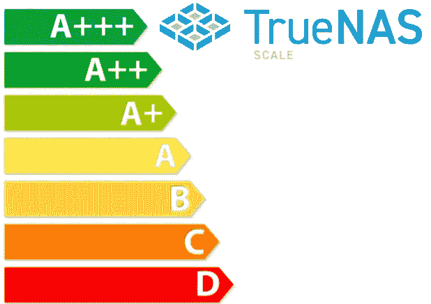

不久前，我写了一篇关于我的备份解决方案的博文。自那以后，我所在的欧洲发生了很多变化，最明显的是能源危机。在过去的 12 个月里，电力和天然气价格大幅上涨，这直接影响了像我这样的个体经营者。在此期间，我的电费从€的每千瓦时 0.21 英镑涨到了€的 0.72 英镑。这是由多种因素造成的，但在荷兰，电价是与天然气价格挂钩的。由于天然气价格上涨是由于……*ehm*、地缘政治事件……(我就不说了)；电价也是如此。

可以肯定地说，我没有非常复杂的家庭实验室设置，远非如此。我倾向于成为一个技术极简主义者，试图用我需要的最小的服务足迹来有效地满足我的需求，同时重用旧的台式机来运行家中的关键服务。然而，即使在我的小设置中，一台 TrueNAS 服务器在角落里嗡嗡作响，每小时消耗 60W 的电力，按照我的提供商向我收取的每千瓦时电力的当前价格，每月运行€31.10 英镑。因为这台机器大部分时间都闲置着，这是浪费钱，所以我决定做点什么。

# 评估

对我来说，对于一台空闲的服务器来说，60W 听起来很耗电。因此，为了看看我能做些什么，我列出了我用于 TrueNAS 服务器的旧 PC 的所有规格:

*   华硕 Z170A 主板
*   带 DeepCool(双风扇)冷却器的英特尔 i7 6700K CPU
*   4 个 8GB DDR4 RAM 模块
*   256GB NVME M.2 固态硬盘
*   4 个 Western Digital RED 3.5 英寸硬盘
*   海盗船 CX600M PSU
*   3 个 BeQuiet 120mm 毫米机箱风扇

出于本文的目的，我将讨论三种主要的功耗。

## CPU 功耗

英特尔 i7 6700K CPU 的 TDP(热设计功率)为 95W。这意味着在满载时，CPU 将消耗高达 95 瓦的电能，但这可能更多地取决于 CPU 是否超频。当 CPU 空闲时，BIOS(如果启用了适当的设置)将利用电源优化来降低 CPU 的功耗。这种降低和/或优化功耗的能力统称为 C 状态，目前共有 6 种。根据 CPU 的年龄，您可能会有一些较低的 C-状态(1、2 和 3)和较新的 CPU 的 C6。C 状态越高，CPU 中空闲的电路越多，CPU 消耗的功率越少。

p 状态也旨在降低 CPU 的功耗，但通过操纵电压和频率来降低功耗。

## 磁盘功耗

像 Western Digital Red 这样的旋转磁盘即使在空闲时(不读或写)也要消耗大量的能量来保持旋转；事实上，根据我的测量，每个驱动器大约 3-5W，稍后您将会看到。相比之下，SSD 在空闲时消耗的功率要少得多，但就每 GB 成本而言，它在 NAS 设置中要贵得多，我认为不值得。

## 电源消耗

电源(PSU)通常是电脑构建中被忽视的部分，然而，质量差的电源可能会对一些顶级组件造成严重破坏。我总是选择体面的电源在我所有的建设，我从来没有一个组件死在我一直在建设计算机，足够说！

PSU 有不同的形状和形式，但只要说我总是选择至少 80+金 PSU 就够了。这意味着在 100%负载下，PSU 的效率将达到 87%。负载为 50%时，效率为 90%。这是 PSU 的一个重要特征，越接近 PSU 额定输出最大功率的 50%，效率就越高。换句话说，600 瓦的 PSU 在 300 瓦时效率最高。同样，在> 50%和< 50%时，PSU 的效率越来越低。在 60W 的功率下，我的服务器消耗了电源额定输出的 11%，效率不是很高。

# BIOS 调整—瓦特可以完成吗？；)

为了降低我的 TrueNAS 服务器的功耗，我进行了大量的反复试验。我将总结我所做的，并在最后揭示当前的功耗。

## 1.BIOS 更新

任何新机器的第一步都是刷新新的 BIOS 固件。这个过程因主板而异，但对我来说，我是通过 BIOS 中的内置工具下载的。大多数现代主板都是这样工作的，但是对于一些主板，你可以通过 u 盘手动操作。请阅读您的主板说明，如果您愿意，也可以跳过这一步。

## 2.CPU 时钟不足

欠频实际上是超频的对立面，有两个主要目标。第一种是通过给芯片本身提供较少的电压来降低 CPU 在负载下的温度。第二，由于温度较低，是为了防止热节流。应该注意的是，在空闲时，欠锁并不会对 CPU 功耗产生任何影响，因为 C 状态已经相当有效地管理了这一点。

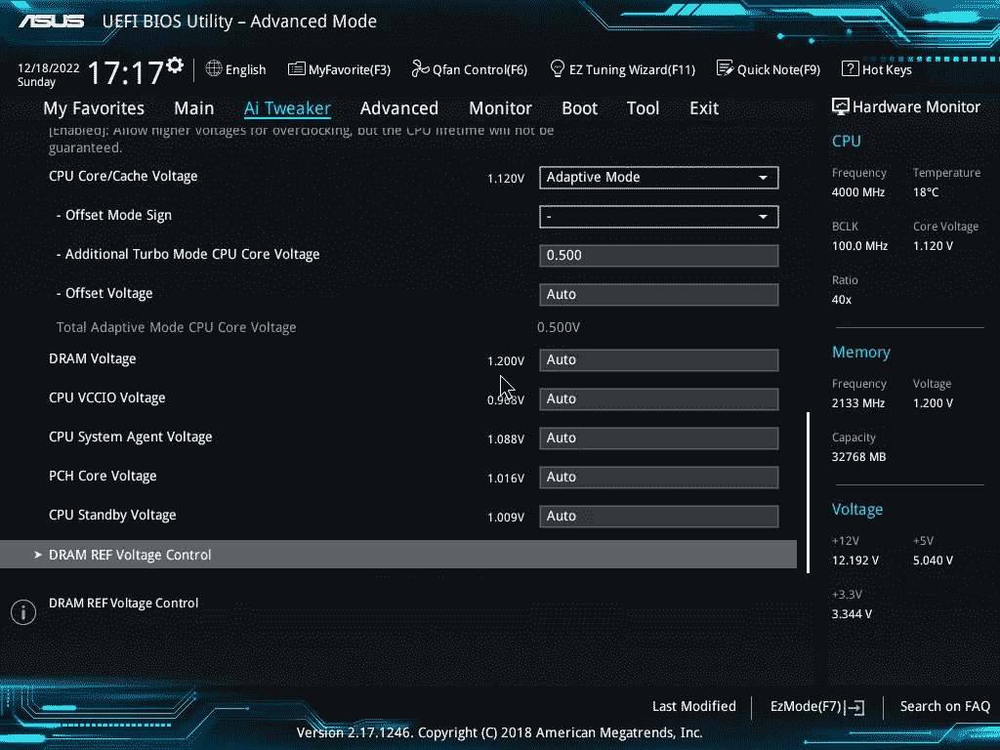

在上面的 BIOS 设置中，我将“CPU 内核/高速缓存电压”设置修改为自适应模式，并将“偏移模式符号”设置为“-”或“-”。这实际上减去了上面截图中“附加 Turbo 模式 CPU 内核电压”中设置的电压。在这种情况下，CPU 的时钟不足 0.500V。所有其他设置都保留为自动。

## 3.CPU 调整

在 Tweakers paradise 设置中，我将一切都设置为自动。英特尔 SpeedStep 也保持启用状态，但是我禁用了“加速模式”,因为我不需要此功能。

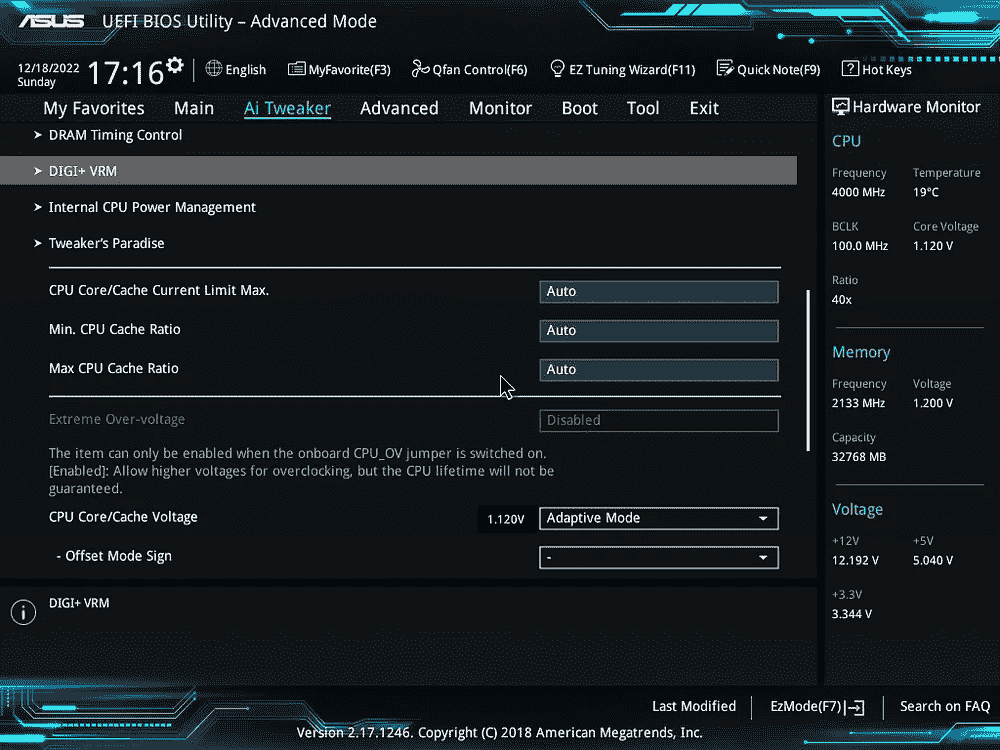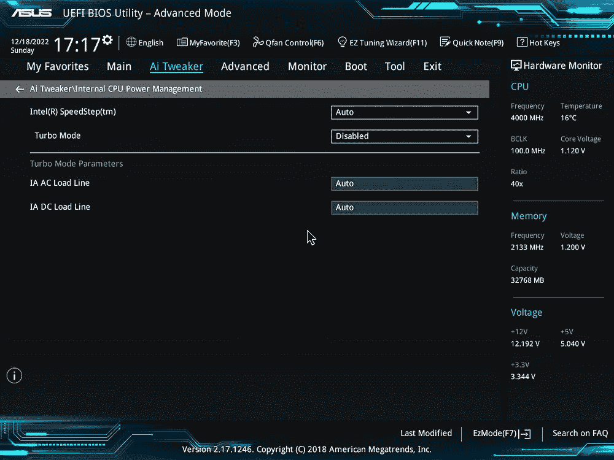

然后我禁用了“超线程”。HT 使用更多的 CPU 能力，因为它允许 CPU 内核在更长的时间内保持活动状态，同样是为了满足我在大部分时间处于空闲状态的 Linux 服务器上的需求，HT 会与节能产生相反的效果。虚拟化也被禁用了，因为我不打算使用这台机器来运行虚拟机(目前还没有…也许将来会有)。

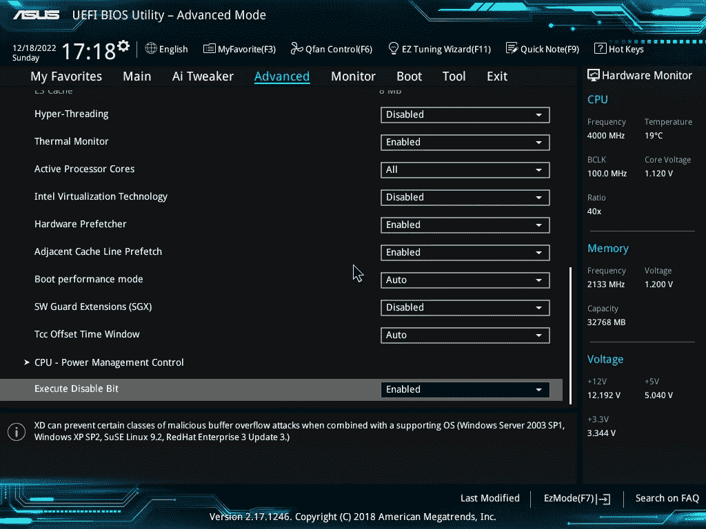

在“CPU 电源管理控制”下，还有一个地方可以禁用 SpeedStep，我假设这两个地方显示的设置是相同的。不管怎样，当它出现在这个屏幕上时，在这里也被禁用了。我把 C 状态设置为自动。

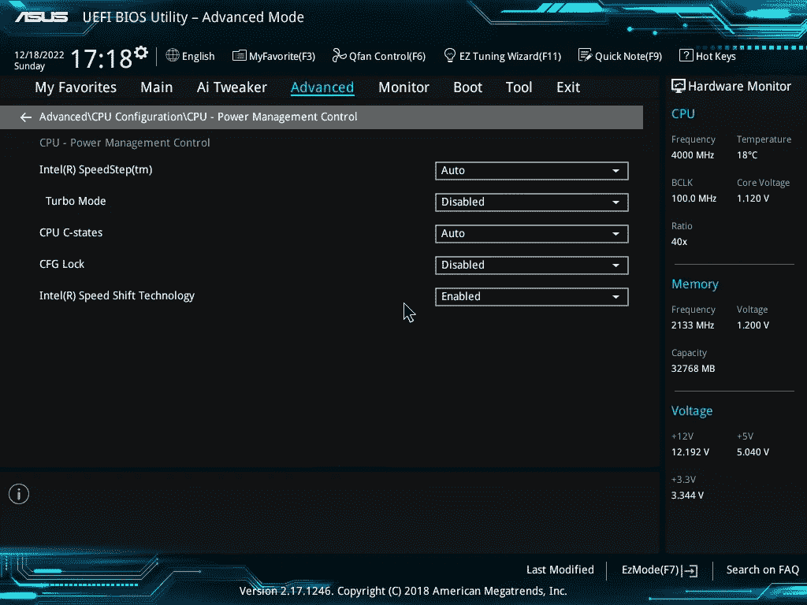

## 4.外围设备

主板包含许多消耗功率的附加电路。从 PCI express 插槽到内置音频、USB 等等。即使你不使用它们，它们在活动时也会消耗少量的能量。以下是我在板上禁用的内容:

*   禁用霹雳和霹雳 PCIe 支持

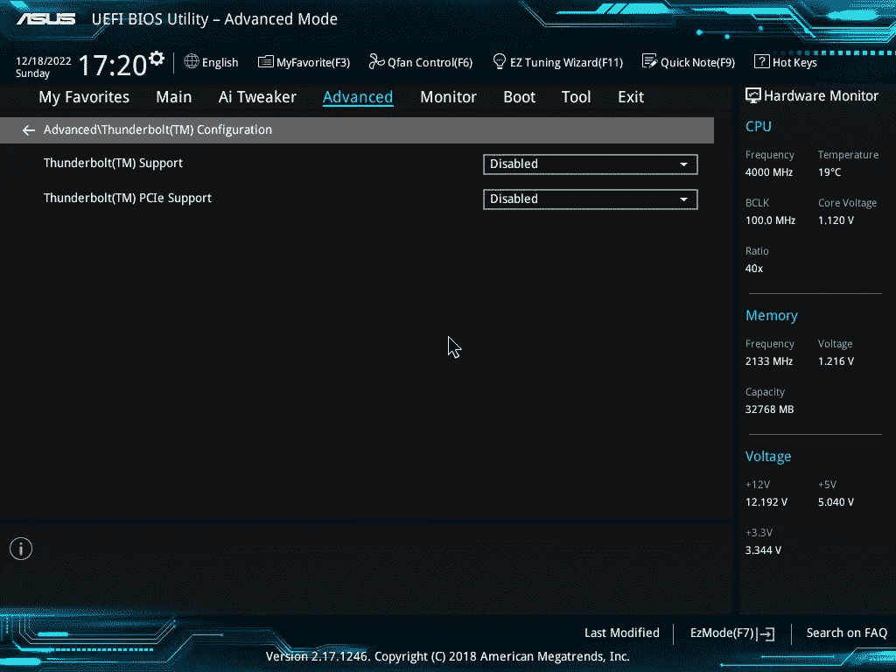

*   禁用高清音频，主板内置音频控制器
*   禁用 USB 3.1 充电支持
*   已禁用 led 设计开关。这会点亮主板上的内置 LED，使其具有未来感。因为我不太喜欢 LED，所以我把它关掉了。

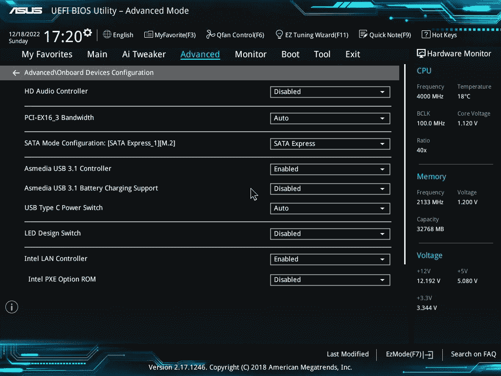

*   已启用内置 PCI 电源管理设置。这应该会关闭未使用的 PCI 设备。

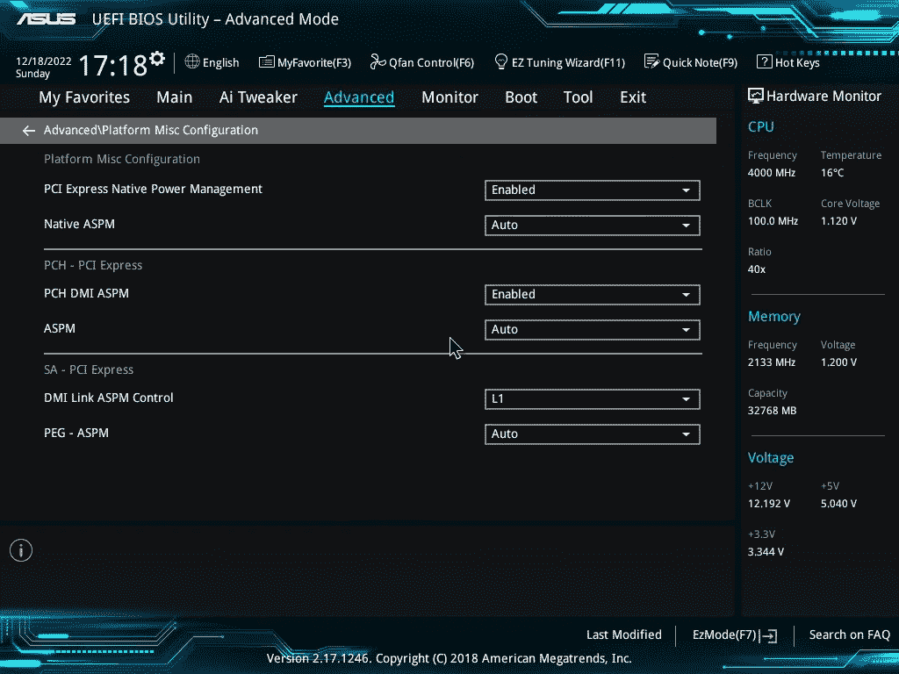

*   禁用所有 USB 3.1 端口-这些是主板背面的蓝色端口，很容易识别。从现在开始，只有黑色端口可以使用——方便键盘和鼠标使用。

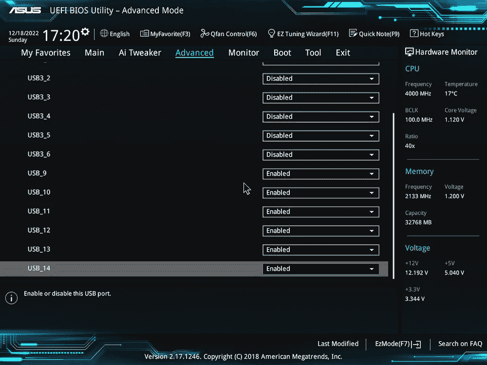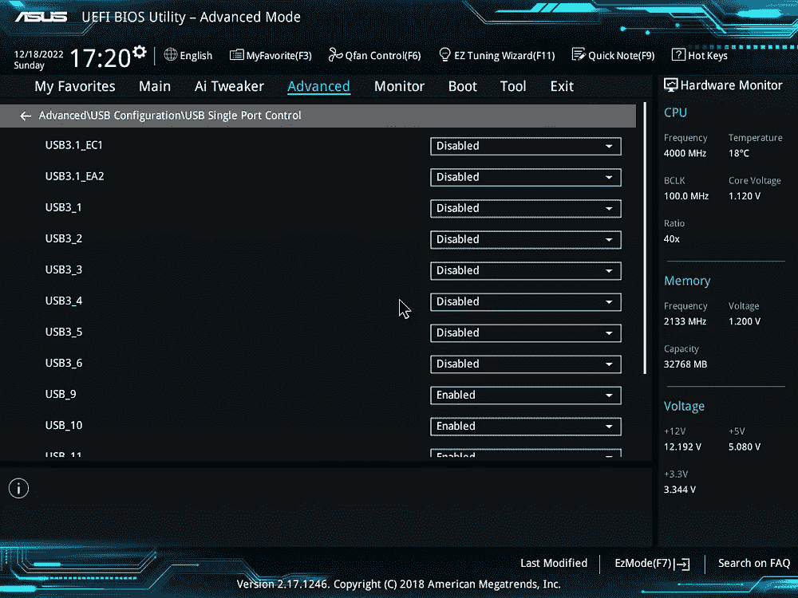

# TrueNAS 节能优化

虽然其中一些技巧是显而易见的，但我还是会在这里列出来。这些是我已经更改的各种设置和我在服务器上实现的软件实用程序。但是应该指出的是，我只将我的服务器用于备份，即没有实时编辑，没有 Plex 服务器，只是一个普通的旧文件系统，现在使用 rclone 定期从我网络上的设备中收集文件。这意味着我确切地知道服务器什么时候会忙，其余的时间我知道它会空闲。

## 1.使用 powertop

对于我来说，我不记得 TrueNAS Scale 是否配有 powertop，但我认为它配有。我简单地运行了命令:

`powertop --auto-tune`

这个命令将自动指示 Linux 内核对它能找到合适的电源设置的所有硬件应用所需的电源优化。这马上救了 1-2W。

## 2.降速 3.5 英寸磁盘

如上所述，旋转磁盘非常耗电！为了省电，请在闲置一段时间后关闭它们。这需要双管齐下的方法。首先，将 TrueNAS 的日志从旋转磁盘池中移出(如果这是您在初始设置期间配置它的方式),并移到您的操作系统驱动器(理想情况下不是旋转磁盘)上。这可以通过高级日志设置下的 TrueNAS UI 来完成。即使您的主驱动器是一个旋转的磁盘，只有一个(或两个)旋转也比让它们都耗电要好。如果你的主操作系统磁盘是 SD 卡或闪存盘，我建议你不要这样做——它会立刻磨损硬盘。我不建议在闪存卡或 SD 卡上运行服务器，因为它们对高读/写周期非常敏感，相当不可靠。

其次，一旦你把文件从旋转的磁盘上移走，[把这个脚本安装到你的服务器上](https://github.com/ngandrass/truenas-spindown-timer)。此降速计时器脚本将定期检查您的旋转磁盘池的活动，如果没有活动，它将使磁盘降速。您可以完全控制等待的时间、磁盘必须空闲多长时间等。自述文件中的说明非常清楚，它对我来说完美无缺。通过 TrueNAS UI 将脚本添加到 init / boot 脚本中，您就可以开始工作了。

## 3.整合工作

整合所有计划任务，使它们一起运行或尽可能靠近运行。ZFS 清理任务、备份作业、快照、云上传等。都可以在几个小时内运行，具体取决于数据集的大小。目的是最大化硬件的空闲时间，最小化硬件的睡眠/唤醒周期。

# 结果——成功了吗？

响亮的是。只需调整 BIOS，降低 CPU 功耗，并禁用不必要的硬件，墙壁电源测量值就降至 37W 左右。在为旋转磁盘 ZFS 池实施降速脚本后，我现在让我的服务器以 28W 的功率空闲。那是相当不同的！

我还测量了有和没有机箱风扇和 CPU 冷却器的情况。CPU 冷却器，因为它是相当低效的，使用 3 和 4W 之间。我可以用一个被动冷却器来代替它，这样可以将我的功耗降低 23 到 24W。对于 ATX 的外形来说，这是非常高效的，我对结果非常满意。

也就是说，当我的备份服务器的唯一备份计划设置为每周运行一次时，我仍然无法证明全天运行备份服务器是合理的。目前，我有一个智能插头，它会在每周的固定时间自动启动，触发“打开交流电”BIOS 设置并给机器通电。我留出几个小时来运行我的备份流程，并完成所有其他 TrueNAS 日常工作。然后，cronjob 会在插件自动关闭之前关闭服务器。感谢 Google Home！这当然是最节能的设置，同样，我使用我所需要的，而不是燃烧树木来毫无理由地闲置机器。

我希望这能帮助其他人降低旧硬件的功耗！

如果你从这篇文章中受益，请考虑关注我，这是在媒体上建立追随者基础并确保我的努力到达目标受众的唯一方法。