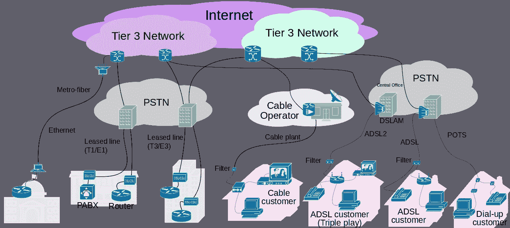
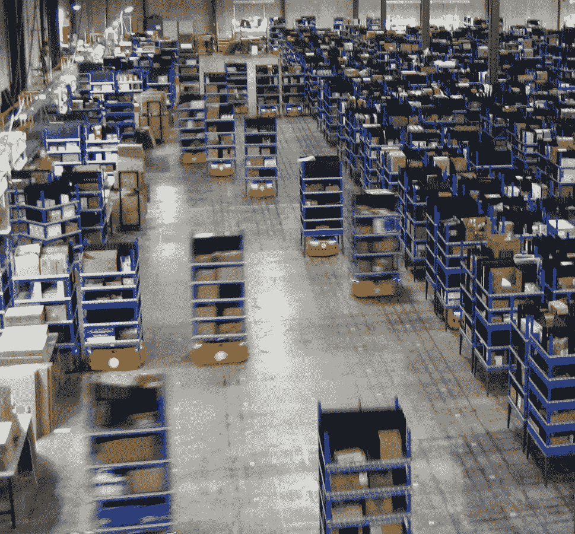
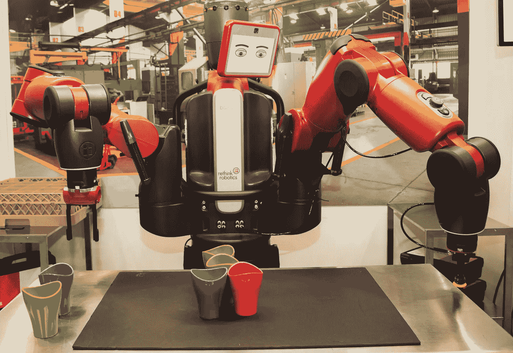
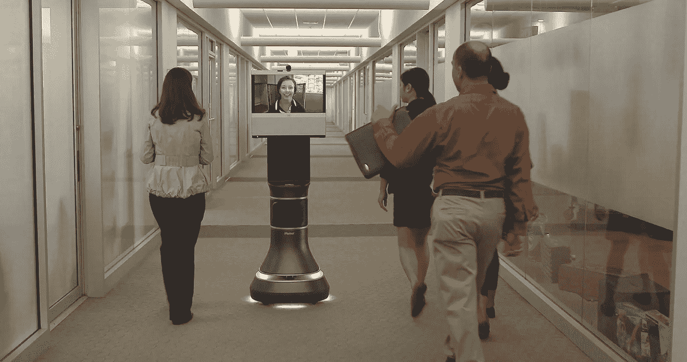
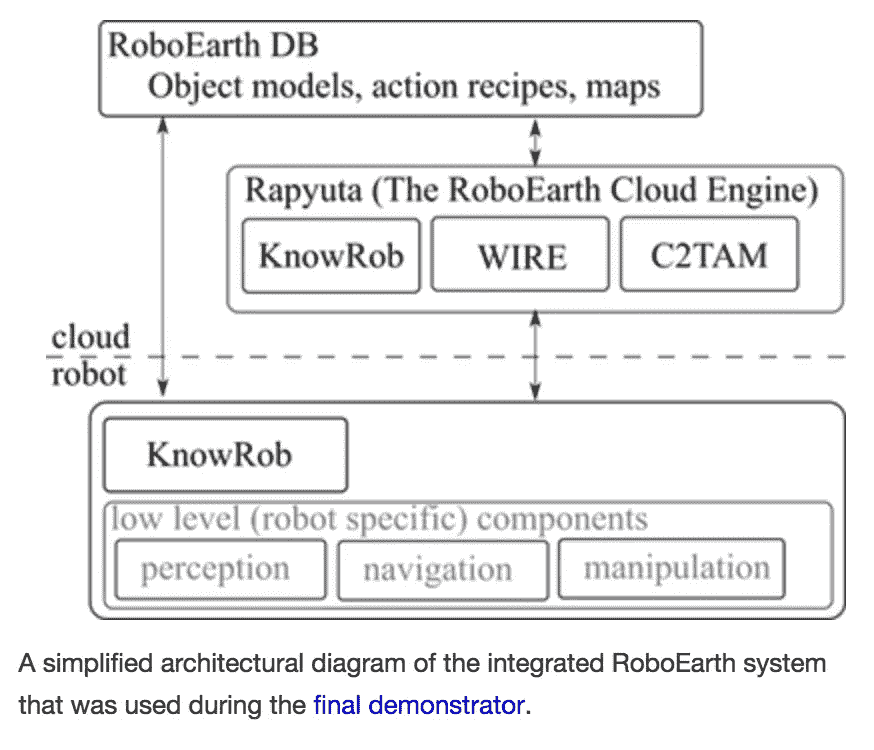
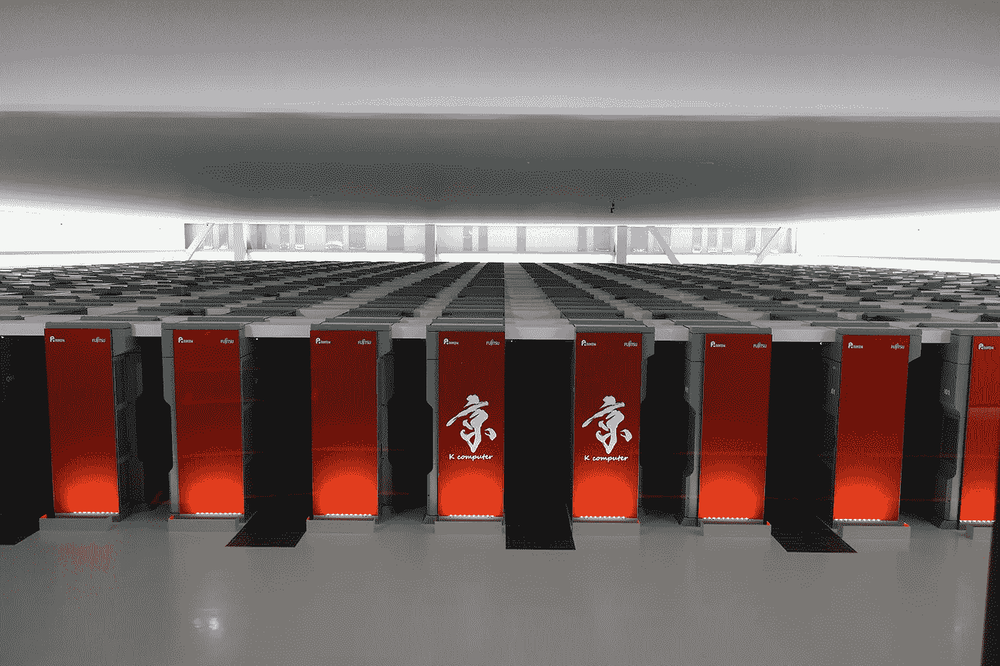

# 特朗普对 MAGA 的奇点

> 原文：<https://itnext.io/trump-to-maga-with-the-singularity-9e1da62ac18c?source=collection_archive---------0----------------------->

[*点击这里在 LinkedIn* 上分享这篇文章](https://www.linkedin.com/cws/share?url=https%3A%2F%2Fitnext.io%2Ftrump-to-maga-with-the-singularity-9e1da62ac18c)

和很多我读过的 [**雷·库兹韦尔的**](https://en.wikipedia.org/wiki/Ray_Kurzweil)[***奇点就在***](https://en.wikipedia.org/wiki/The_Singularity_Is_Near) 附近，他在其中描述了机器智能和人类智能融合的点。库兹韦尔利用他的[***加速回报定律***](http://www.kurzweilai.net/the-law-of-accelerating-returns) 预测了计算机、遗传学、纳米技术、机器人和人工智能等技术的指数增长。库兹韦尔著名地计算出奇点将在 2045 年左右到来。

许多**的科学家，尤其是****和科幻作家，除了库兹韦尔，都写过关于 [**技术奇点**](https://en.wikipedia.org/wiki/Technological_singularity) 智能机器将主宰人类生活的文章。在所有这些著作中，技术的加速进步和人类生活方式的改变，给人一种人类历史上接近某一点的感觉，超过这一点，我们所知道的人类事务就无法继续下去了。******

****虽然奇点著作和预言已经被广泛传播和理解，但它们也被广泛认为不太可能。这是微软联合创始人保罗·艾伦(Paul Allen)在《麻省理工科技评论》**中写的关于库兹韦尔的预测，“*这个预测在我们看来相当牵强*”。******

************

******然而，特朗普总统的联邦通信委员会(FCC)主席 [**阿吉特·帕** i](https://en.wikipedia.org/wiki/Ajit_Pai) ，似乎已经决定他可以“ ***【让美国再次伟大(MAGA)*** ”结束关于所谓的“ [**网络中立**](https://en.wikipedia.org/wiki/Net_neutrality) ”的规定，并在库兹韦尔预测的 2045 年之前实现这一奇点。“网络中立”，是哥伦比亚大学媒体法教授 [**Tim Wu**](https://en.wikipedia.org/wiki/Tim_Wu) 在 2003 年提出的一个术语，作为一个由来已久的概念的延伸****，用来描述通信公司的权利和责任。**********

******在不到四年的时间里，Pai 主席和 Trump FCC 第二次考虑终止网络中立法规，这样，互联网服务提供商(ISP)将不再被要求对所有数据一视同仁，无论这些数据的来源或目的如何。“网络中立”一词指的是这样一条原则，即你的互联网提供商不应该因为不喜欢网络内容或者因为有人没有背着消费者付钱给他们而被允许限制对网络内容的访问。如果没有奥巴马时代的规则，Pai 主席和特朗普总统将确保互联网的每个方面都掌握在少数几家大型电信公司手中，这些公司实际上垄断了大多数领域，这就是特朗普/Pai 战略的高明之处。******

******最后，媒介不是信息，互联网是一种媒介，一个仓库和一个档案。迄今为止，它最大的优点一直是它最大的弱点:它是非选择性的。这意味着它在这个词的两种意义上都是不歧视的。它的包容原则是不分青红皂白的:任何东西都可以进入其中。但它也——至少到目前为止——不歧视任何能接触到它的人。******

************

******特朗普/帕伊的战略是通过让大企业和联邦政府对互联网实施几乎完全的控制来改变这一愿景。知识可能不等同于权力，但对特朗普总统和派主席来说，它无疑是一种权力手段。互联网本身是无私的，但特朗普政府非常有兴趣利用互联网作为一种手段，让已经庞大的电信公司处于一个带来奇点的位置，并使自己在经济上更加庞大。******

******网络中立法规的反对者、特朗普总统的政治盟友认为，[**【ISP】**](https://en.wikipedia.org/wiki/Internet_service_provider)互联网服务提供商应该有权按照自己的意愿对流量进行优先排序并对服务收费，但他们这样做一直是个问题，因为他们被分配了像吴教授这样的自由主义者所描述的 [**公共运营商**](http://www.dictionaryofengineering.com/definition/telecommunications-common-carrier.html) 的责任。因此，这就是 Pai 主席和他的盟友打算如何绕过那些迄今令他们困惑的恼人的公共运营商法律。******

****如果没有网络中立性，互联网将成为美国电话电报公司、威瑞森、康卡斯特和其他一些大型电信企业的天下。一旦这种情况发生，有一件事是肯定的，那就是 ISP 将能够极大地改变互联网的传统定价模式。纽约佩斯大学赛登伯格计算机科学与信息系统学院院长乔纳森·希尔是这样描述它的工作原理的:****

*****“如果你是消费者，每个人都将为青铜、白银和黄金套餐付费，如果你没有黄金套餐，祝你好运赶上《权力的游戏》。这将是一个更慢、更令人沮丧的过程。”*****

****总而言之,“特朗普/帕伊互联网”的唯一真正用户将是那些有能力成为提供其基础设施的其余电信企业客户的人。客户支出的整个问题将留给古老的竞争定价原则，“无论市场将承受什么*”，这正是特朗普总统知道的让美国变得伟大的政策，并将再次这样做。
特朗普/帕伊的这一高明策略，还将在雷·库兹韦尔(Ray Kurzweil)2045 年的预测之前，有效地实现奇点，在所有风险投资技术专家的心中激起特朗普和帕伊，并确保那些肯定会成为世界上最赚钱的企业为连任竞选做出大量贡献。*****

*****随着网络中立性的终结，互联网本质上将成为一个开展业务和推动电信行业盈利的网络。它将成为一个网络，在这个网络上，企业分担运营曾经是私人电信网络的成本。互联网将会像传统的私有网络一样被使用，这是为了榨干做生意的每一滴交易成本。*****

*****从本质上讲，互联网将被改造成旧的电子数据交换(EDI)系统的现代版本。EDI 系统已经存在了 30 多年，它提供的标准和协议被用作所有有抱负的企业的进入壁垒。令 EDI 俱乐部成员沮丧的是，它的服务变得对所有有互联网的人都是免费的(T4)。随着 Trump/Pai 战略的实施，互联网将再次回到一个专属俱乐部，并像所有商业俱乐部一样进行管理，即“*最大限度地降低其成员的交易成本*”。规模经济将成为互联网的主要经营原则，所提供的服务将使商业客户能够最大限度地降低成本。想想所有已经到位的“无人”仓库和无处不在的机器人，就等着专属网络来驱动其成员的利润。*****

*****下面是 [**亚马逊机器人**](https://www.amazonrobotics.com/#/) 运营的一个亚马逊配送中心的图片。*****

**********

*****亚马逊机器人技术允许 Amazon.com 运营“无人”配送中心，使用机器人从货架上挑选商品；将物品装入箱子；将箱子放入货盘，甚至装上卡车——所有这些都无需人工参与。Kiva Systems 现在归亚马逊所有，由亚马逊机器人公司运营，也被 Staples、Crate & Barrel 和 Gap 等零售商使用。*****

*****一个机载摄像头使机器人能够通过读取仓库地板网格系统上的 2D 条形码来导航。当机器人到达正确的位置时，它会取出一个装有物品的移动容器，然后将其运送回给完成订单的工人。人们仍然需要把物品放进盒子里，完成包装——包装礼物；添加包装材料；密封纸箱；贴上邮寄标签，但使用机器人节省的总体劳动力让杰夫·贝索斯成为了世界上最富有的人，也让特朗普总统更加嫉妒，并打算利用亚马逊技术让特朗普的盟友更加富裕。*****

*****另一个有趣的模式正在从 [**Rethink Robotics** 出现。](http://www.rethinkrobotics.com/) Baxter，如下图所示，看起来更像我们许多人在电影中看到的机器人，它有两只类似人类的手臂，可以用于基本的零件处理；简单的线路装卸；打包和解包任务。*****

**********

*****巴克斯特最重要的特点是人类可以和它并肩作战。机器人可以在几分钟内被训练好。不需要软件或机器人方面的专业知识，生产线可以在没有机器人技术人员参与的情况下更换。*****

*****然而，辉煌的特朗普/帕伊战略并不止于仓库或工厂的围墙。电信公司将能够从服务机器人身上获得几乎同样多的利润。凭借其出色的灵活性和多功能性，移动物流机器人可以用于成千上万的企业，如医院、杂货店、托儿所，当然也可以用于几乎所有美国人的家庭。*****

*****世界各国都在努力解决如何照顾越来越多的老年人的问题。根据皮尤研究中心(Pew Research Center)的数据，美国 65 岁及以上人口的比例目前为 13%，但预计到 2050 年这一数字将翻一番，美国甚至还不算是世界上最长寿的国家——这个头衔是为日本保留的。事实上，日本目前 20%的人口年龄在 65 岁或以上。*****

**********

*****随着各国老年人数量的攀升，护理人员的数量仍然停滞不前。到 2020 年，四分之一的欧洲人将超过 60 岁。在他们的银发时代，许多人愿意呆在家里，需要家人或社会工作者的照顾。不幸的是，由于人口结构的变化和工作家庭的增加，护理人员的数量逐年减少。这导致了对大多数西方社会构成重大挑战的“保健赤字”。*****

*****用“ [**”替代连接到互联网的“护理机器人**](http://robohub.org/tag/carebots/) ”，人类护理员不仅会为电信公司带来利润，还会为提供机器人护理员的公司带来巨额利润。国际标准化组织(ISO)是一个为 164 个成员国制定标准的独立组织，最近创建了一个新标准，以确保护理机器人和人类之间的互动保持安全——突出了越来越多的这种性质的机器人。*****

*****该标准的正式名称是服务机器人 ISO 13482 标准，它允许“密切的人机交互，以便在发生事故时免受诉讼，”机器人学教授 Gurvinder Virk 说，他帮助领导了 ISO 标准的创建。*****

**********

*****然后是“办公室”，全世界数百万白领工人在这里度过他们的大部分时间。*****

*****[**网真机器人**](https://www.forbes.com/sites/parmyolson/2013/06/27/rise-of-the-telepresence-robots/#72b50cdac034) 像 iRobot 的艾娃，在相邻的照片中，是第一个“协作机器人”艾娃 500 是由 iRobot 与思科的网络专家合作制造的。它旨在使人们能够协作，即使他们不在同一个物理位置。艾娃 500 实际上是该平台第二次投入使用。第一个是 RP-Vita，iRobot 将其描述为“远程医疗解决方案”，或者基本上是一个用于医院的远程呈现机器人，让医生远程访问患者和现场护理团队。*****

*****远程呈现机器人允许护理人员和家人远程拜访患者的家。没有必要拿起电话，或启动电脑。这个机器人，本质上是一个轮子上的视频会议系统，会开到你面前并开始对话。这个想法并不是要取代面对面的拜访，而是要让它们更频繁地发生，并且在最重要的时候发生。想象一下，有一个亲戚一天来几次——尽管有时是虚拟的——或者在需要的时候能够寻求帮助。*****

*****Trump/Pai 战略最吸引人的方面可能是，如上所述，所有机器人都将连接到互联网，由电信/互联网服务提供商集团控制。电信公司将能够设定他们的定价模型，这样每当机器人向运行在中央计算机上的人工智能(AI)软件发出请求时，他们就可以收取费用。这种配置使得这种策略对所有人都更具吸引力，因为有了集中的人工智能软件，远程指挥机器人，这将使机器人本身的拥有和运营成本大大降低，对于机器人的企业所有者和互联网的剩余用户来说。*****

*****当连接到互联网时，机器人可以受益于现代数据中心的强大计算、存储和通信资源，这些资源可以处理和共享来自各种机器人或代理的信息。互联网计算技术使机器人系统具备强大的能力，同时通过集中技术降低成本。因此，将有可能建造重量轻、成本低、更智能的机器人，它们在互联网上拥有智能“大脑”。“大脑”将由数据中心、知识库、任务规划器、深度学习、信息处理、环境模型、通信支持等组成。*****

**********

*****例如[**roboeearth**](http://roboearth.ethz.ch/)**是一个网络和数据库存储库，机器人可以在其中共享信息并相互学习，以及一个用于外包繁重计算任务的网络。机器人地球被描述为“机器人的万维网”。它汇集了来自德国、荷兰和西班牙五所主要大学的研究人员，并得到了欧盟的支持。*******

*******Large datacenters that offer remote services for robots will be centered around extraordinary super computers like “the K from Fujitsu and [**the IBM Sequoia**](https://en.wikipedia.org/wiki/IBM_Sequoia)**.** The [**K computer**](https://en.wikipedia.org/wiki/K_computer), named for the Japanese word “kei” (京), meaning 10 quadrillion (1016) is currently installed at the **Riken Advanced Institute for Computational Science** campus in Kobe, Japan.*******

*****K 执行 10 千万亿次浮点运算。(每秒浮点运算次数)。一千万亿次浮点运算相当于 10 ⁵.k 可以在一秒钟内完成 10 次⁵运算。*****

**********

*****K 计算机基于分布式内存架构，拥有超过 80，000 个计算节点。今天，它被用于各种复杂的应用，包括气候研究、灾难预防和医学研究，但 K 只是可用于支持特朗普/帕伊战略的计算机模型之一，该战略旨在通过消除网络中立性使美国再次伟大。*****

*****软件开发人员 Abhishek Kumar 创造了一种有趣的方法，用于预测从 20 世纪 50 年代到今天计算机处理能力的提高，以评估摩尔定律。Kumar 将 20 世纪 50 年代的 UNIVAC 与 K 的处理能力进行了比较，然后逐年计算改进情况，看看今天的计算机是比摩尔博士预期的更好还是更差。*****

*****1950 年的 UNIVAC 每秒 2000 次运算与 K 的 10 千万亿次相比似乎很可笑。(FLOPS 代表“每秒浮点运算数”)。一个千万亿次浮点运算是 1015 次运算。K 可以在一秒钟内完成 1015 次运算。库马尔问道:“如果我们只给 UNIVAC 一千万亿次指令，它需要多少时间来处理？根据他的计算，UNIVAC 执行一次千万亿次指令需要 15，855 年或大约 159 个世纪。K 可以在十分之一秒内完成同样的计算。*****

*****库马尔接着推理，根据摩尔定律，每两年计算能力应该增加一倍。从 1950 年开始，已经快 70 年了。除以 2，自 1950 年以来有 35 个两年期。根据摩尔定律，今天的计算能力应该是每秒 70，000 次(UNIVAC 的 2000 * 35)运算，但 K 的性能比这要好 14，000 倍。所以**K 的表现比摩尔定律预期的**要好 14000 倍。*****

*****尽管 K 的性能令人印象深刻，[**为美国能源部加州劳伦斯利弗莫尔国家实验室建造的 IBM 红杉**](https://en.wikipedia.org/wiki/IBM_Sequoia) 超级计算机在 2012 年成为地球上最强大的超级计算机。从那时起，Sequoia 和 K 就在性能改进上来回竞争，只是提供了更多的计算能力来实现 Trump/Pai 策略。*****

*****根据标准软件基准测试，IBM Sequoia 在 500.org([**http://www.top500.org/lists/2012/06**)](https://www.top500.org/lists/2012/06/)世界超级计算机排名中领先，使用 1，572，864 个处理器内核，每秒执行 16.32 千万亿次浮点运算。这标志着自 2009 年以来美国超级计算机首次登上排行榜榜首，现在 K 和红杉等超级计算机可以为特朗普/帕伊互联网提供动力，不受 buedensome 网络中立规则的限制，能够让美国再次伟大，更不用说让数百家电信企业再次伟大。*****

*****所有这些发展肯定会让他现在在谷歌担任机器学习工程总监的雷·库兹韦尔和他的同事更加钦佩他的加速回报的 T2 T3 定律 T4 T5 T6 T7。毕竟，谷歌将需要一种方法，在它所有的人类客户被数以千计的机器人取代后，继续赚取数百万美元，这些机器人需要奇点大师设计的人工智能(AI)软件。让美国再次伟大的奇怪的世界已经发生了。里根总统会感到骄傲的。*****

*****我希望这种对川普/派未来的展望能有所帮助，因为正如乔治·伯恩斯曾经说过的，“那是我们将要度过余生的地方”*****

*******备注:*******

1.  *****保罗·艾伦/奇点不在附近——麻省理工科技评论*****
2.  *****(https://money.usnews.com/money/blogs/my- money/articles/2017–08–02/8-获得权力的游戏的方法-_ x-不含 hbo)*****
3.  *****[http://small business . chron . com/简介-网络-协议-46550.html](http://smallbusiness.chron.com/introduction-network-protocol-46550.html)*****
4.  *****史蒂夫·基弗，“机器人和无人仓库”——垂直分类，2014 年*****
5.  *****[http://robo hub . org/robots-the-may-help-you-in-your-silver-age/](http://robohub.org/robots-that-may-help-you-in-your-silver-age/)*****
6.  *****Danielle Muoio，“日本开发老年人护理机器人”，《商业内幕》，2015 年 11 月 20 日*****
7.  *****丹尼尔·穆伊欧出价*****
8.  *****[https://en.wikipedia.org/wiki/K_computer](https://en.wikipedia.org/wiki/K_computer)*****
9.  *****[https://breathe publication . com/un ivac-vs-k-super computer-709909925 cf3](https://breathepublication.com/univac-vs-k-supercomputer-709909925cf3)*****