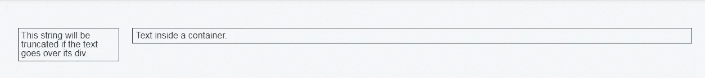
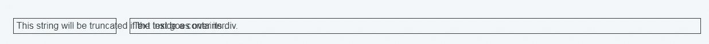
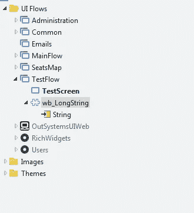
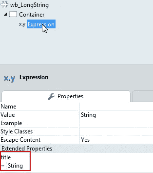
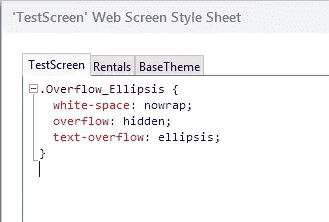
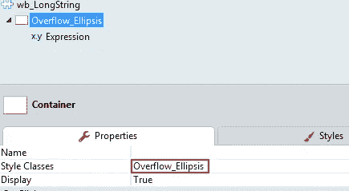
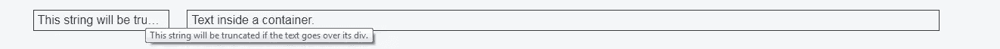
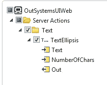

# 在 Outsystems 中用省略号(…)截断字符串

> 原文：<https://itnext.io/truncating-a-string-with-ellipsis-in-outsystems-640a10fc73b2?source=collection_archive---------3----------------------->

如果您是一名开发人员，您可能会遇到由于文本换行而使两倍大小的 div 或表格行中的文本溢出的问题。

使用 CSS 有一个非常简单的方法来处理这个问题。我将向您展示如何使用它，以及如何在外部系统中实现它。

出于演示的目的，我将使用 2 个容器来包装一些文本。第一个容器有一个不适合该容器的文本字符串，因此它将对文本进行换行，从而产生一个比预期更高的容器。他们应该有同样的高度。



所以我们需要修复文本换行。但是添加了 nowrap 属性，文本将溢出到下一个容器。

```
element.style {
    white-space: nowrap;
}
```



CSS 噩梦！

**这个怎么解决？**

如果应用 CSS " **text-overflow:省略号；**"将溢出的内容显示为省略号。还有其他选项，如*剪辑*或显示*自定义*字符串。[阅读更多](https://www.w3schools.com/cssref/css3_pr_text-overflow.asp)

```
.Overflow_Ellipsis {
  white-space: nowrap; 
  overflow: hidden;
  text-overflow: ellipsis;
}
```

**如何在 Outsystems 中解决这个问题？**

实际上很简单。你只需要将 CSS 应用到表达式中。

编辑:Outsystems 为此提供了一个 CSS 类，就像上面显示的那样。你可以在 web Patterns/Patterns _ silk ui Theme/找到它。Text_overflow

但是让我们更进一步，让它成为外部系统中可重用的 webblock:

*   创建一个新的 Webblock，它将只获取一个文本作为输入参数:



*   将容器内的表达式添加到 webblock 屏幕，并将其值设置为“String”(输入参数)
*   将表达式的工具提示(标题)设置为“字符串”(输入参数):



您还可以在 webblock 中添加一个输入参数来设置标题或不设置标题。

*   将 CSS 类添加到主题中，或者只添加到屏幕中:



*   将 CSS 类“Overflow_Ellipsis”设置为小部件所在的容器:



*   将网络块拖放到所需的网络屏幕上。

就这样。我们现在有了一个可重用的 webblock，它提供了一个带有完整字符串的工具提示，如果文本不适合父容器，它会用省略号截断文本。



文本溢出 div 并应用 CSS“text-overflow:ellipsis”。带有完整文本的工具提示。

**结论**

如您所见，用标准 CSS 解决这个问题非常简单。我见过很多，在不同的项目中，开发人员在 Outsystems 中添加函数来用 ellispis 截断字符串。它们将获得一个字符串在容器中可以容纳的字符数作为输入，然后截断该字符串，在末尾添加省略号。请不要。很难维持。想象一下，在一个有文本表达式的 Web 屏幕上这样做，有人改变了布局。现在不是适合 10 个字符，而是适合 20 个。这看起来很奇怪，看到一个字符串被省略号截断，而它显然可以容纳更多的文本，对吗？

也许已经有一个用于外部系统的小部件可以完成我刚才解释的工作。我确实发现了一个我不喜欢的服务器动作(OutsystemsUIWeb)(你必须知道字符数)



OutsystemsUIWeb 中的 TextEllipsis 服务器操作

下一个故事再见！