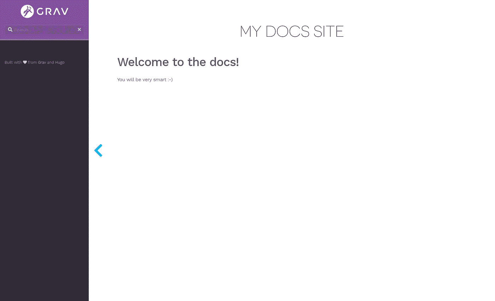
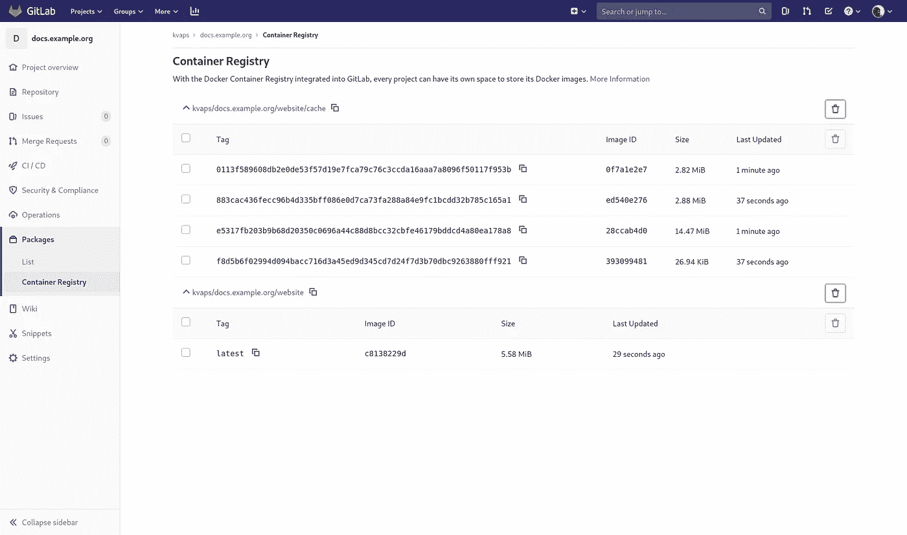
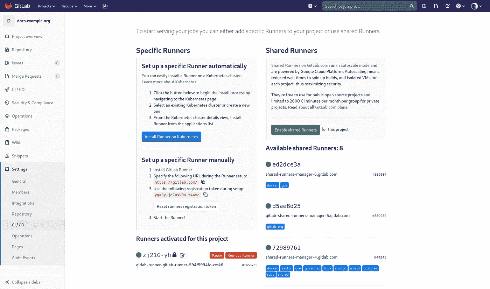
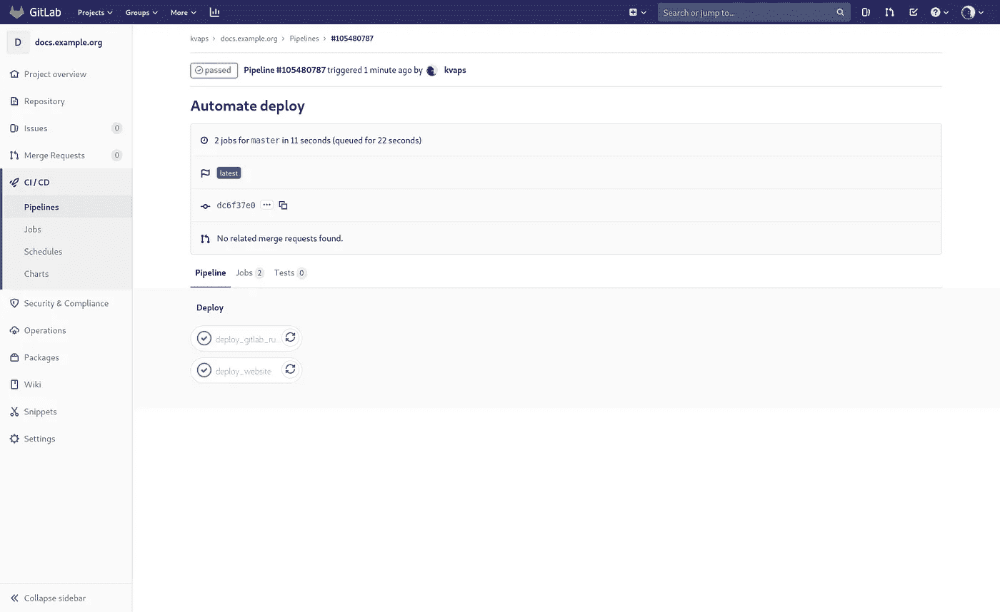
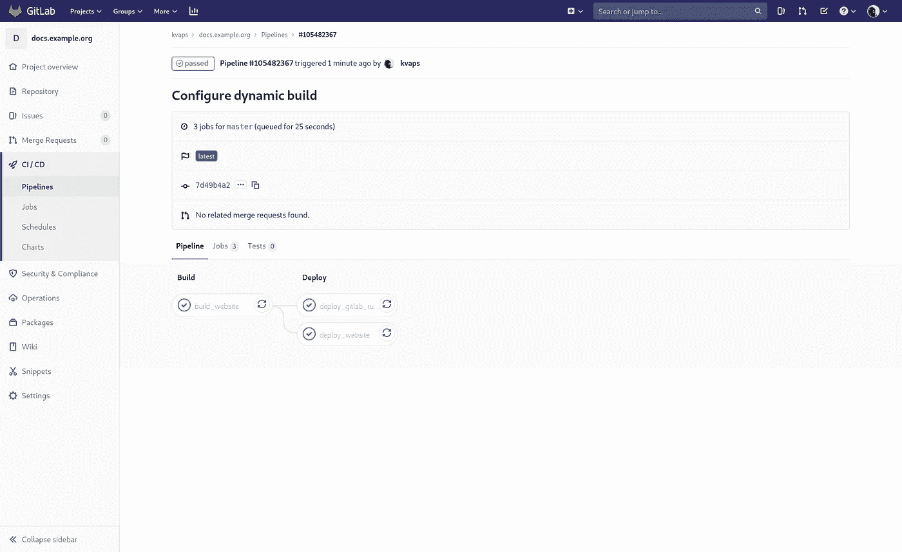
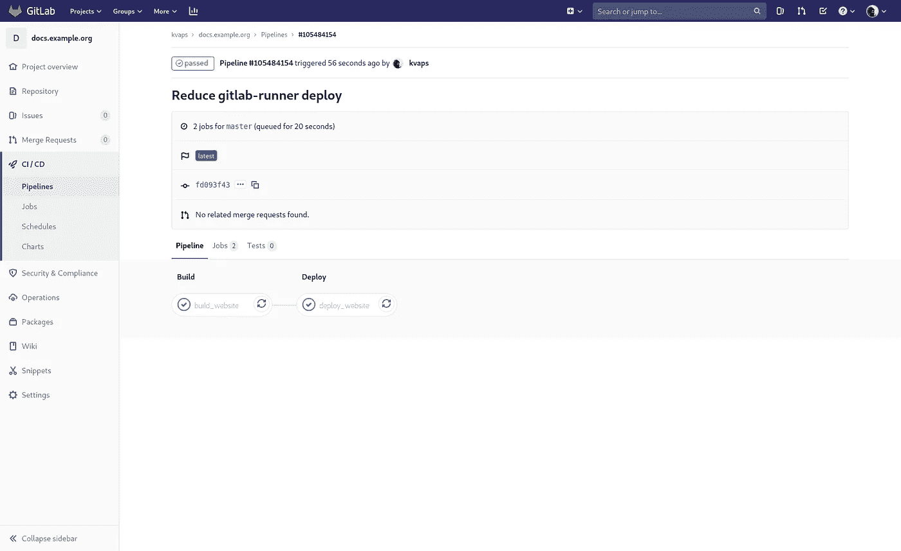
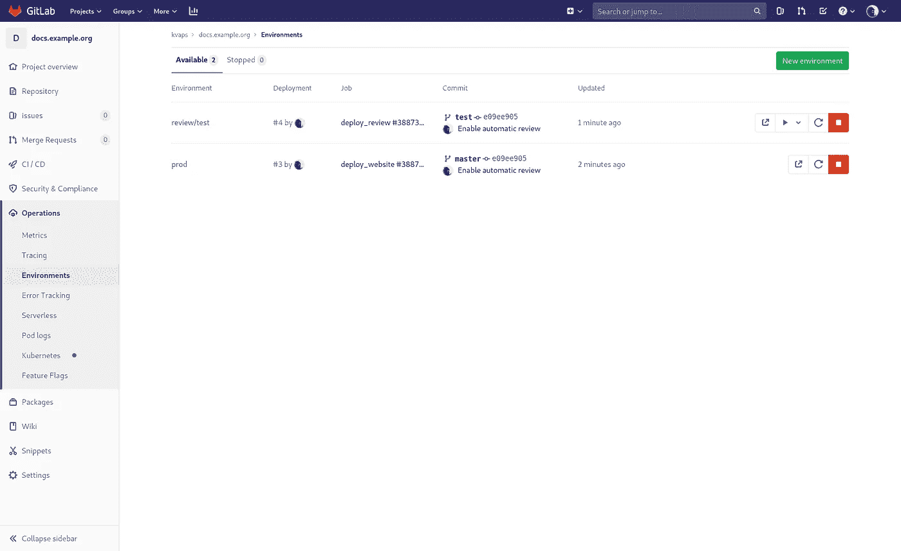
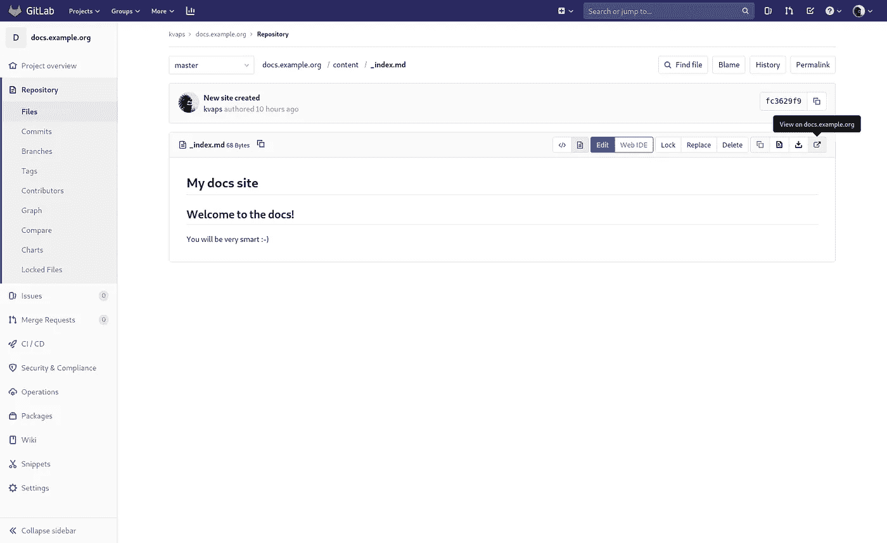

# 在 Kubernetes 中尝试构建和自动化部署的新工具

> 原文：<https://itnext.io/trying-new-tools-for-building-and-automate-the-deployment-in-kubernetes-f96f9684e580?source=collection_archive---------4----------------------->


克里斯托夫·高尔在 [Unsplash](https://unsplash.com?utm_source=medium&utm_medium=referral) 上拍摄的照片

嗨！
最近，许多很酷的自动化工具已经发布，既用于构建 Docker 映像，也用于部署到 Kubernetes。在这方面，我决定稍微玩一下 Gitlab，研究一下它的功能，当然还有配置管道。

这个作品的灵感来源是网站 [kubernetes.io](https://kubernetes.io/) ，它是从[源代码](https://gist.github.com/kvaps/github.com/kubernetes/website)自动生成的。对于每个新的 pullrequest，机器人会自动生成一个预览版本，并提供一个链接供查看。

我试图从头开始构建一个类似的过程，但完全建立在 Gitlab CI 和免费工具的基础上，我过去常常使用这些工具在 Kubernetes 中部署应用程序。今天，我最终会告诉你更多关于他们的事情。

本文将考虑具有动态环境特性的 **Hugo** 、 **qbec** 、 **kaniko** 、 **git-crypt** 和 **GitLab CI** 等工具。

# 内容

1.  [**雨果入门**](#f1d2)
2.  [**Dockerfile 准备**](#2dc8)
3.  [**kaniko**](#9bf2)入门
4.  [**qbec 入门**](#4c4b)
5.  [**用 Kubernetes-executor**](#f626) 尝试 Gitlab-runner
6.  [**用 qbec** 部署舵图](#e4f1)
7.  [**git-crypt 入门**](#29ed)
8.  [**准备工具箱图像**](#f67c)
9.  [**我们先对管线和建筑图片使用标签**](#fef1)
10.  [**部署自动化**](#3880)
11.  [**构件和建筑上推的主**](#83a1)
12.  [**动态环境**](#a684)

# 1.Hugo 入门

作为我们项目的一个例子，我们将尝试创建一个网站来发布基于 Hugo 的文档。 [**Hugo**](https://gohugo.io/) 是一个静态站点生成器。

对于那些不熟悉静电发生器的人，我给你讲一点。不同于普通的带有数据库的站点引擎和一些 PHP，它们会根据用户的请求动态生成页面，静态生成器的工作方式有所不同。
他们允许获取源文本，比如说 **Markdown** 标记和主题模板中的一组文件，然后将它们编译成一个完整的站点。

也就是说，在输出端你会得到一个目录结构和一组生成的 HTML 文件，这些文件可以简单地上传到任何便宜的主机上，并得到一个工作站点。

Hugo 可以在本地安装并试用:

初始化新网站:

```
hugo new site docs.example.org
```

还有 git-repository:

```
cd docs.example.org
git init
```

现在我们的网站是空的，如果我们想让一些东西出现在上面，首先我们需要连接一个主题。主题它只是一套模板和预设规则生成我们的网站。

我们将使用 [**学习**](https://themes.gohugo.io/hugo-theme-learn/) 主题，这在我看来是最适合一个有文档的站点的。

请注意，我们不需要将主题文件保存在我们的存储库中，相反，我们可以使用 **git 子模块**简单地连接它:

```
git submodule add [https://github.com/matcornic/hugo-theme-learn](https://github.com/matcornic/hugo-theme-learn) themes/learn
```

因此，在我们的存储库中，只有与我们的项目直接相关的文件，没有其他的。连接的主题将只是一个到特定存储库和提交散列的链接，因此，它总是可以从原始源中提取，而不用担心不兼容的更改。

编辑配置`config.toml`:

现在我们可以访问 http://localhost:1313/ 并查看我们新创建的站点。目录中的所有更改都会自动更新浏览器中的页面，非常方便！

让我们试着创建一个标题页`content/_index.md`:

```
# My docs site## Welcome to the docs!You will be very smart :-)
```



创建页面的屏幕截图

要生成一个站点，只需运行:

目录`public/`中的内容就是你的站点。

顺便补充一下`.gitignore`:

```
echo /public > .gitignore
```

不要忘记提交我们的更改:

```
git add .
git commit -m "New site created"
```

# 2.Dockerfile 文件准备

是时候确定我们的存储库的结构了。通常我会用这样的词:

```
.
├── deploy
│   ├── app1
│   └── app2
└── dockerfiles
    ├── image1
    └── image2
```

*   `dockerfiles/` —包含 docker 文件目录和构建 docker 映像所需的一切。
*   `deploy/` —包含将我们的应用程序部署到 Kubernetes 的目录

因此，我们将沿着路径`dockerfiles/website/Dockerfile`创建第一个 docker 文件

正如你所看到的，docker 文件包含两个`FROM`，这个机会被称为 [**多阶段构建**](https://docs.docker.com/develop/develop-images/multistage-build/) 并允许你从最终的 docker 映像中排除一切不必要的东西。因此，最终的图像将只包含我们静态生成的站点和 **darkhttpd** (轻量级 HTTP-server)的内容。

不要忘记提交我们的更改:

```
git add dockerfiles/website
git commit -m "Add Dockerfile for website"
```

# 3.kaniko 入门

我决定使用 [**kaniko**](https://github.com/GoogleContainerTools/kaniko) 来构建 docker 映像，因为它不需要运行 docker 守护进程。构建可以在任何主机上完成，这些层可以直接缓存在 docker-registry 中，不再需要完整的持久存储。

要构建映像，只需用 **kaniko executor** 启动容器，并将当前的构建上下文传递给它，您可以在本地使用 docker:

```
docker run -ti --rm \
  -v $PWD:/workspace \
  -v ~/.docker/config.json:/kaniko/.docker/config.json:ro \
  gcr.io/kaniko-project/executor:v0.15.0 \
  --cache \
  --dockerfile=dockerfiles/website/Dockerfile \
  --destination=registry.gitlab.com/kvaps/docs.example.org/website:v0.0.1
```

其中`registry.gitlab.com/kvaps/docs.example.org/website`是您的 docker 映像的名称，在构建之后，它将被自动推送到 docker 注册表中。

选项`--cache`允许缓存 docker 注册表中的层，对于给定的例子，它将保存在`registry.gitlab.com/kvaps/docs.example.org/website/cache`中，但您可以使用选项`--cache-repo`指定另一个。



docker-registry 屏幕截图

# 4.qbec 入门

Qbec 是一个部署工具，它允许你以声明的方式描述你的应用程序清单，并将它们部署到 Kubernetes。使用 Jsonnet 作为主要语法可以简化对几种环境差异的描述，并且几乎完全消除了代码的重复性。

当您需要将一个应用程序部署到几个具有不同参数的集群中，并且希望用 Git 声明性地描述它们时，这非常有用。

Qbec 也允许你通过传递必要的参数来渲染舵图，然后像操作通常的宣言一样操作它们。它允许您为它们添加一些突变，并且消除了使用 ChartMuseum 的需要。通过这种方式，您可以直接从 git 中存储和呈现图表，因为它们在 git 中占有非常重要的位置。

如前所述，我们将所有部署存储在一个目录`deploy/`中:

```
mkdir deploy
cd deploy
```

让我们初始化我们的第一个应用程序:

```
qbec init website
cd website
```

现在，我们的应用程序的结构如下所示:

```
.
├── components
│   ├── gitlab-runner.jsonnet
├── environments
│   ├── base.libsonnet
│   └── default.libsonnet
├── params.libsonnet
├── qbec.yaml
├── secrets
│   └── base.libsonnet
└── vendor
    └── gitlab-runner (submodule)
```

看文件`qbec.yaml`:

这里我们主要对`spec.environment`感兴趣，qbec 已经创建了一个默认环境，并从我们当前的 kubeconfig 中获取了我们的名称空间和服务器地址。
现在，当使用**默认**环境时，qbec 将总是部署到指定的 Kubernetes 集群和名称空间。这样，您不再需要在应用配置之前切换名称空间和上下文。
如有必要，您可以随时更新该文件中的设置。

您的所有环境都应该在`qbec.yaml`和`params.libsonnet`文件中描述，其中包含在哪里为它们获取参数的信息。

接下来我们看到两个目录:

*   `components/` —我们应用程序的所有清单都将存储在这里，我们可以使用 jsonnet 和普通的 yaml 文件来描述它们
*   `environments/` —这里我们将描述我们环境的所有变量(参数)。

默认情况下，我们有两个文件:

*   `environments/base.libsonnet` —包含所有环境的一般参数
*   `environments/default.libsonnet` —包含**默认**环境的参数覆盖

让我们打开`environments/base.libsonnet`，在那里添加第一个组件的参数:

创建我们的第一个组件`components/website.jsonnet`:

在这个文件中，我们描述了三个 Kubernetes 实体，它们是:**部署**、**服务**和**入口**。我们可以把它们分成不同的部分，但是在这个阶段，一个就足够了。

语法 **jsonnet** 与常规 json 非常相似。原则上，常规 json 已经是有效的 jsonnet，所以首先使用一些在线服务，如 **yaml2json** 来将您通常的 yaml 清单转换为 json 格式，或者如果您的组件不包含任何变量，它们可以完全作为通常的 yaml 文件放置。

> 我强烈推荐你为你的编辑器安装一个插件来使用 jsonnet。
> 
> 例如，vim 有一个很好的插件 **vim-jsonnet** ，它打开语法高亮显示，并在每次保存时自动运行`jsonnet fmt`(它需要安装 **jsonnet** 二进制文件)。

开始部署的一切准备就绪:

要查看具体会应用什么，只需运行:

```
qbec show default
```

在输出中，您将看到呈现的 YAML-manifest，它将应用于默认集群。

好，现在申请:

```
qbec apply default
```

在输出中，您将始终看到在您的集群中将进行哪些更改，qbec 将要求您接受这些更改。通过输入`y`你可以确认。

完成，现在我们的应用程序已经部署好了！

描述发生任何变化后，您都可以:

```
qbec diff default
```

查看这些更改将如何影响当前部署

不要忘记提交我们的更改:

```
cd ../..
git add deploy/website
git commit -m "Add deploy for website"
```

# 5.尝试用 Kubernetes-executor 运行 Gitlab-runner

直到最近，我只在一台准备好的机器(LXC 容器)上使用普通的 gitlab-runner，它带有 shell-或 docker-executor。
从一开始，我们就在 Gitlab 中定义了几个这样的跑步者。他们为我们所有的项目建立 docker 图像。

但实践表明，无论从实用性还是安全性来看，这种情况都不太理想。为每一个项目，甚至每一个环境部署单独的运行人员，这是更好的，也是更符合意识形态的。

幸运的是，这根本不是问题，因为现在我们将直接把 **gitlab-runner** 作为我们应用程序的一部分直接部署到 Kubernetes。

Gitlab 提供了在 Kubernetes 中部署 gitlab-runner 的导航图。因此，您需要做的就是在**设置→ CI / CD → Runners** 中找到我们项目的**注册令牌**，并将其传递给 Helm:

```
helm repo add gitlab [https://charts.gitlab.io](https://charts.gitlab.io)helm install gitlab-runner \
  --set gitlabUrl=[https://gitlab.com](https://gitlab.com) \
  --set runnerRegistrationToken=yga8y-jdCusVDn_t4Wxc \
  --set rbac.create=true \
  gitlab/gitlab-runner
```

其中:

*   `https://gitlab.com` —是您的 Gitlab 服务器的地址。
*   `yga8y-jdCusVDn_t4Wxc` —是您项目的注册令牌。
*   `rbac.create=true` —为跑步者提供所有必要的权限，以便使用 Kubernetes-executor 创建新的 pod 并执行我们的工作。

如果一切正常，您应该在项目设置页面的**跑步者**部分看到注册的跑步者。



[新增跑步者截图](https://habrastorage.org/webt/at/lx/g_/atlxg_u6rjn4n0pkcpn8--2gare.png)

有这么简单吗？———对，就这么简单！不再有手动跑步者注册的麻烦，因为现在所有的跑步者都将被自动创建和销毁。

# 6.用 qbec 部署舵图

既然我们决定将 **gitlab-runner** 作为我们项目的一部分，现在是时候在我们的 Git-repository 中描述它了。

我们可以把它描述为**网站**的一个独立组件，但是将来我们计划经常部署**网站**的不同副本，不像`gitlab-runner`，每个 Kubernetes 集群只部署一次。所以让我们为它初始化一个单独的应用程序:

```
cd deploy
qbec init gitlab-runner
cd gitlab-runner
```

这一次我们不会手动描述 Kubernetes 实体，而是使用一个现成的舵图。qbec 的优势之一是能够直接从 Git 存储库呈现舵图。

让我们使用 git 子模块来连接它:

```
git submodule add [https://gitlab.com/gitlab-org/charts/gitlab-runner](https://gitlab.com/gitlab-org/charts/gitlab-runner) vendor/gitlab-runner
```

现在,`vendor/gitlab-runner`目录包含了到带有 gitlab-runner 图表的存储库的链接。

> 类似的方式，你可以和其他存储库连接，例如，整个存储库用官方图表[**https://github.com/helm/charts**](https://github.com/helm/charts)

让我们来描述一下组件`components/gitlab-runner.jsonnet`:

`expandHelmTemplate`的第一个参数是图表的路径，然后是从环境参数中获取的`params.values`，然后是一个带有

*   `nameTemplate` —发布名称
*   `namespace` —名称空间传递给掌舵人
*   `thisFile` —传递当前文件路径的必需参数
*   `verbose` —呈现图表时将显示`helm template`命令及其所有参数

现在让我们描述一下`environments/base.libsonnet`中组件的参数:

注意我们从外部文件`secrets/base.libsonnet`中取出`runnerRegistrationToken`，让我们创建它:

检查一切是否正常:

```
qbec show default
```

如果一切正常，那么我们可以移除早期部署的头盔释放装置:

```
helm uninstall gitlab-runner
```

并再次部署它，但是使用 qbec:

```
qbec apply default
```

# 7.git-crypt 入门

[**Git-crypt**](https://github.com/AGWA/git-crypt) 是一个允许你为你的存储库配置透明加密的工具。

目前，gitlab-runner 的目录结构如下所示:

```
.
├── components
│   ├── gitlab-runner.jsonnet
├── environments
│   ├── base.libsonnet
│   └── default.libsonnet
├── params.libsonnet
├── qbec.yaml
├── secrets
│   └── base.libsonnet
└── vendor
    └── gitlab-runner (submodule)
```

但是在 Git 中保存秘密并不安全，不是吗？所以我们需要通过适当的方式对它们进行加密。

> 通常只对单个变量没有多大意义，因为你可以使用 CI 系统的环境变量将秘密传递给 **qbec** 。
> 
> 但是请注意，可能有更复杂的项目，其中可能包含更多的秘密。使用环境变量很难通过所有的测试。
> 
> 同样在这种情况下，我也不能告诉你像 **git-crypt** 这样一个奇妙的工具。
> 
> Git-crypt 也非常方便，因为它允许你保存秘密的整个历史，以及以与使用标准 Git 相同的方式比较、合并和解决冲突。

安装 **git-crypt** 后的第一步，我们需要为我们的存储库生成密钥:

```
git crypt init
```

如果您有 PGP-key，那么您可以立即将自己添加为此项目的合作者:

```
git-crypt add-gpg-user kvapss@gmail.com
```

因此，您总是可以使用您的私钥解密这个存储库。

如果您没有 PGP-key，也不打算拥有它，那么您可以使用另一种方法导出项目密钥:

```
git crypt export-key /path/to/keyfile
```

这样，任何拥有导出的**密钥文件**的人都可以解密您的存储库。

是时候配置我们的第一个秘密了。
记住我们仍然在目录`deploy/gitlab-runner/`中，这里有目录`secrets/`，让我们加密里面的所有文件。为了实现这一点，我们应该创建包含以下内容的文件`secrets/.gitattributes`:

从内容中可以看出，所有文件掩码`*`都将通过 **git-crypt** 运行，除了`.gitattributes`本身

我们可以通过执行以下命令验证这一点:

```
git crypt status -e
```

在输出中，我们看到存储库中所有启用了加密的文件的列表

这就是全部，现在我们可以勇敢地提交我们的更改:

```
cd ../..
git add .
git commit -m "Add deploy for gitlab-runner"
```

要锁定存储库，只需执行以下操作:

```
git crypt lock
```

所有加密的文件都将变成二进制对象，人们将无法读取它们。要解密存储库，请执行以下操作:

```
git crypt unlock
```

# 8.准备工具箱图像

工具箱映像就是这样一个映像，它包含了在我们的项目中执行部署操作所需的所有工具。gitlab-runner 将使用它来执行典型的部署任务。

这里一切都很简单，用以下内容创建一个新的`dockerfiles/toolbox/Dockerfile`:

如您所见，这张图片包含了我们用来部署应用程序的所有工具。我们在这里不仅仅需要 kubectl，但是您可能想在管道设置阶段使用它。

此外，为了能够与 Kubernetes 通信并执行部署操作，我们需要为 gitlab-runner 创建的 pod 配置角色。

为此，请使用 gitlab-runner 转到目录:

```
cd deploy/gitlab-runner
```

并添加新组件`components/rbac.jsonnet`:

我们还将描述`environments/base.libsonnet`中的新参数，现在看起来像是:

注`$.components.rbac.name`是指部件`rbac`的`name`

让我们看看发生了什么变化:

```
qbec diff default
```

并将我们的更改应用到 Kubernetes:

```
qbec apply default
```

另外，不要忘记将我们的更改提交给 Git:

```
cd ../..
git add dockerfiles/toolbox
git commit -m "Add Dockerfile for toolbox"
git add deploy/gitlab-runner
git commit -m "Configure gitlab-runner to use toolbox"
```

# 9.我们第一个使用标签的管道和建筑图像

在项目的根目录中，我们将创建包含以下内容的`.gitlab-ci.yml`:

注意，对于那些需要在执行前显式初始化子模块的作业，我们使用`GIT_SUBMODULE_STRATEGY: normal`。

不要忘记提交我们的更改:

```
git add .gitlab-ci.yml
git commit -m "Automate docker build"
```

我想我们有足够的勇气称之为版本`v0.0.1`并加上一个标签:

```
git tag v0.0.1
```

每当我们需要发布新版本时，我们都会使用标签。Docker 图像中的标签将被粘贴到 Git 标签上。每一次使用新标签的推送都将使用该标签初始化图像构建。

运行`git push --tags`，看看我们的第一条管道:

> 注意，使用标签适合构建 docker 图像，但不适合在 Kubernetes 中部署应用程序。由于新标签可以添加到旧的提交中，因此它们的管道将启动旧版本的部署过程。
> 
> 为了解决这个问题，通常 docker 图像构建连接到标签，并且应用部署到**主**分支，其中图像版本在配置中被硬编码。在这种情况下，您将能够通过初始化**主**分支的简单恢复来回滚。

# 10.部署自动化

为了允许 Gitlab-runner 解密我们的秘密，我们需要导出存储库密钥并将其添加到我们的 CI 环境变量中:

```
git crypt export-key /tmp/docs-repo.key
base64 -w0 /tmp/docs-repo.key; echo
```

输出的字符串应该保存在 Gitlab 中，我们来看看我们项目的设置:**设置→ CI / CD →变量**

并创建一个新变量:

*   **类型:**
*   **关键:**
*   **值:**
*   **保护:** `true` *(对于训练可以是* `*false*` *)*
*   **蒙面:** `true`
*   **范围:** `All environments`

现在更新我们的`.gitlab-ci.yml`补充一下:

这里我们为 qbec 使用了几个新选项:

*   `--root some/app` —允许用应用程序定义目录
*   `--force:k8s-context __incluster__` —这是一个神奇的变量，表示强制部署到运行 gtilab-runner 的同一个集群。必须这样做，否则 qbec 会试图在 kubeconfig 中寻找合适的 Kubernetes 服务器
*   `--wait` —让 qbec 等待，直到创建的资源变为就绪状态，然后以成功退出代码退出。
*   `--yes` —禁用交互外壳**您确定吗？**展开期间

不要忘记提交我们的更改:

```
git add .gitlab-ci.yml
git commit -m "Automate deploy"
```

在`git push`之后，我们将看到我们的应用程序是如何部署的:



第二个管道的屏幕截图

# 11.工件和基于主推的构建

通常上述步骤足以构建和交付几乎任何微服务，但我们不想每次需要更新站点时都添加一个标签。
因此，我们将采用更动态的方式，直接在主分支机构中配置基于摘要的部署。

想法很简单:现在我们的**网站**的图像会在你每次推送到 **master** 时重建，之后它会自动部署到 Kubernetes。

让我们在`.gitlab-ci.yml`中更新这两个作业:

请注意，我们将我们的**主**分支添加到`refs`用于`build_website`工作，现在我们也使用`$CI_COMMIT_REF_NAME`而不是`$CI_COMMIT_TAG`。这样我们就不再对 docker 图像使用 Git 标记，现在它们将使用每个管道的提交分支名称来创建。它还将与**标签**一起工作，这将允许我们在 docker-registry 中保存特定网站版本的快照。

qbec 的选项`--vm:ext-str digest="$DIGEST"`—允许您将外部变量传递给 jsonnet。

因为我们希望将应用程序的每个版本都应用到集群中，所以我们不能再使用标记名，因为它们不会改变。我们需要为每个部署操作指定确切的映像版本，以便在发生变化时触发滚动更新。

这里，我们将使用 Kaniko 的功能将图像的摘要保存到一个文件中(选项`--digest-file` )
，然后我们将传递这个文件并在部署阶段读取它。

让我们更新`deploy/website/environments/base.libsonnet`的参数，现在看起来像这样:

完成，现在对 **master** 的任何提交都将触发**网站**的 docker 映像构建，然后将其部署到 Kubernetes。

不要忘记提交我们的更改:

让我们检查一下，在`git push`之后我们应该会看到这样的内容:



主管道的屏幕截图

我们不需要每次都重新部署 gitlab-runner，当然，除非它的配置没有任何变化，所以让我们在`.gitlab-ci.yml`中修复它:

`changes`允许您监控`deploy/gitlab-runner/`中的变化，并仅在这种情况下触发作业:

不要忘记提交我们的更改:

```
git add .
git commit -m "Configure dynamic build"
```

`git push`，这样更好:



更新后的管道截图

# 12.动态环境

是时候让我们的渠道在动态环境中多样化了。

首先，更新我们的`.gitlab-ci.yml`中的`build_website`作业，从中移除`only`块，这将迫使 Gitlab 在任何分支中的任何提交时触发它:

然后更新作业`deploy_website`，在那里添加`environment`块:

这将允许 Gitlab 将作业与 **prod** 环境相关联，并显示到它的正确链接。

现在再添加两个作业:

它们将在除 master 之外的任何分支上运行，并将部署站点的预览版本。

我们看到了 qbec 的一个新选项:`--app-tag` —它允许您为应用程序的已部署版本添加特定的标签，并且只在这个标签的上下文中工作。因此，我们可以不为每个评审创建单独的环境，而是简单地重用同一个环境。

在这里，我们还使用了`qbec apply review`，而不是`qbec apply default` —这就是我们如何准确描述我们的环境(审查和默认)的差异:

将**评审**环境添加到`deploy/website/qbec.yaml`

然后在`deploy/website/params.libsonnet`中声明:

并在`deploy/website/environments/review.libsonnet`中为其编写自定义参数:

让我们再仔细看看 **stop_review** 作业，它会在移除分支时触发。为了迫使 Gitlab 不尝试在它上面签出，我们使用`GIT_STRATEGY: none`，稍后我们克隆**主**分支并使用它来删除审查版本部署。
这有点难看，但我还没有找到更漂亮的办法。
另一种方法是将每个审查版本部署到单独的名称空间，然后从应用程序中删除整个名称空间。

不要忘记提交我们的更改:

```
git add .
git commit -m "Enable automatic review"
```

`git push`、`git checkout -b test`、`git push origin test`，检查这个:



Gitlab 中已创建环境的屏幕截图

一切正常吗？— —很好，删除我们的测试分支:`git checkout master`，`git push origin :test`，检查环境移除是否无误完成。

> 这里我想马上澄清，任何能够在项目中创建分支的开发人员也可以更改这个分支中的`.gitlab-ci.yml`文件，并获得对秘密变量的访问权。
> 因此，强烈建议您仅允许它们用于受保护的分支，例如在**主**中，或者为每个环境提供一组单独的变量。

# 13.查看应用程序

[**查看应用**](https://docs.gitlab.com/ee/ci/review_apps/) 就是这样一个特性，它允许您为存储库中的每个文件添加一个按钮，以便在部署的环境中快速查看它。
要让这些按钮出现，你需要创建一个文件`.gitlab/route-map.yml`并在其中描述所有的路径转换，在我们的例子中这将非常简单:

不要忘记提交我们的更改:

```
git add .gitlab/
git commit -m "Enable review apps"
```

`git push`，又查:



查看应用程序按钮的屏幕截图

# 任务完成了。

**本作品来源:**

*   在 Gitlab 上:[https://gitlab.com/kvaps/docs.example.org](https://gitlab.com/kvaps/docs.example.org)
*   在 GitHub 上:[https://github.com/kvaps/docs.example.org](https://github.com/kvaps/docs.example.org)

感谢您的关注，希望您喜欢😉