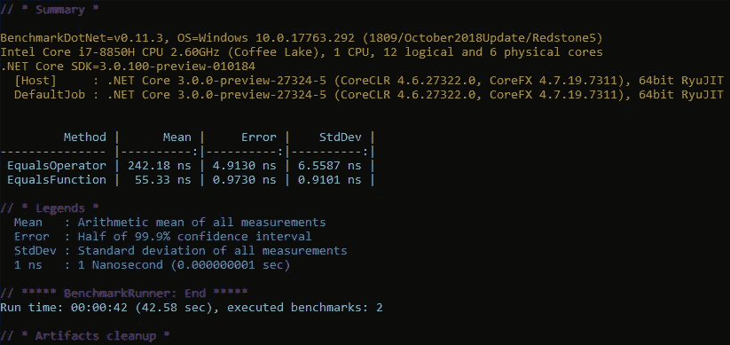

# 试用 BenchmarkDotNet

> 原文：<https://itnext.io/trying-out-benchmarkdotnet-abcb2a5f960?source=collection_archive---------3----------------------->

在软件中，有成千上万种不同的方法来完成同一件事情，我们倾向于用来确定行动过程的一个度量标准是我们感觉一组代码将如何优于另一组代码。事情是确定哪个代码实际上执行得更好有点棘手，我觉得一般来说人们是基于直觉而不是实际证据来做出选择的。即使开发者所涉及的证据如果没有被恰当地收集，那么它实际上是没有帮助的。例如，试图确定一组代码在调试模式下运行时的性能，实际上并不能很好地表明它将如何执行。

开发商该怎么做？嗯，这就是[BenchmarkDotNet](https://benchmarkdotnet.org/)的用武之地。下面是这个项目对自己的描述。

> *基准测试真的很难(尤其是微基准测试)，在性能测量过程中你很容易出错。BenchmarkDotNet 将保护您避免常见的陷阱(即使对于有经验的开发人员来说也是如此),因为它为您做了所有的脏工作:它为每个基准方法生成一个独立的项目，多次启动这个项目，运行方法的多次迭代(包括预热),等等。通常，您甚至不应该关心迭代次数，因为 BenchmarkDotNet 会自动选择它来达到所要求的精度水平。*

这篇文章的其余部分将介绍如何使用 BenchmarkDotNet 创建一个示例项目。

# 示例项目

我们将使用新的。NET 核心控制台应用程序，可以使用下面的。NET CLI 命令。

```
dotnet new console
```

接下来，运行下面的命令来添加 [BenchmarkDotNet NuGet 包](https://www.nuget.org/packages/BenchmarkDotNet/)。

```
dotnet add package BenchmarkDotNet
```

现在在**程序**类的**主**函数中，我们需要告诉应用程序运行我们感兴趣的基准。在这个例子中，我们告诉它运行**字符串**类中的基准。

```
public static void Main(string[] args) { BenchmarkRunner.Run<Strings>(); }
```

现在在 **Strings** 类中，我们有两个用 **Benchmark** 属性标记的函数，这是包如何识别要测量的函数的。在这个例子中，我们将测量两种不同的不区分大小写的字符串比较方法的性能。

```
public class Strings{private readonly Dictionary<string, string> _stringsToTest =new Dictionary<string, string>{{ “Test”, “test” },{ “7”, “7” },{ “A long string”, “Does not match” },{ “Testing”, “Testing” },{ “8”, “2” }};[Benchmark]public bool EqualsOperator(){var result = false;foreach (var (key, value) in _stringsToTest){result = key.ToLower() == value.ToLower();}return result;}[Benchmark]public bool EqualsFunction(){var result = false;foreach (var (key, value) in _stringsToTest){result = string.Equals(key, value,StringComparison.OrdinalIgnoreCase);}return result;}}
```

我确信有更好的方法来为测试运行设置数据，但是上面的方法在我第一次尝试的时候是有效的。

# 结果

在发布模式下运行应用程序，您将看到类似如下的输出。



# 包扎

拥有一个能够消除运营方式中所有猜测的工具将是非常有价值的。这是我真希望几年前就找到的工具之一。该项目是开源的，可以在 [GitHub](https://github.com/dotnet/BenchmarkDotNet) 上找到。

*原载于 2019 年 3 月 31 日*[*【elanderson.net*](https://elanderson.net/2019/03/trying-out-benchmarkdotnet/)*。*