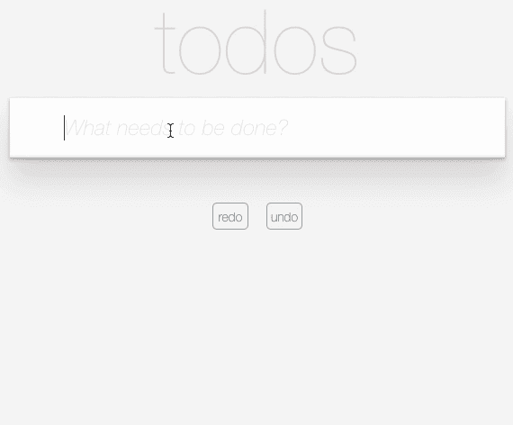

# 为 MobX 打开时间旅行引擎

> 原文：<https://itnext.io/turn-on-time-travelling-for-mobx-c3f267a46f10?source=collection_archive---------3----------------------->

*注:本文不是*[*mobx-state-tree*](https://github.com/mobxjs/mobx-state-tree)*用法指南。其实整篇文章与 MST (mobx-state-tree)* 无关



# **前言**

作为官方的状态模型构建库，MST 提供了许多精彩的特性，如时间旅行、热重装和 redux-devtools 支持。但是 MST 的问题是它太固执己见了(官方网站已经提到了)，你必须接受一组值(就像 redux 一样)才能使用它们。

让我们快速看一下如何在 MST 中定义模型:

```
import { types } from "mobx-state-tree"const Todo = types.model("Todo", {
    title: types.string,
    done: false
}).actions(self => ({
    toggle() {
        self.done = !self.done
    }
}))const Store = types.model("Store", {
    todos: types.array(Todo)
})
```

老实说，我第一次看到这段代码的时候，内心是拒绝的，太主观了。直观地说，我们使用 MobX 来定义一个应该如下所示的模型:

```
import { observable, action } from 'mobx'
class Todo {
  title: string;
  @observable done = false; @action
  toggle() {
    this.done = !this.done;
  }
}class Store {
  todos: Todo[]
}
```

用基于类的方式定义模型，对开发者来说显然更直观纯粹，而 MST 的“主观”方式有些反直觉，对项目的可维护性并不友好(基于类的方式只要谁懂最基本的 OOP 都可以理解)。但相应的，MST 提供的诸如时间旅行等能力确实很吸引人。有没有办法用通常的方式编写 MobX，在 MST 中享受同样的特性？

相比 MobX 的多存储和基于类方法的动作这种序列化不友好的范式，Redux 对时间旅行/动作回放的支持显然要容易得多(但对应的应用程序代码更繁琐)。但是只要我们解决了两个问题，MobX 中的时间旅行/动作回放支持问题也就解决了:

1.收集应用程序的所有商店并被动激活它们，当它们发生变化时手动序列化它们。完成存储->反应式存储收集->快照(json)过程。
2。识别收集的存储实例和各种变化(动作),并映射关系。完成快照的逆向过程(json) - >基于类的存储。

针对这两个问题， [mmlpx](https://github.com/mmlpxjs/mmlpx) 给出了相应的解决方案:

1.DI +反应容器+快照(收集存储并响应存储变化，生成序列化快照)
2。[ts-plugin-mm lpx](https://github.com/mmlpxjs/ts-plugin-mmlpx)+hydrate(标识存储和活动，将序列化数据合并到有状态存储实例中)

我们来看看 [mmlpx](https://github.com/mmlpxjs/mmlpx) 是如何给出这两种基于快照的解决方案的。

# 快照需要的基本功能

如上所述，为了在 MobX 下为应用程序状态提供快照功能，我们需要解决以下问题:

## 收集 app 的所有商店

MobX 本身与应用程序组织无关。它不限制应用程序如何组织状态存储，遵循单一存储(如 redux)或多存储范例。但是，由于 MobX 本身是 OOP，在实践中我们通常采用 [MVVM](https://msdn.microsoft.com/en-us/library/hh848246.aspx) 模式。行为准则定义了我们的领域模型和 UI 相关模型(如何区分两类模型可以参见 MVVM 相关文章或者 [MobX 官方最佳实践](https://mobx.js.org/best/store.html)，此处不再赘述)。这导致我们在使用 MobX 时，下意识地遵循多商店范式。那么如果我们想管理应用程序中的所有商店呢？

在 OOP 世界观中，为了管理所有类的实例，我们自然需要一个集中的存储容器，这通常很容易被称为 [IOC 容器](https://www.martinfowler.com/articles/injection.html)。作为最常见的 IOC 实现类型，DI(依赖注入)是手工实例化 MobX 存储的一个很好的替代方法。对于 DI，我们推荐商店的方式如下:

```
import { inject } from 'mmlpx'
import UserStore from './UserStore'class AppViewModel {
    @inject() userStore: UserStore

    loadUsers() {
        this.userStore.loadUser()
    }
}
```

之后，我们可以很容易地通过 IOC 容器中的依赖注入来实例化所有商店实例。这就解决了收集 MobX 中所有商店的问题。

更多 DI 用法看这里: [mmlpx di 系统](https://github.com/mmlpxjs/mmlpx#di-system)。

## 响应所有存储状态变化

一旦拥有了所有的存储实例，下一步就是监听状态的变化。

如果在应用程序初始化之后，应用程序中的所有存储都被实例化了，那么监控应用程序中的变化就相对容易了。但通常在阿迪系统中，实例化是懒惰的，只有当一个存储被实际使用时才被实例化，然后初始化它的状态。这意味着从我们打开快照特性的那一刻起，IOC 容器就应该被转换为 reactive，从而允许为新添加的存储中定义的状态自动绑定侦听器。

现在，我们可以通过`onSnapshot`方法获取当前 IOC 容器当前收集的所有存储，然后基于 MobX `ObservableMap`构建一个新的容器，加载所有之前的存储，最后用`reaction`做数据重定义和递归跟踪依赖关系，这样就可以响应容器(存储添加/移除)和存储状态变化。如果更改触发了反应，我们可以手动序列化应用程序快照的当前应用程序状态。

具体实现可以看这里: [mmlpx onSnapshot](https://github.com/mmlpxjs/mmlpx/blob/master/src/api/snapshot.ts#L155)

# 从快照中唤醒应用程序

通常，我们获取应用程序的快照数据，并使其持久化，以确保应用程序在下次进入时可以直接恢复到退出时的状态，或者我们需要实现一个常见的重做/撤消功能。

这在 Redux 系统中相对容易实现，因为它是用普通对象定义的，并且是序列化友好的。但这并不意味着您不能在不友好的序列化 MobX 系统中从快照中唤醒应用程序。

要成功从快照恢复，我们必须满足以下两个条件:

## **给每个商店添加一个唯一的标识符**

如果我们希望序列化后的快照数据成功地恢复到它自己的存储中，我们必须给每个存储一个惟一的标识符，以便 IOC 容器可以通过这个 id 将每个数据层与其原始存储相关联。

在 mmlpx 方案下，我们可以用@Store 和@ViewModel decorator 标记应用程序的全局状态和局部状态，并赋予相应的模型类一个 id:

```
[@Store](http://twitter.com/Store)('UserStore')
class UserStore {}
```

但是手动命名存储是愚蠢且容易出错的，您必须确保您的名称空间没有重叠(这正是 redux 所做的🙃).

幸好 [ts-plugin-mmlpx](https://github.com/mmlpxjs/ts-plugin-mmlpx) 救了我们。我们只需要这样定义商店:

```
@Store
class UserStore {}
```

插件运行后，它变成了:

```
@Store('UserStore.ts/UserStore')
class UserStore {}
```

文件名+类名的组合通常可以确保存储名称空间的唯一性。关于插件使用的更多信息，请查看 [ts-plugin-mmlpx](https://github.com/mmlpxjs/ts-plugin-mmlpx) 项目主页。

## hydration

从序列化快照状态激活 app 的反应系统，从静态到动态的逆向过程非常类似于 SSR 中的[水化](https://ssr.vuejs.org/guide/hydration.html)。事实上，这是在 MobX 中实现时间旅行最困难的一步。与受 Flux 启发的库(如 redux 和 vuex)不同，MobX 中的状态通常是基于类的充血模型定义的。在对模型进行脱水和重新填充之后，我们还必须确保那些不能被序列化的行为仍然被正确地定义到模型上下文中。重新绑定行为尚未完成，我们必须确保反序列化后数据的 mobx 定义也与原始定义一致。比如我用了一个特殊的修改器比如`observable.ref`、`observable.shallow`、`ObservableMap`，重新填充后必须保持原来的能力。特别是对于不能连载的`ObservableMap`，我们要想办法让他们恢复到原来的状态行为。

幸运的是，我们整个解决方案的基石是 DI 系统，当调用者请求获得依赖项时，它给了我们“动手”的可能性。我们所要做的就是当依赖项被获取时，识别依赖项是否是由序列化数据填充的，也就是说，存储在 IOC 容器中的实例不是原始类类型的实例。此时，水合作用开始，然后水合作用恢复。激活过程也非常简单，因为我们在`inject`的上下文中有了 store 类类型(构造函数)，我们只需要重新初始化一个新的空白 Store 实例，并用序列化数据填充它。幸运的是，MobX 只有三种数据类型，对象、数组和映射。我们只需要对不同类型的水合物进行简单处理即可完成:

```
if (!(instance instanceof Host)) {const real: any = new Host(...args); // awake the reactive system of the model
    Object.keys(instance).forEach((key: string) => {
        if (real[key] instanceof ObservableMap) {
            const { name, enhancer } = real[key];
            runInAction(() => real[key] = new ObservableMap((instance as any)[key], enhancer, name));
        } else {
            runInAction(() => real[key] = (instance as any)[key]);
        }
    });return real as T;
}
```

[这里的](https://github.com/mmlpxjs/mmlpx/blob/master/src/core/dependency-inject/hydrate.ts)是水合物的源代码。

# 情节

与 MST 的快照功能(MST 只能拍摄某个商店的快照，而不是整个应用程序的快照)相比，基于 mmlpx 的方法更容易实现快照派生的功能:

## 时间旅行

时光旅行功能在实际开发中有两个应用场景，一个是重做/撤销，一个是 redux-devtools 提供的动作回放功能。

使用 mmlpx 后，在 MobX 中重做/撤消实现非常容易。实际上你只需要`onSnapshot`和`applySnapshot`这两个 API。文章开头的 gif 图片是[重做/撤销演示](https://github.com/mmlpxjs/mmlpx-todomvc)，你可以查看 [mmlpx 项目主页](https://github.com/mmlpxjs/mmlpx)了解详情。

像 redux-devtools 这样的函数实现起来有点复杂(实际上很简单)，因为我们想要重放每个动作，我们应该为每个动作提供一个唯一的标识符。redux 中的目标是通过手动编写具有不同名称空间的 action _ types 来实现的。这个太繁琐了。幸运的是，我们有 [ts-plugins-mmlpx](https://github.com/mmlpxjs/ts-plugin-mmlpx) 可以帮助我们自动命名动作(就像自动给商店命名一样)。解决了这个问题后，我们只需要在`onSnapshot`工作的同时记录下每个动作，就可以方便地使用 MobX 中的 redux-devtool 功能了。

## 苏维埃社会主义共和国

我们知道，当 React 或 Vue 进行 SSR 时，预取的数据通过在窗口上挂载全局变量传递给客户端，但通常官方的例子是基于 Redux 或 Vuex 的，如果我们想使用 MobX 代替，还有一些问题需要解决。现在，在 mmlpx 的帮助下，我们只需要在应用程序启动之前使用预取数据在客户端上应用快照:

```
import { applySnapshot } from 'mmlpx'if (window.__PRELOADED_STATE__) {
    applySnapshot(window.__PRELOADED_STATE__)
}
```

## 应用崩溃监控

这个特性可以由每个可以快照应用程序状态并从中恢复的库提供。也就是说，当检测到应用崩溃时，按下快门然后将快照数据上传到云端，那么云平台就可以通过快照数据还原场景。如果我们上传的快照数据也包含用户之前的操作栈，那么就有可能在监控平台上回放用户操作。

# 最后

作为“多店”范式的信奉者，MobX 在我心目中取代了 redux 在前端状态管理领域的地位。但由于 MobX 多店架构下的店铺缺乏集中管理，在时光旅行等一系列功能的开发经验上一直有所欠缺。现在有了 [mmlpx](https://github.com/mmlpxjs/mmlpx) 的帮助，MobX 也可以开启时光旅行了，Redux 在我心目中最后的优势也没有了。