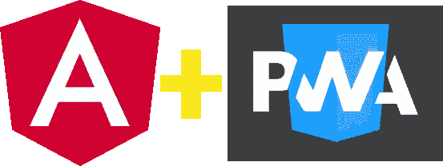
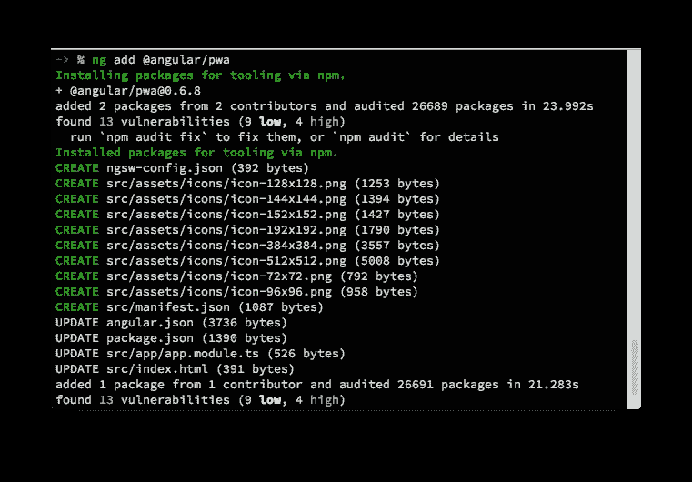
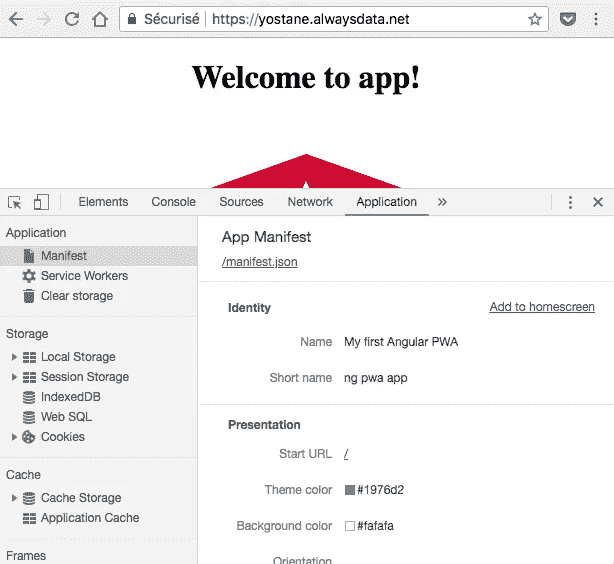
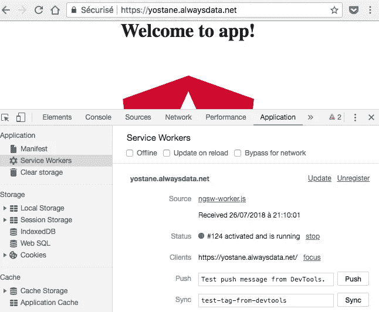

# 将 Angular 6 应用转变为渐进式 Web 应用

> 原文：<https://itnext.io/turning-an-angular-6-app-into-a-progressive-web-app-9e6fc6361ba6?source=collection_archive---------0----------------------->



本文展示了如何在 Angular 6 应用程序中添加 PWA(渐进式 Web 应用程序)功能。(*宠溺:很容易*😍)

我们将经历以下步骤:

1.  向 Angular 应用程序添加 PWA 功能
2.  填写清单
3.  配置服务人员
4.  验证和测试

在下面，我们将使用 Angular 6，我想你已经创建了一个 Angular 应用程序。

我们将立即开始为现有的 Angular 应用程序添加 PWA 功能。

# 向 Angular 应用程序添加 PWA 功能

Angular CLI 6 允许向现有 Angular 应用程序添加 PWA 功能。为此，只需在项目的根目录下打开一个终端，并键入以下命令。

```
ng add @angular/pwa
```

您应该会看到类似下面的输出:

```
-> % ng add @angular/pwa
Installing packages for tooling via npm.
+ @angular/pwa@0.6.8
added 2 packages from 2 contributors and audited 26689 packages in 23.992s
CREATE ngsw-config.json (392 bytes)
CREATE src/assets/icons/icon-128x128.png (1253 bytes)
CREATE src/assets/icons/icon-144x144.png (1394 bytes)
CREATE src/assets/icons/icon-152x152.png (1427 bytes)
CREATE src/assets/icons/icon-192x192.png (1790 bytes)
CREATE src/assets/icons/icon-384x384.png (3557 bytes)
CREATE src/assets/icons/icon-512x512.png (5008 bytes)
CREATE src/assets/icons/icon-72x72.png (792 bytes)
CREATE src/assets/icons/icon-96x96.png (958 bytes)
CREATE src/manifest.json (1087 bytes)
UPDATE angular.json (3736 bytes)
UPDATE package.json (1390 bytes)
UPDATE src/app/app.module.ts (526 bytes)
UPDATE src/index.html (391 bytes)
```



我们可以看到，该命令创建了一堆文件，并更新了一些文件。在下面，我会试着快速解释发生了什么。

*   **ngsw-config.json** :是服务人员的配置文件。当 ng-cli 需要创建服务工作者文件时，将使用该文件。它主要用于配置不同的缓存策略。
*   **icon-xxx.png**:不同分辨率的应用图标。这些图标由 PWA 清单使用。图标用作应用程序图标和闪屏内的图标。
*   **manifest . JSON**:PWA 清单。它提供了关于 web 应用程序的元数据。例如，它包含应用程序的图标和名称。
*   更新后的文件允许考虑服务人员和 Angular 应用程序中的清单。如果我们打开**index.html**，我们可以注意到它在其 head 标签中引用了 manifest。这些更新对于浏览器将应用程序视为 PWA 是必要的。如果我们忽略在 web 应用程序中引用 PWA 功能，即使服务工作人员和清单文件存在，也不会启用 PWA 功能。

angular-cli 已经用一些数据填充了清单和服务工作者配置。它还创建了带有 Angular 徽标的资产。下一步是用我们自己的标志替换掉这个标志。除此之外，我们还将修改清单和服务人员配置以满足我们的需求。

下一步，我们将更新清单。

# 填写清单

清单文件包含一些在安装 PWA 和需要显示闪屏时使用的元数据。事实上，从主屏幕启动的 PWA 会显示闪屏。

以下是一些清单字段的描述。[更详尽的列表可在此处找到](https://pwa-workshop.js.org/1-manifest/):

*   `name` -显示在应用图标下方的闪屏上
*   `short_name` -显示在桌面或主屏幕的快捷方式下方
*   `description` -应用程序的一般描述
*   `background_color` -闪屏的背景颜色
*   `theme_color` -应用程序的通用主题颜色，例如在状态栏显示时使用
*   `display` -指定显示模式。`standalone`:外观和感觉像一个独立的应用程序。这意味着应用程序将有自己的窗口，自己的图标，等等。在这种模式下，用户代理将排除用于控制导航的 UI 元素，但可以包括其他 UI 元素，如状态栏。
*   `icons` -不同分辨率的应用图标列表，用于快捷方式和闪屏。建议提供的尺寸至少为 192x192px 和 512x512px。该设备将根据具体情况自动选择最佳图标。提供一个 SVG 矢量版本的图标也很有趣，它将适合最大的尺寸。

下面是一个示例清单文件:

```
{
  "name": "My first Angular PWA",
  "short_name": "ng pwa app",
  "theme_color": "#1976d2",
  "background_color": "#fafafa",
  "display": "standalone",
  "scope": "/",
  "start_url": "/",
  "icons": [
    {
      "src": "assets/icons/icon-72x72.png",
      "sizes": "72x72",
      "type": "image/png"
    },
    {
      "src": "assets/icons/icon-96x96.png",
      "sizes": "96x96",
      "type": "image/png"
    },
    {
      "src": "assets/icons/icon-128x128.png",
      "sizes": "128x128",
      "type": "image/png"
    },
    {
      "src": "assets/icons/icon-144x144.png",
      "sizes": "144x144",
      "type": "image/png"
    },
    {
      "src": "assets/icons/icon-152x152.png",
      "sizes": "152x152",
      "type": "image/png"
    },
    {
      "src": "assets/icons/icon-192x192.png",
      "sizes": "192x192",
      "type": "image/png"
    },
    {
      "src": "assets/icons/icon-384x384.png",
      "sizes": "384x384",
      "type": "image/png"
    },
    {
      "src": "assets/icons/icon-512x512.png",
      "sizes": "512x512",
      "type": "image/png"
    }
  ]
}
```

更新清单和应用程序图标后，我们可以负责服务人员的配置。

# 配置服务人员

Angular 提供配置服务，而不是手工编写服务人员的代码。在这方面， **ngsw-config.js** 允许配置缓存行为。这个配置文件是一个 JSON 对象，有 4 个条目，下面是每个条目的简短描述:([这里提供了更详尽的描述](https://angular.io/guide/service-worker-config)和[这里提供了](https://medium.com/progressive-web-apps/a-new-angular-service-worker-creating-automatic-progressive-web-apps-part-1-theory-37d7d7647cc7)):

*   `index`:指定文件的主页面。通常是 index.html 文件
*   `assetsGroups`:包含属于应用程序一部分的文件。Angular 将此部分定义为随应用程序一起版本化的文件。我们也可以把它们看作静态资源(index.html、javascript、css、图片、字体等)。).我们可以在这里指定总是被缓存的资源(`"installMode": "prefetch"`)和加载时被缓存的资源(`"installMode": "lazy"`)。
*   `dataGroups`:未随 app 一起版本化的所有资源。您也可以将它们视为您想要缓存的 API urls。我们可以在这里配置两种不同的策略:带网络回退的缓存优先(`"strategy": "performance"`)和带缓存回退的网络优先(`"strategy": "freshness"`)。
*   `appData`:允许传递描述应用程序当前版本的数据。我不会在这里研究这个领域。

我们可以猜测，**索引**字段应该不会改变。在我看来，我们应该改变的部分是**资产组**的**资产**部分和**数据组**部分。

假设我们想要缓存以下资源:

*   静态重要文件:index.html、main.js、style.css
*   可以延迟缓存的静态资产:/assets/logo.png
*   REST api 网址:[https://myapi.org/api/items](https://myapi.org/api/items)，[https://myapi . org/API/item/[itemId](https://myapi.org/api/item/[itemId)]
*   REST API 缩略图网址:[https://myapi . org/API/thumb/[itemId](https://myapi.org/api/thumb/[itemId)]

下面是一个允许实现这一点的配置文件:

```
{
  "index": "/index.html",
  "assetGroups": [
    {
      "name": "app",
      "installMode": "prefetch",
      "resources": {
        "files": ["/favicon.ico", "/index.html", "/*.css", "/*.js"]
      }
    },
    {
      "name": "assets",
      "installMode": "lazy",
      "updateMode": "prefetch",
      "resources": {
        "files": ["/assets/**"]
      }
    }
  ],
  "dataGroups": [
    {
      "name": "api",
      "urls": ["https://myapi.org/api/**"],
      "cacheConfig": {
        "maxSize": 100,
        "maxAge": "3d",
        "timeout": "1m",
        "strategy": "freshness"
      }
    },
    {
      "name": "thumbs",
      "urls": ["https://myapi.org/api/thumb/**"],
      "cacheConfig": {
        "maxSize": 100,
        "maxAge": "3d",
        "timeout": "1m",
        "strategy": "performance"
      }
    }
  ]
}
```

该示例文件还允许您查看不同的可用配置选项。

Huraaaay，服务人员和货单都完成了。接下来，让我们看看如何测试它。

# 测试

因为服务工作者执行缓存，所以在开发期间 PWA 特性不被启用。因此，`ng serve`将跳过服务工作者，但是将添加清单。所有 PWA 功能-包括维修工人-在**生产**模式下启用。因此，我们需要运行`ng serve --prod`或`ng build --prod`来启用服务人员。第二个命令需要运行一个本地服务器来运行像 [http-server](https://github.com/indexzero/http-server) 或 [http-server-pwa](https://www.npmjs.com/package/http-server-pwa) 这样的应用程序。我记得在使用 [serve](https://www.npmjs.com/package/serve) 从 Android 打开 wep 应用程序时遇到了问题。我不建议使用它。

为了在最佳条件下测试 PWA，web 应用程序至少需要运行在一个具有有效证书的静态 HTTPS 服务器上。如果我们不满足其中一些条件，我们可能会得到部分 PWA 支持。例如，我们可能有一个服务人员在运行，但安装将是一个简单的快捷方式，应用程序不会被添加到 Android 上的应用程序抽屉中。

令人惊讶的是，在本地实现完美的条件比在免费网络主机上更复杂，尤其是因为 HTTPS。有一些教程展示了如何有效地在本地测试 PWA，比如[这个](https://www.remotesynthesis.com/blog/running-ssl-localhost)、[这个](https://deanhume.com/testing-service-workers-locally-with-self-signed-certificates/)和[也许还有这个](https://www.npmjs.com/package/http-server-pwa)。对我来说，我没有在本地测试，我使用了一个免费的网络主机。

希望使用 **Chrome 开发工具**上的**应用选项卡**可以在本地测试许多东西，而不需要太多的努力:

*   检查清单
*   调试服务工作器
*   操作缓存

你需要一个 Android 设备来测试**添加到主屏幕**和**闪屏功能**。我注意到，在 HTTPS 上，选择**添加到主屏幕**会将应用程序添加到应用程序抽屉，而在 http 上，它将是主屏幕上的快捷方式。

我的建议是首先在本地测试 http，然后在 https 上测试。

不要忘记检查服务人员和开发人员工具中的清单。



现在是总结的时候了。

# 结论

在本文中，我们看到了如何向 Angular 应用程序添加 PWA 功能。由于 ng-cli 的支持，添加清单、服务人员和示例应用程序图标变得非常容易。接下来，我们更新了清单并配置了服务人员。

最后，我们解释了在最佳条件下测试 PWA 特性有些复杂，但是一旦我们掌握了窍门，就没那么难了。

最后要注意的是，没有理由不在 Angular app 中加入 PWA。

角度项目[在 GitHub](https://github.com/yostane/pwa-angular6) 上有。

快乐编码:)

# 链接

 [## 渐进式网络应用食谱

### 编辑描述

pwa-cookbook.js.org](https://pwa-cookbook.js.org/)  [## 简介| PWA 研讨会

### 渐进式 Web 应用程序简介

pwa-workshop.js.org](https://pwa-workshop.js.org/)