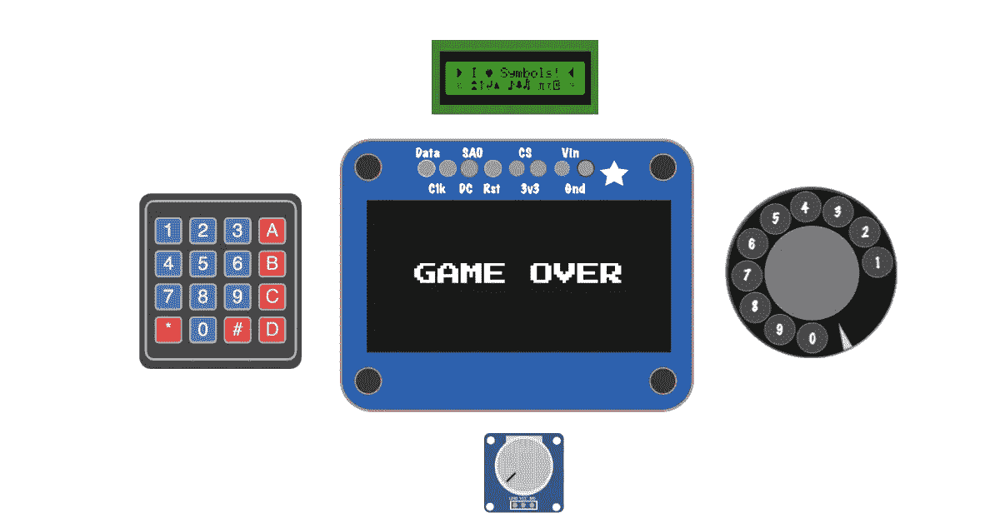
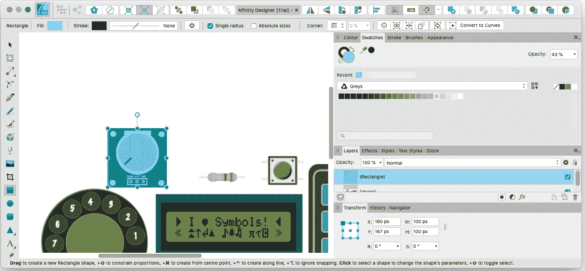

# 有机发光二极管显示为 Web 组件

> 原文：<https://itnext.io/turning-arduino-oled-display-into-a-web-component-bf6bbb43a257?source=collection_archive---------3----------------------->

让我们创建一个基于硬件设备的 web 组件！



**注:我最初在 Wokwi 的官方博客上发表了这篇文章。

在下面的帖子中，我将描述我在硬件设备上制作 web 组件的个人经历，作为对“ [Wokwi-elements](https://elements.wokwi.com/?path=/story/rotary-dialer--default) ”的贡献的一部分。这是一个由 [Uri Shaked](https://medium.com/u/355b1dfe86ae) 制作的非常酷的“Arduino 元素”开源库。

Wokwi lib 背后的创意立即吸引了我的注意力，我意识到这是一个尝试新技术和获得更多概念经验的机会。

如果我很快尝试解释一下 [Wokwi](https://wokwi.com/) (目前)是什么，我会说——一个有趣的教程形式的虚拟 Arduino 游乐场环境，建立在令人印象深刻的 Arduino AVR 模拟器项目之上。


制作硬件组件的 web 表单是一个有趣的过程。

它要求:

*   对组件做一些研究——获得它的实际大小(物理高度和宽度)。
*   注意其各部分之间的比例(比例)。
*   了解其使用方式，以便其网络行为尽可能接近原始设备，从而提供良好的用户体验。

## 你说是有机发光二极管？

有机发光二极管是一种显示技术。你可能对液晶显示器很熟悉，那么有机发光二极管有什么特别之处呢？

有机发光二极管显示器是发射型的，这意味着当你给它们通电时，它们的像素会发光。这与液晶显示器形成对比，液晶显示器通过阻挡光线来显示图像。

这使得有机发光二极管的效率更高:因为它们自己发光，只有白色像素耗电，不需要耗电的背光(就像液晶显示器一样)。

点击了解更多关于有机发光二极管及其用途的信息。

[](https://www.adafruit.com/product/326) [## 单色 0.96 英寸 128x64 有机发光二极管图形显示器- STEMMA QT

### Adafruit Industries，独特的&趣味 DIY 电子产品和套件单色 0.96 128x64 有机发光二极管图形显示器- STEMMA QT…

www.adafruit.com](https://www.adafruit.com/product/326) 

制作有机发光二极管显示器的目标是在使用 I2C 协议(SDA，SCL 引脚)和使用其[驱动程序 API](https://github.com/adafruit/Adafruit_SSD1306/blob/68249c7803ef43988c433111411f69bfdd01114e/examples/ssd1306_128x64_i2c/ssd1306_128x64_i2c.ino) 连接[*Adafruit*](https://www.adafruit.com/product/938)*128 x64*像素显示器时模拟实际硬件。

Wokwi 用户可以通过使用模拟器来测试他们的代码，并相信它在硬件上使用时能够正常运行，而且它还使与其他人共享代码和项目变得容易。

## web 化:从硬件到 UI 元素

一旦我们在[规格](https://www.adafruit.com/product/326#technical-details)中找到元件尺寸，我们将开始设计它。说明组件的最简单方法是使用设计工具，如 Inkscape、Sketch、Illustrator 等..并导出 SVG。

起初，我使用 Sketch 免费试用，我喜欢他们的 UI，真的很简单，我甚至从一个设计师朋友那里得到了一些建议。后来，我开始使用 Affinity Designer，它也很不错。

比方说，我想从 elements png 图像中重新创建一个 SVG 形式的电位计设备。



亲和力设计者

一般来说，这样做的步骤是:

1.  从左侧菜单中选择矩形形状
2.  给它一个 50%左右的颜色和不透明度，这样你就可以把它调整到原来的大小——在右边的菜单中，你也可以给角落一个半径。
3.  对组成这个元素的内部形状做同样的操作——内部圆，角落里的 4 个小圆。
4.  添加文字，然后开始涂色，想怎么涂就怎么涂！
5.  将元素分组到一个 SVG 中并提取它

只要看看 Uri 的教程，看看有多简单！

**调整和优化 SVG**

我认为每个经验丰富的前端开发人员在某个时候都会从设计者那里得到“有缺陷的”字体，并且不得不钻研原始的 SVG。当你打开一个没有正确解压的 SVG 文件时，你会发现很多你不需要的东西。一些设计工具可以让你提取一个更干净的版本，但是我的下一步是使用一个叫做 [SVG-OMG](https://jakearchibald.github.io/svgomg/) (由 Jake Archibald 开发)的工具来清理它。

一旦我有了一个更干净的 SVG，我就像使用 HTML 一样使用它，这样就更容易维护，例如，干燥 SVG(删除重复的模式)。这是通过将重复出现的属性移动到聚合的<g>中来实现的。同样，如果只有一个文本元素:</g>

```
<text><tspan> foo </tspan></text>
```

我将删除<tspan>，如果有一个过滤器，我可能会想把一些定义移动到 CSS 等..</tspan>

SSD1306 是一个 SVG 元素，但 128x64 像素显示器实际上是一个**画布**元素。

为什么？SVG 非常适合矢量图形，但这是一种像素显示，所以我们需要一些方法来显示像素，因此 Canvas 是最终的候选。

我使用`[**foreignObject**](https://developer.mozilla.org/en-US/docs/Web/SVG/Element/foreignObject)` 元素将其集成到 SVG 中，如下所示:(LIT)

```
<foreignObject  
   ?visibility="${visibility}"  
    width="${screenWidth}"  
    height="${screenHeight}">  
    <canvas 
       width="${screenWidth}"                                                    height="${screenHeight}">
    </canvas>
</foreignObject>
```

画布元素让我们提供图像绘制体验，因为在幕后我们使用它的 2D 上下文 [**putImageData**](https://developer.mozilla.org/en-US/docs/Web/API/CanvasRenderingContext2D/putImageData) 方法，每当用户向元素传递一个 [**imageData**](https://developer.mozilla.org/en-US/docs/Web/API/ImageData) 时，它将被绘制到我们的画布显示中。

`[ImageData](https://developer.mozilla.org/en-US/docs/Web/API/ImageData)`对象表示画布对象的一个区域的底层像素数据。

imageData 对象持有一个**数据**属性，该属性是一个位于`0`和`255,`之间的 8 位无符号整数值数组，称为`[Uint8ClampedArra](https://developer.mozilla.org/en-US/docs/Web/JavaScript/Reference/Global_Objects/Uint8ClampedArray)y.`

这个一维数据数组表示 [**RGBA**](https://en.wikipedia.org/wiki/RGBA_color_model) —构成[像素](https://en.wikipedia.org/wiki/Pixel)的红色、绿色、蓝色和 Alpha(不透明度)值。

## 使用 LitElement 制作 Arduino 组件

Wokwi 元素最终是 Web 组件——这很棒，因为你可以在任何支持 Web 组件的框架上使用它们(Angular/Vew/React)。

使用原生 API 编写 Web 组件需要编写大量代码，这非常冗长，因此很容易忘记。

我们使用 [LitElement](https://lit-element.polymer-project.org/) 抽象，它非常简单、直观，并且有很好的特性:简单的钩子、样式图和类图指令等等

ssd1306 元素期望在元素初始化时使用单个 imageData 属性，为了实现这一点，我们使用了 LIT [firstUpdated](https://lit-element.polymer-project.org/guide/lifecycle#firstupdated) 钩子。

```
firstUpdated() {  
    this.initContext();  
    this.ctx?.putImageData(this.imageData, 0, 0);
}
```

该 API 还公开了一个 redraw()方法，以防用户希望更新图像或运行动画。

下面是一个使用 Typescript 应用程序中的<wokwi-ssd1306>元素的示例:</wokwi-ssd1306>

查看 Wokwi SSD1306 游乐场:

[](https://wokwi.com/playground/ssd1306) [## ssd1306 -使用 Wokwi 学习 Arduino

### 有机发光二极管显示器连接在 I C 地址 0x3D。单击右边的运行代码按钮来查看它的运行情况:您能…

wokwi.com](https://wokwi.com/playground/ssd1306) 

综上所述，我想说的是，基于硬件制作网页元素的端到端体验(UI 设计到编码)是惊人的，我真的很喜欢样式部分，以及在保留鼓励创造性思维的实际行为方面的技术挑战。

我要感谢 [Uri Shaked](https://medium.com/u/355b1dfe86ae) 制作 Wokwi 和评论这篇帖子！

BR，

利伦。