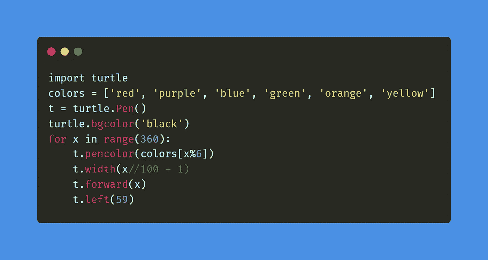
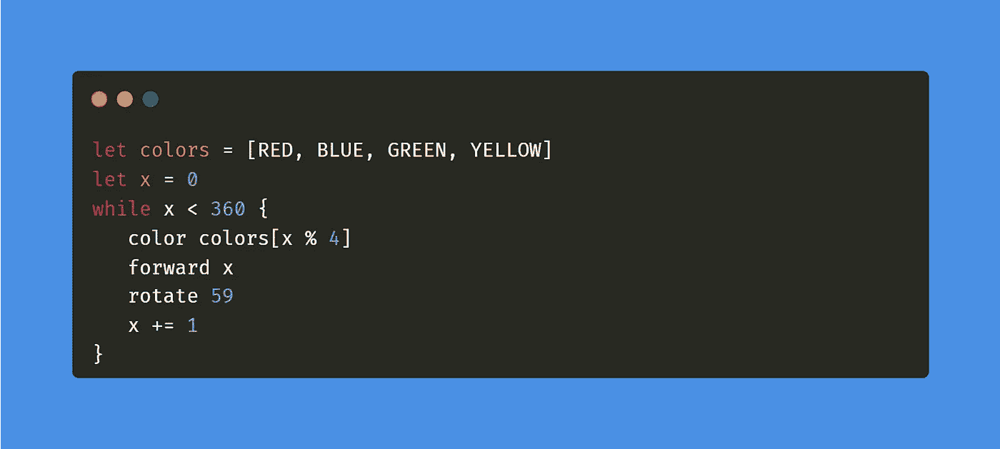
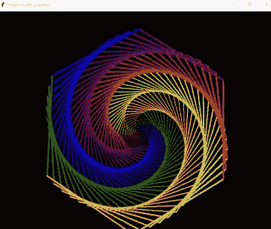
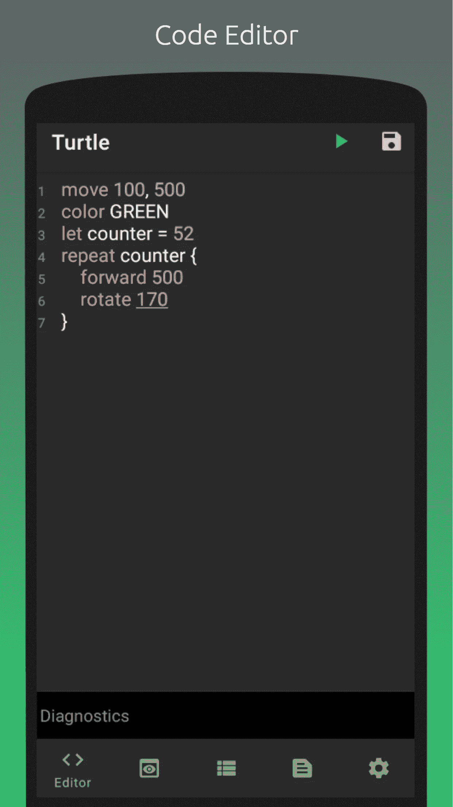
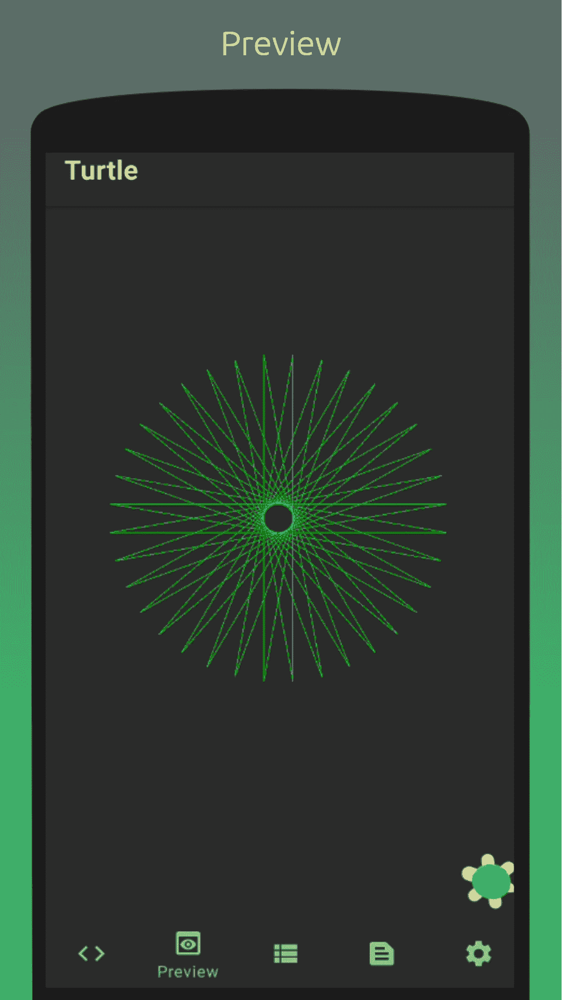
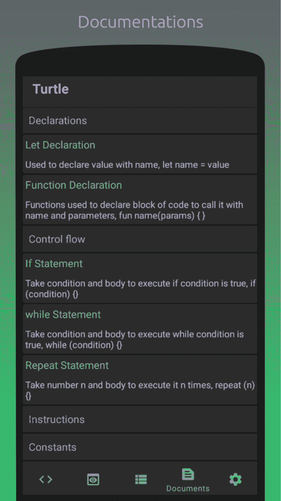

# Android 平台的海龟图形实现

> 原文：<https://itnext.io/turtle-graphics-implementation-for-android-60bd0b735bc5?source=collection_archive---------0----------------------->

大家好，在这篇文章中，我想介绍我的最后一个副业项目，叫做 Turtle，这个项目的想法完全是受 Turtle Graphics 项目的启发。

什么是海龟图形项目？

今天，你可能从 Python 标准库中的 Turtle 实现中知道 Turtle graphics，它允许你在二维空间中控制一只或多只乌龟，但最初的图形是在 20 世纪 60 年代末作为编程语言 Logo 的一个关键功能首次出现的，Logo 是由沃利·弗尔泽格、西蒙·派珀特和辛西娅·索罗门在 1967 年设计的，你可以从 [**维基百科**](https://en.wikipedia.org/wiki/Logo_(programming_language)) 中阅读更多关于 Logo 和一些现代衍生品的信息。

在我玩了 python 中的 turtle 模块并爱上它之后，我用同样的想法在 google play 上搜索 Android 版本，这样我就可以有指令、变量、控制流、数据结构…等等，我没有找到任何具有这些功能的应用程序，所以我决定实现一个作为辅助项目。

第一步是要有一个易于编写和理解语法的编程语言，所以我用类似 python 的语法创建了一个小程序，我把它命名为 Lilo(这个名字来自 Lilo 和 Stitch animation，类似于 logo)，这样我们就可以有函数、if、循环、变量、常量和一组用于绘制和控制颜色的指令，但是现在你只能控制一只乌龟，所以这里有一个用 Python 和 Lilo 绘制彩虹苯的例子。

Python 版本

Lilo 版本。

结果会是这样的

Lilo 还提供了一个清晰的错误，并用行号和列号警告消息，这样您就可以轻松地修改脚本。

如果你对 Lilo 这样的编程语言感兴趣，你可以从这两本书开始

1 —罗伯特·奈斯特伦从[T5 到这里](https://craftinginterpreters.com/) 制作口译员

2 —从 [**到**](https://interpreterbook.com/) 在 Go by Thorsten Ball 中编写解释器

我创建编程语言后的下一步是为它创建一个代码编辑器和一个预览屏幕，对于代码编辑器，我使用了 [**CodeView**](https://github.com/AmrDeveloper/CodeView) 库来提供高亮显示、自动完成、代码片段、错误和警告高亮显示，对于诊断消息，我使用了 [**TreeView**](https://github.com/AmrDeveloper/treeview) 库，以便您可以轻松地展开或折叠错误、警告或两者都有。

对于预览屏幕，我已经创建了一个简单的自定义视图，可以使用 Lilo executor 并绘制结果，您可以从这里检查代码。

之后，我通过使用[**easy adapter**](https://github.com/AmrDeveloper/easyadapter)**库生成了一个文档扩展列表，并实现了保存、更新、搜索和删除 lilo 脚本，作为一个带有额外元数据的 lilo 包。**

****

**Turtle Android 应用程序现在可以在 Google Play 上下载，源代码也可以在 Github 上下载，因此欢迎您提出功能建议、报告错误并做出贡献。**

**Google play: [**乌龟图形 App**](https://play.google.com/store/apps/details?id=com.amrdeveloper.turtle)**

**github:[**AMR developer/turtle**](https://github.com/AmrDeveloper/turtle)**

**这是 turtle 应用程序的演示视频，它将许多 python 示例转换为 lilo，请查看这里的****。******

****你可以在:[**GitHub**](https://github.com/amrdeveloper)[**LinkedIn**](https://www.linkedin.com/in/amrdeveloper/)[**Twitter**](https://twitter.com/amrdeveloper)上找到我。****

****享受编程😋。****