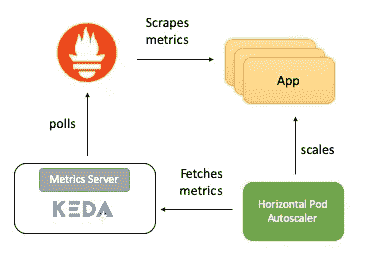

# 用普罗米修斯和 KEDA 自动缩放 Kubernetes 应用程序

> 原文：<https://itnext.io/tutorial-auto-scale-your-kubernetes-apps-with-prometheus-and-keda-c6ea460e4642?source=collection_archive---------0----------------------->

可伸缩性是云原生应用的关键要求。使用 [Kubernetes](https://kubernetes.io/) ，扩展您的应用程序就像增加相应`Deployment`或`ReplicaSet`的副本数量一样简单——但是，这是一个手动过程。Kubernetes 使用[水平窗格自动缩放器](https://kubernetes.io/docs/reference/generated/kubernetes-api/v1.16/#horizontalpodautoscaler-v1-autoscaling)规范，以声明的方式自动缩放您的应用程序(即`Deployment`或`ReplicaSet`中的`Pod`)。默认情况下，支持使用 CPU 利用率(`Resource`指标)作为自动伸缩的标准，但是也可以集成自定义和外部提供的指标。

这篇博客将展示如何使用外部指标来自动调整 Kubernetes 应用程序。出于演示目的，我们将使用通过 [Prometheus](https://prometheus.io/) 公开的 HTTP 访问请求度量。我们不直接使用`Horizontal Pod Autoscaler`，而是利用 [**Kubernetes 事件驱动的自动伸缩**又名**KEDA**](https://github.com/kedacore/keda)——一个开源的 Kubernetes 操作器，它与`Horizontal Pod Autoscaler`本机集成，为事件驱动的工作负载提供细粒度的自动伸缩(包括从零到零)。

该代码可在 [GitHub](https://github.com/abhirockzz/kubernetes-keda-prometheus) 上获得

> 我希望得到您的反馈和建议！欢迎随意发表 [*推文*](https://twitter.com/abhi_tweeter) *或发表评论😃*

# 概观

这里总结了端到端的工作方式——这一部分将详细讨论每一种方式



事物如何在高层次上运作

*   该应用程序以 Prometheus 格式公开 HTTP 访问计数指标
*   普罗米修斯被配置为收集这些指标
*   KEDA 的 Prometheus scaler 经过配置和部署，可根据 HTTP 访问计数指标自动扩展应用

# KEDA 和普罗米修斯

Prometheus 是一个开源系统监控和警报工具包，是[云本地计算基金会](https://cncf.io/)的一部分。Prometheus 从各种来源收集指标，并将它们存储为时间序列数据，并且可以使用像 [Grafana](https://grafana.com/) 或其他 API 消费者这样的工具来可视化收集的数据。

KEDA 支持在 KEDA 和外部系统之间充当桥梁的概念。一个`Scaler`实现特定于一个目标系统，并从中获取相关数据，然后被 KEDA 用来帮助驱动自动扩展。支持[多种缩放器](https://github.com/kedacore/keda#event-sources-and-scalers)(包括 Kafka，Redis 等。)包括普罗米修斯。这意味着你可以使用普罗米修斯指标作为标准，利用 KEDA 来自动调整你的 T2。

# 示例应用程序

示例 [Golang](https://golang.org/) 应用程序公开了一个 HTTP 端点，并做了两件重要的事情:

*   使用 [Prometheus Go 客户端库](https://github.com/prometheus/client_golang/)来检测应用程序，并公开由`[Counter](https://godoc.org/github.com/prometheus/client_golang/prometheus#Counter)`支持的`http_requests`指标。普罗米修斯指标终点在`/metrics`可用。

```
var httpRequestsCounter = promauto.NewCounter(prometheus.CounterOpts{
        Name: "http_requests",
        Help: "number of http requests",
    })
```

*   为了响应一个`GET`请求，它还在 Redis 中增加了一个键(`access_count`)——这是作为 HTTP 处理程序的一部分完成一些“工作”的简单方法，也有助于验证 Prometheus 指标(应该与 Redis 中的`access_count`的值相同)

```
func main() {
        http.Handle("/metrics", promhttp.Handler())
        http.HandleFunc("/test", func(w http.ResponseWriter, r *http.Request) {
            defer httpRequestsCounter.Inc()
            count, err := client.Incr(redisCounterName).Result()
            if err != nil {
                fmt.Println("Unable to increment redis counter", err)
                os.Exit(1)
            }
            resp := "Accessed on " + time.Now().String() + "\nAccess count " + strconv.Itoa(int(count))
            w.Write([]byte(resp))
        })
        http.ListenAndServe(":8080", nil)
    }
```

该应用程序作为`Deployment`部署到 Kubernetes，并且还创建了一个`ClusterIP`服务，以允许 Prometheus 服务器抓取应用程序`/metrics`端点。

> [*这里是*](https://github.com/abhirockzz/kubernetes-keda-prometheus/blob/master/go-app.yaml) *为申请*

# 普罗米修斯服务器

普罗米修斯部署清单包括:

*   `ConfigMap`捕捉普罗米修斯配置
*   `Deployment`对于普罗米修斯服务器本身
*   `ClusterIP`用于访问 Prometheus UI 的服务
*   `ClusterRole`、`ClusterRoleBinding`和`ServiceAccount`允许 Kubernetes 服务发现工作

> [*这里是普罗米修斯设置*的清单](https://github.com/abhirockzz/kubernetes-keda-prometheus/blob/master/prometheus.yaml)

# *KEDA·普罗米修斯*

*如前所述，`Scaler`实现充当 KEDA 和外部系统之间的桥梁，需要从外部系统获取指标。`ScaledObject`是一个定制资源，为了将`Deployment`与事件源(本例中为 Prometheus)同步，需要部署该资源。它包含关于要扩展哪个`Deployment`的信息、事件源的元数据(例如连接字符串机密、队列名称)、轮询间隔、冷却时间等。`ScaledObject`将导致相应的自动缩放资源(HPA 定义)来缩放`Deployment`*

> **当* `*ScaledObject*` *被删除时，相应的 HPA 定义被清除。**

*以下是我们的示例中使用`Prometheus`缩放器的 ScaledObject 定义*

```
*apiVersion: keda.k8s.io/v1alpha1
kind: ScaledObject
metadata:
  name: prometheus-scaledobject
  namespace: default
  labels:
    deploymentName: go-prom-app
spec:
  scaleTargetRef:
    deploymentName: go-prom-app
  pollingInterval: 15
  cooldownPeriod:  30
  minReplicaCount: 1
  maxReplicaCount: 10
  triggers:
  - type: prometheus
    metadata:
      serverAddress: http://prometheus-service.default.svc.cluster.local:9090
      metricName: access_frequency
      threshold: '3'
      query: sum(rate(http_requests[2m]))*
```

*请注意以下事项:*

*   *它的目标是名为`go-prom-app`的`Deployment`*
*   *触发类型为`prometheus`。普罗米修斯`serverAddress`与`metricName`、阈值和 [PromQL 查询](https://prometheus.io/docs/prometheus/latest/querying/basics/) ( `sum(rate(http_requests[2m]))`)一起被提及*
*   *根据`pollingInterval`，KEDA 将每`fifteen`秒轮询一次普罗米修斯目标。最少保留一个`Pod`(`minReplicaCount`)，最大数量的`Pod`不会超过`maxReplicaCount`(本例中为`ten`)*

> **可以将* `*minReplicaCount*` *设置为* `*zero*` *。在这种情况下，KEDA 将从零到一“激活”部署，然后让 HPA 进一步自动扩展(反过来也是如此，即从一扩展到零)。我们没有选择 zero，因为这是一个 HTTP 服务，而不是一个随需应变的系统，比如消息队列/主题消费者**

## *自动秤背后的魔力*

*`threshold`计数用于触发扩展部署。在本例中，PromQL 查询`sum(rate(http_requests[2m]))`返回在过去两分钟内测量的每秒 HTTP 请求率的聚合值。由于`threshold`计数是`three`，这意味着如果`sum(rate(http_requests[2m]))`的值保持小于 3，将有一个 Pod。如果该值上升，则每次`sum(rate(http_requests[2m]))`增加`three`就会有一个额外的`Pod`，例如，如果该值在`12`到`14`之间，则`Pod`的数量将为`4`*

*好了，是时候动手试试了！*

**

# *先决条件*

*你所需要的只是一个 Kubernetes 集群和`kubectl`*

*Kubernetes 集群——这个例子使用了`minikube`,但是也可以随意使用其他的。您可以使用此导轨安装它[。](https://kubernetes.io/docs/tasks/tools/install-minikube/)*

*要在 Mac 上安装最新版本:*

```
*curl -Lo minikube https://storage.googleapis.com/minikube/releases/latest/minikube-linux-amd64 \
&& chmod +x minikube
sudo mkdir -p /usr/local/bin/
sudo install minikube /usr/local/bin/*
```

*请[安装](https://kubernetes.io/docs/tasks/tools/install-kubectl/) `[kubectl](https://kubernetes.io/docs/tasks/tools/install-kubectl/)`来访问您的 Kubernetes 集群。*

*要在 Mac 上安装最新版本:*

```
*curl -LO "https://storage.googleapis.com/kubernetes-release/release/$(curl -s https://storage.googleapis.com/kubernetes-release/release/stable.txt)/bin/darwin/amd64/kubectl"
chmod +x ./kubectl
sudo mv ./kubectl /usr/local/bin/kubectl
kubectl version*
```

# *设置*

# *安装 KEDA*

*根据文档，您可以通过多种方式[部署 KEDA。我只是用一个整体 YAML 来完成这项工作](https://github.com/kedacore/keda#setup)*

```
*kubectl apply -f [https://raw.githubusercontent.com/kedacore/keda/master/deploy/KedaScaleController.yaml](https://raw.githubusercontent.com/kedacore/keda/master/deploy/KedaScaleController.yaml)*
```

> **KEDA 及其组件安装在* `*keda*` *命名空间*中*

*为了证实，*

```
*kubectl get pods -n keda*
```

> **等待 KEDA 操作符* `*Pod*` *启动(* `*Running*` *状态)后再进行**

# *使用 Helm 设置 Redis*

*如果您没有安装头盔，只需使用本指南。在苹果电脑上，你可以使用*

```
*brew install kubernetes-helm
helm init --history-max 200*
```

> *`*helm init*` *是初始化本地 CLI，同时将* `*Tiller*` *安装到您的 Kubernetes 集群**

```
*kubectl get pods -n kube-system | grep tiller*
```

*等待手柄`Pod`切换到`Running`状态*

*设置好一个舵，获得 Redis 服务器就像运行:*

```
*helm install --name redis-server --set cluster.enabled=false --set usePassword=false stable/redis*
```

*要确认 Redis 是否准备好:*

```
*kubectl get pods/redis-server-master-0*
```

> **等待 Redis 服务器* `*Pod*` *启动(* `*Running*` *状态)后再继续**

# *部署应用程序*

*要部署:*

```
*kubectl apply -f go-app.yaml//output
deployment.apps/go-prom-app created
service/go-prom-app-service created*
```

*确认它是否在运行*

```
*kubectl get pods -l=app=go-prom-app*
```

> **等待应用程序* `*Pod*` *启动(* `*Running*` *状态)，然后继续**

# *部署普罗米修斯服务器*

*普罗米修斯清单使用针对普罗米修斯的 [Kubernetes 服务发现](https://prometheus.io/docs/prometheus/latest/configuration/configuration/#kubernetes_sd_config)来基于服务标签动态检测应用程序*

```
*kubernetes_sd_configs:
    - role: service
    relabel_configs:
    - source_labels: [__meta_kubernetes_service_label_run]
      regex: go-prom-app-service
      action: keep*
```

*要部署:*

```
*kubectl apply -f prometheus.yaml//output
clusterrole.rbac.authorization.k8s.io/prometheus created
serviceaccount/default configured
clusterrolebinding.rbac.authorization.k8s.io/prometheus created
configmap/prom-conf created
deployment.extensions/prometheus-deployment created
service/prometheus-service created*
```

*确认它是否在运行*

```
*kubectl get pods -l=app=prometheus-server*
```

> **等待普罗米修斯服务器* `*Pod*` *启动(* `*Running*` *状态)后再继续**

*使用`kubectl port-forward`访问 Prometheus UI——您可以在 [http://localhost:9090](http://localhost:9090/) 访问 Prometheus UI(或 API 服务器)*

```
*kubectl port-forward service/prometheus-service 9090*
```

# *部署 KEDA 自动缩放配置*

*你需要创建`ScaledObject`*

```
*kubectl apply -f keda-prometheus-scaledobject.yaml*
```

*检查 KEDA 操作员日志*

```
*KEDA_POD_NAME=$(kubectl get pods -n keda -o=jsonpath='{.items[0].metadata.name}')
kubectl logs $KEDA_POD_NAME -n keda*
```

*你应该看看*

```
*time="2019-10-15T09:38:28Z" level=info msg="Watching ScaledObject: default/prometheus-scaledobject"
time="2019-10-15T09:38:28Z" level=info msg="Created HPA with namespace default and name keda-hpa-go-prom-app"*
```

*检查应用程序`Pod` -应该有一个实例正在运行，因为`minReplicaCount`是`1`*

```
*kubectl get pods -l=app=go-prom-app*
```

*确认 HPA 资源也已创建*

```
*kubectl get hpa*
```

*您应该会看到类似这样的内容:*

```
*NAME                   REFERENCE                TARGETS     MINPODS   MAXPODS   REPLICAS   AGE
keda-hpa-go-prom-app   Deployment/go-prom-app   0/3 (avg)   1         10        1          45s*
```

# *自动缩放正在进行中…*

# *健全测试:访问应用程序*

*要访问我们应用程序的 REST 端点，只需运行:*

```
*kubectl port-forward service/go-prom-app-service 8080*
```

*现在，您应该能够使用 [http://localhost:8080](http://localhost:8080/) 访问 Go 应用程序*

*要访问端点:*

```
*curl [http://localhost:8080/test](http://localhost:8080/test)*
```

*您应该会看到类似以下内容的响应:*

```
*Accessed on 2019-10-21 11:29:10.560385986 +0000 UTC m=+406004.817901246
Access count 1*
```

*此时，也要检查 Redis。您会看到`access_count`键已经增加到 1*

```
*kubectl exec -it redis-server-master-0 -- redis-cli get access_count
//output
"1"*
```

*确认`http_requests`度量计数也相同*

```
*curl http://localhost:8080/metrics | grep http_requests
//output
# HELP http_requests number of http requests
# TYPE http_requests counter
http_requests 1*
```

# *生成负载*

*我们将使用 [hey](https://github.com/rakyll/hey) ，一个实用程序来生成负载*

```
*curl -o hey https://storage.googleapis.com/hey-release/hey_darwin_amd64 && chmod a+x hey*
```

> **也可以下载给*[*Linux*](https://storage.googleapis.com/hey-release/hey_linux_amd64)*或者* [*Windows*](https://storage.googleapis.com/hey-release/hey_windows_amd64)*

*像这样调用它*

```
*./hey [http://localhost:8080/test](http://localhost:8080/test)*
```

*默认情况下，实用程序发送`200`请求。您应该能够使用普罗米修斯指标和 Redis 来确认它*

```
*curl http://localhost:8080/metrics | grep http_requests
//output
# HELP http_requests number of http requests
# TYPE http_requests counter
http_requests 201kubectl exec -it redis-server-master-0 -- redis-cli get access_count
//output
201*
```

*确认实际指标(由 PromQL 查询返回)*

```
*curl -g 'http://localhost:9090/api/v1/query?query=sum(rate(http_requests[2m]))'//output
{"status":"success","data":{"resultType":"vector","result":[{"metric":{},"value":[1571734214.228,"1.686057971014493"]}]}}*
```

*在这种情况下，实际结果是`1.686057971014493`(在`value`)。这不足以触发横向扩展，因为我们设置的阈值是`3`*

# *摩尔负荷！*

*在新的终端中，跟踪应用程序*

```
*kubectl get pods -l=app=go-prom-app -w*
```

*让我们模拟一个重载:*

```
*./hey -n 2000 [http://localhost:8080/test](http://localhost:8080/test)*
```

*在某个时候，你会看到`Deployment`将被 HPA 扩展，新的`Pod`将被加速。*

*检查 HPA 以确认相同，*

```
*kubectl get hpaNAME                   REFERENCE                TARGETS         MINPODS   MAXPODS   REPLICAS   AGE
keda-hpa-go-prom-app   Deployment/go-prom-app   1830m/3 (avg)   1         10        6          4m22s*
```

*如果负载不持续，则`Deployment`将按比例缩小到只有一个`Pod`运行的程度*

*如果您使用以下命令检查实际指标(由 PromQL 查询返回)*

```
*curl -g 'http://localhost:9090/api/v1/query?query=sum(rate(http_requests[2m]))'*
```

# *打扫卫生*

```
*//Delete KEDA
kubectl delete namespace keda//Delete the app, Prometheus server and KEDA scaled object
kubectl delete -f .//Delete Redis
helm del --purge redis-server*
```

# *结论*

*KEDA 允许您根据外部指标(如普罗米修斯指标、Redis 中的队列长度、Kafka 主题的消费者延迟等)的数据自动扩展您的 Kubernetes 部署(从零扩展到零)。它完成了与外部资源集成的所有繁重工作，并通过度量服务器公开其度量，以便水平 Pod 自动缩放器发挥其魔力！*

*这个博客到此为止。此外，如果你觉得这篇文章有用，请喜欢并关注😃😃*