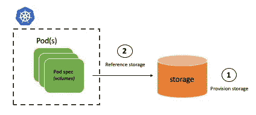
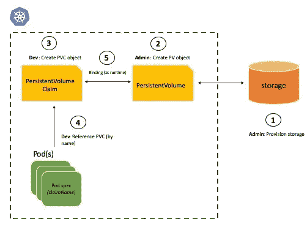
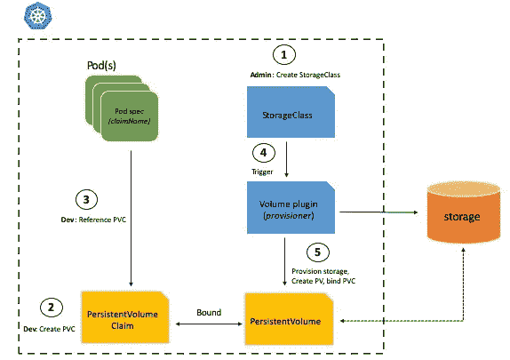

# 库伯内特卷:权威指南(第二部分)

> 原文：<https://itnext.io/tutorial-basics-of-kubernetes-volumes-part-2-b2ea6f397402?source=collection_archive---------2----------------------->

欢迎来到[“Kubernetes in the 坚果壳”](https://medium.com/@abhishek1987/kubernetes-in-a-nutshell-blog-series-c3a97fce9445)博客系列的另一部分，它关注 Kubernetes 的“广度”并涵盖基本主题，如[编排无状态应用](https://dev.to/itnext/stateless-apps-in-kubernetes-beyond-pods-4p52)，如何[使用](https://dev.to/itnext/hands-on-guide-configure-your-kubernetes-apps-using-the-configmap-object-44gj) `[ConfigMap](https://dev.to/itnext/hands-on-guide-configure-your-kubernetes-apps-using-the-configmap-object-44gj)`配置 Kubernetes 应用等。我希望你到目前为止喜欢它！

 [## “果壳中的库伯内特”——博客系列

### 本系列将涵盖 Kubernetes 的“广度”和核心/基础主题(见下一节)。它会…

medium.com](https://medium.com/@abhishek1987/kubernetes-in-a-nutshell-blog-series-c3a97fce9445) 

这是上一篇博客的延续，上一篇博客讲述了 Kubernetes `Volume`的基础知识。

[](/learn-about-the-basics-of-kubernetes-persistence-part-1-b1fa2847768f) [## 了解 Kubernetes 持久性的基础知识—第 1 部分

### 我们继续我们的“果壳中的库伯内特”之旅，这一部分将涵盖库伯内特卷！

itnext.io](/learn-about-the-basics-of-kubernetes-persistence-part-1-b1fa2847768f) 

在这一部分，我们将对其进行一些改进:

*   了解`PersistentVolume`、`PersistentVolumeClaim`物体以及它们如何协同工作
*   深入了解 Kubernetes 中的资源调配类型—静态、动态
*   了解存储类别以及它们如何支持动态配置
*   探索相关示例


# 先决条件:

要遵循这篇博客中的例子，您需要以下内容:

*   一个[微软 Azure 账户](https://docs.microsoft.com/azure/?WT.mc_id=medium-blog-abhishgu)—[注册一个免费账户吧！](https://azure.microsoft.com/free/?WT.mc_id=medium-blog-abhishgu)
*   [Azure Kubernetes 服务(AKS)集群](https://azure.microsoft.com/services/kubernetes-service/?WT.mc_id=medium-blog-abhishgu)——本博客将指导您创建一个集群
*   Azure CLI 或 Azure Cloud Shell——如果你还没有安装 Azure CLI ,你可以选择安装它(应该很快！)或者直接从你的浏览器使用 [Azure 云壳](https://azure.microsoft.com/features/cloud-shell/?WT.mc_id=medium-blog-abhishgu)。
*   `[kubectl](https://kubernetes.io/docs/tasks/tools/install-kubectl/)`与您的 AKS 集群互动

代码可从 GitHub 上的[获得](https://github.com/abhirockzz/kubernetes-in-a-nutshell/blob/master/volumes-2)

# 前一集…


…最后讨论了“对持久存储的需求”,因为普通 Kubernetes `Volume`的生命周期与`Pod`紧密相关，而严肃的应用需要比`Pod`甚至运行`Pod`的`Node`更持久的稳定持久的存储。

长期存储介质的例子是网络文件系统(NFS、Ceph、GlusterFS 等)。)或者基于云的选项，比如 [Azure Disk](https://azure.microsoft.com/services/storage/disks/?WT.mc_id=medium-blog-abhishgu) ，亚马逊 EBS，GCE 持久盘等。

下面的代码片段展示了如何使用`nfs`卷类型将 NFS(网络文件系统)挂载到`Pod`中。您可以使用`server`属性指向一个现有的 NFS 实例。

```
spec:
  volumes:
  - name: app-data
    nfs:
      server: nfs://localhost
      path: "/"
  containers:
  - image: myapp-docker-image
    name: myapp
    volumeMounts:
    - mountPath: /data
      name: app-data
```

# 这是👆够好吗？

在上面的`Pod`清单中，存储信息(NFS)直接在`Pod`中指定(使用`volumes`部分)。这意味着开发者需要知道 NFS 服务器的细节，包括它的位置等等。这里肯定有改进的余地，就像软件中的大多数事情一样，可以使用持久卷和持久卷声明的概念，通过另一个层次的间接或抽象来实现。

关键思想围绕着“职责分离”以及将存储创建/管理与其需求/请求分离开来。这就是`PersistentVolumeClaim`和`PersistentVolume`发挥作用的地方:

*   `PersistentVolumeClaim`允许用户通过指定需求(例如存储量)作为`PersistentVolumeClaim`规范的一部分，以“声明”的方式请求持久存储。
*   一个`PersistentVolume`是对`PersistentVolumeClaim`的补充，代表 Kubernetes 集群中的存储介质。存储的实际供应(例如，使用 Azure CLI 创建 [Azure 磁盘、Azure 门户等)。)并且集群中的`PersistentVolume`的创建通常由管理员完成，或者在动态供应的情况下，由 Kubernetes 自己完成(稍后将介绍)](https://docs.microsoft.com/cli/azure/disk?view=azure-cli-latest&WT.mc_id=medium-blog-abhishgu#az-disk-create)

除了职责的分离和分离，它还提供了灵活性和可移植性。例如，您有多个环境，如开发、测试、生产等。使用`PersistentVolume`，您只需声明一次存储需求(例如，“我的应用需要 5 GB”)，并根据环境切换实际存储介质，这要归功于`PersistentVolumeClaim`——这可以是开发环境中的本地磁盘、测试中的标准硬盘和生产中的固态硬盘。这同样适用于多云场景中的可移植性，在这种场景中，您可以使用相同的请求规范，但是根据云提供商切换`PersistentVolume`

> *在接下来的章节中，我们将举例来帮助巩固这些概念。*

# 深潜

## PersistentVolumeClaim

一个`PersistentVolumeClaim`只是另一个 Kubernetes 对象(如`Pod`、`Deployment`、`ConfigMap`等)。).这里有一个例子:

```
apiVersion: v1
kind: PersistentVolumeClaim
metadata:
  name: data-volume-claim
spec:
  accessModes:
    - ReadWriteOnce
  resources:
    requests:
      storage: 2Gi
  storageClassName: volume-class
```

最重要的部分是`**spec**`，它是对一个`[PersistentVolumeClaimSpec](https://kubernetes.io/docs/reference/generated/kubernetes-api/v1.15/#persistentvolumeclaimspec-v1-core)`对象的引用——这是定义存储需求的地方。需要关注的重要属性包括:

*   `resources` -卷所需的最小资源
*   `accessModes` -卷可以安装的方式(有效值为`ReadWriteOnce`、`ReadOnlyMany`、`ReadWriteMany`)
*   `storageClassName` -权利要求所要求的`StorageClass`的名称(`StorageClass`另节)

> `*PersistentVolumeClaim*` *有其他属性*`*apiVersion*`*`*kind*`*`*metadata*`*`*status*`*。这些是所有 Kubernetes 对象共有的。****

## **持久卷**

**这是典型的`PersistentVolume`规格的样子:**

```
**apiVersion: v1
  kind: PersistentVolume
  metadata:
    name: my-pvc
  spec:
    capacity:
      storage: 10Gi
    accessModes:
      - ReadWriteOnce
    persistentVolumeReclaimPolicy: Recycle
    storageClassName: volume-class
    nfs:
      server: nfs://localhost
      path: "/"**
```

**就像`PersistentVolumeClaim`，`spec` ( `PersistentVolumeSpec`对象)是`PersistentVolume`最重要的部分——让我们进一步剖析它:**

*   **特定于提供商/存储—如`nfs`、`azureDisk`、`gcePersistentDisk`、`awsElasticBlockStore`等。它允许你提供特定于存储介质(NFS，Azure 磁盘等)的信息。)**
*   **`accessModes` -卷的安装方式**
*   **`capacity` -永久卷的资源和容量信息。**
*   **`storageClassName` -该持久卷所属的`StorageClass`的名称(`StorageClass`即将被覆盖)**
*   **`persistentVolumeReclaimPolicy` -删除相应的`PersistentVolumeClaim`会发生什么-选项有`Retain`、`Delete`和`Recycle`(已弃用)**

**作为作业，请探究`nodeAffinity`、`volumeMode`、`mountOptions`属性，确定它们起什么作用**

> **`*PersistentVolume*` *有其他属性——*`*apiVersion*`*`*kind*`*`*metadata*`*`*status*`*。这些是所有 Kubernetes 对象共有的。******

## **这些对象是如何协同工作的？**

**有两种方法可以使用这些结构为 Kubernetes 应用程序获取存储— **静态**和**动态**。**

**在“静态”模式下，用户需要负责调配实际存储(云、本地存储等))然后在`Pod`规范(您的应用程序)中引用它**

**在“动态”方式中，Kubernetes 承担了存储供应的重任，并创建了`PersistentVolume`。您所做的就是通过在`Pod`规范中创建并引用一个`PersistentVolumeClaim`来提供您的存储需求**

> ***应在群集上启用动态预配置—在大多数提供商中，这是现成的***

**让我们探索一下静态资源调配**

# **静态供应**

**使用静态资源调配有两种方式:**

**其中之一是调配存储，并在`Pod`规范中直接使用其信息**

********

****我已经提到了这一点，但这是我最后一次这样做(在这种情况下)，并建议尝试一下关于如何[“在 Azure Kubernetes 服务(AKS)中手动创建和使用带有 Azure 磁盘的卷”](https://docs.microsoft.com/azure/aks/azure-disk-volume?WT.mc_id=medium-blog-abhishgu)的优秀教程。这就是它看起来的样子(正如你之前读到的，这很方便，但是有它的局限性)****

```
****spec:
  containers:
  - image: nginx
    name: mypod
    volumeMounts:
      - name: azure
        mountPath: /mnt/azure
  volumes:
      - name: azure
        azureDisk:
          kind: Managed
          diskName: myAKSDisk
          diskURI: /subscriptions/<subscriptionID>/resourceGroups/MC_myAKSCluster_myAKSCluster_eastus/providers/Microsoft.Compute/disks/myAKSDisk****
```

****在第二种方法中，不是创建磁盘并提供它的细节(在本例中是`azureDisk`，而是将信息封装在一个`PersistentVolume`中。然后您创建一个`PersistentVolumeClaim`并从`Pod`规范中引用它，并将其留给 Kubernetes 来匹配可用的存储需求****

********

****这里有一个片段可以让你有所了解****

```
****spec:
      volumes:
      - name: app-data
        persistentVolumeClaim:
          claimName: data-volume-claim****
```

> *****把它想象成把一个逻辑重构成它自己的方法——你接受一堆存储请求信息，并以* `*PersistentVolume*` *(类似于一个方法)的形式将其具体化。*****

# ****动态供应****

****如前所述，使用动态预配置，您可以将所有繁重的工作交给 Kubernetes。在我们开始之前，这里有一个它是如何工作的快照****

********

****与动态预配置相关的一个关键概念是`StorageClass`****

## ****存储类****

****就像`PersistentVolume`封装存储细节一样，`StorageClass`提供了一种描述存储“类别”的方式。为了使用`StorageClass`，你需要做的就是从`PersistentVolumeClaim`中引用它。****

****让我们实际理解一下——这是一个 [Azure 磁盘](https://azure.microsoft.com/services/storage/disks/?WT.mc_id=medium-blog-abhishgu)的`StorageClass`的例子。****

```
****apiVersion: storage.k8s.io/v1
kind: StorageClass
metadata:
  labels:
    kubernetes.io/cluster-service: "true"
  name: default
parameters:
  cachingmode: ReadOnly
  kind: Managed
  storageaccounttype: Standard_LRS
provisioner: kubernetes.io/azure-disk
reclaimPolicy: Delete
volumeBindingMode: Immediate****
```

****`StorageClass`规格中的关键参数是:****

*   ****`provisioner` -提供实际存储的卷插件(细节如下)****
*   ****`parameters` -可在运行时用作供应器的自定义键值对****
*   ****`reclaimPolicy` -创建`PersistentVolume`的回收策略(`Delete`删除 PVC 时删除 PV，保留 PV)****
*   ****`volumeBindingMode` -指示`PersistentVolumeClaim`应如何供应和绑定(有效值为`Immediate`和`WaitForFirstConsumer`)****

****这些参数(以及其他一些参数，如`allowVolumeExpansion`、`allowedTopologies`、`mountOptions`)中的信息在运行时用于动态配置存储并创建相应的`PersistentVolume`。****

> ****`*StorageClass*` *也有其他属性——*`*apiVersion*`*`*kind*`*`*metadata*`*。这些是所有 Kubernetes 对象共有的。*******

## ****什么是`provisioner`？****

****`provisioner`是动态预配置的核心——它是一个插件，包含用于创建特定类型存储资源的定制逻辑。Kubernetes 附带了一系列供应器，包括基于云的供应器，如 [Azure Disk](https://azure.microsoft.com/services/storage/disks/?WT.mc_id=medium-blog-abhishgu) ( `kubernetes.io/azure-disk`)、Azure File ( `kubernetes.io/azure-file`)、GCE 持久性磁盘、AWS EBS 等。****

> *****在上面的示例中，* `*kubernetes.io/azure-disk*` *被用作供应器*****

****`parameters`部分提供了一种在运行时将信息传递给参数的方法——这显然是特定于`provisioner`的。在上面的例子中，`cachingmode`、`storageaccounttype`和`kind`作为参数传递给`kubernetes.io/azure-disk`provisioner——这提供了很大的灵活性。****

> *****如果参数未通过，则使用默认值*****

## ****关于缺省存储类的一个注记****

****可以将`StorageClass`标记为默认值，以便在`PersistentVolumeClaim`中未提供`storageClass`属性时使用它(用于动态供应)。****

****[Azure Kubernetes 服务](https://azure.microsoft.com/services/kubernetes-service/?WT.mc_id=medium-blog-abhishgu)通过包含两个预播种存储类，简化了动态配置。您可以通过运行`kubectl get storageclass`命令进行检查****

```
**NAME                PROVISIONER                AGE
default (default)   kubernetes.io/azure-disk   6d10h
managed-premium     kubernetes.io/azure-disk   6d10h**
```

*   ****`default`存储类别:提供由标准硬盘支持的标准 [Azure 磁盘](https://docs.microsoft.com/azure/virtual-machines/windows/disks-types?WT.mc_id=medium-blog-abhishgu#standard-hdd)****
*   ****`managed-premium`存储类别:提供由高级固态硬盘支持的高级 [Azure 磁盘](https://docs.microsoft.com/azure/virtual-machines/windows/disks-types?WT.mc_id=medium-blog-abhishgu#premium-ssd)****

# ****动手操作:动态配置****

****是时候使用 [Azure Kubernetes 服务](https://azure.microsoft.com/services/kubernetes-service/?WT.mc_id=medium-blog-abhishgu)尝试动态预配置了。您将创建一个`PersistenceVolumeClaim`，一个简单的应用程序(`Deployment`)，它引用该声明并查看事情在实践中是如何工作的。****

****如果你还没有一个 Azure 帐户，现在是时候注册一个免费帐户了。****

# ****Kubernetes 集群设置****

****你只需要一个命令就可以在 Azure 上建立一个 Kubernetes 集群。但是，在此之前，我们必须创建一个资源组****

```
**export AZURE_SUBSCRIPTION_ID=[to be filled]
export AZURE_RESOURCE_GROUP=[to be filled]
export AZURE_REGION=[to be filled] (e.g. southeastasia)**
```

****切换到您的订阅并调用`az group create`****

```
**az account set -s $AZURE_SUBSCRIPTION_ID
az group create -l $AZURE_REGION -n $AZURE_RESOURCE_GROUP**
```

****您现在可以调用`az aks create`来创建新的集群****

> *****为了简单起见，下面的命令创建了一个单节点集群。请根据您的要求随意更改规格*****

```
**export AKS_CLUSTER_NAME=[to be filled]az aks create --resource-group $AZURE_RESOURCE_GROUP --name $AKS_CLUSTER_NAME --node-count 1 --node-vm-size Standard_B2s --node-osdisk-size 30 --generate-ssh-keys**
```

****使用`az aks get-credentials`获取 AKS 集群凭证——因此，`kubectl`现在将指向您的新集群。你可以证实这一点****

```
**az aks get-credentials --resource-group $AZURE_RESOURCE_GROUP --name $AKS_CLUSTER_NAME
kubectl get nodes**
```

> *****如果你有兴趣使用*[*Azure*](https://azure.microsoft.com/services/kubernetes-service/?WT.mc_id=medium-blog-abhishgu)*学习 Kubernetes 和 Containers，一个很好的起点是使用文档中的* [*快速入门、教程和代码示例*](https://docs.microsoft.com/azure/aks/?WT.mc_id=medium-blog-abhishgu) *来熟悉这项服务。我也强烈推荐查看一下* [*50 天 Kubernetes 学习路径*](https://azure.microsoft.com/resources/kubernetes-learning-path/?WT.mc_id=medium-blog-abhishgu) *。高级用户可能希望参考* [*Kubernetes 最佳实践*](https://docs.microsoft.com/azure/aks/best-practices?WT.mc_id=medium-blog-abhishgu) *或观看一些* [*视频*](https://azure.microsoft.com/resources/videos/index/?services=kubernetes-service&WT.mc_id=medium-blog-abhishgu) *以了解演示、主要功能和技术会议。*****

# ****创建 PersistentVolumeClaim，然后部署应用程序****

****这是我们将使用的`PersistentVolumeClaim`规格****

```
**apiVersion: v1
kind: PersistentVolumeClaim
metadata:
  name: azure-disk-pvc
spec:
  accessModes:
    - ReadWriteOnce
  resources:
    requests:
      storage: 2Gi**
```

****注意，`PersistenceVolumeClaim`没有使用`storageClass`——这是为了确保`default`存储类用于动态供应。****

****创造了`PersistenceVolumeClaim`****

```
**kubectl apply -f [https://raw.githubusercontent.com/abhirockzz/kubernetes-in-a-nutshell/master/volumes-2/azure-disk-pvc.yaml](https://raw.githubusercontent.com/abhirockzz/kubernetes-in-a-nutshell/master/volumes-2/azure-disk-pvc.yaml)**
```

****如果你检查一下，你会看到这样的东西(`STATUS` = `Pending`)****

```
**kubectl get pvcNAME             STATUS    VOLUME   CAPACITY   ACCESS MODES   STORAGECLASS   AGE
azure-disk-pvc   Pending                                      default        11s**
```

****一段时间后，它应该变成(`STATUS`=`Bound`)——这是因为 Azure 磁盘和`PersistenceVolume`是自动创建的****

```
**NAME             STATUS   VOLUME                                     CAPACITY   ACCESS MODES   STORAGECLASS   AGE
azure-disk-pvc   Bound    pvc-7b0e2911-df74-11e9-93ab-025752f370d3   2Gi        RWO            default        36s**
```

****您也可以检查动态配置的`PersistenceVolume`-`kubectl get pv`****

****确认 Azure 磁盘已创建****

```
**AKS_NODE_RESOURCE_GROUP=$(az aks show --resource-group $AZURE_RESOURCE_GROUP --name $AKS_CLUSTER_NAME --query nodeResourceGroup -o tsv)az disk list -g $AKS_NODE_RESOURCE_GROUP**
```

****`tags`部分看起来类似于****

```
**"tags": {
      "created-by": "kubernetes-azure-dd",
      "kubernetes.io-created-for-pv-name": "pvc-7b0e2911-df74-11e9-93ab-025752f370d3",
      "kubernetes.io-created-for-pvc-name": "azure-disk-pvc",
      "kubernetes.io-created-for-pvc-namespace": "default"
}**
```

****创建应用程序`Deployment`****

```
**kubectl apply -f [https://raw.githubusercontent.com/abhirockzz/kubernetes-in-a-nutshell/master/volumes-2/app.yaml](https://raw.githubusercontent.com/abhirockzz/kubernetes-in-a-nutshell/master/volumes-2/app.yaml)**
```

****为了测试它，我们将使用一个简单的 Go 应用程序。它所做的只是将日志语句推送到`/mnt/logs`中的一个文件`logz.out`——这是安装到`Pod`中的路径****

****等待一段时间，使部署处于`Running`状态****

```
**kubectl get pods -l=app=logzNAME                               READY   STATUS    RESTARTS   AGE
logz-deployment-59b75bc786-wt98d   1/1     Running   0          15s**
```

****为了确认，检查`Pod`中的`mnt/logs/logz.out`****

```
**kubectl exec -it $(kubectl get pods -l=app=logz --output=jsonpath={.items..metadata.name}) -- tail -f /mnt/logs/logz.out**
```

****您将每 3 秒钟看到一次日志(只有时间戳)****

```
**2019-09-25 09:17:11.960671937 +0000 UTC m=+84.002677518
2019-09-25 09:17:14.961347341 +0000 UTC m=+87.003352922
2019-09-25 09:17:17.960697766 +0000 UTC m=+90.002703347
2019-09-25 09:17:20.960666399 +0000 UTC m=+93.002671980**
```

****这就是我们关于 Kubernetes 卷的两部分系列的结尾。你觉得这篇文章怎么样？你从中学到了什么吗？它是否有助于解决一个问题，解决您一直以来的疑问？😃😃或者它需要改进😡请提供您的反馈——它非常有价值，我将非常感谢！你可以通过推特或者直接在下面留言来开始讨论。****

****正如我前面提到的，这是更大的博客系列[“Kubernetes in through”](https://medium.com/@abhishek1987/kubernetes-in-a-nutshell-blog-series-c3a97fce9445)的一个子部分，还有更多！请不要忘记喜欢和关注😉****