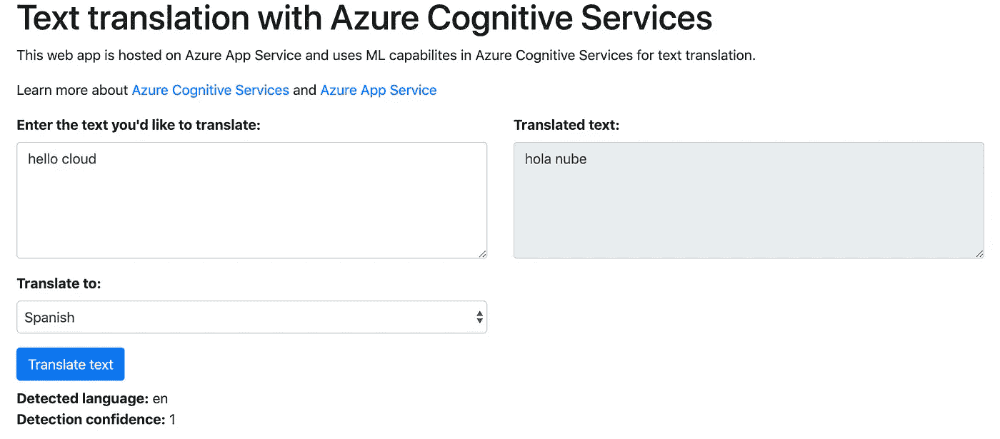

# 教程:用 Azure 认知服务构建文本翻译应用

> 原文：<https://itnext.io/tutorial-build-a-text-translation-app-with-azure-cognitive-services-3dd7f5d013c4?source=collection_archive---------3----------------------->

本教程将借助一个文本翻译示例演示 [Azure 认知服务](https://azure.microsoft.com/services/cognitive-services/?WT.mc_id=medium-blog-abhishgu)的用法，该示例使用部署到 [Azure 应用服务](https://azure.microsoft.com/services/app-service/?WT.mc_id=medium-blog-abhishgu)的简单 [Golang](https://golang.org/) 应用来实现



您将:

*   获得 Azure 认知和 Azure 应用服务功能的概述
*   浏览一个简单而实用的例子，展示如何使用[认知翻译文本 API](https://docs.microsoft.com/azure/cognitive-services/translator/translator-info-overview?WT.mc_id=medium-blog-abhishgu)
*   了解如何设置、配置认知服务和应用服务以及应用部署

> 我希望得到您的反馈和建议😃就[*tweet/DM*](https://twitter.com/abhi_tweeter)*或者掉个评论！*

# 概观

这里是正在使用的 Azure 服务的一个快速概述。

# Azure 认知服务

Azure 认知服务使开发者能够构建智能 [AI 和机器学习驱动的](https://docs.microsoft.com/azure/cognitive-services/cognitive-services-and-machine-learning?WT.mc_id=medium-blog-abhishgu)应用。它以 SDK 和 API 的形式提供了跨越视觉、[语音](https://azure.microsoft.com/services/cognitive-services/directory/speech/?WT.mc_id=medium-blog-abhishgu)、[语言](https://azure.microsoft.com/services/cognitive-services/directory/lang/?WT.mc_id=medium-blog-abhishgu)、[网络搜索](https://azure.microsoft.com/services/cognitive-services/directory/search/?WT.mc_id=medium-blog-abhishgu)和[决策](https://azure.microsoft.com/services/cognitive-services/directory/decision/?WT.mc_id=medium-blog-abhishgu)等领域的能力，从而使 AI/ML 更容易被广大开发人员使用。

在本例中，我们将使用 [Translator Text API](https://docs.microsoft.com/azure/cognitive-services/translator/translator-info-overview?WT.mc_id=medium-blog-abhishgu) ，它允许您添加 60 多种语言的多语言用户体验，并且可以在任何硬件平台和任何操作系统上用于文本到文本的语言翻译。

> *Azure 认知服务也有* [*Docker 容器*](https://docs.microsoft.com/azure/cognitive-services/cognitive-services-container-support?WT.mc_id=medium-blog-abhishgu) *的形式！*

# Azure 应用服务

Azure App Service 使您能够以自己选择的编程语言构建和托管 web 应用、移动后端和 RESTful APIs，而无需管理基础架构。[您可以在 Linux 上使用它](https://docs.microsoft.com/azure/app-service/containers/app-service-linux-intro?WT.mc_id=medium-blog-abhishgu)在 Linux 上本地托管 web 应用程序，以获得支持的应用程序堆栈，并支持多种语言的内置 Docker 映像[，如 Node.js、Java、Python](https://docs.microsoft.com/azure/app-service/containers/app-service-linux-intro?WT.mc_id=medium-blog-abhishgu#languages) 等。虽然我们使用 Golang 作为示例应用程序，但我们仍然可以在应用程序服务上托管它，因为它也支持自定义 Docker 图像！

# 先决条件

你需要一个[微软 Azure 账户](https://docs.microsoft.com/azure/?WT.mc_id=medium-blog-abhishgu)——如果你还没有的话，就去[拿一个免费的](https://azure.microsoft.com/free/?WT.mc_id=medium-blog-abhishgu)。另外，确保你已经安装了 Azure CLI(应该很快！)

# 代码演练…

在我们真正经历设置和部署过程之前，让我们花点时间浏览一下应用程序逻辑

> *该代码可在* [*GitHub*](https://github.com/abhirockzz/azure-cognitive-translateapp) 上获得

该应用程序有两个部分:

*   前端:用户可以使用它输入要翻译成特定语言的文本
*   后端:一个 Go API，接受翻译请求，调用 Azure 认知服务 API 并将响应返回给用户

> *来自* [*的用户界面本教程*](https://docs.microsoft.com/azure/cognitive-services/translator/tutorial-build-flask-app-translation-synthesis?WT.mc_id=medium-blog-abhishgu) *被重新用于本例*

Go 后端提供了一个简单的 HTTP 服务器。我们为 UI 注册了一个 HTTP 处理程序

```
uiHandler := http.FileServer(http.Dir("ui"))
http.Handle("/", uiHandler)
```

为翻译请求服务的另一个处理程序(为了简洁起见，只显示了代码的相关部分)

```
....
http.HandleFunc(translateRoute, func(w http.ResponseWriter, r *http.Request) {
	var userReq request
	err := json.NewDecoder(r.Body).Decode(&userReq)
	response, err := translateText(userReq.Text, userReq.ToLang)
	err = json.NewEncoder(w).Encode(&response)
})
....
```

最后，启动 HTTP 服务器

```
http.ListenAndServe(":"+port, nil)
```

`translateText`函数负责调用文本翻译 API。这是调用翻译器文本 API 的地方。API 端点是以下内容的组合

*   作为环境变量(`https://api.cognitive.microsofttranslator.com`)传递的基本端点，
*   一个后缀(`/translate?api-version=3.0"`)和
*   作为查询参数(`to`)添加的目标语言代码(如`en`代表英语)

> *如* `[*https://api.cognitive.microsofttranslator.com/translate?api-version=3.0&to=de*](https://api.cognitive.microsofttranslator.com/translate?api-version=3.0&to=de.)` [*。*](https://api.cognitive.microsofttranslator.com/translate?api-version=3.0&to=de.)

请求体是一个简单的 JSON 有效负载，包含要翻译的文本

```
func translateText(text, toLang string) (translateAPIResponse, error) {
    ....
    cognitiveServiceEndpoint := baseEndpoint + endpointSuffix + "&to=" + toLang
    reqBody := `[{'Text':'` + text + `'}]`
    req, err := http.NewRequest(http.MethodPost, cognitiveServiceEndpoint, strings.NewReader(reqBody)) req.Header.Add(subscriptionKeyHeader, subscriptionKey)
    req.Header.Add("Content-Type", "application/json") res, err := http.DefaultClient.Do(req) var result translateAPIResponse
    err = json.NewDecoder(res.Body).Decode(&result)
    return result, nil
}
```

认知服务订阅密钥和 API 端点所需的环境变量在`init()`函数中进行检查，以便在未配置时快速失效

```
func init() {
    subscriptionKey = os.Getenv(subscriptionKeyEnvVar)
    if "" == subscriptionKey {
        log.Fatalf("Please set the %s environment variable", subscriptionKeyEnvVar)
    }
    baseEndpoint = os.Getenv(endpointEnvVar)
    if "" == baseEndpoint {
        log.Fatalf("Please set the %s environment variable", endpointEnvVar)
    }
}
```

现在，您已经对基本逻辑有了一个大致的了解，让我们来启动并运行所有这些。我们将从建立 Azure 认知服务开始。

# Azure 认知服务设置

创建一个新的 Azure 资源组来试用这个演示应用程序。

```
export AZURE_RESOURCE_GROUP=[to be filled]
export AZURE_LOCATION=[to be filled e.g. southeastasia]az group create --name $AZURE_RESOURCE_GROUP --location $AZURE_LOCATION
```

您应该会看到类似下面的响应

```
{
    "id": "/subscriptions/1234564b-6705-4cc2-b8ea-9a9036f8b42d/resourceGroups/foobar-resource-group",
    "location": "southeastasia",
    "managedBy": null,
    "name": "foobar-resource-group",
    "properties": {
        "provisioningState": "Succeeded"
    },
    "tags": null,
    "type": null
}
```

要创建认知服务帐户，您需要:

*   `kind`您想要使用的服务-由于我们正在使用翻译文本服务，我们将选择`TextTranslation`

> *用* `[*az cognitiveservices account list-kinds*](https://docs.microsoft.com/cli/azure/cognitiveservices/account?view=azure-cli-latest&WT.mc_id=medium-blog-abhishgu#az-cognitiveservices-account-list-kinds)`找到可用认知服务列表 `*kind*`

*   *您需要的`SKU`(定价层)——在本例中，您可以使用自由层 SKU ( `F0`)。要查找`SKU`的详尽列表，请使用`az cognitiveservices account list-skus --kind TextTranslation --location $AZURE_LOCATION`*

> **文档**

*设置所需的环境变量*

```
*export COGNITIVE_SERVICE_KIND=TextTranslation
export COGNITIVE_SERVICE_SKU=F0
export COGNITIVE_SERVICE_ACCOUNT_NAME=[to be filled e.g. text-translation-service]*
```

*要创建帐户*

```
*az cognitiveservices account create \
    --name $COGNITIVE_SERVICE_ACCOUNT_NAME \
    --resource-group $AZURE_RESOURCE_GROUP \
    --kind $COGNITIVE_SERVICE_KIND \
    --sku $COGNITIVE_SERVICE_SKU \
    --location $AZURE_LOCATION \
    --yes*
```

> **为*[*az cognitive services 账户创建*](https://docs.microsoft.com/cli/azure/cognitiveservices/account?view=azure-cli-latest&WT.mc_id=medium-blog-abhishgu#az-cognitiveservices-account-create) 的文档*

*您需要认知服务资源的密钥才能对其进行身份验证。*

```
*az cognitiveservices account keys list \
    --name $COGNITIVE_SERVICE_ACCOUNT_NAME \
    --resource-group $AZURE_RESOURCE_GROUP*
```

*您应该得到两个键作为 JSON 响应——您可以使用其中任何一个*

```
*{
"key1": "42d9a082a4242edbaffd42487db8d2ec",
"key2": "2f2ce290b0ae4c42a428b7e6ebe34242"
}*
```

*请注意，这些订阅密钥包含敏感信息，您不应共享它们。它们应安全储存并定期再生。*

> **文档为* `[*az cognitiveservices account keys list*](https://docs.microsoft.com/cli/azure/cognitiveservices/account/keys?view=azure-cli-latest&WT.mc_id=medium-blog-abhishgu#az-cognitiveservices-account-keys-list)`*

# *健全性检查*

*在继续下一步之前，请检查认知服务设置是否正常工作。您所需要的只是一种访问认知服务 REST API 的方法。在这种情况下，我使用`curl`来测试文本`Hello World`到德语(`de`)的转换*

```
*export COGNITIVE_SERVICE_API_KEY=[fill in the api/subcription key obtained earlier]curl -X POST "https://api.cognitive.microsofttranslator.com/translate?api-version=3.0&to=de" -H "Ocp-Apim-Subscription-Key: $COGNITIVE_SERVICE_API_KEY" -H "Content-Type: application/json" -d "[{'Text':'Hello World'}]"*
```

> *`*https://api.cognitive.microsofttranslator.com*` *是翻译 API* 的基本 HTTP 端点*

*您应该看到这个带有`"text": "Hallo Welt"`的 JSON 响应，它是翻译后的响应*

```
*[
  {
    "detectedLanguage": {
      "language": "en",
      "score": 1
    },
    "translations": [
      {
        "text": "Hallo Welt",
        "to": "de"
      }
    ]
  }
]*
```

# *为翻译应用程序构建 Docker 映像*

> *这一步是可选的。你可以使用我在[*docker hub*](https://hub.docker.com/)上提供的预建图像 `[*abhirockzz/azure-translate*](https://hub.docker.com/r/abhirockzz/azure-translate)`*

**您可以使用 Docker 文件构建您自己的映像，并将其推送到您选择的 Docker 注册表(公共/私有)。**

```
**docker build -t [REPOSITORY_NAME/YOUR_DOCKER_IMAGE:TAG] .
//e.g.
docker build -t [abhirockzz/azure-translate:latest] .//login to your registry
docker login//push image to registry
docker push [REPOSITORY_NAME/YOUR_DOCKER_IMAGE:TAG]**
```

> **[*这里有一个教程*](https://docs.microsoft.com/azure/app-service/containers/tutorial-custom-docker-image?WT.mc_id=medium-blog-abhishgu) *提供了一个如何将* [*Azure 容器注册表*](https://azure.microsoft.com/services/container-registry/?WT.mc_id=medium-blog-abhishgu) *与 Azure Web App* 一起使用的例子**

# **设置并部署到 Azure 应用服务**

**是时候将我们的应用部署到云上了——让我们使用 Azure 应用服务快速完成这项工作。首先，创建一个应用服务计划，为我们的 web 应用运行定义一组计算资源。**

> ***关于 App 服务计划的详细信息，请参见* [*文档*](https://docs.microsoft.com/azure/app-service/overview-hosting-plans?toc=/azure/app-service/containers/toc.json&WT.mc_id=medium-blog-abhishgu)**

***该计划与一个`SKU`相关联——就像认知服务一样，你也需要为应用服务选择一个`SKU`(定价层)。对于这个例子，我们将使用一个小层(`B1`)。***

> ****接受的值有*和`*B1, B2, B3, D1, F1, FREE, P1V2, P2V2, P3V2, PC2, PC3, PC4, S1, S2, S3, SHARED*`***

```
**export APP_SERVICE_PLAN_NAME=[to be filled e.g. my-appsvc-plan]
export APP_SERVICE_SKU=B1az appservice plan create --name $APP_SERVICE_PLAN_NAME --resource-group $AZURE_RESOURCE_GROUP --sku $APP_SERVICE_SKU --is-linux**
```

> ***文档***

**部署应用程序**

```
**export APP_NAME=[to be filled e.g. translateapp]
export APP_DOCKER_IMAGE=[to be filled e.g. abhirockzz/azure-translate]
export COGNITIVE_TRANSLATOR_TEXT_SUBSCRIPTION_KEY=[Cognitive Translator text API key obtained previously]
export COGNITIVE_TRANSLATOR_API_BASE_ENDPOINT=https://api.cognitive.microsofttranslator.comaz webapp create --resource-group $AZURE_RESOURCE_GROUP --plan $APP_SERVICE_PLAN_NAME --name $APP_NAME --deployment-container-image-name $APP_DOCKER_IMAGE//add the environment variables required by the applicationaz webapp config appsettings set --resource-group $AZURE_RESOURCE_GROUP --name $APP_NAME --settings COGNITIVE_TRANSLATOR_TEXT_SUBSCRIPTION_KEY=$COGNITIVE_TRANSLATOR_TEXT_SUBSCRIPTION_KEY COGNITIVE_TRANSLATOR_API_BASE_ENDPOINT=$COGNITIVE_TRANSLATOR_API_BASE_ENDPOINT**
```

# **尝试一些翻译！**

**您应该能够使用浏览器访问您的 web 应用程序。只需导航至`https://[APP_NAME].azurewebsites.net/`，例如`[https://translateapp.azurewebsites.net/](https://translateapp.azurewebsites.net/)`**

**使用该应用程序很简单。只需输入您想要翻译的文本，并从**翻译到:**下拉菜单中选择目标语言。如果一切顺利，您应该会在**翻译文本:**下看到结果！**

# **一旦你完成了…**

**删除资源组以删除为认知服务和 Azure 应用服务创建的所有关联资源**

```
**az group delete --name $AZURE_RESOURCE_GROUP --yes --no-wait**
```

# **外卖食品**

**这是一个简单的应用程序，但要理解的关键是，智能 AI/ML 驱动的应用程序只是一堆 API 调用，这要归功于 Azure Cognitive Servies，它提供了大量的功能，如决策、语言、搜索、语音和视觉！我们使用 Azure 应用服务来托管应用，但你可以自由选择选项，如 [Azure 容器实例](https://docs.microsoft.com/azure/container-instances/?WT.mc_id=medium-blog-abhishgu)或 [Azure Kubernetes 服务](https://docs.microsoft.com/azure/aks/?WT.mc_id=medium-blog-abhishgu)。**

**这就是本文的全部内容，请继续关注更多内容！如果你觉得有用，请点赞并关注😃😃**