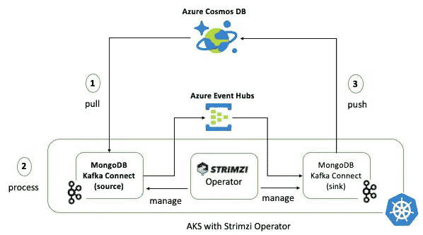
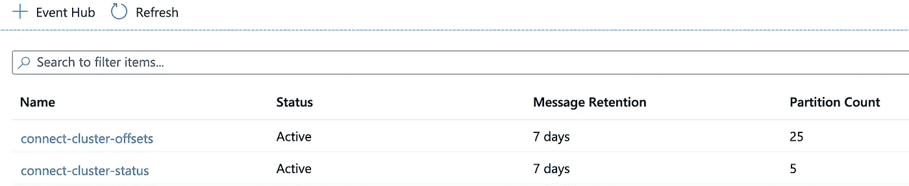

# 使用 Kubernetes 上的 MongoDB 和 Kafka Connect 构建数据管道

> 原文：<https://itnext.io/tutorial-data-pipeline-using-mongodb-and-kafka-connect-on-kubernetes-39ce92227736?source=collection_archive---------1----------------------->

在 Kubernetes 上的 Kafka Connect，简单的方法！，我已经在`Kubernetes`上使用`[Strimzi](http://strimzi.io/)`以及文件源和接收器连接器演示了`[Kafka Connect](https://kafka.apache.org/documentation/#connect)`。这篇博客将展示如何使用 MongoDB 和 Kafka 以及 [MongoDB Kafka 连接器](https://docs.mongodb.com/kafka-connector/current/)构建一个简单的数据管道，这些连接器将通过`Strimzi`部署在 Kubernetes 上。

我将使用以下 Azure 服务:

> *请注意，这些组件之间没有硬性依赖关系，该解决方案也应该与替代方案一起使用*

*   [Apache Kafka 的 Azure 事件中心](https://docs.microsoft.com/azure/event-hubs/event-hubs-for-kafka-ecosystem-overview?WT.mc_id=medium-blog-abhishgu)(任何其他 Kafka 集群都应该工作正常)
*   [Azure Kubernetes 服务](https://docs.microsoft.com/azure/aks/?WT.mc_id=medium-blog-abhishgu)(随意使用`minikube`、`kind`等。)
*   [Azure Cosmos DB](https://docs.microsoft.com/azure/cosmos-db/introduction?WT.mc_id=medium-blog-abhishgu) 作为 MongoDB 数据库，感谢 [Azure Cosmos DB 为 MongoDB](https://docs.microsoft.com/azure/cosmos-db/mongodb-introduction?WT.mc_id=medium-blog-abhishgu) 提供的 API

在本教程中，Kafka Connect 组件被部署到 Kubernetes，但它也适用于任何 Kafka Connect 部署

包括什么？

*   MongoDB Kafka 连接器和 Strimzi 概述
*   Azure 特定(可选)— Azure 事件中心、Azure Cosmos DB 和 Azure Kubernetes 服务
*   设置和操作源和接收器连接器
*   测试端到端场景

> *GitHub*上的 [*都有*](https://github.com/abhirockzz/mongodb-kafkaconnect-kubernetes)

# 概观

以下是不同组件的概述:



> 我用了一个人为的/简单的例子来关注管道和移动部件

## MongoDB Kafka 连接器

MongoDB Kafka Connect 集成提供了两个连接器:源和接收器

*   源连接器:它从一个`MongoDB`集合(充当一个`source`)中提取数据，并将它们写入 Kafka 主题
*   Sink connector:它用于处理 Kafka 主题中的数据，将它们保存到另一个 MongoDB 集合中(这相当于一个`sink`)

> *这些连接器也可以单独使用，但是在这篇博客中，我们将一起使用它们来拼接端到端解决方案*

## `Strimzi`概述

`Strimzi`通过为在 Kubernetes 上运行 Kafka 提供容器映像和操作符，简化了在 Kubernetes 集群中运行 Apache Kafka 的过程。它是 `[Cloud Native Computing Foundation](https://strimzi.io/blog/2019/09/06/cncf/)`的[部分，作为](https://strimzi.io/blog/2019/09/06/cncf/)`[Sandbox](https://www.cncf.io/sandbox-projects/)` [项目](https://www.cncf.io/sandbox-projects/)(撰写时)

是这个项目的基础。这些操作人员具有专业的操作知识，能够有效地管理 Kafka。运营商简化了以下过程:部署和运行 Kafka 集群和组件，配置和保护对 Kafka 的访问，升级和管理 Kafka，甚至负责管理主题和用户。

# 先决条件

`kubectl`-[https://kubernetes.io/docs/tasks/tools/install-kubectl/](https://kubernetes.io/docs/tasks/tools/install-kubectl/)

如果你选择使用 Azure Event Hubs、Azure Kubernetes 服务或 Azure Cosmos DB，你将需要一个[微软 Azure 账户](https://docs.microsoft.com/azure/?WT.mc_id=medium-blog-abhishgu)。去报名参加一个免费的吧！

`Azure CLI`或`Azure Cloud Shell` -如果你还没有安装 [Azure CLI](https://docs.microsoft.com/cli/azure/install-azure-cli?view=azure-cli-latest&WT.mc_id=medium-blog-abhishgu) ，你可以选择安装它(应该很快！)或者直接从浏览器使用 [Azure 云壳](https://azure.microsoft.com/features/cloud-shell/?WT.mc_id=medium-blog-abhishgu)。

## 舵

我将使用`Helm`安装`Strimzi`。这里是安装【https://helm.sh/docs/intro/install/】[`Helm`本身的文档](https://helm.sh/docs/intro/install/)

> *您也可以使用* `*YAML*` *文件直接安装* `*Strimzi*` *。点击这里查看快速入门指南-*[*https://strim zi . io/docs/quick start/latest/# proc-install-product-str*](https://strimzi.io/docs/quickstart/latest/#proc-install-product-str)

让我们从设置所需的 Azure 服务开始(如果您没有使用 Azure，请跳过这一部分，但请确保您有 Kafka 集群的详细信息，即代理 URL 和身份验证凭据，如果适用)

> *我建议将以下服务作为单个* [*Azure 资源组*](https://docs.microsoft.com/azure/azure-resource-manager/management/overview?WT.mc_id=medium-blog-abhishgu#resource-groups) *的一部分安装，这样可以很容易地清理这些服务*

## 天蓝色宇宙数据库

您需要创建一个启用了 MongoDB API 支持的 Azure Cosmos DB 帐户以及一个数据库和集合。按照以下步骤使用 Azure 门户设置 Azure Cosmos DB:

*   [创建 Azure Cosmos DB 帐户](https://docs.microsoft.com/azure/cosmos-db/create-mongodb-java?WT.mc_id=medium-blog-abhishgu#create-a-database-account)
*   [添加数据库和集合](https://docs.microsoft.com/azure/cosmos-db/create-mongodb-java?WT.mc_id=medium-blog-abhishgu#add-a-collection)并获取连接字符串

> *了解更多关于如何在 Azure Cosmos DB* 中使用数据库、容器和项目的信息

如果你想使用 Azure CLI 或云 Shell，下面是你需要执行的命令序列:

[创建 Azure Cosmos DB 帐户](https://docs.microsoft.com/cli/azure/cosmosdb?view=azure-cli-latest&WT.mc_id=medium-blog-abhishgu#az-cosmosdb-create)(注意`--kind MongoDB`)

```
az cosmosdb create --resource-group <RESOURCE_GROUP> --name <COSMOS_DB_NAME> --kind MongoDB
```

[创建数据库](https://docs.microsoft.com/cli/azure/cosmosdb/mongodb/database?view=azure-cli-latest&WT.mc_id=medium-blog-abhishgu#az-cosmosdb-mongodb-database-create)

```
az cosmosdb mongodb database create --account-name <COSMOS_DB_ACCOUN> --name <COSMOS_DB_NAME> --resource-group <RESOURCE_GROUP>
```

最后，[在数据库中创建一个集合](https://docs.microsoft.com/cli/azure/cosmosdb/mongodb/collection?view=azure-cli-latest&WT.mc_id=medium-blog-abhishgu#az-cosmosdb-mongodb-collection-create)

```
az cosmosdb mongo collection create --account-name <COSMOS_DB_ACCOUNT> --database-name <COSMOS_DB_NAME> --name <COSMOS_COLLECTION_NAME> --resource-group-name <RESOURCE_GROUP> --shard <SHARDING_KEY_PATH>
```

获取连接字符串并保存它。你以后会用到它

```
az cosmosdb list-connection-strings --name <COSMOS_DB_ACCOUNT> --resource-group <RESOURCE_GROUP> -o tsv --query connectionStrings[0].connectionString
```

用一些数据作为集合的种子。有很多方法可以做到这一点。出于本教程的目的，我推荐快速简单的方法，例如:

*   Azure 门户中可用的`Data Explorer`选项卡(当您创建 Azure Cosmos DB 帐户时)
*   [Azure Cosmos DB explorer](https://docs.microsoft.com/azure/cosmos-db/data-explorer?WT.mc_id=medium-blog-abhishgu) (一个独立的基于网络的界面)
*   [原生 Mongo shell](https://devblogs.microsoft.com/cosmosdb/preview-native-mongo-shell/) (通过 Azure 门户中的数据浏览器选项卡)

> *稍后，当我们部署源连接器时，我们将仔细检查这些(现有的)项目/记录是否被连接器拾取并发送到 Kafka*

## Azure 活动中心

[Azure Event Hubs](https://docs.microsoft.com/azure/event-hubs/event-hubs-about?%5BWT.mc_id=medium-blog-abhishgu) 是一个数据流平台和事件摄取服务[，它还提供了一个 Kafka 端点](https://docs.microsoft.com/azure/event-hubs/event-hubs-for-kafka-ecosystem-overview?WT.mc_id=medium-blog-abhishgu)，现有的基于 Kafka 的应用程序可以使用它作为运行自己的 Kafka 集群的替代方案。Event Hubs 支持 Apache Kafka protocol 1.0 和更高版本，并与 Kafka 生态系统中现有的 Kafka 客户端应用程序和其他工具一起工作，包括`Kafka Connect`(在本博客中演示过)`MirrorMaker`等。

要设置 Azure Event Hubs 集群，您可以从各种选项中进行选择，包括[Azure 门户](https://docs.microsoft.com/azure/event-hubs/event-hubs-create?WT.mc_id=medium-blog-abhishgu)、 [Azure CLI](https://docs.microsoft.com/azure/event-hubs/event-hubs-quickstart-cli?WT.mc_id=medium-blog-abhishgu) 、 [Azure PowerShell](https://docs.microsoft.com/azure/event-hubs/event-hubs-quickstart-powershell?WT.mc_id=medium-blog-abhishgu) 或[ARM 模板](https://docs.microsoft.com/azure/event-hubs/event-hubs-resource-manager-namespace-event-hub?WT.mc_id=medium-blog-abhishgu)。一旦设置完成，您将需要连接字符串(将在后续步骤中使用)用于[认证到事件中心](https://docs.microsoft.com/azure/event-hubs/authenticate-shared-access-signature?WT.mc_id=medium-blog-abhishgu) — [使用本指南](https://docs.microsoft.com/azure/event-hubs/event-hubs-get-connection-string?WT.mc_id=medium-blog-abhishgu)完成此步骤。

请确保您还创建了一个事件中心(与 Kafka 主题相同),作为我们的 Kafka Connect 连接器的目标(在后续部分中有详细描述)

## 蓝色库伯内特服务

[Azure Kubernetes 服务(AKS)](https://docs.microsoft.com/azure/aks/intro-kubernetes?WT.mc_id=medium-blog-abhishgu) 让在 Azure 中部署托管的 Kubernetes 集群变得简单。它通过将大部分责任转移给 Azure，降低了管理 Kubernetes 的复杂性和运营开销。以下是如何使用 [Azure CLI](https://docs.microsoft.com/azure/aks/kubernetes-walkthrough?WT.mc_id=medium-blog-abhishgu) 、 [Azure portal](https://docs.microsoft.com/azure/aks/kubernetes-walkthrough-portal?WT.mc_id=medium-blog-abhishgu) 或 [ARM 模板](https://docs.microsoft.com/azure/aks/kubernetes-walkthrough-rm-template?WT.mc_id=medium-blog-abhishgu)设置 AKS 集群的示例

现在让我们继续讨论 Kubernetes 组件:

> *请注意，我重复使用了* [*之前博文*](https://dev.to/azure/kafka-connect-on-kubernetes-the-easy-way-2co9) *中的部分内容(毕竟安装是一样的！)，但同时尽量保持简短，避免重复。对于已经省略的部分，例如解释 Kafka Connect 的* `*Strimzi*` *组件规格等。，我想请你看看那个博客*

# 基础安装

首先，我们将安装`Strimzi`和 Kafka Connect，然后是 MongoDB 连接器

## 安装 Strimzi

使用`Helm`安装 Strimzi 非常简单:

```
//add helm chart repo for Strimzi
helm repo add strimzi https://strimzi.io/charts///install it! (I have used strimzi-kafka as the release name)
helm install strimzi-kafka strimzi/strimzi-kafka-operator
```

这将安装`Strimzi`操作符(它只是一个`Deployment`)、定制资源定义和其他 Kubernetes 组件，如`Cluster Roles`、`Cluster Role Bindings`和`Service Accounts`

更多详情，请点击此链接

为了确认 Strimzi 操作器已经被部署，检查它的`Pod`(它应该在一段时间后转换到`Running`状态)

```
kubectl get pods -l=name=strimzi-cluster-operatorNAME                                        READY   STATUS    RESTARTS   AGE
strimzi-cluster-operator-5c66f679d5-69rgk   1/1     Running   0          43s
```

现在我们有了“大脑”(Strimzi 操作符)，让我们使用它吧！

## 卡夫卡连接

在部署 Kafka Connect 之前，我们需要创建一些 helper Kubernetes 组件。

克隆 [GitHub repo](https://github.com/abhirockzz/mongodb-kafkaconnect-kubernetes)

```
git clone [https://github.com/abhirockzz/mongodb-kafkaconnect-kubernetes](https://github.com/abhirockzz/mongodb-kafkaconnect-kubernetes)cd mongodb-kafkaconnect-kubernetes
```

Kafka Connect 将需要引用现有的 Kafka 集群(在本例中是 Azure Event Hubs)。我们可以将集群的认证信息存储为一个 [Kubernetes](https://kubernetes.io/docs/concepts/configuration/secret/) `[Secret](https://kubernetes.io/docs/concepts/configuration/secret/)`，稍后可以在 Kafka Connect 定义中使用。

更新`eventhubs-secret.yaml`文件以包含 Azure 事件中心的凭证。在`eventhubspassword`属性中输入连接字符串。

例如

```
apiVersion: v1
kind: Secret
metadata:
  name: eventhubssecret
type: Opaque
stringData:
  eventhubsuser: $ConnectionString
  eventhubspassword: Endpoint=sb://<eventhubs-namespace>.servicebus.windows.net/;SharedAccessKeyName=RootManageSharedAccessKey;SharedAccessKey=<access-key>
```

> *保持* `*eventhubsuser: $ConnectionString*` *不变*

打造`Secret`:

```
kubectl apply -f deploy/eventhubs-secret.yaml
```

以下是卡夫卡连接斯特里姆齐的定义:

```
apiVersion: kafka.strimzi.io/v1beta1
kind: KafkaConnect
metadata:
  name: my-connect-cluster
  annotations:
    strimzi.io/use-connector-resources: "true"
spec:
  image: abhirockzz/strimzi-kafkaconnect-mongodb:latest
  version: 2.4.0
  replicas: 1
  bootstrapServers: [EVENT_HUBS_NAMESPACE.servicebus.windows.net]:9093
  config:
    group.id: strimzi-connect-cluster
    offset.storage.topic: mongo-connect-cluster-offsets
    config.storage.topic: mongo-connect-cluster-configs
    status.storage.topic: mongo-connect-cluster-status
  authentication:
    type: plain
    username: $ConnectionString
    passwordSecret:
      secretName: eventhubssecret
      password: eventhubspassword
  tls:
    trustedCertificates: []
```

我已经使用了一个定制的 Docker 映像来打包 MongoDB Kafka 连接器。它以施特林齐·卡夫卡的形象为(`strimzi/kafka`)基础

```
image: abhirockzz/strimzi-kafkaconnect-mongodb:latest
```

> *详情请查看*[*https://strim zi . io/docs/latest/# creating-new-image-from-base-str*](https://strimzi.io/docs/latest/#creating-new-image-from-base-str)

这里是`Dockerfile`——您可以调整它，使用不同的，上传到任何 Docker 注册表，并在 Kafka Connect 清单中引用它

```
FROM strimzi/kafka:0.17.0-kafka-2.4.0
USER root:root
COPY ./connectors/ /opt/kafka/plugins/
USER 1001
```

我们几乎已经准备好创建 Kafka Connect 实例了。在此之前，确保用 Azure Event Hubs 端点的属性更新`bootstrapServers`属性

```
spec:
  version: 2.4.0
  replicas: 1
  bootstrapServers: <replace-with-eventhubs-namespace>.servicebus.windows.net:9093
```

要创建 Kafka Connect 实例，请执行以下操作:

```
kubectl apply -f deploy/kafka-connect.yaml
```

要确认:

```
kubectl get kafkaconnectsNAME                 DESIRED REPLICAS
my-connect-cluster   1
```

这将创建一个`Deployment`和一个相应的`Pod`

```
kubectl get pod -l=strimzi.io/cluster=my-connect-clusterNAME                                          READY   STATUS    RESTARTS   AGE
my-connect-cluster-connect-5bf9db5d9f-9ttg4   1/1     Running   0          1h
```

您在 Kubernetes 拥有 Kafka Connect 集群！使用`kubectl logs <pod name>`检查日志

> *检查 Azure Event Hubs——在 Azure 门户中，打开您的 Azure Event Hubs 名称空间，然后单击 Event Hubs 选项卡，您应该会看到 Kafka Connect(内部)主题*



# MongoDB Kafka 连接器

## 源连接器

我们现在将设置源连接器。定义如下:

```
apiVersion: kafka.strimzi.io/v1alpha1
kind: KafkaConnector
metadata:
  name: mongodb-source-connector
  labels:
    strimzi.io/cluster: my-connect-cluster
spec:
  class: com.mongodb.kafka.connect.MongoSourceConnector
  tasksMax: 2
  config:
    connection.uri: [AZURE_COSMOSDB_CONNECTION_STRING]
    topic.prefix: mongo
    database: [MONGODB_DATABASE_NAME]
    collection: [MONGODB_COLLECTION_NAME]
    copy.existing: true
    key.converter": org.apache.kafka.connect.json.JsonConverter
    key.converter.schemas.enable: false
    value.converter: org.apache.kafka.connect.json.JsonConverter
    value.converter.schemas.enable: false
    publish.full.document.only: true
    pipeline: >
      [{"$match":{"operationType":{"$in":["insert","update","replace"]}}},{"$project":{"_id":1,"fullDocument":1,"ns":1,"documentKey":1}}]
```

我们使用标签来指代我们刚刚设置的 kafka 集群

```
metadata:
  name: mongodb-source-connector
  labels:
    strimzi.io/cluster: my-connect-cluster
```

在`config`部分，我们输入连接器配置，包括 MongoDB 连接字符串、数据库和集合名称，以及我们是否想要复制现有数据等。`topic.prefix`属性被添加到数据库&集合名称中，以生成 Kafka 主题的名称来发布数据。例如，如果数据库和集合名称分别为`test_db`、`test_coll`，那么卡夫卡主题名称将为`mongo.test_db.test_coll`。此外，`publish.full.document.only`被设置为`true`——这意味着，只有受到影响(创建、更新、替换)的文档将被发布到 Kafka，而不是整个变更流文档(包含许多其他信息)

> *详见文档:*[*https://docs . MongoDB . com/Kafka-connector/current/Kafka-source/# source-connector-configuration-properties*](https://docs.mongodb.com/kafka-connector/current/kafka-source/#source-connector-configuration-properties)

除此之外，我想强调一下`pipeline`属性:

```
pipeline: >
      [{"$match":{"operationType":{"$in":["insert","update","replace"]}}},{"$project":{"_id":1,"fullDocument":1,"ns":1,"documentKey":1}}]
```

这就是`JSON`(嵌入在`YAML`中)..多开心啊！)定义了一个自定义管道。在 Azure Cosmos DB 的 MongoDB API 的情况下，由于变更流特性中的约束(在编写本文时)，这是强制性的。有关详细信息，请参考[Azure Cosmos DB 文档]中的这一部分

在部署连接器之前，让我们做最后一件事。为了确认我们的源连接器设置确实在工作，我们需要关注事件中心中的 Kafka 主题

> *既然我们已经为连接器指定了* `*copy.existing: true*` *config，那么集合中现有的条目应该被发送到 Kafka 主题。*

有许多方法可以做到这一点。这个文档包含了很多有用的链接，包括，`[kafkacat](https://github.com/Azure/azure-event-hubs-for-kafka/tree/master/quickstart/kafkacat)`， [Kafka CLI](https://github.com/Azure/azure-event-hubs-for-kafka/tree/master/quickstart/kafka-cli) 等。

> *我会用*

在 mac 上安装`kafkacat`-[https://github.com/edenhill/kafkacat#install](https://github.com/edenhill/kafkacat#install)例如`brew install kafkacat`。替换`kafkacat.conf`文件中的属性(在`GitHub` repo 中)

```
metadata.broker.list=[EVENTHUBS_NAMESPACE].servicebus.windows.net:9093
security.protocol=SASL_SSL
sasl.mechanisms=PLAIN
sasl.username=$ConnectionString
sasl.password=Endpoint=sb://[EVENTHUBS_NAMESPACE].servicebus.windows.net/;SharedAccessKeyName=RootManageSharedAccessKey;SharedAccessKey=[EVENTHUBS_ACCESS_KEY]
```

导出环境变量

```
export KAFKACAT_CONFIG=kafkacat.conf
export BROKER=[EVENTHUBS_NAMESPACE].servicebus.windows.net:9093
export TOPIC=[KAFKA_TOPIC e.g. mongo.test_db.test_coll]
```

根据以下连接器配置属性，`TOPIC`的值遵循模板:

```
<topic.prefix>.<database>.<collection>
```

…并调用`kafkacat`:

```
kafkacat -b $BROKER -t $TOPIC -o beginning
```

在连接器清单文件中，更新 Azure Cosmos DB 连接字符串、MongoDB 数据库的名称以及集合

例如

```
...
  connection.uri: mongodb://<COSMOSDB_ACCOUNT_NAME>:<COSMOSDB_PRIMARY_KEY>@<COSMOSDB_ACCOUNT_NAME>.mongo.cosmos.azure.com:10255/?ssl=true&replicaSet=globaldb&maxIdleTimeMS=120000&appName=@<COSMOSDB_ACCOUNT_NAME>@
  topic.prefix: mongo
  database: my_source_db
  collection: my_source_coll
...
```

好了，你都准备好了。从不同的终端部署连接器

```
kubectl apply -f deploy/mongodb-source-connector.yaml
```

要进行确认，只需列出连接器:

```
kubectl get kafkaconnectorsNAME                  AGE
mongodb-source-connector  70s
```

连接器应该旋转起来，开始编织它的魔法。如果您想反思 Kafka Connect 日志:

```
kubectl logs -f $(kubectl get pod -l=strimzi.io/cluster=my-connect-cluster -o jsonpath='{.items[0].metadata.name}')
```

按照说明，如果您已经在源 MongoDB 集合中创建了项目，请检查`kafkacat`终端——您应该看到 Kafka 主题记录弹出。继续向 MongoDB 集合添加一些项目，并确认您可以在`kafkacat`消费者终端中看到它们

> *恢复功能:连接器能够从特定时间点继续处理。* [*根据连接器文档*](https://docs.mongodb.com/kafka-connector/current/kafka-source/#change-stream-event-document-format) *—* “顶层 _id 字段用作恢复令牌，用于从特定时间点开始变更流。”

## 接收器连接器

我们有设置的前半部分，使用它我们可以将 MongoDB 操作细节发布到 Kafka 主题。让我们完成另一半，它将转换 Kafka 主题中的数据，并将其存储在目标 MongoDB 集合中。为此，我们将使用接收器连接器——下面是它的定义

```
apiVersion: kafka.strimzi.io/v1alpha1
kind: KafkaConnector
metadata:
  name: mongodb-sink-connector
  labels:
    strimzi.io/cluster: my-connect-cluster
spec:
  class: com.mongodb.kafka.connect.MongoSinkConnector
  tasksMax: 2
  config:
    topics: [EVENTHUBS_TOPIC_NAME]
    connection.uri: [AZURE_COSMOSDB_CONNECTION_STRING]
    database: [MONGODB_DATABASE_NAME]
    collection: [MONGODB_COLLECTION_NAME]
    post.processor.chain: com.mongodb.kafka.connect.sink.processor.DocumentIdAdder,com.mongodb.kafka.connect.sink.processor.KafkaMetaAdder
    key.converter: org.apache.kafka.connect.json.JsonConverter
    key.converter.schemas.enable: false
    value.converter: org.apache.kafka.connect.json.JsonConverter
    value.converter.schemas.enable: false
```

在`config`部分中，我们需要指定源 Kafka 主题(使用`topics`)——这与源连接器写入记录的 Kafka 主题相同。`database`和`collection`应分别填入目标数据库和集合的名称。注意,`post.processor.chain`属性包含`com.mongodb.kafka.connect.sink.processor.KafkaMetaAdder`——这将自动向 MongoDB 文档添加一个属性(`topic-partition-offset`),并捕获 Kafka 主题、分区和偏移值

例如，`"topic-partition-offset" : "mongo.test_db1.test_coll1-0-74",`其中`mongo.test_db1.test_coll1`是主题名，`0`是分区，`74`是偏移量

在创建接收器连接器之前，用 MongoDB 连接字符串、源 Kafka 主题的名称以及接收器数据库和集合更新清单

例如

```
...
  config:
    topics: mongo.my_source_db.my_source_coll
    connection.uri: mongodb://<COSMOSDB_ACCOUNT_NAME>:<COSMOSDB_PRIMARY_KEY>@<COSMOSDB_ACCOUNT_NAME>.mongo.cosmos.azure.com:10255/?ssl=true&replicaSet=globaldb&maxIdleTimeMS=120000&appName=@<COSMOSDB_ACCOUNT_NAME>@
    database: my_sink_db
    collection: my_sink_coll
...
```

现在可以部署连接器了:

```
kubectl apply -f deploy/mongodb-sink-connector.yaml
```

要进行确认，只需列出连接器:

```
kubectl get kafkaconnectorsNAME                  AGE
mongodb-source-connector  70s
mongodb-sink-connector  70s
```

首先，连接器将 Kafka 主题中的现有记录(如果有的话)复制到 sink 集合中。如果您最初在 source Azure Cosmos DB 集合中创建了项目，它们应该已经被复制到 Kafka topic(通过 source connector ),并随后通过 sink connector 持久化到 sink Azure Cosmos DB 集合——要确认这一点，请使用前面提到的任何方法查询 Azure Cosmos DB

下面是一个示例记录(注意`topic-partition-offset`属性)

```
{
    "_id" : ObjectId("5eb937e5a68a237befb2bd44"),
    "name" : "foo72",
    "email" : "foo72@bar.com",
    "status" : "online",
    "topic-partition-offset" : "mongo.test_db1.test_coll1-0-74",
    "CREATE_TIME" : 1589196724357
}
```

> *您可以继续试验该设置。添加、更新和删除源 MongoDB 集合中的项目，并查看结果…*

# 打扫

一旦您完成了对应用程序的探索，您就可以删除这些资源。如果你把 Azure 服务(AKS，Event Hubs，Cosmos DB)放在同一个资源组下，执行一个命令很容易。

> *请注意，这将删除组中的所有资源，包括您作为教程的一部分创建的资源，以及如果您使用已经存在的*资源组时可能拥有的任何其他服务实例

```
az group delete --name $AZURE_RESOURCE_GROUP_NAME
```

# 结论

如前所述，这是一个简化的示例，有助于关注不同的组件和移动部分，例如 Kafka、Kubernetes、MongoDB、Kafka Connect 等。我演示了一个用例，其中记录在最终存储到 sink 集合之前被修改，但是连接器提供了许多其他选项，所有这些选项都是基于配置的，不需要额外的代码(尽管也有集成挂钩)。一些例子包括，在源连接器中使用[定制管道](https://docs.mongodb.com/kafka-connector/current/kafka-source/#custom-pipeline-example)，在接收连接器中使用[后处理器](https://docs.mongodb.com/kafka-connector/current/kafka-sink-postprocessors/#post-processing-of-documents)等。

## 资源

这个博客到此为止。一如既往，敬请期待更多！

我将给你们留下一些资源:

*   MongoDB Kafka 连接器文档—[https://docs.mongodb.com/kafka-connector/current/](https://docs.mongodb.com/kafka-connector/current/)
*   MongoDB Kafka 连接器 GitHub repo—[https://github.com/mongodb/mongo-kafka](https://github.com/mongodb/mongo-kafka)
*   斯特里姆齐文档—【https://strimzi.io/docs/latest/ 
*   卡夫卡连线—【https://kafka.apache.org/documentation/#connect 