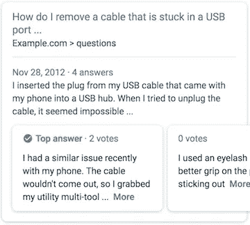

# 教程:面向结构化数据和 SEO 的 Newtonsoft JSON.NET

> 原文：<https://itnext.io/tutorial-newtonsoft-json-net-for-structured-data-seo-6ab2f2507733?source=collection_archive---------2----------------------->


用 CMS 构建 C# MVC 网站会使创建结构化数据变得困难；这反过来又刺激了谷歌上丰富的片段。

## 什么是丰富的片段？

丰富的片段是大多数搜索引擎的一个特征，这些搜索引擎使用结构化数据来提供比传统搜索结果更好的用户体验，并且可以[给你的网站更多的可见性](https://medium.com/@tristolliday/structured-data-unifying-the-web-for-the-better-2bcdd0df53ca?source=friends_link&sk=fc6fa3ec1e1c652852fe4660368fa72a)。



Google 上丰富的片段，由结构化数据驱动。

## 如何向 razor cshtml 页面添加结构化数据

结构化数据有三种形式，`json-ld`、`RDFa`和`microdata`。因为`RDFa`和`microdata`必须嵌入到 html 中，这很难追溯性地添加到模板中。为此，我们将重点放在`json-ld`上，它可以活在自己的`<script>`标签中。

在本教程中，我们将在 razor 模板页面上添加`json-ld`。示例教程将构建在 Umbraco 8 上，但同样的方法应该适用于任何 C# MVC 解决方案。

我们正在构建的例子是[问题&答案丰富片段](https://developers.google.com/search/docs/data-types/qapage)，但是这个概念适用于所有丰富片段。

1.  在您的文件中包含[纽敦软件 Json.NET](https://www.newtonsoft.com/json)。`@using Newtonsoft.Json.Linq`。这是一个常用的库，可以在 [NuGet](https://www.nuget.org/packages/Newtonsoft.Json/) 上找到。
2.  从你的 CMS/任何存储的地方提取你的数据。在这种情况下，我们使用`<IEnumberable<IPublishedElement>>`，但是任何可循环的数据源都应该工作。

```
@{ var questions = Model.Value<IEnumerable<IPublishedElement>>("questions"); }
```

3.接下来，我们需要用我们的 Newtonsoft 复制'*结构化数据'*'的*结构*。方便的是，Google 在他们的文档中提供了每种类型的示例，或者查看 schema.org 的完整文档，了解如何使用 JSON-LD 构建结构化数据。

首先，这是我们试图复制的最后一个平面 html 示例:

```
<script type="application/ld+json">
  {
    "[@context](http://twitter.com/context)": "[https://schema.org](https://schema.org)",
    "[@type](http://twitter.com/type)": "QAPage",
    "mainEntity": {
      "[@type](http://twitter.com/type)": "Question",
      "name": "How many ounces are there in a pound?",
      "text": "I have taken up a new interest in baking and keep running across directions in ounces and pounds. I have to translate between them and was wondering how many ounces are in a pound?",
      "answerCount": 3,
      "upvoteCount": 26,
      "dateCreated": "2016-07-23T21:11Z",
      "author": {
        "[@type](http://twitter.com/type)": "Person",
        "name": "New Baking User"
      },
      "acceptedAnswer": {
        "[@type](http://twitter.com/type)": "Answer",
        "text": "1 pound (lb) is equal to 16 ounces (oz).",
        "dateCreated": "2016-11-02T21:11Z",
        "upvoteCount": 1337,
        "url": "[https://example.com/question1#acceptedAnswer](https://example.com/question1#acceptedAnswer)",
        "author": {
          "[@type](http://twitter.com/type)": "Person",
          "name": "SomeUser"
        }
      },
      "suggestedAnswer": [
        {
          "[@type](http://twitter.com/type)": "Answer",
          "text": "Are you looking for ounces or fluid ounces? If you are looking for fluid ounces there are 15.34 fluid ounces in a pound of water.",
          "dateCreated": "2016-11-02T21:11Z",
          "upvoteCount": 42,
          "url": "[https://example.com/question1#suggestedAnswer1](https://example.com/question1#suggestedAnswer1)",
          "author": {
            "[@type](http://twitter.com/type)": "Person",
            "name": "AnotherUser"
          }
        }, {
          "[@type](http://twitter.com/type)": "Answer",
          "text": " I can't remember exactly, but I think 18 ounces in a lb. You might want to double check that.",
          "dateCreated": "2016-11-06T21:11Z",
          "upvoteCount": 0,
          "url": "[https://example.com/question1#suggestedAnswer2](https://example.com/question1#suggestedAnswer2)",
          "author": {
            "[@type](http://twitter.com/type)": "Person",
            "name": "ConfusedUser"
          }
        }
      ]
    }
  }
</script>
```

Schema.org 对结构特别挑剔，所以我们需要逐字匹配。幸运的是，Newtonsoft 很容易使用，有三种主要类型可以转换为 json: `JObject`例如`{}`、`JArray`例如`[]`和`JProperty`例如`"”:””`。

这意味着我们使用以下内容:

```
<script type="application/ld+json">@{var structuredData =new JObject(new JProperty("@context", "https://schema.org"),new JProperty("@type", "FAQPage"),new JProperty("mainEntity",new JArray(from item in questionsselect new JObject(new JProperty("@type", "Question"),new JProperty("name", (string)(item.GetProperty("question").Value().ToString())),new JProperty("acceptedAnswer",new JObject(new JProperty("@type", "Answer"),new JProperty("text", (string)(item.GetProperty("answer").Value().ToString()))))))));}@Html.Raw(structuredData.ToString())</script>
```

我们通过声明一个`var`来生成匹配的代码，构建我们的 JSON.NET 对象，然后在`@Html.Raw`中将它呈现为一个**字符串**。

Newtonsoft 将让我们使用`from item in questions`遍历我们的可枚举对象(本例中是问题)。这个解决方案允许我们在每个模板的基础上灵活地使用动态数据源，这意味着我们可以将它放入一个可重用的部分中，并且只在需要的地方注入它。

***分解这个例子的核心概念将允许你产生任何结构化数据格式，并把它从 razor 转换成 json。丰富的片段是当今 SEO 的一个重要组成部分，从很早开始就在你的 webapp 中包含结构化数据是很重要的，而旧网站仍然可以翻新以帮助你在搜索引擎上的排名。***

这个例子的全部要点可以在找到[。喜欢你读的吗？考虑给一些👏 👏 👏](https://gist.github.com/tristolliday/220f5f33762bf2492a30a5f1557d4a72)