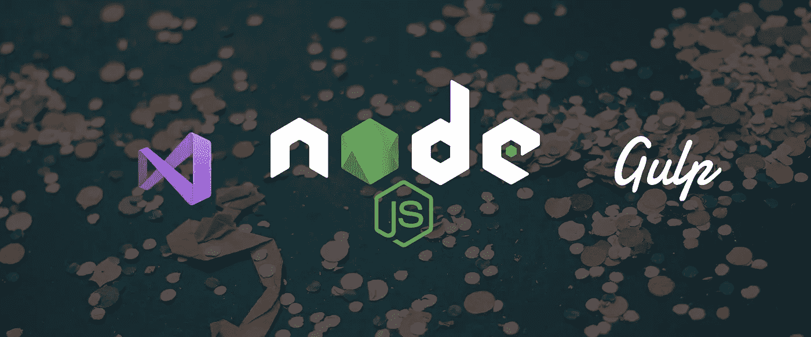
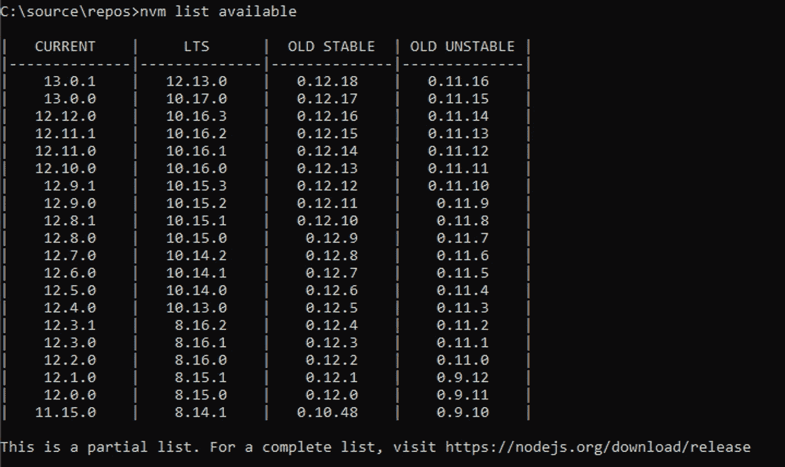
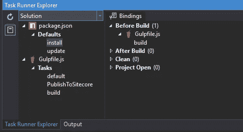
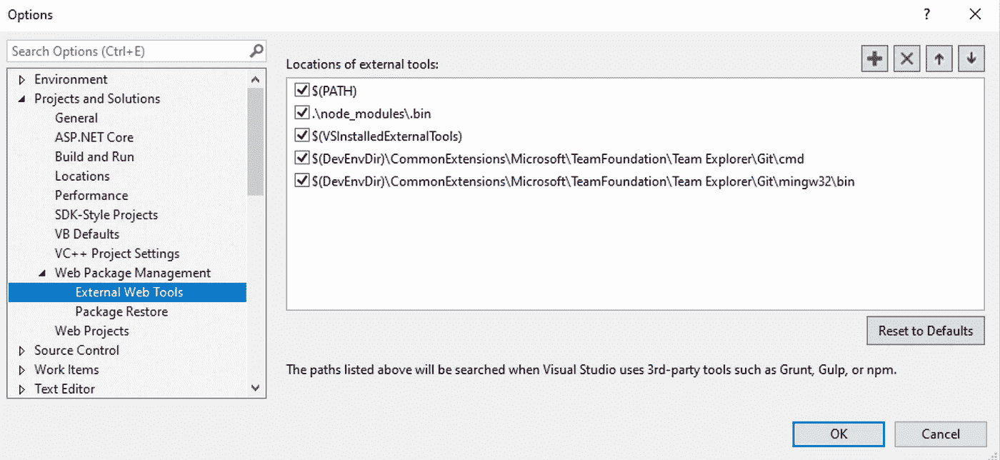

# 教程:节点 12 LTS + Gulp 4 + VS2019

> 原文：<https://itnext.io/tutorial-node-12-lts-gulp-4-visual-studio-vs2019-85af5179f193?source=collection_archive---------0----------------------->



## 就像撕掉石膏一样。痛苦，但值得脱发。

他的教程将带你更新你的项目，使用最新版本的 Node，Gulp 和 Visual Studio 2019。我将一起谈论它们，因为这是一个常见的配方，经过几个小时的血汗和 stackoverflow/gitrepo 搜索，你可以从我的痛苦中学习。

通过学习本教程，您将能够在 Visual Studio 2019 的任务运行器资源管理器中运行您的项目。我们走吧。

> 警告:如果你正处于冲刺阶段，也许现在不是更新的时候。你将需要一个小时的时间来确保一切顺利运行，并且你有时间修复错误

# 节点 12

万岁万岁，随着 [NodeJs 最近宣布 Node 12 击中 LTS](https://medium.com/@nodejs/node-js-12-to-lts-and-node-js-13-is-here-e28d6a4a2bd) ，很值得重新审视遗留项目。长期支持本质上意味着这个版本的 Node 将在很长一段时间内获得错误和安全修复。在 v12 的情况下，使用**直到 2022 年 4 月**都是安全的，这意味着在接下来的两年多时间里，你只需要更新它。


当前发布窗口

如果你在 Node 10 上运行你的项目，你还可以再用一年，所以不要急着更新，特别是如果你使用容易发生冲突的旧包。

然而，如果你在[节点 8 或更低的](https://nodejs.org/en/about/releases/)😬，您必须在 2019 年新年前夕之前进行升级，以维护您项目的安全性。

**节点 13 也出了。为什么不更新到那个？**

奇数个节点版本是不会得到长期支持的实验分支。如果您想使用 node 提供的最新版本，请务必在 Node 13 上运行您的项目(当然，一定要考虑 nvm)。如果你正在为一个客户或企业运行一个生产项目，坚持使用 LTS 版本。

## 安装节点 12

选择您的装置风格:

**A)标准安装(无 nvm)** 只需[下载并安装](https://nodejs.org/en/)

**B) nvm 安装**假设你已经在使用 [nvm](https://github.com/nvm-sh/nvm/blob/master/README.md) (没有的话安装链接里的说明)，添加节点 12 还是一个简单的过程:

```
nvm list available 
```



[完整发布列表](https://nodejs.org/download/release)

在“长期支持”行中，请记住最新的 12 个版本，因此在上面的示例中，它是`12.13.0`

```
nvm install 12.13.0
// make yourself a cuppanvm use 12.13.0
```

**🎉你现在是一个节点的骄傲用户。JS 12 实例🎉**

太好了，但这是第一次打嗝，吞咽 3 将开始出错

```
const { Math, Object, Reflect } = primordials;
                                  ^

ReferenceError: primordials is not defined
```

Gulp 3 具有节点 12 无法处理的依赖性。所以下一步，是让 gulp 升级到版本 4，这是 Gulp 最新最棒的版本。

## 吞咽 4——依赖地狱

**最新最棒，但确实需要一点争论**

所以，为你的项目打开你的`package.json`，在写它的`^4.0.2`的时候，用最新稳定的 gulp release 替换你当前的 gulp ( `3.x.x`

如果你想在 visual studio 2019 中通过任务管理器资源管理器使用 Gulp 4，那么你**也需要通过`npm install gulp@4.0.2 -g`全局安装**如果你不这样做，Visual studio 2019 将无法检测 Gulp，并且不会显示可用的任务。

一旦我们做到了这一点，我们需要更新我们的吞咽依赖，这是一个完全不同的球赛。每一个依赖都有它自己的地狱要经历，但是快速检查一下互联网会对你的特定模块有所帮助。

然而..这里有两个给了我最大的悲痛:

## [大口喘气](https://github.com/dlmanning/gulp-sass)

尽管 SASS 和 Gulp 都很棒，但我想不出有哪一次 gulp-sass/node-sass 的新安装进展顺利。在这个过程中保持冷静，你最终会让它运转起来。我能给的最好建议是:

1.用核武器摧毁你的节点模块目录。删除它，移除它，清除它。如果它的一丝一毫存在，它就会缠着你，让你失败。

2.在我使用`^4.0.2`的时候，用你的`package.json`中的新版本替换，它和你正在使用的 Gulp 版本是一样的，而且我假设已经连接上了。

3.如果仍然出现错误，请确保您是从具有管理员权限的控制台运行 gulp。

4.仔细阅读错误，它可能看起来像一堵文字墙，但会有线索表明消息中缺少什么。

## 吞咽-msbuild

这是一个有点奇怪的依赖关系，实际上只适用于使用特殊框架的项目，如。NET，所以一般人可以跳过。然而，如果你正在使用`gulp-msbuild`，我有一个简单的提示:删除它，用 `[msbuild](https://github.com/jhaker/nodejs-msbuild)`替换[。这是一个更快乐、更干净的包，它更有意义，而且似乎失败得更少。](https://github.com/jhaker/nodejs-msbuild)

gulp 4 中的 msbuild 任务示例

将所有这些添加到 package.json 之后，您应该可以运行`npm install`了。如果一切都运行得很好，你应该没有错误，更好的是，你应该没有漏洞。

# 将你的吞咽任务转换成吞咽任务

根据上面的建议，你应该会受益匪浅，基本的迁移并不太难，因为它更多的是一种语法转换，而不是完全重写。如果你发现一个特殊的 gulp 插件有问题，通常情况下你需要用一个更现代的 gulp 插件来替换它。`gulp-util`已经被弃用，取而代之的是个人插件，所以当你运行 gulp 时，只要留意控制台，它会告诉你需要修复什么。

## 示例更新

它有点罗嗦，但总体感觉更整洁，更现代。Gulp 4 有关于这个过程的很棒的文档，你可以用各种方式让 Gulp 知道你的任务什么时候完成。

一切正常，你现在应该能够打开 Visual Studio 2019，看到任务运行器快乐地运行:



这就是我们这样做的原因。

有时最费力不讨好的任务是最难的，但是为了可维护性、安全性和进度，它们是最令人满意的。现在向前迈进，伙伴节点 12er…并建立创新的东西。

# 进一步故障排除

## npm 包脆弱性

如果你确实有漏洞，运行一个`npm audit fix`应该可以解决绝大部分漏洞。任何其他易受攻击的东西都需要一些手动调整，通常是更新软件包或用更现代的对等物替换它们。你可以用`npm audit`找到这些不正确的包，然后追溯到你的麻烦包。

## Visual Studio 2019 任务运行器资源管理器

要让任务运行器资源管理器与 Gulp 一起工作，有相当多的事情需要正确设置:

1.  在项目的根目录下应该有一个名为`gulpfile.js`的文件。
2.  您应该有一个带有依赖项或 devDependencies 的`package.json`
3.  Gulp 需要在全球和本地安装(如您的`package.json`中所述)
4.  你的 gulp 文件中提到的任何模块都应该在你的`package.json`中，输出控制台会告诉你出了什么问题。同样，它可能看起来像一堵文字墙，但在里面会有丢失什么的线索。

## **Visual Studio 2019 仍然认为它使用的是 Node 的旧版本**

这是由于 VS2019 找不到新节点造成的，所以需要将其路径直接添加到 VS 中。

1.  打开 VS2019，点击`Tools`标签，然后导航到选项。
2.  在选项中找到`External Web Tools`，并在`$(PATH)`变量下添加节点路径。节点的默认路径是`.\node_modules\.bin`



您的位置应该包括 node_modules 引用，如 so ^