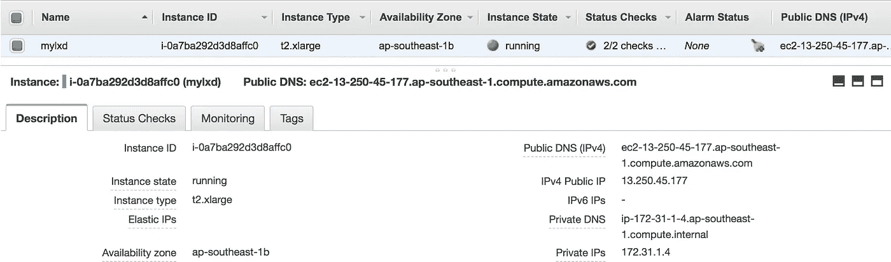
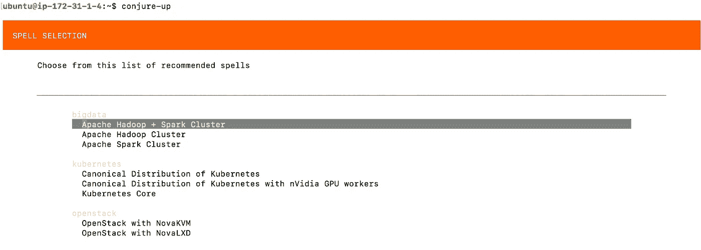
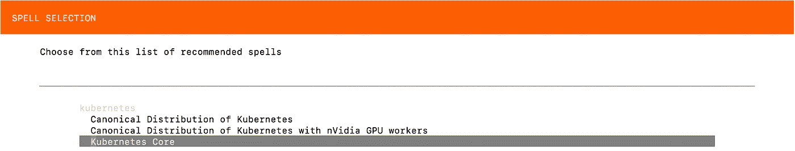
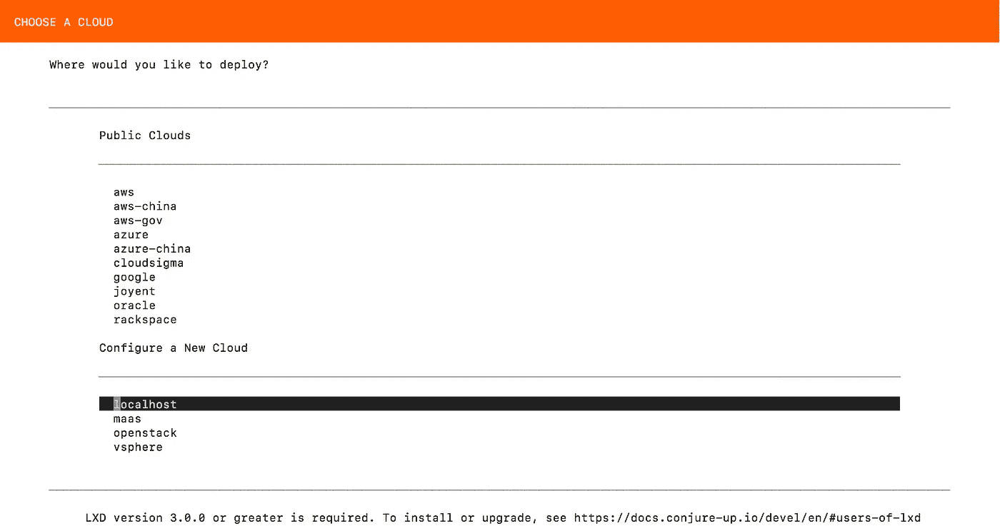

# 教程第 1 部分:在 LXC/LXD 运行 Kubernetes

> 原文：<https://itnext.io/tutorial-part-1-kubernetes-up-and-running-on-lxc-lxd-b760c79cd53f?source=collection_archive---------1----------------------->


在本教程中，我们将使用[召唤](https://conjure-up.io/)在 [Linux 容器](https://linuxcontainers.org/) (LXC/LXD)上部署 Kubernetes。

**请注意，本教程仅供学习之用。**

让我们开始吧。

*   旋转 AWS EC2 Ubuntu 16.04 LTS“T2 . x large”因为我有 AWS 信用点可以花。(你可以在笔记本电脑或云上启动 Ubuntu VM)。
*   在安全组中允许 HTTP、HTTPS、TCP:8443、SSH



*   SSH 到 EC2 实例并验证预安装的 LXD 版本。然后安装变戏法。

```
$ ssh -i aws.pem ubuntu@13.250.45.177ubuntu@ip-172-31-1-4:~$ lxd --version
2.0.11ubuntu@ip-172-31-1-4:~$ which lxd
/usr/bin/lxdubuntu@ip-172-31-1-4:~$ sudo snap install conjure-up --classic --edgeubuntu@ip-172-31-1-4:~$ conjure-up
```

变戏法让我们部署软件-stack suck 作为 bigdata，kubernetes，openstack 作为一个“咒语”。

```
*# conjure-up usage (bigdata, kubernetes, openstack)*
$ conjure-up
*# or*
$ conjure-up kubernetes
*# or*
$ conjure-up openstack
*# or*
$ conjure-up bigdata
```



$变戏法



$召唤库伯内特斯

我们可以在公共云、私有云或本地云上部署“咒语”。(在本教程中，虽然 AWS EC2 实例是“本地”的，但是 Kubernetes 部署需要 LXD 版本 3.0.0 或更高版本)。



*   让我们卸载内置的 LXD 2 . 0 . 11 版本，安装 LXD 3.0.0 或更高版本。请注意[卡扣](https://snapcraft.io/)将是安装和使用 LXD 的唯一推荐方式。

```
ubuntu@ip-172-31-1-4:~$ sudo apt-get remove lxd lxd-clientubuntu@ip-172-31-1-4:~$ sudo snap install lxd
lxd 3.0.0 from 'canonical’ installedubuntu@ip-172-31-1-4:~$ which lxd
/snap/bin/lxd
```

*   让我们在需要设置存储、网络等的地方进行 LXD 初始配置。请仔细地一行一行地检查设置。

```
ubuntu@ip-172-31-1-4:~$ /snap/bin/lxd init
Would you like to use LXD clustering? (yes/no) [default=no]: 
Do you want to configure a new storage pool? (yes/no) [default=yes]: 
Name of the new storage pool [default=default]: 
Name of the storage backend to use (btrfs, ceph, dir, lvm) [default=btrfs]: **dir**
Would you like to connect to a MAAS server? (yes/no) [default=no]: 
Would you like to create a new local network bridge? (yes/no) [default=yes]: 
What should the new bridge be called? [default=lxdbr0]: 
What IPv4 address should be used? (CIDR subnet notation, “auto” or “none”) [default=auto]: **auto**
What IPv6 address should be used? (CIDR subnet notation, “auto” or “none”) [default=auto]: **none**
Would you like LXD to be available over the network? (yes/no) [default=no]: **yes**
Address to bind LXD to (not including port) [default=all]:
Port to bind LXD to [default=8443]:
Trust password for new clients:
Again:
Would you like stale cached images to be updated automatically? (yes/no) [default=yes] 
Would you like a YAML "lxd init" preseed to be printed? (yes/no) [default=no]:
```

*   LXD 初始配置完成，并检查我们的主机上运行的 LXD 容器(当然，我们目前没有任何东西)

```
ubuntu@ip-172-31-1-4:~$ lxc list
If this is your first time running LXD on this machine, you should also run: lxd init
To start your first container, try: lxc launch ubuntu:16.04

+*------+-------+------+------+------+-----------+*
| NAME | STATE | IPV4 | IPV6 | TYPE | SNAPSHOTS |
+*------+-------+------+------+------+-----------+*
```

*   使用 ubuntu image 发布我们的第一个 LXD 容器。(点击此处查看当前可用图片:[https://uk.images.linuxcontainers.org/](https://uk.images.linuxcontainers.org/))

```
ubuntu@ip-172-31-1-4:~$ lxc launch ubuntu:16.04 webserver
Creating webserver
Starting webserver

Now we have our first LXD container running.
ubuntu@ip-172-31-1-4:~$ lxc list
+-----------+---------+---------------------+------+------------+-----------+
|   NAME    |  STATE  |        IPV4         | IPV6 |    TYPE    | SNAPSHOTS |
+-----------+---------+---------------------+------+------------+-----------+
| webserver | RUNNING | 10.217.72.74 (eth0) |      | PERSISTENT | 0         |
+-----------+---------+---------------------+------+------------+-----------+ubuntu@ip-172-31-1-4:~$ lxc info webserver
Name: webserver
Remote: unix:*//*
Architecture: x86_64
Created: 2018/05/20 03:52 UTC
Status: Running
Type: persistent
Profiles: default
Pid: 14296
Ips:
  eth0:inet10.217.72.74vethJS9UBV
  eth0:inet6fe80::216:3eff:fea5:e984vethJS9UBV
  lo:inet127.0.0.1
  lo:inet6::1
Resources:
  Processes: 28
  CPU usage:
    CPU usage (in seconds): 4
  Memory usage:
    Memory (current): 34.40MB
    Memory (peak): 155.04MB
  Network usage:
    eth0:
      Bytes received: 276.12kB
      Bytes sent: 9.75kB
      Packets received: 131
      Packets sent: 120
    lo:
      Bytes received: 0B
      Bytes sent: 0B
      Packets received: 0
      Packets sent: 0
```

*   让我们使用 alpine image 启动另一个容器。

```
ubuntu@ip-172-31-1-4:~$ lxc launch images:alpine/3.7 my-alpine-lxd-container
Creating my-alpine-lxd-container
Starting my-alpine-lxd-container

ubuntu@ip-172-31-1-4:~$ lxc list
+-------------------------+---------+----------------------+------+------------+-----------+
|          NAME           |  STATE  |         IPV4         | IPV6 |    TYPE    | SNAPSHOTS |
+-------------------------+---------+----------------------+------+------------+-----------+
| **my-alpine-lxd-container** | RUNNING | 10.217.72.102 (eth0) |      | PERSISTENT | 0         |
+-------------------------+---------+----------------------+------+------------+-----------+
| **webserver**               | RUNNING | 10.217.72.74 (eth0)  |      | PERSISTENT | 0         |
+-------------------------+---------+----------------------+------+------------+—————+**ubuntu@ip-172-31-1-4**:**~**$ lxc image list+-------+--------------+--------+---------------------------------------------+--------+----------+------------------------------+| ALIAS | FINGERPRINT  | PUBLIC |                 DESCRIPTION                 |  ARCH  |   SIZE   |         UPLOAD DATE          |+-------+--------------+--------+---------------------------------------------+--------+----------+------------------------------+|       | 09ef606a183d | no     | ubuntu 16.04 LTS amd64 (release) (20180509) | x86_64 | 156.99MB | May 20, 2018 at 3:52am (UTC) |+-------+--------------+--------+---------------------------------------------+--------+----------+------------------------------+|       | 9a8851d41d04 | no     | Alpine 3.7 amd64 (20180519_17:50)           | x86_64 | 1.80MB   | May 20, 2018 at 4:00am (UTC) |+-------+--------------+--------+---------------------------------------------+--------+----------+------------------------------+
```

*   让我们对 web 服务器容器进行 shell 访问。

```
ubuntu@ip-172-31-1-4:~$ lxc exec webserver /bin/bash
root@webserver:~*#*
root@webserver:~*# ls -la*
total 20
drwx------  3 root root 4096 May 20 03:52 .
drwxr-xr-x 22 root root 4096 May  9 01:53 ..
-rw-r--r--  1 root root 3106 Oct 22  2015 .bashrc
-rw-r--r--  1 root root  148 Aug 17  2015 .profile
drwx------  2 root root 4096 May 20 03:52 .ssh
```

恭喜你！！！现在，我们可以推出 LXD 集装箱，并发挥左右。

请继续[教程第二部分](https://bit.ly/2IugrDX)我们将在 Linux 容器上部署 Kubernetes(LXC/LXD)。