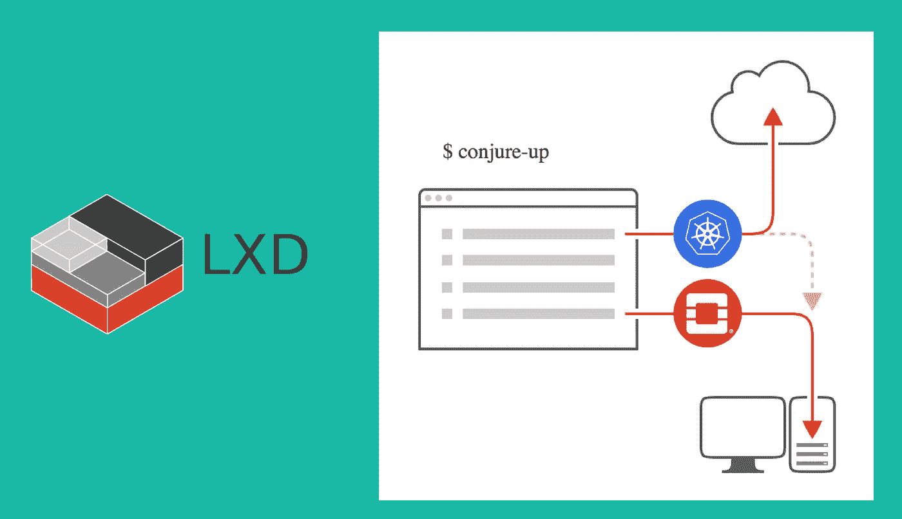
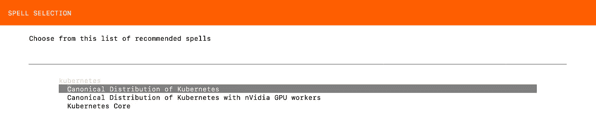
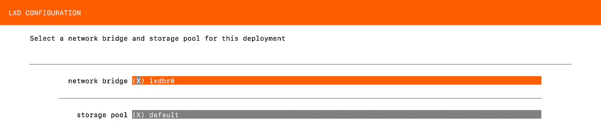
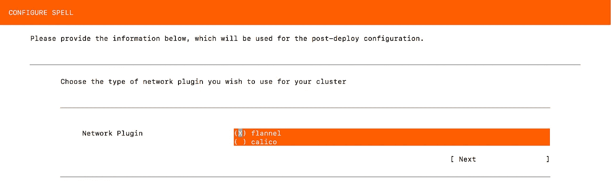
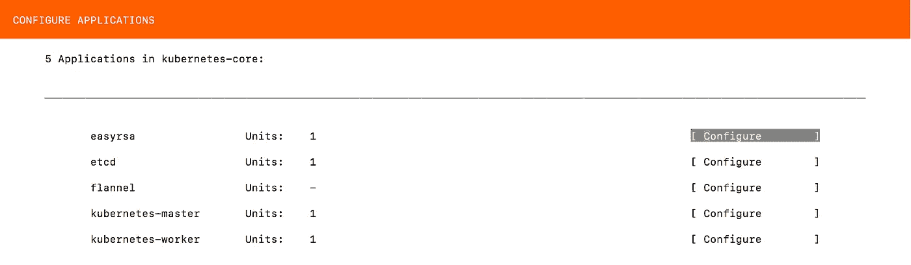
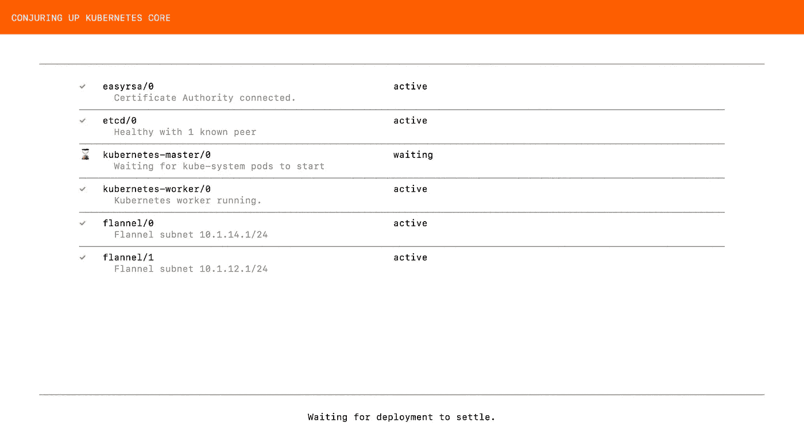
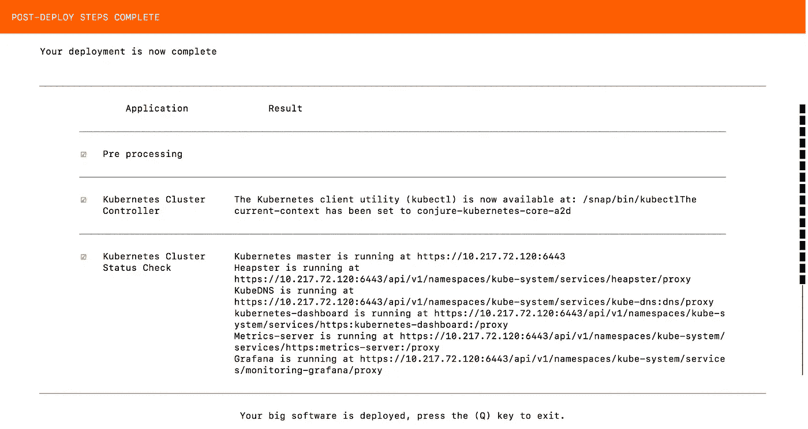

# 教程第 2 部分:在 LXC/LXD 运行 Kubernetes

> 原文：<https://itnext.io/tutorial-part-2-kubernetes-up-and-running-on-lxc-lxd-6d60e98f22df?source=collection_archive---------3----------------------->

请注意，本教程仅供学习之用。

你可以查看[教程第 1 部分:Kubernetes 在 LXC/LXD 运行](https://bit.ly/2LcdKEy)。



让我们部署 kubernetes。我们有 3 个部署选项。我们还可以尝试 Kubernetes 的规范分布，其中包括:

*   灰色日志
*   舵
*   JFrog Artifactory
*   库贝弗洛
*   普罗米修斯
*   Rancher2.0(测试版)

但是在本教程中，我们将选择 Kubernetes 核心并部署在本地主机上。

```
ubuntu@ip-172-31-1-4:~$ conjure-up kubernetes
```



选择“网桥”和“存储池”。



为 Kubernetes 网络插件选择“法兰绒”。法兰绒是一个虚拟网络，它为每个主机提供一个子网，供容器运行时使用。一个屏幕一个屏幕地跟着做。



在等待 Juju 控制器时，我们可以在运行 MacOS 的笔记本电脑上设置“lxc 客户端”。我们可以通过远程管理运行在 AWS EC2 上的 LXD。

打开一个新的终端并安装 lxc(🍺/usr/local/Cellar/lxc/3.1: 6 文件，17.6MB) — lxc 是 MacOS 的 LXD 客户端。

```
$ brew install lxc$ lxc remote list
+-----------------+------------------------------------------+---------------+-----------+--------+--------+
|      NAME       |                   URL                    |   PROTOCOL    | AUTH TYPE | PUBLIC | STATIC |
+-----------------+------------------------------------------+---------------+-----------+--------+--------+
| images          | https:*//images.linuxcontainers.org       | simplestreams |           | YES    | NO     |*
+-----------------+------------------------------------------+---------------+-----------+--------+--------+
| local (default) | unix:*//                                  | lxd           | tls       | NO     | YES    |*
+-----------------+------------------------------------------+---------------+-----------+--------+--------+
| ubuntu          | https:*//cloud-images.ubuntu.com/releases | simplestreams |           | YES    | YES    |*
+-----------------+------------------------------------------+---------------+-----------+--------+--------+
| ubuntu-daily    | https:*//cloud-images.ubuntu.com/daily    | simplestreams |           | YES    | YES    |*
+-----------------+------------------------------------------+---------------+-----------+--------+————+
```

让我们在笔记本电脑上配置“lxc 客户端”来管理 LXD，它在 AWS 上作为 EC2 实例运行。**“13 . 250 . 45 . 177”**是 LXD 正在运行的 EC2 实例的公有 IP。

```
$ lxc remote add mylxd 13.250.45.177
Certificate fingerprint: 438e80f5dcca7c26acbeef60fff82615feda7cb43e49cc794c199788113ce960
ok (y/n)? yes
Admin password for mylxd:
Client certificate stored at server:  mylxd

$ lxc remote set-default mylxd

$ lxc remote list
+*-----------------+------------------------------------------+---------------+-----------+--------+--------+*
|      NAME       |                   URL                    |   PROTOCOL    | AUTH TYPE | PUBLIC | STATIC |
+*-----------------+------------------------------------------+---------------+-----------+--------+--------+*
| images          | https://images.linuxcontainers.org       | simplestreams |           | YES    | NO     |
+*-----------------+------------------------------------------+---------------+-----------+--------+--------+*
| local           | unix://                                  | lxd           | tls       | NO     | YES    |
+*-----------------+------------------------------------------+---------------+-----------+--------+--------+*
| mylxd (default) | https://13.250.45.177:8443               | lxd           | tls       | NO     | NO     |
+*-----------------+------------------------------------------+---------------+-----------+--------+--------+*
| ubuntu          | https://cloud-images.ubuntu.com/releases | simplestreams |           | YES    | YES    |
+*-----------------+------------------------------------------+---------------+-----------+--------+--------+*
| ubuntu-daily    | https://cloud-images.ubuntu.com/daily    | simplestreams |           | YES    | YES    |
+*-----------------+------------------------------------------+---------------+-----------+--------+————+*
```

在我们的笔记本上运行“lxc 列表”。

```
$ lxc list
+-------------------------+---------+-----------------------+------+------------+-----------+
|          NAME           |  STATE  |         IPV4          | IPV6 |    TYPE    | SNAPSHOTS |
+-------------------------+---------+-----------------------+------+------------+-----------+
| juju-0ed97e-0           | RUNNING | 10.217.72.120 (eth0)  |      | PERSISTENT | 0         |
|                         |         | 10.1.14.0 (flannel.1) |      |            |           |
|                         |         | 10.0.224.1 (lxdbr0)   |      |            |           |
+-------------------------+---------+-----------------------+------+------------+-----------+
| juju-0ed97e-1           | RUNNING | 172.17.0.1 (docker0)  |      | PERSISTENT | 0         |
|                         |         | 10.217.72.136 (eth0)  |      |            |           |
|                         |         | 10.1.12.1 (cni0)      |      |            |           |
|                         |         | 10.1.12.0 (flannel.1) |      |            |           |
+-------------------------+---------+-----------------------+------+------------+-----------+
| juju-a8bbdd-0           | RUNNING | 10.217.72.54 (eth0)   |      | PERSISTENT | 0         |
+-------------------------+---------+-----------------------+------+------------+-----------+
| my-alpine-lxd-container | RUNNING | 10.217.72.102 (eth0)  |      | PERSISTENT | 0         |
+-------------------------+---------+-----------------------+------+------------+-----------+
| webserver               | RUNNING | 10.217.72.74 (eth0)   |      | PERSISTENT | 0         |
+-------------------------+---------+-----------------------+------+------------+—————+
```

酷！！！现在，我们可以远程管理我们的 LXD。

让我们回去检查 kubernetes 部署的状态。



恭喜你！！！我们在 LXD 集装箱上的 Kubernetes 部署已经完成。

我们可以验证我们的 k8s 主节点和工作节点，如下所示:

```
$ lxc info juju-0ed97e-0
Name: juju-0ed97e-0
Remote: https:*//13.250.45.177:8443*
Architecture: x86_64
Created: 2018/05/20 04:20 UTC
Status: Running
Type: persistent
Profiles: default, juju-conjure-kubernetes-core-a2d
Pid: 25540
Ips:
  lo:inet127.0.0.1
  lo:inet6::1
  lxdbr0:inet10.0.224.1
  lxdbr0:inet6fe80::6432:3cff:fe07:f32f
  veth58AEPD:inet6fe80::fcf7:9dff:fe0a:a91d
  eth0:inet10.217.72.120vethHIBQEA
  eth0:inet6fe80::216:3eff:feca:580cvethHIBQEA
  flannel.1:inet10.1.14.0
  flannel.1:inet6fe80::fc96:25ff:fe8e:ca77
Resources:
  Processes: 242
  CPU usage:
    CPU usage (in seconds): 665
  Memory usage:
    Memory (current): 3.44GB
    Memory (peak): 3.51GB
  Network usage:
    eth0:
      Bytes received: 689.96MB
      Bytes sent: 15.48MB
      Packets received: 184636
      Packets sent: 118813
    flannel.1:
      Bytes received: 41.31kB
      Bytes sent: 24.28kB
      Packets received: 269
      Packets sent: 249
    lo:
      Bytes received: 25.61MB
      Bytes sent: 25.61MB
      Packets received: 87787
      Packets sent: 87787
    lxdbr0:
      Bytes received: 1.98MB
      Bytes sent: 141.17MB
      Packets received: 27299
      Packets sent: 31633
    veth58AEPD:
      Bytes received: 2.34MB
      Bytes sent: 141.17MB
      Packets received: 27299
      Packets sent: 31634$ lxc info juju-0ed97e-1
Name: juju-0ed97e-1
Remote: https:*//13.250.45.177:8443*
Architecture: x86_64
Created: 2018/05/20 04:21 UTC
Status: Running
Type: persistent
Profiles: default, juju-conjure-kubernetes-core-a2d
Pid: 27193
Ips:
  lxdbr0:inet6fe80::d4ed:47ff:fe80:e006
  lxdbr0:inet6fe80::1
  vethd8be2574:inet6fe80::c19:b7ff:fe97:6a9a
  cni0:inet10.1.12.1
  cni0:inet6fe80::9085:81ff:fe0b:dcf4
  flannel.1:inet10.1.12.0
  flannel.1:inet6fe80::c4e8:e3ff:fe76:fb54
  lo:inet127.0.0.1
  lo:inet6::1
  veth46d4a179:inet6fe80::e8ea:d2ff:fe9a:d27
  veth5c0422eb:inet6fe80::fcfe:40ff:fe51:927b
  veth65e39fc3:inet6fe80::784b:5bff:fe06:5e36
  vetha5902530:inet6fe80::b0d7:68ff:fe18:f041
  docker0:inet172.17.0.1
  eth0:inet10.217.72.136vethJ6HM6I
  eth0:inet6fe80::216:3eff:fea4:64e0vethJ6HM6I
  veth23e516ee:inet6fe80::1448:60ff:fe59:7530
Resources:
  Processes: 716
  CPU usage:
    CPU usage (in seconds): 398
  Memory usage:
    Memory (current): 2.60GB
    Memory (peak): 2.64GB
  Network usage:
    flannel.1:
      Bytes received: 25.18kB
      Bytes sent: 42.69kB
      Packets received: 258
      Packets sent: 278
    lo:
      Bytes received: 72.62kB
      Bytes sent: 72.62kB
      Packets received: 814
      Packets sent: 814
    lxdbr0:
      Bytes received: 0B
      Bytes sent: 650B
      Packets received: 0
      Packets sent: 7
    vethd8be2574:
      Bytes received: 126.58kB
      Bytes sent: 95.45kB
      Packets received: 669
      Packets sent: 849
    cni0:
      Bytes received: 1.98MB
      Bytes sent: 5.95MB
      Packets received: 6802
      Packets sent: 7026
    eth0:
      Bytes received: 655.55MB
      Bytes sent: 8.16MB
      Packets received: 181509
      Packets sent: 98928
    veth23e516ee:
      Bytes received: 144.94kB
      Bytes sent: 1.51MB
      Packets received: 1278
      Packets sent: 1332
    veth46d4a179:
      Bytes received: 26.00kB
      Bytes sent: 28.80kB
      Packets received: 282
      Packets sent: 339
    veth5c0422eb:
      Bytes received: 40.95kB
      Bytes sent: 1.30MB
      Packets received: 406
      Packets sent: 435
    veth65e39fc3:
      Bytes received: 1.41MB
      Bytes sent: 1.95MB
      Packets received: 1687
      Packets sent: 1833
    vetha5902530:
      Bytes received: 290.38kB
      Bytes sent: 510.22kB
      Packets received: 2074
      Packets sent: 2309
    docker0:
      Bytes received: 0B
      Bytes sent: 0B
      Packets received: 0
      Packets sent: 0
```

感谢阅读。