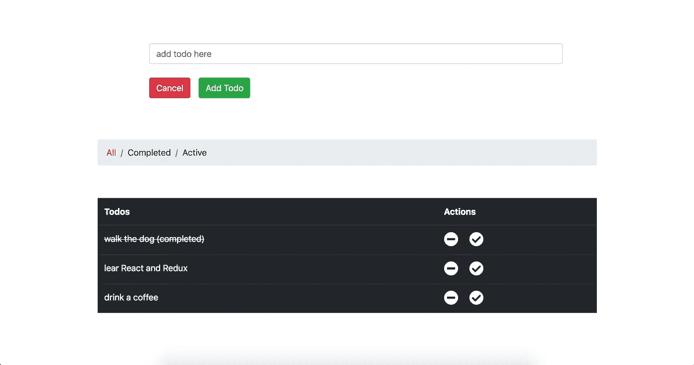
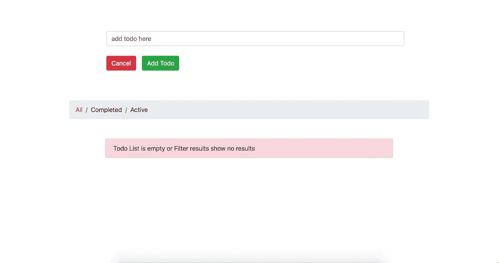
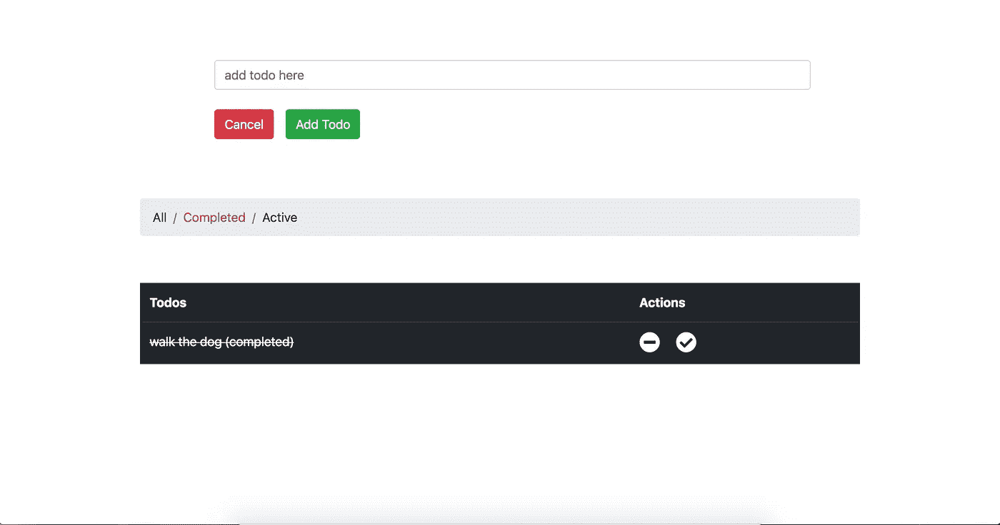

# 教程:简单的 React Redux App

> 原文：<https://itnext.io/tutorial-simple-react-redux-app-cd559621ec00?source=collection_archive---------0----------------------->

我们要创造什么:)。我用它来生成脚手架。

用户可以添加新的待办事项、标记为已完成、删除待办事项以及过滤待办事项。检查代码或从[https://github.com/nunosoares27/React_Redux_todoApp](https://github.com/nunosoares27/React_Redux_todoApp)下载

在 Redux 应用程序中，我们只有一个真实的来源，帮助我们正确地管理状态。当用户点击应用程序时，它会调度一个动作，即 reducer 配方并对状态进行更改。状态得到更新，因为 ui 视图已经订阅了商店事件。

首先，我们创建将要在动作 creators、reducers 等上使用的常量。

现在，动作创建器是创建动作的函数，非常有用，例如在将有效负载发送到 reducers 之前发出 HTTP 请求。

然后我们创建两个 reducer，一个用于管理 Todo 状态，另一个用于过滤，第三个用于合并其他两个 reducer。

那就该换指数了。用于将 react 应用程序连接到 Redux 存储的 js 文件。

我们使用 compose 只是为了启用 redux devTools 扩展，react-redux 库中的 Provider 组件负责连接 react 和 redux 中的所有内容。

现在让我们更改 App.js 文件，我们将创建两个容器的组件，一个用于显示创建 todo 字段，另一个用于显示结果表。

然后我们创建了 CreateTodo 组件

和表组件

mapStateToProps 负责从 Redux 存储中获取状态，并作为道具注入 React 应用程序。mapDispatchToProps 负责调度操作创建者。

这是一个非常基础的应用程序，但是你已经学到了一些很棒的概念:)。

玩得开心，开心编码。